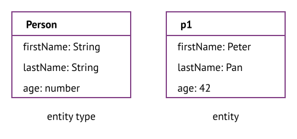
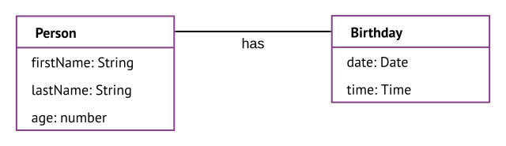
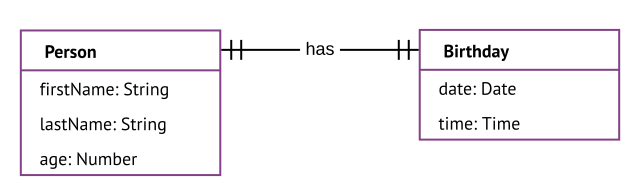
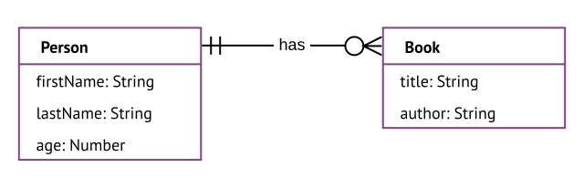
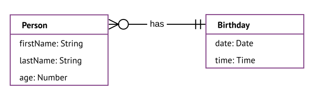
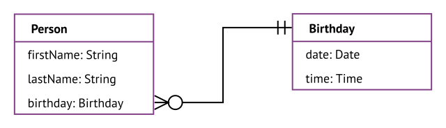
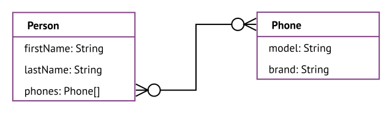

# Entity-relationship model (ER model)

[TOC]

## Introduction

- models data as entities and relationships
- closer to real world than other models ???
- mainly used for database models

## Definitions  

- entity: individual thing that exists, e.g. concrete person, physical address, JavaScript object, etc.
- attribute: individual property of an entity, characterises the entity, e.g. concrete age of concrete person
- relationship: individual relation of multiple entities, e.g. concrete person has concrete birthday
- entity type: abtract notion of the type of an entity, e.g. a person, an address, a JSON schema, etc.
- attribute type: abtract notion of the type of an attribute, characterises the entity type, e.g. the age of a person
- relationship type: abstract notion of the type of a relationship, e.g. a person has a birthday
- beware: often entity, attribute, relationship are used as synonym for their types ❗️
- an entity is an instance of its entity type, e.g. an object is an instance of its object type
- similarly an attribute is an instance of its attribute type, a relationship is an instance of its relationship type

## ER diagram

- diagram of entity types with their attribute types and their relationship types, usually drawn as boxes and lines
- beware: the diagram is drawn for the abstract types, it really "exists" only for the concrete instances ❗️

- can think of entity types as nouns and relationship types as verbs, e.g. person owns car, car is owned by person
- beware: a relationship label can be read in one direction only, the other direction is obtained by turning the verb into passive voice
- beware: label a relationship with a verb in active voice instead of passive, otherwise can't express the reverse relationship type ❗️
- entity types and relationship types have each a label, e.g. "Person" "has" "Birthday"
- entity types and relationship types can both have attribute types, relationship is first-class citizen, e.g. relationship type `created` with attribute type `when: Date`
- attribute types can be drawn in separate boxes connected to entity type, here we draw them directly on the entity type like object properties

## Cardinality of a relationship type

- number of _instances_ of the second entity type that one _instance_ of the first entity type can have the given relationship with, e.g. a person (instance) can own multiple books (instance)
- cardinality can be determined for each entity in a relationship, may very well have different cardinalities, e.g. a person (instance) has one birthday (instance), one birthday (instance) can be had by multiple people (instances)
- cardinality is notated at the end of the line close to the other entity
- usually uses Martin-notation: a ring represents `0`, a vertical dash represents `1`, a crow's foot represents `more`, can be expressed in letters as `o`, `|`, `{` / `}` (depending on direction)
- always combines two symbols, the inner component represents the minimum, the outer component represents the maximum, from the point of view of the given entity
- makes only sense for the following combinations: the symbol `||` means exactly one, `o{` means zero or more, and `|{` means one or more, for cardinality from left entity to right

- beware: if wants to be able to version the graph, needs to keep the cardinality of a relationship at one and have many duplicated entities with the same content, instead of having a single entity that many otherwise unrelated entities link to, e.g. `Person ||has|| Birthday`, `Person ||has|| Age`, `Person ||has|| Address`, `Person ||has|| Nationality`, instead of `}|has||` or `Person ||has|{ Book` instead of `}|has|{` etc. ⚠️

## Relational database

- ???
- not good to store relationships, even though their name contains "relation"

- each row of the table represents one entity of the same entity type, has a unique identifier (primary key)
- each field in the table represents an attribute
- relationships between entities of different entity types are implicitly implemented by storing the ID (primary key) of one entity as a pointer (foreign key) in the table of the other entity, no explicit relationships, i.e. relationships can't have attributes
- only attributes of an entity can have relationships, since they can contain a pointer to other entities, e.g. the person entry uses one birthday entry, while the birthday entry can be used by multiple person entries

- the relationship can be labeled "uses", is usually not labeled since it is always the same
- the cardinality of a relationship of an attribute must be at least one, otherwise the attribute would be empty, if the cardinality is higher than one, the attribute must be an array, since it can contain multiple instances ❗️

## Object database

- stores information in the form of objects, as opposed to tables like relational databases
- an object is one entity, has a unique identifier
- a property is an attribute, can be an object if it doesn't link to it
- relationships between entities of different entity types are still implemented by storing the ID of one entity in the attribute of the other entity, i.e. like relational database

## Graph database

- stores data in a graph, more like in real world
- relationships are first-class citizens, just as much as entities

- like ER diagram in Introduction

- can visualise data better, pattern, anomalies, etc.
no two nodes need to have the same attributes and relationships, not like in table where columns are fixed, can add over time as learns them
however in the ER model it's fixed

- can easily find meaning in relationships, patterns, etc.
- entity is a node, relationship is an edge, i.e. database stores multiple instances of abstract types, ER model shows structure

- keep attributes on nodes small, put attributes into own nodes, e.g. person with single attribute name, relationships lives in city, has telephone number etc.
-> can't sort graph by attributes, but can visualise how many customers live in city
everything that wants to be able to aggregate by should be an entity, instead of an attribute
use nodes for entities with identity
attributes for properties of the entities
relationships to connect entities
attributes for relationship to specify relationship
label nodes to give roles, group entities

Problems
- When attributes of a node or separate node connected to node
e.g. address is property of User or separate node connected to user?
-> if attribute value is a complex value type pull out into separate node with attributes, e.g. address
-> if want to group, by this attribute, start traversing graph at this attribute, e.g. tags, skills
-> if attribute is in certain relationship with node, e.g. `award` attribute to which wants to add date, etc.
- How to implement time in the graph, versions of the graph at points in time, e.g. prices a week ago, number of friends a year ago, etc.
need to separate state from structure, need to be able to version independently from each other, e.g. structure node changes or state node changes
purely additive, never delete
use "entity nodes" to link to first and last version of that node, each intermediary node links to next,
add `to` and `from` properties to every relationship to limit validness, use EPOCH time, use max EPOCH for `from` even if unlimited to store it together with other attribute on disk
alternatively attach linked list to structure node with versions, attach next state node with timestamp
beware: much more data, need to add every change, queries become more complex
add state node for every attribute except id

- every relationship can have only one start and end node
- use intermediary nodes if wants to connect more than two nodes, e.g. add details to relationship, n-ary relationship, etc.
e.g. `User works at Company` and attach `as Role`, or `Customer buys Product` and attach `for Price` and `using Payment`

- make intermediary nodes if relationship contains standalone information, can use intermediary nodes to build more relationships, e.g. instead of `User reviews Product` use `User writes Review reviews Product`, can add review-specific details to `Review` node
link off from relationship to intermediary nodes

Labels are used to shape the domain by grouping nodes into sets where all nodes that have a certain label belongs to the same set.
A node can have zero to many labels. ????

## Resources

- [Wikipedia - Entity–relationship model](https://en.wikipedia.org/wiki/Entity%E2%80%93relationship_model)
- [Mermaid - Entity Relationship Diagrams](https://mermaid-js.github.io/mermaid/#/entityRelationshipDiagram)
- [Wikipedia - Graph database](https://en.wikipedia.org/wiki/Graph_database)
- [David Bechberger - A Skeptics Guide to Graph Databases](https://www.youtube.com/watch?v=yOYodfN84N4)

- [Neo4j - Tips and Tricks for Graph Data Modeling](https://www.youtube.com/watch?v=78r0MgH0u0w)