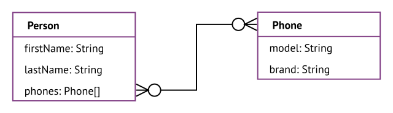

# Traditional databases

[TOC]

## Introduction

- all are bad at storing connected data
- treat relationships as second-class, not explicit
- can't have attributes on relationships
- can't traverse relationships backwards

## Relational database

- data model consists of tables
- each table corresponds to one entity type
- each row (record) of the table represents one entity of that entity type
- each column (field) in the table represents an attribute type of that entity type, e.g. unique identifier (primary key) in first column
- relationships between entities are implicitly encoded using attributes, "foreign key" attribute contains primary key of entity that is related to

- the relationship can be labeled "uses", is usually not labeled since it is always the same
- the cardinality of a relationship must be at least one, otherwise the attribute would be empty
- if the cardinality is higher than one, the attribute must be an array, since it can contain multiple instances ❗️

- schema-fixed: data must have fixed structure, column of table forces nodes to have the same attribute types, can not add / remove attributes only for some entities without changing other ones

## Object database

- data model consist of objects
- each object corresponds to one entity
- each property is an attribute, e.g. unique identifier (primary key) in first property
- relationships between entities are still implicitly encoded using same "foreign key" attribute as in relational database
- schema-free: data can have variable structure, no two objects need to have the same properties