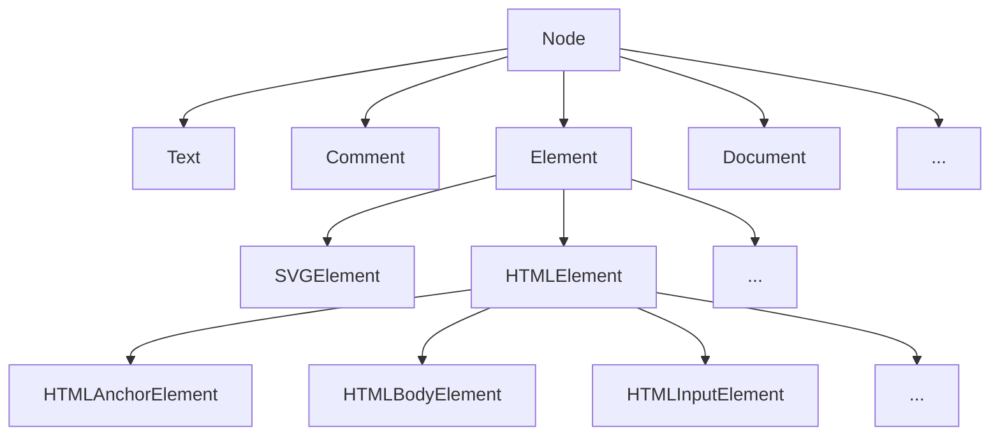

# DOM API

[TOC]

## The DOM (Document Object Model)

- set of APIs to interact with a markup document, e.g. HTML, to change content, structure and styling programmatically
- language independent, but mainly used with JS
- represents document as logical structure, everything in document is a node, can visualize as tree-like structure, often refers by "DOM" to this "DOM tree"
- nodes are represented as objects, can be manipulated via their properties


## `document` object

- represents document

- entry point to DOM, all nodes are descendants (as nodes) of it, is the master node

  ("root node" is already used for `<html>` node)

- beware: don't confuse DOM tree of node objects with their inheritance chain, are completely seperate things

- `Document.dir`: direction of reading, "ltr" or "rtl"
- `Document.title`: document title

## Nodes

- everything in document is a node, i.e. (HTML) elements, text, comments, the doctype, and the document itself
- only element nodes, the document node, and the root document node (`<html>` element) can have children, i.e. text and comment nodes are always leaf nodes
- any whitespace after `<head>` is a / part of a text node, usually not visible on page, dev tools also don't show, shows between inline-block elements, can change using CSS property `white-space`
- when computing the DOM, the browser autocorrets sloppy HTML markup, e.g. adds missing `<html>`, `<head>`, `<body>`, `<tbody>`, etc.
- JS can create nodes and add them to the DOM, enables possibility to manipulate every part of web page

### `Node` object type

- general node type, ancestor (as object) to all other node object types, inheritance chain



- beware: don't confuse DOM tree of node objects with their inheritance chain, are completely seperate things, e.g. `Document` inherits from `Node`, but properties of `Document` are only available to its single instance `document` instead of all objects that can be accessed through `document`
- `Node.nodeName`: node name as string
- `Node.nodeType`: node type as integer
- `Node.nodeValue`: node value as string or null

### Node object types

| object type        | `nodeName`         | `nodeType` | `nodeValue` |
| ------------------ | ------------------ | ---------- | ----------- |
| `Element`          | <tag name>         | 1          | null        |
| `Text`             | #text              | 3          | <content>   |
| `Comment`          | #comment           | 8          | <content>   |
| `Document`         | #document          | 9          | null        |
| `DocumentType`     | <doctype>          | 10         | null        |
| `DocumentFragment` | #document-fragment | 11         | null        |

- (this text uses abbreviation of first letter, e.g. "E" for `Element`, "DF" for `DocumentFragment`)

- `DocumentFragment`: temporary container for transferring nodes to DOM, is never part of DOM
- several mixins are implemented in node types that share functionality
  - `ParentNode` in E, D, DF
  - `NonElementParentNode` in D, DF
  - `ChildNode` in E, C, T, DT
  - `NonDocumentTypeChildNode` in E, C, T
- collection objects: `NodeList`, `HTMLCollection`, etc.

### DOM tree

#### Example HTML file

```html
<!-- test -->
<!DOCTYPE html>
<html>
  <head></head>↵
  <body>↵
  ␣␣<p>Hello World!</p>↵
  </body>
</html>
```

#### Example DOM tree

<!-- align side by side, format nodeName with border: inset thin -->

##### `nodeName`

- #document
  - #comment
  - html  <!-- the DOCTYPE -->
  - HTML
    - HEAD
      - #text
    - BODY
      - #text
      - P
        - #text
      - #text


##### `nodeValue`

- null
- ␣test␣
- null
- null
- null
- ↵
- null
- ↵␣␣
- null
- Hello World!
- ↵


## Walking the DOM

(in following chapters for readability names only "object type" instead of correctly writing "instance of object type", e.g. "`Node`" instead of "instance of `Node`")

- `Node.childNodes`: live `NodeList` of child `Node`s, (`Node` can only be `ParentNode`)
- `Node.firstChild`: first child `Node`, first item of `Node.childNodes`, (`Node` can only be `ParentNode`)
- `Node.lastChild`: last child `Node`, last item of `Node.childNodes`, (`Node` can only be `ParentNode`)
- `Node.nextSibling`: next adjacent `Node`
- `Node.previousSibling`: previous adjacent `Node`
- `Node.parentNode`: parent `Node`, (can only be `ParentNode`)


- `ParentNode.children`: live `HTMLCollection` of child `Element`s
- `ParentNode.firstElementChild`: first child `Element`, first item of `ParentNode.children`
- `ParentNode.lastElementChild`: last child `Element`, last item of `ParentNode.children`
- `NonDocumentTypeChildNode.nextElementSibling`: next adjacent `Element`
- `NonDocumentTypeChildNode.previousElementSibling`: previous adjacent `Element`
- `Node.parentElement`: parent `Element`


- `Document.doctype`: the single instance of `DocumentType`
- `Document.documentElement`: the single instance of `HTMLHtmlElement`
- `Document.head`: the single instance of `HTMLHeadElement`
- `Document.body`: the single instance of `HTMLBodyElement`


- `Document.forms`: `HTMLCollection` of all `HTMLFormElement`s, 🚫
- `Document.images`: `HTMLCollection` of all `HTMLImageElement`s, 🚫
- `Document.links`: `HTMLCollection` of all `HTMLAnchorElement` and `HTMLAreaElement`s, 🚫
- `Document.scripts`: `HTMLCollection` of all `HTMLScriptElement`s, 🚫
- `DocumentOrShadowRoot.styleSheets`: `StyleSheetList` of all `CSSStyleSheet`s, 🚫


## Searching the DOM

- `ParentNode.querySelector()`: first matching descendant `Element`, static
- `ParentNode.querySelectorAll()`: `NodeList` of all descendant `Element`s, static
- `ParentNode.getElementsByTagName()`: live `HTMLCollection` of matching descendant `Element`s, *
- `ParentNode.getElementsByClassName()`: live `HTMLCollection` of matching descendant `Element`s, *
- `ParentNode.getElementsByName()`: live `HTMLCollection` of matching descendant `Element`s, 🚫
- `NonElementParentNode.getElementById()`: single matching `Element`, (note the missing "s" in "Element" and the small "d" in "Id")
- `Element.closest()`: first matching ancestor `Element` including itself
- `Element.matches()`: if `Element` itself matches selector, boolean

(* as of Jan 2020 actually still implemented seperately in E, D, DF instead via mixin like written here)


## Modifying the DOM

- `Document.createComment()`: creates new `Comment`
- `Document.createDocumentFragment()`: creates new `DocumentFragment`
- `Document.createElement()`: creates new `HTMLElement`
- `Document.createTextNode()`: creates new `Text`, (note the extra "Node" suffix)


- `Node.appendChild()`: adds node to end of child nodes, if node is already part of DOM just moves it, if node is DF appends only its content, (`Node` can only be valid `ParentNode`)
- `Node.insertBefore()`: inserts node before reference node in child nodes, if node is already part of DOM just moves it, if node is DF appends only its content, (`Node` can only be valid `ParentNode`)
- `Node.cloneNode()`: creates duplicate node with or without its content, with all attributes, i.e. beware of duplicate IDs, inline event listeners, etc.
- `Node.removeChild()`: removes node from child nodes, returns reference to removed node, (`Node` can only be valid `ParentNode`)
- `Node.replaceChild()`: replaces node in child nodes, returns reference to replaced node, (`Node` can only be valid `ParentNode`)


- `ParentNode.append()`: like `Node.appendChild()`, but newer
- `ParentNode.prepend()`: like `ParentNode.append()`, but to beginning
- `ChildNode.before()`: inserts node(s) before this node within parent
- `ChildNode.after()`: inserts node(s) after this node within parent
- `ChildNode.remove()`: removes this node from parent
- `ChildNode.replaceWith()`: replaces this node within parent with node(s)


## Modifying nodes

- `Element.attributes`: live `NamedNodeMap` containing all attributes, 👎
- `Element.hasAttribute`/`s()`: if contains specified / any attribute, boolean
- `Element.getAttributeNames()`: attribute names, array of strings, 👍
- `Element.getAttribute()`: attribute value, string, 👍
- `Element.setAttribute()`: sets or creates attribute, returns undefined, 👍
- `Element.removeAttribute()`: removes attribute, returns undefined, 👍


- `Element.classList`: live `DOMTokenList` containing all class attribute values, modify using its `add()`/`remove()` methods, 👍
- `Element.className`: entire class attribute value, string, (should have been called "class" but it was a reserved keyword at the time it was created), 👎


- `Element.innerHTML`: serialized HTML of content, static
- `Element.outerHTML`: serialized HTML of element and content, static
- `Node.textContent`: concatenation of all descendant `Text` nodes, i.e. including text in hidden elements, `<style>` and `<script>` elements, etc.
- `HTMLElement.innerText`: only rendered text content


- `HTMLElement.dir`: direction of reading, "lrt" or "rtl" or "auto"
- `HTMLElement.hidden`: if `hidden` attribute is present, boolean
- `HTMLElement.style`: inline style, returns `CSSStyleDeclaration`, set/get its properties using camelCasing instead of hyphen, e.g. `myelement.style.color`, value must be string with unit
- `HTMLElement.title`: title attribute value


## Notes on DOM methods

- `ParentNode.querySelector`/`All()` is only sugar on `NonElementParentNode.getElementsBy*()`, less performant, also not live
- `Node.appendChild()` forces repaint if `Node` is part of the DOM, i.e. for appending lots of nodes in a loop better append them to a DF first and then the DF once to DOM
- directly manipulating the raw HTML of a node with `Node.innerHTML` is faster than individually creating new nodes, setting their content, appending them to the node, though more important than speed is what gives cleaner more readable code
