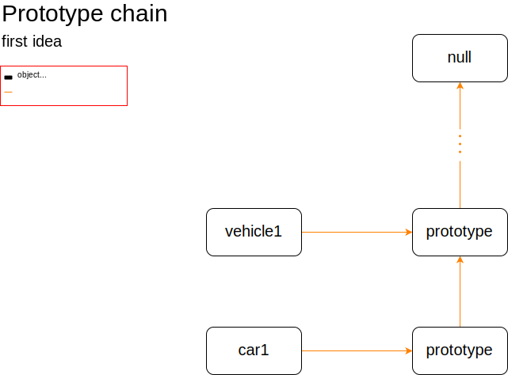
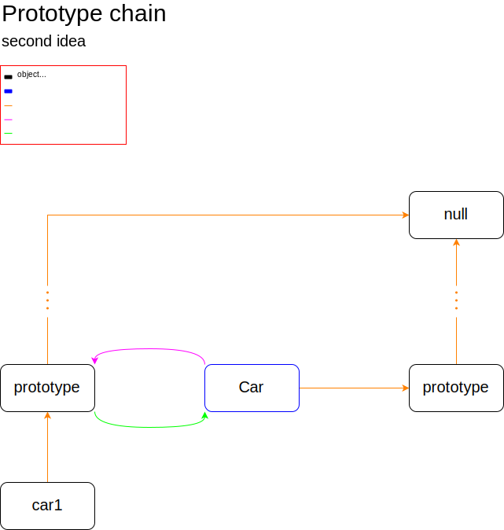
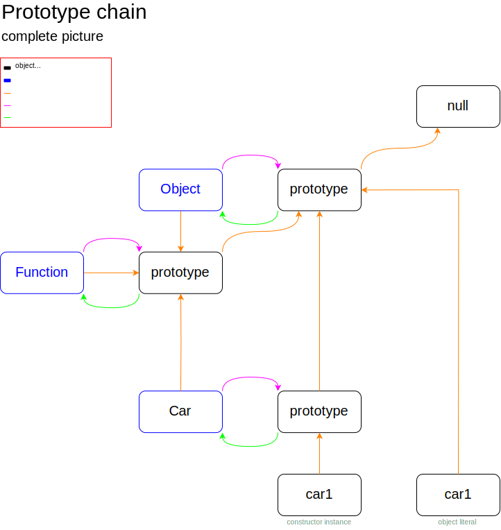

# Objects

[TOC]

## Motivation

- every data type in JS is either an object, e.g. arrays, functions, objects, or behaves like an object, e.g. strings, numbers, booleans

  -> needs to understand objects to understand JS

- inheritance is the distinct feature of objects in comparison to other data types

  -> can build powerful data structures


## Introduction

- collection of key-value pairs, called "properties", properties are like variables, object is like a container for multiple variables

- property names can be of data type `String` or `Symbol`

- property values can be of any data type including object, function, array, etc.

  -> can build nested data structures of arbitrary complexity

- properties are called methods if the property value is a function

- objects are only mutable data type, properties can be modified after creation, reference stays the same, i.e. `const a = {}` and `a.name = "Peter"` is valid

- objects are addressed / passed ❓"by reference", not "by value" like primitive data types, i.e. if `a` is an object and `let b = a`, then `b` refers to the same identical object as `a`, not only a copy

- objects are compared "by reference", not "by value" like primitive data types, i.e. `let a = {}`, `let b = {}`, then `a === b` is false, because `a` and `b` are not referencing to the same object


## Object literals

### Creating object literals

```javascript
/*const car1 =*/ {make:	"Honda",														// property
  							  model:	"Civic",													// property
             			year:	1998,																// property
            		  honk: function() {console.log("Hooonk");},// method
          		    beep() {console.log("Beeep");},						// method, shorthand with ES5
         			    blub : alreadyExistingFunction						// method
         			    }
```

- comma seperated key-value pairs, like in arrays

- if key is not valid identifier, must be enclosed in quotes, e.g. `{"1number": 42}`

- can use reserved keyword as key, since ES5 without quotes, (except internally used keyword `__proto__`)

- can use computed property values, i.e. variables as values

  ```javascript
  const value1 = "Honda";
  const car1 = {make: value1,
                model: "Civic",
                year: 1998};
  ```

- can use computed property names, i.e. variables as keys, since ES6

  ```javascript
  const key1 = "make";
  const car1 = {[key1]: "Honda",
                model: "Civic",
                year: 1998};
  ```

- property value shorthand if property names should be the same as the variable name

  ```javascript
  const make = "Honda";
  const model = "Civic";
  const year = 1998;
  const car1 = {make,
                model,
                year};
  ```

- object properties are locally scoped in object, not accessible from outside, (except if object is global object)

- computed property names get converted to string if they aren't already, (uses `Object.prototype.toString()` method)

- property names must be unique, or the last will overwrite the previous, in strict mode will throw error

- can use spread operator to copy own enumerable properties from other object, see ellipsis operator

### Accessing and changing properties

- dot notation: `car1.make`, `car1.honk()`

- can only use if key is valid identifier and not computed property name, else must use bracket notation

- bracket notation: `car1[make]`, `car1[honk]()`

- can use with variable or any string in quotes as key, e.g. `obj["1number"]`

- return `undefined` if property doesn't exist

- can chain if value itself is object

- set property values by assignment, doesn't matter what variable type the object reference is, e.g. `const`

  ```javascript
  car1.year = 1999;
  car1.honk = function() {console.log("Move b****, get out da way!")};
  ```

- if sets property that doesn't exists a new property is created in this object

  -> very powerful, can add and remove properties on the fly

- delete operator to delete own property, see delete operator

### Getters and Setters

```javascript
const car1 = {...
              owners: ["Bob", "Sarah", "James"],								// owners, first to current
              set currentOwner(name) {owners += name;},
              get currentOwner() {return owners[owners.length - 1];}
             }
console.log(car1.currentOwner); // "James"
car1.currentOwner = "Zoe";			// Zoe just bought the car
console.log(car1.currentOwner); // "Zoe"
```

- bind object's property to a function call

- behaves like any other property, can be accesses, set, or deleted, but is itself not a property, e.g. there is no property `currentOwner` in above example, it's just getters and setters

- can make property seem like it stores dynamically computed value

  beware: using getters and setters one can't trust anymore that an object's properties stay the same if they haven't been modified, since now they can be modified internally through different "properties", use cautiously❗️

- set: takes exactly one argument, no return statement

- get: takes exactly zero arguments, has return statement

- can not have a normal property with the same name as get / set

- use `Object.defineProperty()` to define getters and setters for existing object


## Constructors

- regular function, but designed to be called with `new` keyword
- convention is to name with upper CamelCase

### Terminology

- object type: abtract notion of type of object, e.g. cars, trucks, bikes
- constructor: blueprint for object type, e.g. `Car` constructor creates car objects
- instance: object created using a particular constructor, e.g. `car1` is instance of `Car`

### `this` keyword

- `this` refers to an object, like a variable

- which object depends on the context, often source of confusion

- outside of any function in global context `this` is the global object

- in a function generally `this` is the global object in non-strict mode or `undefined` in strict mode

  - in a method, `this` is the object the method is called on, doesn't matter where function was defined, outside, on prototype chain, etc.❗️

    ```javascript
    car1.sayHi = function() {console.log("Hi, my make is " + this.make);};
    car1.sayHi(); // "Hi, my make is Honda"
    ```

  - in a constructor, i.e. called by `new` operator, `this` refers to the object being constructed

  - in an event handler, `this` is the object the event handler is attached to, is not necessarily the same object the event targeted, see Events

- beware: `this` depends only on how function was called, not how it was defined, e.g. if a method is passed as value and then called independent from object, it's `this` will be back to default ⚠️

  ```javascript
  // invoked as function
  function sayHi() {console.log("Hi, my make is " + this.make);};
  sayHi(); // "Hi, my make is undefined"
  
  // invoked as method
  car1.sayHi = sayHi;
  car1.sayHi(); // "Hi, my make is Honda"
  
  // invoked as function
  const func = car1.sayHi
  func(); // "Hi, my make is undefined"
  
  // invoked as function
  function execute(callback) {
    callback();
  }
  execute(car1.sayHi); // "Hi, my make is undefined"
  
  // "undefined" since "this" is global object in non-strict mode which has no property "make"
  ```

- use `Function.prototype.call`/`apply()` to call any function with `this` being specified, or create entirely new function using `Function.prototype.bind()` with `this` being fixed

  ```javascript
  func.call(car1); // "Hi, my make is Honda"
  func.apply(car1); // "Hi, my make is Honda"
  func(); // "Hi, my make is undefined"
  
  const func2 = car1.sayHi.bind(car1);
  func2();  // "Hi, my make is Honda"
  ```

### `new` operator

- operates on a function, but used specifically with constructor or class

  `new Constructor()`

- usually assigns it to a variable

- steps of the `new` operator:

  1. creates a new empty object
  2. sets its `[[prototype]]` property to the constructor's `prototype` property (see later)
  3. calls the constructor with `this` being the new object
  4. returns `this` (if the function doesn't return it's own object)

### Constructor function

```javascript
function Car(make, model, year) {
  this.make = make;													// property
  this.model = model;												// property
  this.year = year;													// property
  this.honk = function() {console.log("Hooonk");};// method
  this.beep = function() {console.log("Beeep");};	// method, no shorthand
  this.blub = alreadyExistingFunction;						// method
}

/*const car1 =*/ new Car("Honda", "Civic", 1998)
```

- constructor is simply a function that sets object properties of object in `this`, as if setting any other object's properties, just object has weird name "this"

- when called via `new` operator, it exactly sets all the properties for the newly created object

- constructor has no return statement, otherwise calling it with `new` doesn't make sense, the newly created object would not be used (see step 4. in steps of the `new` operator), wouldn't be a constructor

- use dot notation, because the property names are _not_ computed, i.e. only the assigned `make` becomes the argument variables value, not the `make` in `this.make`

- object created with constructor is identical to object literal equivalent, except when using constructor also inheritance is set up (see later)

  -> use constructor if wants to create many objects that inherit, object literal if only needs single generic

- syntax is different from object literal, semicolons instead of commas, equal signs instead of colons

- beware: forgetting `new` operator when calling constructor, makes it modify properties of global object in non-strict mode ⚠️ one reason to always use strict mode

### Static properties

- properties of constructor itself, since it's like any other object can add properties to it
- not inherited to any instances, since constructor itself is not part of the instances' prototype chain, only the constructor's `prototype` property
- usually uses for methods instead of properties since they stay the same for all instances
- in a static method, `this` refers to the constructor, since the static method is called as method of the constructor, i.e. `this` is not an object instance❗️

```javascript
Car.repairPrice = 420;
Car.repair = function(car) {
  console.log("Repair done. " + car.make + " " + car.model + " looks like new.");
  console.log("Cost " + this.repairPrice); // this will be Car itself
};

Car.repair(car1); // "Repair done. Honda Civic looks like new.", "Cost 420"

console.log(car1.repairPrice); // undefined, no such property in prototype chain of car1
```


## Inheritance

### Idea

- let object types inherit from each other, e.g. `SportsCar` from `Car` from `Vehicle`

- only define what's different, inherit what's the same, i.e. not one huge constructor for all types of objects and neighter one full constructor for every single type of object

  -> better scalability, maintainability, readability, etc.

### Inheritance model

- JS uses a prototype-based inheritance model, as opposed to the traditional class-based inheritance model, single mainstream programming language to date that does this
- objects themselves are "prototypes" from which other objects can inherit, instead of classes
- constructors are like traditional classes and the `new` operator like traditional constructors

- JS offers more flexibility than traditional class-based OOP, can freely add / remove properties to individual objects without having to modify whole class, allows to modify prototype objects at run-time to change inherited properties, allows to change whole inheritance chain at run-time

- JS does not support multiple inheritance, i.e. every object inherits only from exactly one other object

### The `[[prototype]]` property

- each object has an internal property called `[[prototype]]`, which is set to another object, the object's "prototype" object

- since objects are addressed by reference, any changes made to this prototype object will show up in the `[[prototype]]` property

- since the prototypes are objects themselves, they have their own `[[prototype]]` properties, linking to another prototype object, this chain is called a "prototype chain", the end of the chain is always the `null` object, `null` is the last prototype / commin ancestor to all objects

- any properties added to a prototype object will be available to all objects below in the prototype chain

- when accessing an object's property, JS first searches the own properties of the object, if no matching property is found it goes up the prototype chain searching through every prototype object until the first  match, if it reaches `null` it returns `undefined`, i.e. doesn't need to specify where in the prototype chain the property is, can use property as if it were own property of object

  -> Prototypal inheritance is actually more "delegation" than inheritance, since properties are only referenced and not copied

  -> for performance reason don't let JS search long prototype chains

- since JS returns the first match when searching the prototype chain for a property, later properties "overshadow" earlier ones with the same name

  ```javascript
  car1.color; // undefined, no such own property or in prototype chain
  Car.prototype.color = "black"; // set default color for all cars
  car1.color; // "black", from prototype chain
  car1.color = "red"; // add new own property "color"
  car1.color; // "red", overshadows any "color" property in prototype chain
  delete car1.color; // "true", deletes own "color" property
  car1.color; // "black", from prototype chain
  delete car1.color; // "true", even though nothing to delete since no own "color" property exists anymore
  car1.color; // "black", from prototype chain
  ```

- there can be various prototype chains, all ending at `null`, see later





- problem 1: by default the `[[prototype]]` properties of the objects are not chained to each other, would need to set it for each single object
- problem 2: changing the `[[prototype]]` property of an object is very inefficient operation, should not be done manually
- solution: constructors or `Object.create()`, see later

### The `prototype` property

- functions are objects and have like every other object a `[[prototype]]` property linking to a prototype object

- but they are special, because they have a second property called `prototype` which is set to yet another prototype object, can be the same prototype object as the `[[prototype]]` property, e.g. like the `Function` constructor has is, see later

- this other prototype object is part of a prototype chain as well

- this prototype object also has a property called `constructor` set to the function object for which it is a prototype, i.e. creating a circular reference

- when creating an object using a constructor, the `new` operator sets the `[[prototype]]` property of the new object to the `prototype` property of the constructor, i.e. exactly this second prototype object, (see step 2. in steps of the `new` operator) 

- so all instances of a constructor get this same object as their `[[prototype]]`, any changes made to it are instantly available to all instances, need only to add / change / remove properties in this single object accessible through constructor's `prototype` property

  -> enables inheritance

- can access constructor from every instance through the `constructor` property of the constructor's `prototype` property which is inherited to every instance, e.g. useful if doesn't know constructor's name but has a instance available

  ```javascript
  const car2 = new Car("Toyota", "Corolla", 1995); // via constructor
  const car2 = new car1.constructor(/*...*/); 		 // via instance, same result
  ```





- by default a function's `prototype` property is linked to the `prototype` property of `Object` which is linked to `null`, see later how can change `prototype` property of constructors for multi-level inheritance
- object literals have their `[[prototype]]` property directly set to `Object.prototype`





### Summary

- every object has exactly one `[[prototype]]` property (orange arrow)
- every function object has an additional `prototype` property (pink arrow)
- `Object.prototype` is a common prototype of every typical object, (see later how can create different prototype chains using `Object.create()`)
- beware: don't simply add custom properties to `Object.prototype` since it pollutes the entire global prototype chain, instead create a single constructor for all your objects to inherit from and use its `prototype` propery to add desired properties
- a function object has by default `Function.prototype` as `[[prototype]]` (blue objects)
- an object literal has by default `Object.prototype` as `[[prototype]]`
- "own properties" are properties of object itself, not from prototype chain

### Accessing `[[prototype]]` property

- the `[[prototype]]` property of an object is internal, can not be accessed like a normal property

- `Object.get`/`set.PrototypeOf()`: prefered way

- `Object.prototype.__proto__`: legacy, is actually a getter / setter property

- modifying the `[[prototype]]` of an object is a very slow operation, avoid if possible, best way of changing it is to leave it and create new object with desired prototype using `Object.create()` (see later)

- can access `prototype` properties of constructor without knowing its name by walking up the inheritance chain, can modify or delete properties

  ```javascript
  Object.getPrototypeOf(car1).sayHi = function() {/*...*/} // equivalent to Car.prototype.sayHi
  car1.sayHi(); // "Hi, my make is Honda"
  delete Object.getPrototypeOf(car1).sayHi
  car1.sayHi(); // TypeError: car1.sayHi is not a function, doesn't exist
  ```

### Inheriting properties

- a constructor's `prototype` properties are available on every object instance of descendant object type, e.g. everything in `Object.prototype` is available in every object (as long as it's part of the standard prototype chain, see `Object.create()` later how to create different prototype chains)

- add properties to custom constructor's prototype property, because

  - are available to all instances like own properties, but beware property shadowing
  - only way if wants to easily modify / add / remove later for all instances
  - exist only once in prototype object instead of being copied to every instance

  ```javascript
  Car.prototype.sayHi = function() {console.log("Hi, my make is " + this.make);};
  car1.sayHi(); // "Hi, my make is Honda"
  car2.sayHi(); // "Hi, my make is Toyota"
  ```

- usually adds only properties to object instances and all methods to constructor's `prototype` object, since methods usually don't change for each object instance, and even later members in inheritance chain can access them

- don't pollute default prototype chains by adding to built-in constructor's `prototype` properties, e.g. `Object.prototype`, instead create a single constructor for all your objects to inherit from and use its `prototype` propery to add desired properties

- properties added to constructor object itself instead of it's `prototype` property won't inherit to instances

- remember: `this` in a method refers to the calling object, i.e. especially not the prototype object in which a method is defined and inherited from, e.g. like in `car1.sayHi()` above

### Data types as objects

- all data types in JS either are or behave like objects

- for each data type exists a constructor, holds relevant properties in its `prototype` property for all instances to inherit, e.g. `Object`, `Function`, `Array`, `String`, `Number`, `Boolean`

- data type constructors `Array`, `String`, `Number`, `Boolean` are like `Car` in above diagram, have their `prototype` properties linked to `Object.prototype` and their `[[prototype]]` properties to `Function.prototype`

- objects, functions, and arrays are objects, even if created using literals, no difference if created literally or using data type constructor

- strings, numbers, and booleans are primitives if created literally, not objects, different from data type constructors which create objects

- beware: don't create primitives using constructors, don't work as expected, stay with primitives, e.g

  ```javascript
  "Hi" === new String("Hi") // false, since RHS is of type object
  Boolean(false) === true // true, since object is always truthy
  ```

- when using strings, numbers, or booleans like an object, e.g. accessing a method, JS silently creates a temporary "wrapper object" to perform the desired operation on, i.e. makes primitives behave like objects

  ```javascript
  "Hello World!".toUpperCase() // "HELLO WORLD!"
  "  boat  \n".trim() // "boat"
  3.141592654.toFixed(2) // "3.14"
  3.141592654.toPrecision(3) // "3.14"
  ```

- wrapper objects are only one time use, are discarded immediately after use, i.e. can't use like objects to store data

  ```javascript
  const str = "Hello";
  str.data = "abc";
  console.log(str.data); // undefined, already discarded
  ```

- data type constructors implement a `valueOf()` method in their `prototype` property, to overshadow `Object.valueOf()`, returns the primitive value of the wrapper instance, e.g. `Boolean(false).valueOf()` gives primitive false value, `(new Number (42)).valueOf()` gives primitive `42`

- data type constructors implement a `toString()` method in their `prototype` property, to overshadow `Object.prototype.toString()`, returns value as string, useful for all data types except for objects, returns useless "[object type]", can use `JSON.stringify` instead to stringify object


## Multi-level inheritance

### Idea

- link `prototype` properties of multiple constructors in row, see diagram
- in child constructor could make use of parent constructor to set properties

- set child constructor's `prototype` property to parent constructor's `prototype` property to build inheritance chain
- could also set up multi-level inheritance for individual objects using `Object.create()` but not often useful, focus on constructors here

### Properties

```javascript
function SportsCar(..., zeroTo60) {
  Car.call(this, ...);
  this.zeroTo60 = zeroTo60;
}

const sportsCar1 = new SportsCar(..., 3.8);

console.log(car1.zeroTo60); // undefined
console.log(sportsCar1.zeroTo60); // 3.8
```

- in child constructor call parent constructor to set up existing properties, e.g. `make`, `model` and `year` from `Car`
- need to use `Function.prototype.call`/`apply()` to specify correct `this` in parent constructor, otherwise `this` would be back to default, would modify the global object in non-strict mode ⚠️

- set any additional own properties for this object type, e.g. a `zeroTo60` property just for sports cars
- until now prototype chain is not set up yet, has just set properties of object instance, e.g. `SportsCar.prototype` links still to `Object.prototype`
- beware: using global variables in parent constructor, parent constructor will also be called any time a child object instance is created, e.g. incrementing an id counter❗️
- child objects don't necessarily need to have same properties as parent objects, could skip above and just set own properties, i.e. if object types don't have same properties but should still inherit methods from each other

### Prototype chain

```javascript
SportsCar.prototype = Object.create(Car.prototype);
SportsCar.prototype.constructor = SportsCar;
```

- set child constructor's `prototype` property to link to its parent constructor's `prototype` property
- use `Object.create()` to create new empty object with parent constructor's `prototype` property as `[[prototype]]`, use it as `prototype` property of the child constructor
- don't just set to parent constructor's `prototype` properties, would share same prototype, no inheritance chain, makes no sense, e.g. `SportsCar.prototype = Car.prototype` ⚠️
- don't just set it a new instance of parent constructor, would have all instance properties, inherited to all child objects, e.g. `SportsCar.prototype = new Car()` ⚠️
- don't just manually change the `[[prototype]]` property of the child constructor's `prototype` property to point to the parent constructor's `prototype` property, very inefficient, e.g. `Object.setPrototypeOf(SportsCar.prototype) = Car.prototype` ⚠️
- need to correct the `constructor` property within the child constructor's new `prototype` property to point back to it, (would't be necessary if directly changed prototype, but won't ever do that)
- JS does not support multiple inheritance because any object can have only exactly one `[[prototype]]`  property

```javascript
function SportsCar(..., zeroTo60) {
  Car.call(this, ...);
  this.zeroTo60 = zeroTo60;
}

SportsCar.prototype = Object.create(Car.prototype);
SportsCar.prototype.constructor = SportsCar;

SportsCar.prototype.scream = function() {console.log("Brummm");};

const sportsCar1 = new SportsCar(..., 3.8);
sportsCar1.honk(); // "Hooonk", from Car.prototype
sportsCar1.scream(); // "Brummm", from SportsCar.prototype
```

<!-- diagram here -->


## Classes

- only syntactical sugar for same prototype-based inheritance, since ES6
- beware: don't just blindly use classes as if it were C++ or Java ⚠️
- automate some tasks like setting up multi-level inheritance chain, bundle code together, cleaner than constructor syntax
- are just special constructor functions
- not hoisted
- class body is in strict mode by default

### Class constructor

- can use like normal constructor
- `constructor` method is called with arguments of class
- if no `constructor` method is specified, it defaults to an empty function
- don't confuse `constructor` method with `constructor` property in classe's `prototype` property❗️

```javascript
class Car {
  constructor(make, model, year) {
    this.make = make;																// property
    this.model = model;															// property
    this.year = year;																// property
    this.honk = function() {console.log("Hooonk");};// method
    this.beep = function() {console.log("Beeep");};	// method, no shorthand
    this.blub = alreadyExistingFunction;						// method
  }
}

/*const car1 =*/ new Car("Honda", "Civic", 1998);
```

### Inherited properties

- other methods in class are directly put into it's `prototype` property, no need to add them seperately to constructor's `prototype` property afterwards dangling behind in code 🎉
- must be in shorthand notation
- can only be methods, properties will be interpreted as if they were in constructor❗️
- no comma between class methods

```javascript
class Car {
  constructor(make, model, year) {
    this.make = make;
  	this.model = model;
  	this.year = year;
  }
  
  honk() {console.log("Hooonk");}
  beep() {console.log("Beeep");}
  blub = alreadyExistingFunction
}

const car1 = new Car("Honda", "Civic", 1998);
car1.honk(); // "Hooonk", from Car.prototype
```

### Static properties

- can directly add static properties within class, no need to add them seperately to constructor afterwards dangling behind in code 🎉
- in class terminology a static property is called "static field" as opposed to static methods, static fields are only implemented with ES2019
- can make static methods and fields private with ES2019, prepend # sign

```javascript
class Car {
  constructor(make, model, year) {
    this.make = make;
  	this.model = model;
  	this.year = year;
  }
  
  honk() {console.log("Hooonk");}
  beep() {console.log("Beeep");}
  blub = alreadyExistingFunction

	static repairPrice = 420;
	static repair(car) {
    console.log("Repair done. " + car.make + " " + car.model + " looks like new.");
    console.log("Cost " + this.repairPrice); // this will be Car itself
  }
}

const car1 = new Car("Honda", "Civic", 1998);
Car.repair(car1); // "Repair done. Honda Civic looks like new.", "Cost 420"
```

### Multi-level inheritance

- classes automatically set up the prototype chain, no need to set the constructor's `prototype` property manually anymore 🎉

- parent class is called via `super` keyword, automatically passes the correct `this`, no need to specify it with `Function.prototype.apply`/`call()` anymore 🎉

- `super` keyword aliases the parent constructor, just like `this` aliases calling object 

- if no constructor is specified, uses an empty constructor but with super call

  ```javascript
  constructor(...args) {
    super(...args)
  }
  ```

- to be able to use `this` in a constructor of an extended class, `super` must have been called before, difficult explanation ❗️

```javascript
class SportsCar extends Car {
  constructor(..., zeroTo60) {
    super(...);
    this.zeroTo60 = zeroTo60;
  }
  
  scream() {console.log("Brummm");}
}

const sportsCar1 = new SportsCar(..., 3.8);
sportsCar1.honk(); // "Hooonk", from Car.prototype
sportsCar1.scream(); // "Brummm", from SportsCar.prototype
```

### Mixins

- a class containing methods to be used by other classes without having to be parent class of those other classes
- used for sharing the same tools across different classes
- since JS doesn't support multiple inheritance, needs to use mixin as parent class, becomes part of inheritance chain


## Built-in constructors

- there are many built-in object types, the data type wrappers, `Math`, `Date`, `RegExp`, `JSON`, `Intl`, error object types, etc.
- they can construct instances, have built-in own properties, or inherit properties to all their descendants via their `prototype` property
- Web APIs add many more object types

### `Date` object type

- dates are stored as milliseconds since 01.01.1970, 00:00:00 UTC ("Unix epoch")
- create date object using `new Date(...)`
- many inherited properties and methods available to convert dates
- `Date()`, i.e. like forgetting `new`, returns current date and time as string, different behavior than normal constructor who would modify global object❗️
- `Date.now()` returns number of milliseconds since epoch as string

### `Object` object type

#### Constructor

- `Object()`: object constructor
- equivalent to object literal

#### Properties

-  `Object.create()`: creates new object with argument as `[[prototype]]`, if argument is `null` creates new prototype chain without `Object.prototype`, i.e. all following prototype properties are not available on custom prototype chains ❗️
-  `Object.getOwnPropertyNames()`: returns array with own property names including non-enumerable ones, but not Symbols
-  `Object.keys()`: returns array with own enumerable property names as strings, can use array iteration ways, not in prototype because of fear of collision with existing code
-  `Object.get`/`setPrototypeOf()`: get / set `[[prototype]]` property of an object, slow, don't use❗️create new object with desired `[[prototype]]` instead using `Object.create()`

- `Object.defineProperty`/`ies()`: add properties to object, can specify descriptor ❓

#### Prototype properties

- `Object.prototype.constructor`: reference to constructor function of object, available on every object, overshadowed in constructor's `prototype` property
- `Object.prototype.__proto__`: reference to `[[prototype]]`, deprecated, use `Object.get`/`setPrototypeOf()` instead, 🚫
- `Object.prototype.hasOwnProperty()`: true if object has given own property, else false
- `Object.prototype.isPrototypeOf()`: checks if given object is part of the object's prototype chain, (instanceof operator checks if `Constructor.prototype` is part of the object's prototype chain)
- `Object.prototype.toString()`: string representing an object, not useful since only "[object type]", can use `JSON.stringify` instead to stringify object, or overshadow it on constructor's prototype
- `Object.prototype.valueOf()`: primitive value of an object, useful for primitive data type wrappers, overshadowed anyways

<!-- ToDo: properties can be set to enumerable, writable, etc. "descriptor" -->


## Resources

- MDN - as usual