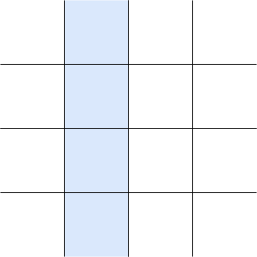

# Grid Layout

[TOC]


<!-- ToDo: finish -->
<!-- todo: remove unnecessary "grid" fillerword, e.g. explicit ~grid~ track -->
<!-- todo: add example code for almost everything -->

## Introduction

- a regular layout, for applications
- two-dimensional layout since uses grid, for one-dimensional layout see Flex Layout
- replaces Table Layout 🎉


## Terminology

- grid line: horizontal or vertical line


- grid: set of intersecting grid lines


- grid track: space between two adjacent grid lines, defines columns and rows



- grid cell: intersection of a row and a column


- grid area: rectangular set of adjacent grid cells


- beware: grid area is not a distinct feature of the grid, just a term for certain sets of grid cells ❗️


## Tracks

- rows / columns are relative to logical inline / block directions, see Writing Mode
- beware: can't specify directions independent of writing mode like in Flex Layout, not needed since can specify exact placement of items, see Placement ❗️
- explicit or implicit

### Track size

- breath of a track
- can be content-based or context-based
- can be fixed or if context-based also flexible

#### `<length-percentage>`

- non-negative
- percentage relative to corresponding dimension of the content area of the grid container
- context-based, fixed

#### `min-content`

- largest min-content contribution of a grid item in the track
- content-based, (fixed)

#### `max-content`

- largest max-content contribution of a grid item in the track
- content-based, (fixed)

#### `minmax(minimum, maximum)`

- flexible value that grows within the range
- `auto` minimum is largest minimum size of a grid item in the track ??? i.e. often but not always `min-content` ???
<!-- todo: see 6.6, minimum size is minimum size property, can be made smaller / bigger than min-content !! -->
- `auto` maximum is `max-content`, but track size can be bigger due to `*-content` alignment properties, see Alignment ❗️
- beware: can set `<flex>` factor only as maximum and not as minimum ❗️
- content-based (fixed) or context-based (fixed or flexible)

#### `auto`

- computes to `minmax(auto, auto)`, i.e. usually but not always `minmax(min-content, max-content)`
- content-based, (fixed)

#### fit-content(limit)

- the limit, but bound below by auto minimum (see `minmax(auto, )`) and above by `max-content`
- limit is `<length-percentage>`
- computed as `min(minmax(auto, max-content), minmax(auto, limit))`
- context-based, fixed

#### `<flex>`

- non-negative
- beware: outside of `minmax()` has a lower bound of `auto`, i.e. like `minmax(auto, <flex>)`
- beware: positive free space is only distributed after all non-flexible track sizing functions have reached their maximum, e.g. `minmax()`, etc.
- content-based, flexible

### Track list

- space-separated list of track sizes
- beware: leave out line names here for clarity, see Named grid lines

```css
/* breadth values */
<flexible-breadth>       = <length-percentage> | <flex> | min-content | max-content | auto
<inflexible-breadth>     = <length-percentage> | min-content | max-content | auto
<fixed-breadth>          = <length-percentage>

/* track sizes */
<flexible-size>          = <flexible-breadth> | minmax( <inflexible-breadth> , <flexible-breadth> ) | fit-content( <length-percentage> )
<fixed-size>             = <fixed-breadth> | minmax( <fixed-breadth> , <flexible-breadth> ) | minmax( <inflexible-breadth> , <fixed-breadth> )

/* repeat functions */
<flexible-repeat>        = repeat( <integer [1,∞]> , <flexible-size>+ )
<auto-repeat>            = repeat( auto-fill | auto-fit , <fixed-size>+ )
<fixed-repeat>           = repeat( <integer [1,∞]> , <fixed-size>+ )

/* track lists */
<flexible-list>          = [ <flexible-size> | <flexible-repeat> ]+
<auto-flexible-list>     = [ <fixed-size> | <fixed-repeat> ]* <auto-repeat> [ <fixed-size> | <fixed-repeat> ]*
```

#### `repeat()`

- track list fragment from repeating a track list fragment, i.e. creates a pattern
- auto repetition to create as many tracks as fit in content box of container
- `auto-fit` is like `auto-fill`, except after Placement any empty tracks created by the repetition are removed
- beware: can't nest `repeat()` functions ❗️
- beware: auto repetition requires fixed track sizes, can't be used with flexible track sizes ❗️
- beware: a track list can only contain a single auto repetition ❗️
- beware: returns at least the non-repeated track list fragment, even if tracks already overflow ❗️
- can combine auto repetition with `minmax( <length-percentage>, <flex> )` to let tracks grow to fill any remaining space

<!-- Demo: gridrepeat -->

### Explicit tracks

- always created
- as many as have size and/or name specified
- beware: final grid may have more tracks, see Implicit tracks ❗️

#### `grid-template-columns`, `grid-template-rows`

- specify track size of explicit grid tracks in column, row
- not inherited
- applies only to grid containers
- values: `none`, `<track-list>`, `<auto-track-list>`, see Track Size
- initial value: `none`
- beware: with `none` explicit tracks can still be created by `grid-template-area` ❗️

#### `grid-template`

- shorthand for `grid-template-columns` and `grid-template-rows`, i.e. specifies all explicit track sizes
- first `grid-template-rows`, then `grid-template-columns` separated by a `/`
- beware: resets omitted explicit tracks properties to their initial value ❗️

### Implicit tracks

- created if grid items are placed outside of explicit tracks, see Placement
- as many as needed
- beware: can't guarantee size of final grid, depends on number of implicit tracks generated ❗️

#### `grid-auto-columns`, `grid-auto-rows`

- specify track size of implicit grid tracks in column, row
- beware: also sizes additional explicit grid tracks from `grid-template-areas` that aren't sized by `grid-template-columns` / `grid-template-rows` ❗️
- not inherited
- applies only to grid containers
- values: `<flexible-size>`+, see Track Size
- beware: can't use `repeat()` function ❗️
- initial value: `auto`, see Track Size/`auto`
- track list is repeated if not long enough
- beware: can't guarantee custom track size for every implicit track since can become arbitrarily many ❗️

### `grid`

- shorthand for all explicit and implicit grid track properties (`grid-template-rows`, `grid-template-columns`, `grid-template-areas` and `grid-auto-rows`, `grid-auto-columns`, `grid-auto-flow`)
- beware: includes `grid-auto-flow` although it's a placement property ❗️
- like `grid-template`, except can specify `[ auto-flow && dense? ] <grid-auto-*>?` for one of the `grid-template-*`
- beware: for each direction can specify either size of explicit or implicit tracks, i.e. can't specify for both explicit and implicit tracks ❗️
- beware: don't use, instead use longhands, less confusing and can specify size for both explicit and implicit tracks ❗️
- beware: resets omitted properties to their initial value ❗️

### Named grid lines

- can assign one or more names to a grid line of a explicit grid track
- used in placement, see Placement
- allows to place items independent of actual grid line since independent of numerical index, can redefine named grid line in media query without changing placement
- add `[<custom-ident>*]` in explicit grid properties, keywords `span` or `auto` are not allowed

```css
myel {
  /* the three lines each have two names (english, spanish) */
  grid-template-columns: [one uno] 150px [two dos] 1fr [three tres];
}
```

- beware: in `repeat()` function line names at start and end of the pattern create two names for middle lines, e.g. `repeat(2, [a] 1fr [b])` computes to `[a] 1fr [b a] 1fr [b]` ❗️

### Named grid areas

- can assign one or more names to a grid area of explicit grid tracks
- used in placement, see Placement
- actually just named grid lines that make up grid area with names `<custom-ident>-start` and `<custom-ident>-end` for named grid area `<custom-ident>`, see Named grid lines
- beware: could as well manually name grid lines like that, would work just like named grid area ⚠️
- beware: there are no named grid areas, just implicitly named grid lines, named grid area is just shorthand for multiple named grid lines ⚠️
- allows to place items independent of actual grid area since independent of numerical indices, can redefine named grid area in media query without changing placement

#### `grid-template-areas`

- specifies names for grid areas of explicit grid tracks
- not inherited
- applies only to grid containers
- values: `none`, `"<custom-ident-list>"`+ where `<custom-ident-list>` is list of one or more `<custom-ident>` (like in Named grid lines) seperated by any sequence of whitespace
- beware: actually `"<custom-ident-list>"` above is `<string>`, but would need to escape any other characters in placement properties, don't use ⚠️
- initial value: `none`
- each string represents a row, each word in string represents a cell in that row
- beware: number of words in string must be identical, otherwise wouldn't be valid grid ❗️
- each unique word specifies the name for the grid area represented by its occurrences
- beware: identical words must create rectangular shape, otherwise wouldn't be valid grid area ❗️

```css
/* holy grail layout */
myel {
  grid-template-areas: "header header header"
                       "nav    main   aside"
                       "footer footer footer";
}
```

- dot characters are not a name, i.e. can use for throwaway name

```css
myel {
  grid-template-areas: "header ..     ."
                       "main   main   main"
                       "footer .      ...";
}
```

- beware: can specify only names for non-overlapping grid areas ❗️
- beware: can specify only one name for a grid area unlike multiple names for a grid line, see Named grid line ❗️
- beware: if specifies names for more explicit tracks than sized by `grid-template-columns` / `grid-template-rows`, creates new explicit tracks that are sized by `grid-auto-columns`, `grid-auto-rows` ❗️
- beware: total number of explicit tracks is larger length of value list of `grid-template-columns`, `grid-template-rows` and `grid-template-areas` ❗️

### Shorthands

- can name grid areas also in shorthand
- in `grid-template` shorthand add names for each row before the corresponding row track size
- if no track size after names, then `auto` is assumed
- beware: column track lists may not contain `repeat()` function, intended to line up in ASCII art with columns ❗️

```css
myel {
  grid-template-columns: 100px 200px 300px;
  grid-template-rows: auto 400px;
  grid-template-areas: "header header header"
                        "nav   main   aside";
  /* shorthand for the above */
  grid-template: "header header header"
                 "nav    main   aside" 400px
                 / 100px 200px 300px;
}
```

- can add names for row grid lines before string and after track size
- beware: can only name row grid lines, not column grid lines, need to use longhand `grid-template-columns` instead ❗️

```css
myel {
  grid-template-columns: 100px 200px 300px;
  grid-template-rows: [one] auto [two dos] 400px [tres];
  grid-template-areas: "header header header"
                        "nav   main   aside";
  /* shorthand for the above */
  grid-template: [one] "header header header" auto [two]
                 [dos] "nav    main   aside" 400px [tres]
                 / 100px 200px 300px;
}
```

in `grid` shorthand identical to `grid-template` shorthand, except it resets also implicit grid track properties


## Placement

- grid item is placed in a grid area
- specifies grid area manually, or automatically, or as mix of both
- beware: doesn't "create" grid area because grid area doesn't "exist", just term for the set of grid cells that are used, see Terminology ❗️
- beware: affects only visual rendering, keyboard navigation and screen reader still use document tree order ❗️
- beware: item can be placed in implicit grid instead of explicit grid, e.g. if numeric index is too large in manual placement, if too many items to auto-place in auto-placement ❗️
- beware: grid item in grid area is aligned by alignment properties, see Alignment ❗️

### Manual placement

- specifies grid area by bounding grid lines, i.e. start and end grid line in each direction
- grid line is referenced by integer numeric index from edges of explicit grid
- positive numeric indexes count from start side of explicit grid, negative numeric indexes count from end side of explicit grid
- explicit grid contains at least one grid line in each axis, i.e. numeric indexes `1` and `-1` are always in explicit grid
- beware: zero is invalid numeric index ❗️
- beware: start / end side are relative to direction of writing mode ❗️
- alternatively can specify grid line relative to opposite grid line, i.e. amount of tracks the grid item "spans"
- span is positive integer, negative or zero are invalid
- `<grid-line> = auto | <integer> | [ span && <integer> ]`
- beware: ignores named grid lines / areas here for simplicity ❗️
- beware: grid items can overlap if placed in intersecting grid areas or uses negative margins ❗️
- beware: order of stacking is same as Visual order, not order of document tree, see Stacking ❗️

#### grid-row-start, grid-row-end, grid-column-start, grid-column-end

specify the inline-start, block-start, inline-end, and block-end edges of the item's grid area
- values: `<grid-line>`


- initial value: `auto`
- applies only to grid items
- not inherited

`auto` means uses auto placement ?!?! figure rest out

if both `grid-*-start` and `grid-*-end` are numerical indexes, and start line is further end-ward than the end line, swap the two lines
  e.g. `grid-row-start: 4; grid-row-end: 2;`
if both `grid-*-start` and `grid-*-end` are numerical indexes and start line is equal to the end line, then end line is ignored, i.e. `grid-*-end` computes to `auto`
  i.e. effectively `span 1`
  e.g. `grid-row-start: 8; grid-row-end: 8;`
if both `grid-*-start` and `grid-*-end` are spans, then end line is ignored, i.e. `grid-*-end` computes to `auto`
  e.g. `grid-row-start: span 2; grid-row-end: span 2;`
beware: needs to define at least one grid line by numeric index, otherwise position is not definite, end side will default to auto-placement


#### `grid-row`, `grid-column`

- shorthand for `grid-row-*`, `grid-column-*`
- first `grid-*-start`, then optional `grid-*-end` separated by a `/`
- beware: resets omitted properties to their initial value ❗️

#### `grid-area`

- shorthand for `grid-row` and `grid-column`
- first `grid-row-start`, then optional `grid-column-start` separated by a `/`, then optional `grid-row-end` separated by a `/`, then optional `grid-column-end` separated by a `/`
- beware: resets omitted properties to their initial value ❗️

#### Named grid line

grid line can also be referenced by name instead of numeric index


can partially align grid area to named grid area by specifying name in `grid-*-start`/`end` properties
  e.g. *-start/end edge to the *-start/end edge of the named grid area.

specifying grid-row-start: foo will choose the start edge of that named grid area (unless another line named foo-start was explicitly specified before it) ??? WHAT DOES BEFORE MEAN??

for all above can specify named grid line
can place independent of numeric index of grid line, if named grid line is redefined in media query

If there are multiple lines of the same name, they can be indexed
by default treats as if provided index 1
order of integer and custom-ident doesn't matter
integer can be negative, counts in reverse, starting from the end edge of the explicit grid.
zero integer is invalid

???if both `grid-*-start` and `grid-*-end` are named grid lines / areas and start line is equal to the end line, then ??????end line is ignored, i.e. `grid-*-end` computes to `auto`
      e.g. `grid-row-start: text; grid-row-end: text;`
      --> important, since `grid-row` / `grid-column` shorthand set both ends to same <custom-ident>

<!-- todo: improve in-code comments -->
```css
myel {
  /* Span between the 5th and 7th lines named "text". */
  grid-row: text 5 / text 7;
}
```

can also span across lines with a name
order of "span" and [integer + custom-ident] doesn't matter
but Negative integers or zero are invalid for "span"

<!-- todo: improve in-code comments -->
```css
myel {
  /* start at the 5th line, then span across to next "text" line */
  grid-row: 5 / span text 1;
}

myel {
  /* start at the 5th line named "text", then span across two "text" lines (i.e. to the 7th line named "text") */
  grid-row: text 5 / span text 2;
}
```

beware: an auto-placed item can’t span to a named grid line ?!?!
if one of `grid-*-start` and `grid-*-end` is `auto` and other is a span to a named grid line, then span is ignored, i.e. span computes to `auto`
  e.g. `/* grid-row-start: auto; */ grid-row-end: span text;`

```
myel {
  /* invalid ?!?! */
  grid-row: auto / span text;
}
```

---

beware: If not enough lines with that name exist, all implicit grid lines are assumed to have that name for the purpose of finding this position !!!!

<!-- todo: clean up code, add picture from SPEC -->
```css
/* two grid lines numbered 1 and 2, "foo" is first line in implicit grid since not in explicit grid */
.grid { grid-template-columns: 100px; }
.griditem { grid-column: span foo / 4; }
```

??? WHY IS THE BELOW USEFUL ??? because named grid areas create such lines ??
??? SO, E.G. GRID-*-START SEARCHES FOR TWO LINES, NAME <custom-ident> AND <custom-ident>-START ??? WHICH ONE FIRST ??? the one with the lower numeric index ???
for grid-*-start can specify <custom-ident> for named grid line with the name <custom-ident>-start
for grid-*-end can specify <custom-ident> for named grid line with the name <custom-ident>-end

for `grid-row`, `grid-column` shorthands: if the first value is a <custom-ident>, the second value is also set to that <custom-ident>
  i.e. ??? useful only if its a named grid area ??? if grid line makes no sense since same line ???

for `grid-area` shorthand: if start side is a <custom-ident> and end side is omitted, the end side is also set to that <custom-ident>
  if only one <custom-ident> is specified, then all sides are set to that <custom-ident>
  i.e. ??? useful only if its a named grid area ??? if grid line makes no sense since same line ???

#### Named grid area

for `grid-row-*`, `grid-column-*` can specify named grid area, then partially aligns to that edge
???for `grid-row`, `grid-column` as well ??? ALIGNS TWO EDGES ???
for `grid-area` can specify named grid area, then places in that grid area
can place independent of numeric indexes of grid area, if named grid area is redefined in media query

Note that if a named grid area and a named grid line have the same name, the placement algorithm will prefer to use named grid area’s lines instead. ?? SO, LINE OR AREA ??

beware: named grid area only useful if places item using name in `grid-area` ??!??

### Auto placement

placement of grid items without a manual placement
places remaining grid items without manual placement

automatically places into an unoccupied grid area
places into first empty grid areas
by default, along row from row-start direction towards row-end direction, then wrap around to next row from column-start direction towards column-end direction, see `grid-auto-flow`
beware: may grow grid and create implicit tracks if needed
  may generate implicit tracks if explicit tracks are full
  adds new rows / columns as necessary
by default automatically placed in visual order WITHIN AUTO PLACED GRID ITEMS, NOT MANUALLY PLACED ONES, see `grid-auto-flow`

beware: auto placed items never overlap any other grid item, because laid out only after manual placement

beware: auto placement doesn't maintain any order relative to manually placed items, fills empty space, just maintains order within auto placed items, e.g. auto placed item can come before before manually placed item even though is later in source

can place certain items, leave rest for auto placement in between

can partially place items, remaining information is figured out by auto placement, like constraints, e.g. only span, or only start / end position
if only start / end position, span is set to 1
beware: by default, an item is placed into one cell

<!-- todo: improve in-code comment -->
```css
myel {
  /* auto placement makes span 1 */
  grid-row-start: 2;
  /* grid-row-end: 3; */
  grid-column-start: 3;
  /* grid-column-end: 4; */
}
```

<!-- todo: improve in-code comment -->
```css
myel {
  /* auto placement finds first grid-row-end and grid-column-end that satisfy span constraint */
  grid-row-start: span 2;
  grid-column-start: span 3;
}
```

#### `grid-auto-flow`

<!-- todo: reread 7.7. -->

- specifies direction in which boxes are laid out in auto placement
- also specifies packing
- beware: should have been two separate properties, conflates direction with packing ❗️

- not inherited
- applies only to grid containers
- values: `[ row | column ] || dense`
- initial value: `row`

- beware: doesn't affect stacking order since doesn't change order of boxes but only the direction, see Order ❗️

beware: without any explicit tracks, by default lays out items in block direction, differs from Flex Layout which lays out inline direction ❗️

##### Packing

items of different sizes may create holes, could fill by later items, backfills
  skips empty space to place a larger item, could return to fill those spaces with later items
sparse packing keeps order of auto-placed items, leaves holes
dense packing ignores order of auto-placed items, fills holes
- by default, packing is sparse, 
- if specifies `dense`, packing is dense
- beware: if packing is `dense`, the order of items may not be in Visual order ❗️

#### Visual order

- specifies order in which boxes are laid out in auto placement
- `order`
- not inherited
- applies only to grid items
- values: `<integer>`
- initial value: `0`
- element with lower number comes first in row/column-start direction (depending on `grid-auto-flow`)
- elements with same number are laid out by order in document tree, earlier one is towards row/column-start direction (depending on `grid-auto-flow`)
- beware: can use negative numbers to always show first since default is zero ❗️
- beware: elements with positive order number come after non-ordered elements since default is zero ❗️
- beware: order of stacking is same as Visual order, not order of document tree, see Stacking ❗️
- beware: in manual placement `order` has identical effect to `z-index`, because there is no auto placement ❗️


## Size

let's grid determine size from placement, different than Flow Layout where specifies size on item
beware: use auto sizing of items to adapt to track size, different to Flex Layout where size on item determined layout

BUT INITIAL POSITION OF ABSOLUTE POSITIONED GRID ITEM IS RELATIVE TO CONTAINER !?!?!?!?!

- beware: minimum size `auto` value of grid item that is not a scroll container, spans at least one track in that axis whose min track sizing function is auto, and spans more than one track in that axis of which none are flexible, then it resolves to `min-content` (with some adjustments) instead of zero ⚠️

### `auto` size

depends on self-alignment values


## Gutters

empty grid tracks between other grid tracks
spaces grid tracks from each other
only in between tracks, not before first / behind last

by default grid tracks are packed tightly
can use gap properties to make appear as separate 

can only specify for all rows / columns, not for individual ones
need to use margins of grid item instead

???!!!row-gap, column-gap can add additional space between tracks, i.e. grid is not purely the sum of the track sizes

- beware: size of final grid depends also on gutters ❗️

### `grid-row-gap`, `grid-column-gap`

- specify gutters in row, column

### `grid-gap`

- shorthand for `grid-row-gap` and `grid-column-gap`


## Alignment


e.g. due to fixed track size
if grid item is bigger than its grid area, then overflows, aligned by alignment properties, see Alignment
if grid item is smaller than its grid area, then doesn't overflow, aligned by alignment properties, see Alignment

<!-- todo: 10. -->

like for Flex Layout but in two!!! dimensions
?? has no effect if no positive free space
?? aligns in negative free space as well ??

"justify" is inline direction
"align" for block direction
??? also in Flex Layout
beware: in Grid Layout are same for different direction, in Flex Layout has multiple items for justify but ony single item (in line) for align
*-items properties are shortcuts for *-self properties of all child elements

*-content aligns the tracks in a container ??? 
???!!!justify-content, align-content can add additional space between tracks, i.e. grid is not purely the sum of the track sizes
??? what if grid container is smaller, tracks overflow, aligns in negative free space ??? TRACK CAN'T OVERFLOW 
aligns grid tracks in container
??? safe keyword

self-alignment properties *-self
aligns the item within its grid area
by default stretches over its whole grid area
??? what if grid area is smaller, item overflows, aligns in negative free space ???

?!?! beware: by default columns are full width because of `justify-content: stretch`
?? WHY NOT ROWS ??
BEWARE: TRACK SIZE IS LARGER THAN SPECIFIED IF JUSTIFY-CONTENT / ALIGN-CONTENT (?) : STRETCH IS SPECIFIED !!!!
Note: auto track sizes (and only auto track sizes) can be stretched by the align-content and justify-content properties.
i.e. can grow `auto` track sizes !!! ALSO IN MINMAX()
track size can be bigger due to `*-content` alignment properties, see Alignment ❗️

WHAT DO MARGINS DO? COPY DROM FLEX LAYOUT


## Absolute positioning
<!-- move to Positioned Layout -->

if containing block of absolutely positioned element is a grid container, can apply grid placement properties to element as if it were a grid item
`auto` value computes to (relevant edge of) padding box of grid container, no auto placement
i.e. by default, abspos element has same position as if container were not grid container
doesn't contribute to implicit grid, track sizing, etc.
non existent lines or out-of-bounds line compute to `auto`

offset properties are relative to grid area, i.e. as if grid area were containing block

<!-- todo: what happens if grid container is (also) parent of abspos element? -->


## Flex Layout comparison

two dimensional
alignment of content in both dimensions
explicitly position items in the grid, i.e. can create "holes"
allows explicit overlapping of items

Although many layouts can be expressed with either Grid or Flexbox, they each have their specialties. Grid enforces

2-dimensional alignment
top-down approach to layout, i.e. size tracks, not item itself
explicit overlapping of items, i.e. by placing in overlapping grid areas

columns / rows can use flexible sizing

sizes grid tracks and lets item size automatically grow to fill, instead of specifying item size ??
specifies size and location in grid (parent), instead of on child itself, doesn't need to hope they line up, guaranteed

can't change direction of grid, uses writing mode, not needed since grid itself provides any directions
??? also when laying out automatically 

SAME:

order property
margins, auto margins

floats don't apply
no margin collapse

## TODO

6.2. Grid Item Sizing
6.6. Automatic Minimum Size of Grid Items

11.

SUBGRID FOR LEVEL 2


## Resources

- [W3C - CSS Grid Layout Module Level 1](https://www.w3.org/TR/css-grid-1/)