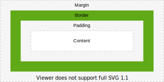

# Box model

[TOC]


## Introduction

- visual representation of elements in a document
- every element is represented as a box
- document tree is transformed into box tree
- box layout defines how box tree is rendered
- style of box is taken from properties of element
- (additional helper boxes may be generated, will only look at principal box of element here)


## Viewport

- area where document can be viewed, i.e. browser window excluding menu bar, etc.
- user agent offers scrolling mechanism if viewport is smaller than rendered document
- user agent adapts layout of document to viewport size automatically, e.g. text wrap ???
- 2D coordinate system, origin in top left corner


## Box

- rectangular content area with optional padding, border, and margin areas



- can think of box as four boxes in one, content box, padding box, border box, margin box (beware: don't confuse with descendant boxes)
- content area contains the boxes content, e.g. text, image, etc.
- box size automatically adapts to fit content, beware: don't confuse with descendant boxes in box tree, can "overflow" their containing block, see Box generation ???!!!


## Box Layout

- arrangement of boxes
- multiple layout models, e.g. flow layout, flex layout, grid layout, table layout, positioned layout
<!-- ToDo: write multiple layout models -->

<!-- TODO see css-break-4
a box can "break" into fragments, e.g. end of line, end of page on print, etc.
-->


## Size

<!-- TODO see css-sizing-3
- width / height of the box refers to width / height of content area
CAN CHANGE USING BOX-SIZING???

size of box often depends on the element’s content and/or its containing block size
The sizing properties, together with various other properties that control layout, define the size of the content area

padding, border, margin affect size of box, therefore may affect layout, e.g. line break

??? box-sizing selects to which width and height apply, content box, padding box, border box, margin box ?!?!
-->


## Margin

- visually separates box from other boxes
- margin properties specify thickness of margin area
- longhand `margin-*` for each side, shorthand `margin` for all four sides
- margin can be negative, results in ??? controled overflow of parent box ??
- initial value is `0`, beware: user agent style sheet may set a value ❗️
- percentage refers to _width_ of containing block, beware: even for `margin-top` and `margin-bottom` ❗️

<!-- Block Layout
Adjoining margins in block layout collapse, see Block Layout
beware: horizontal margins never collapse

vertical margins don't have any effect on inline elements
-->

<!--  ToDo: see css-break-4
Margins adjoining a fragmentation break are sometimes truncated
 -->


## Padding

- visually separates content from border
- padding properties specify thickness of padding area
- longhand `padding-*` for each side, shorthand `padding` for all four sides
- initial value is `0`
- percentage refers to _width_ of containing block, beware: even for `padding-top` and `padding-bottom` ❗️
- beware: user agent style sheet may set any value, overrides initial value ❗️


## Border

- visually defines box
- border properties specify thickness and style of border area
- longhand `border-*-width` for each side's thickness, shorthand `border-width` for all four sides
- initial value is `medium`
- percentage is not defined ⚠️
- longhand `border-*-style` for each side's line style, shorthand `border-style` for all four sides
- initial value is `none`, color and width are ignored, i.e. no border by default ❗️
- longhand `border-*-color` for each side's color, shorthand `border-color` for all four sides
- initial value is value of `color` property
- shorthand `border-*` combines `border-*-width`, `border-*-color`, `border-*-style`, in any order
- beware: `border-*` resets any ommitted values to their initial values ❗️

```css
border-top-width: 42px;
/* resets border-top-width to medium */
border-top: solid black;
```

- shorthand `border` combines `border-*`, can't set different values for each side, unlike `margin` and `padding`
- beware: `border` resets all other border properties to its initial value ❗️
- beware: user agent style sheet may set any value, overrides initial value ❗️


## Background

<!-- ToDo: see css-background-3 -->

- `background` of element styles background of content, padding and border area of box
- also `border` of element styles background of border area of bo
- background of margin area is always transparent, i.e. background of outer box shines through

background of element box by default within the padding edges
can be adjusted using the background-origin and background-clip properties

background by default within border edges ?!?!, overriden by initial value of border-color, can be seen with border-color: transparent


Each box has a background layer that may be fully transparent (the default), or filled with a color and/or one or more images. The background properties specify what color (background-color) and images (background-image) to use, and how they are sized, positioned, tiled, etc.
The background properties are not inherited, but the parent box’s background will shine through by default because of the initial transparent value on background-color.


## Color

<!-- ToDo: see css-color -->

color of an element's content (usually text).