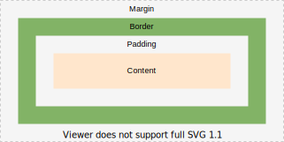

# Box model

[TOC]

## Introduction

- visual representation of elements in a document
- every element is represented as a box (*)
- document tree is transformed into box tree
- box layout defines how box tree is rendered
- style of box is taken from properties of element (*)
- (* for exact details see Box generation)
- a box "contains" another box, if in the box tree it's a descendant of the box
- descendant box refers to box of descendant element

## Viewport

- area where document can be viewed, i.e. browser window excluding menu bar, etc.
- user agent offers scrolling mechanism if viewport is smaller than rendered document
- user agent adapts layout of document to viewport size automatically, e.g. text wrap ???
- 2D coordinate system, origin in top left corner

## Box

- rectangular content area with optional padding, border, and margin areas

- can think of box as four boxes in one, content box, padding box, border box, margin box
- content area contains the boxes content, e.g. text, image, descendant boxes, etc.
(since box tree hierarchy is same as document tree hierarchy, see Box generation)
- box size automatically adapts to fit content
- beware: descendant boxes can "overflow" their containing block, but actual content like text, image, not, see ???

## Box Layout

- arrangement of boxes
- multiple layout models, e.g. flow layout, flex layout, grid layout, table layout, positioned layout
- applied within a formatting context, see Formatting Context

controlled by `display`, `position` (and `float`) properties of element

elements have no inherent layout (or style in general), all given by user agent style sheet, e.g. `table { display: table; }` and `li { display: list-item; }`
always choose elements by semantic meaning, then style as desired, e.g. navigation menu as `<ul`

<!-- ToDo: write multiple layout models -->

<!-- TODO see css-break-4
a box can "break" into fragments, e.g. end of line, end of page on print, etc.
-->

## Size

size of box refers to total visible area it takes up, i.e. content area + padding + border but not margin !!

<!-- TODO see css-sizing-3
standard box model using element's box-sizing: content-box (default)
- width / height of the box refers to width / height of content area, also min-width /height, max-widht/height
i.e. for "size" of box with border needs to add each padding and each border

- alternate box model using element's box-sizing: border-box, padding-box, margin-box ???
can make width height apply to different area of box e.g. border box
size of box often depends on the element’s content and/or its containing block size
The sizing properties, together with various other properties that control layout, define the size of the content area

padding, border, margin affect size of box, therefore may affect layout, e.g. line break

??? box-sizing selects to which width and height apply, content box, padding box, border box, margin box ?!?!
-->

beware: `width` and `height` are always horizontal and vertical, but change their meaning for vertical writing mode

## Margin

- visually separates box from other boxes
- margin properties specify thickness of margin area
- longhand `margin-*` for each side, shorthand `margin` for all four sides
- margin can be negative, results in ??? controled overflow of parent box ??
- initial value is `0`, beware: user agent style sheet may set a value ❗️
- percentage refers to _width_ of containing block, beware: even for `margin-top` and `margin-bottom` ❗️
- beware: vertical margins have no effect on inline-level boxes, see Flow Layout

vertical margins collapse, ONLY IN BLOCK FC??
see CSS2 8.3.1

<!--  ToDo: see css-break-4
Margins adjoining a fragmentation break are sometimes truncated
 -->

## Padding

- visually separates content from border
- padding properties specify thickness of padding area
- longhand `padding-*` for each side, shorthand `padding` for all four sides
- initial value is `0`
- percentage refers to _width_ of containing block, beware: even for `padding-top` and `padding-bottom` ❗️
- beware: user agent style sheet may set any value, overrides initial value ❗️

## Border

- visually confines box
beware: whole box still includes margin area, there is no empty space between boxes, all boxes touch each other, just margin is transparent ❗️
- border properties specify thickness and style of border area
- longhand `border-*-width` for each side's thickness, shorthand `border-width` for all four sides
- initial value is `medium`
- percentage is not defined ⚠️
- longhand `border-*-style` for each side's line style, shorthand `border-style` for all four sides
- initial value is `none`, color and width are ignored, i.e. no border by default ❗️
- longhand `border-*-color` for each side's color, shorthand `border-color` for all four sides
- initial value is value of `color` property
- shorthand `border-*` combines `border-*-width`, `border-*-color`, `border-*-style`, in any order
- shorthand `border` combines `border-*`, can't set different values for each side, unlike `margin` and `padding`
- beware: `border` resets all other border properties to its initial value ❗️
- beware: user agent style sheet may set any value, overrides initial value ❗️

## Background

<!-- ToDo: Finish, see css-background-3 -->

Each box has a background layer that may be fully transparent (the default), or filled with a color and/or one or more images. The background properties specify what color (background-color) and images (background-image) to use, and how they are sized, positioned, tiled, etc.

The background properties are not inherited, but the parent box’s background will shine through by default because of the initial transparent value on background-color.

background of the content, padding and border areas

- `background` of element styles background of content, padding and border area of box
- also `border` of element styles background of border area of bo
- background of margin area is always transparent, i.e. background of outer box shines through

background of element box by default within the padding edges
can be adjusted using the background-origin and background-clip properties

background by default within border edges ?!?!, overriden by initial value of border-color, can be seen with border-color: transparent

background-clip: sets whether an element's background extends underneath its border box (default), padding box, or content box
beware: solid border style masks the difference, needs to be opaque, dashed, etc.

## Color

<!-- ToDo: see css-color -->

color of an element's content (usually text).

## Resources

- [W3C - CSS Box Model Module Level 4](https://www.w3.org/TR/css-box-4/)
- [W3C - CSS Backgrounds and Borders Module Level 3](https://www.w3.org/TR/css-backgrounds-3/)