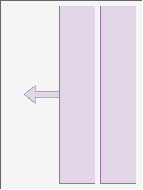
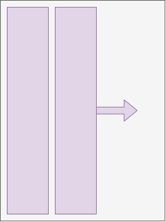
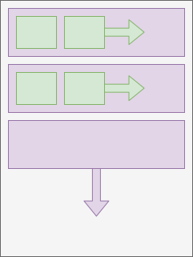
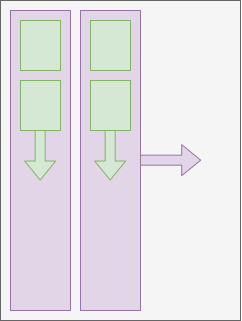
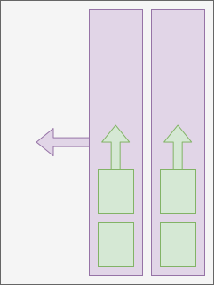
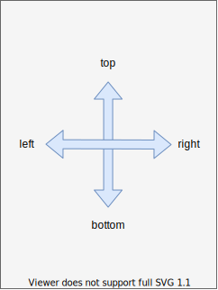
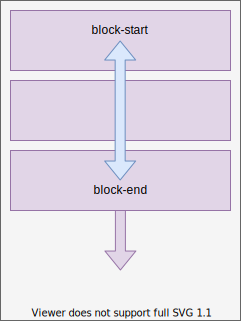
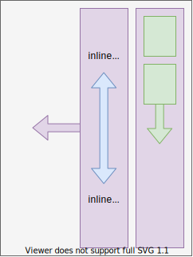
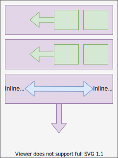
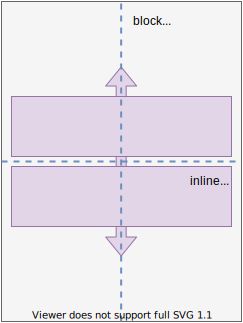

## Writing modes

[TOC]

## Introduction

- writing orientation: orientation of a line, e.g. horizontal or vertical
- line directionality: direction in which lines progress on a page, perpendicular to writing orientation, e.g. top-to-bottom or bottom-to-top, left-to-right or right-to-left
- text directionality: direction in which text progresses in a line, relative to writing orientation, i.e. (line-)left-to-(line-)right or (line-)right-to-(line-)left
- beware: line directionality and text directionality are often conflated, see [English StackExchange](https://english.stackexchange.com/questions/535835/precise-terms-for-directionality-in-a-writing-system) ⚠️

| writing orientation | line directionality | text directionality | example scripts |
| - | - | - | - |
| horizontal | top-to-bottom | left-to-right | Latin, Cyrillic, Indic |
| horizontal | top-to-bottom | right-to-left | Arabic, Hebrew |
| horizontal | bottom-to-top | left-to-right | N/A |
| horizontal | bottom-to-top | right-to-left | N/A |
| vertical | left-to-right | top-to-bottom | Mongolian |
| vertical | left-to-right | bottom-to-top | N/A |
| vertical | right-to-left | top-to-bottom | Chinese, Japanese, Korean |
| vertical | right-to-left | bottom-to-top | N/A |

- line orientation: orientation of text in a line
- text orientation: orientation of characters in text, e.g. upright, sideways, etc.
- writing mode: a particular line directionality, text directionality and text orientation
- beware: often characterises writing mode by writing orientation it uses, e.g. "horizontal writing mode", "vertical writing mode"
- typographic mode: orientation used for typographic conventions, e.g. for baseline, beware: doesn't need to match writing orientation ❗️
- beware: unfortunate choice of properties, `writing-mode` sets fixed combination of line directionality, line orientation and typographic mode, but not text directionality and text orientation, instead should have separate properties for each and `writing-mode` should have been shorthand for all ⚠️

## Block (flow) direction

- direction of flow of boxes in block formatting context, e.g. top-to-bottom by default
- also direction of flow of rows in table formatting context
- "vertical" overflow applies to it
- defines line directionality, since line boxes are block-level boxes
- can set using `writing-mode` property
- inherited property, set on root element to inherit
- beware: also sets line orientation and typographic mode, should be separate properties ⚠️
- beware: property name is confusing, should be `block-direction` ⚠️
- beware: property values are confusing, include redundant writing orientation, can be deduced from block flow direction ⚠️

| `writing-mode` | block flow direction | image | typographic mode |
| - | - | - | - | - |
| `horizontal-tb` | top-to-bottom |  | horizontal |
| `vertical-rl` | right-to-left |  | vertical |
| `vertical-lr` | left-to-right |  | vertical |
| `sideways-rl` | right-to-left | like `vertical-rl` | horizontal |
| `sideways-lr` | left-to-right | like `vertical-lr` | horizontal |

- beware: content of replaced element doesn't change orientation, e.g. image, iframe, etc.

## Inline (base) direction

- direction of flow of boxes in inline formatting context, e.g. line-left-to-line-right by default
- also direction of flow of columns in table formatting context
- "horizontal" overflow applies to it
- defines text directionality, since text are inline-level boxes
- relative to writing orientation, i.e. perpendicular to block flow direction (line directionality) ❗️
- can set using `direction` CSS property
- beware: property name is unclear, should be `inline-direction` ⚠️

| `direction` | block flow direction | image | block flow direction | image | block flow direction | image |
| - | - | - | - | - | - | - |
| `ltr` | top-to-bottom |  | right-to-left |  | left-to-right |  |
| `rtl` | top-to-bottom |  | right-to-left |  | left-to-right |  |

- beware: in left-to-right block flow direction `ltr` and `rtl` seem to be switched, because the line orientation stays the same as in right-to-left block flow direction, see Line-relative ❗️
- `sideways-rl` behaves like `vertical-rl` for both `direction`s
- `sideways-lr` behaves like `vertical-lr` with line orientation flipped, see Line-relative
- beware: semantic property of document, not presentation, don't use `direction` property, instead use `dir` attribute ⚠️
- set in document using `dir` attribute on element, set on root element such that inherits
- use `<bdo>` element with different `dir` attribute for exceptions
- use `<bdi>` element for automatically determined direction, equivalent to `dir="auto"` attribute, e.g. user input

## Text orientation

- orientation of characters in text
- can set using `text-orientation`, possible values `mixed`, `upright`, `sideways`
- only takes effect for vertical typographic modes, i.e. `writing-mode: vertical-rl` or `writing-mode: vertical-lr`

| `text-orientation` | image |
| - | - |
| `mixed` |  |
| `upright` |  |
| `sideways` |  |

## Logical properties ??

define box layout for other writing modes
 make layout independent of writing mode
depending on writing mode, i.e. `writing-mode` and `direction`

## Directions

### Physical

- relative to page, independent of writing mode
- "left", "right", "top", and "bottom"

### Flow-relative

- relative to block flow direction
- block-start: side that comes earlier in block flow direction
- block-end: side that comes later in block flow direction

| `writing-mode` | block-start | block-end | image |
| - | - | - | - |
| `horizontal-tb` | top | bottom |  |
| `vertical-rl` | right | left |  |
| `vertical-lr` | left | right |  |

- inline-start: vector of inline base direction
- inline-end: vector against inline base direction
- beware: inline-* are always perpendicular to block-* ❗️

|  `writing-mode` | `direction` | inline-start | inline-end | image |
| - | - | - | - | - |
| `horizontal-tb` | `ltr` | left | right |  |
| `vertical-rl` | `ltr` | top | bottom |  |
| `vertical-lr` | `ltr` | top | bottom |  |
| `horizontal-tb` | `rtl` | right | left |  |
| `vertical-rl` | `rtl` | bottom | top |  |
| `vertical-lr` | `rtl` | bottom | top |  |

- beware: in `vertical-lr` the "start" and "end" of a line are opposite from the other cases ⚠️

### Line-relative

- relative to line orientation
- line-left: inline-start for `dir: ltr`
- line-right: inline-start for `dir: rtl`
- line-over: vector line-left to line-right rotated by +90°
- line-under: vector line-left to line-right rotated by -90°

| `writing-mode` | line-left | line-right | line-over | line-under | image |
| - | - | - | - | - | - |
| `horizontal-tb` | left | right | top | bottom |  |
| `vertical-rl` | top | bottom | right | left |  |
| `vertical-lr` | top | bottom | right | left |  |
| `sideways-rl` | top | bottom | right | left | like `vertical-rl` |
| `sideways-lr` | bottom | top | left | right |  |

- beware: in `vertical-lr` the line orientation stays the same as in `vertical-rl`, use `sideways-lr` to flip it ❗️

## Dimensions

### Physical

- relative to page, independent of writing mode
- dimensions: "horizontal" and "vertical"
- axes: "x-axis" and "y-axis"
- length: "width" and "height"

### Logical

- relative to writing orientation
- block dimension: dimension parallel to block flow direction, perpendicular to inline base direction
- inline dimension: dimension parallel to inline base direction, perpendicular to block flow direction
- block / inline axis: axis in block / inline dimension
- block / inline "size": length in block / inline dimension
- beware: "size" is used for a length in a specific dimension, bad naming choice ⚠️

| writing orientation | block dimension | inline dimension | image | block axis | inline axis | block size | inline size |
| - | - | - | - | - | - | - | - |
| horizontal | vertical | horizontal |  | y-axis | x-axis | height | width |
| vertical | horizontal | vertical |  | x-axis | y-axis | width | height |

## Resources

- [W3C - CSS Writing Modes Level 4](https://www.w3.org/TR/css-writing-modes-4/)

-----

## Affecting Layout

an inline level box with different writing mode than parent will display as if it has display: inline-block.

A block-level box will establish a new block formatting context, meaning that if its inner display type would be flow, it will get a computed display type of flow-root

If a box has a different writing-mode value than its parent box (i.e. nearest ancestor without display: contents):
  If the box would otherwise become an in-flow box with a computed display of inline, its display computes instead to inline-block.
  If the box is a block container, then it establishes an independent block formatting context.
  More generally, if its specified inner display type is flow, then its computed inner display type becomes flow-root.

