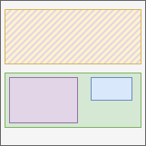

# Formatting context

[TOC]

## Introduction

- a box layout applied to a specific set of boxes, can think of a layout "instance" applied to specific boxes
- each box establishes a formatting context for its descendant boxes
see below which descendant boxes is applied to exactly

??? or continues the formatting context of its containing block

- can think of region the formatting context is applied as the establishing box itself
but not actual region, since FCs can "overlap", use "layout applied to set of boxes"

- beware: some boxes may be in region that don't follow formatting context, "out-of-flow" boxes, e.g. absolutely positioned box
- nesting similar to nesting of boxes, nested FC is applied in the boundaries of parent FC, formatting context chain

- a box selects which type of ancestor formatting context to follow, usually parent formatting context, ALWAYS THE CLOSEST OF THAT TYPE?!?!

beware: a box can "break out" of its parent formatting context, instead follow another ancestor FC higher up in the FC chain, no matter how deep the box is in the box tree, e.g. block-level box inside inline formatting context

???WRONG nested boxes are handled by nested FC, i.e. a FC only "knows" about immediate children

--> element's ODT  
--> FC of CB! WHAT IS CB???

- nested FCs don't affect each other, except through size of the establishing box, "independent"
(((except exclusions can are able to affect content across independent formatting context boundaries)))
except when box creates more than one FCs, these can be dependent

- ???each box establishes a single FC

??? 0: continue existing

??? 1: exactly one
beware: don't confuse a FC which extends another FC as multiple, is just a superset in functionality, still logically different FC

??? 1+: multiple, co-existing, dependent
apply to same set of boxes at same time
e.g. inline formatting context within a block formatting context, see Flow Layout

- ??? type of FC established by box may depend on ODT of child boxes it contains, e.g. block container ???

margins don't collapse accross formatting context boundaries ??? ONLY INDEPENDENT ???
anyways happens only for block FC ?!?!

## Out-of-flow box

- box laid out differently from formatting context it belongs to
- not at expected position in layout
- not in expected interaction with surrounding boxes
- "not part of normal flow of content in formatting context"

This occurs if the box is floated (via float) or absolutely positioned (via position)
i.e. box is floated or absolutely positioned
position is changed by something other than `display`, i.e. `position` or `float`
and root element (`<html>`)

OOF boxes create a new BFC ??!!

- in-flow box: box that is not out-of-flow, i.e. laid out using formatting context it's in

## Resources

- [W3C - CSS Display Module Level 3](https://www.w3.org/TR/css-display-3/)