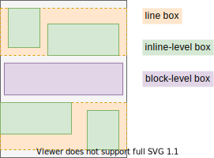
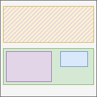

# Terminology

[TOC]


## Formatting context

- a box layout applied to a specific set of boxes
often a region of canvas, but certain boxes in region can behave differently, e.g. out-of-flow !!!
can think of region as within the box that establishes it

can think of "instance" of a layout applied to a concrete set of boxes

- each box establishes a formatting context for its descendant boxes
??? OR CONtINUE?

- nesting similar to nesting of boxes, containing block chain
nested FC is applied in the boundaries of parent FC
a box always follows closest parent formatting context, i.e. of parent element
only "knows" about immediate children, nested boxes are handled by nested FC


(beware: diagram assumes already boxes will be rendered nested, could be rendered all side by side instead)

- but a box can decide to "break out" of its parent formatting context and instead follow the one of its containing block, no matter how deep the box is in the box tree ??? WHAT IS CB
e.g. block box inside inline box
see ODT

here the div "breaks out" of the span, the span is only the line box

```html
<span>
  <em>Lorem</em>
  <strong>ipsum</strong>
  <div>dolor sit</div>
  <em>amet</em>
</span>
```



???- multiple can apply to same set of boxes at same time
e.g. inline formatting context within a block formatting context, see Flow Layout




FCs don't affect each other, except through the size of the establishing box

Each box only establishes a single FC, i.e. no multiple FCs applied to a box.

There are no "co-existing" FCs. The inline FC is within a line box, which is within a BFC.

FCs can be a superset of the functionality of another FC, but logically different FC, e.g. no "inline FC within block FC", but an inline-block FC which supports both block and inline layout

- independent: formatting context not affected by and not affecting the outer formatting context it's in, except through the size of its establishing principal box
(((except exclusions can are able to affect content across independent formatting context boundaries)))

box either establishes a new independent formatting context or continues the parent formatting context
WHAT DOES "CONTINUE" MEAN??? ASSUME IT MEANS ESTABLISH IDENTICAL ONE

???- can additionally establish an new non-independent co-existing formatting context, e.g. ???

margins don't collapse accross formatting context boundaries ??? ONLY INDEPENDENT ???

- [...]-level box: box that participates in a [...] formatting context, e.g. block-level box, inline-level box, flex-level box, etc.
i.e. is exactly the parent formatting context


## Out-of-flow box

- box laid out differently from formatting context it's in
- not at expected position in layout
- not in expected interaction with surrounding boxes
- "not part of normal flow of content in formatting context"

e.g. box is floated or absolutely positioned

- in-flow box: box that is not out-of-flow, i.e. laid out using formatting context it's in


## Resources

- [W3C - CSS Display Module Level 3](https://www.w3.org/TR/css-display-3/)