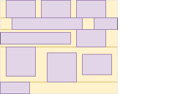

# Flow Layout

[TOC]


<!-- ToDo: revisist once css-flow/block is written -->
<!-- see note in https://www.w3.org/TR/css-box-4/#intro -->

## Introduction

- default layout of document

size and position boxes in relation to each other so that nothing overlaps
size and position boxes based on their relationships with their sibling and ancestor boxes

- beware: also called Block Layout or Block-Inline Layout


defaults to block, inline is superset of block


## Block ???DELETE formatting context

- boxes are laid out sequentially vertically
- beginning at the top of a containing block ??? WHAT IS CB
- each box's left outer edge touches the left edge of the containing block (for right-to-left formatting, right edges touch) ??? WHAT IS CB
and the right edge touches the right edge of its containing block ???
they can overflow
- vertical distance between two sibling boxes is determined by margin properties
- vertical margins between adjacent boxes collapse, beware: horizontal margins never collapse


## Inline ???DELETE formatting context

if in block fc needs wrapper line box

- exists within a block ???DELETE formatting context
- boxes are laid out sequentially horizontally in a line, wrap around to next line
- beginning at the top of a containing block ??? WHAT IS CB
- line box: block-level box that wraps the inline-level boxes that form a line
- line boxes have no margins, touch each other
- line boxes behave like normal block-level boxes, can interact with floats in BFC
- line box is always as wide as containing block, except in presence of floats
- line box grows tall enough for all inline-level boxes it contains
- horizontal distance between two sibling inline-level boxes is determined by margin, border and padding properties
- beware: vertical margins don't have any effect ❗
- line box can be taller than the tallest inline-level box, e.g. if vertically aligned by baseline of their text content
- vertical alignment of an inline-level box within its line box if the line box is taller than itself is controlled using `vertical-align` on element associated with the inline-level box, beware: can put on element associated with the block container to inherit to all inline-level boxes ❗️
- line box can be wider than total width of inline-level boxes it contains
- horizontal distribution of inline-level boxes within their line box if the line box is wider than their total width is controlled using `text-align` on element associated with the block container
- inline-level box can be split and distributed accross serveral line boxes if it exceeds line box width, see Fragmentation
<!-- ToDo: write Fragmentation -->
- if inline-level box can't be split then it overflows line box, e.g. due to `white-space: nowrap` or `white-space: pre`
- i.e. a line box itself never overflows its containing block ??? WHAT IS CB
- horizontal margins, borders and padding don't apply to split



???overflow-x controls line box width??? or containing block width???


## Terminology ???NEW

- inline box: inline-level box that establishes an inline formatting context
- block container: box that establishes an inline fc or an block fc
- block box: block-level block container


## Terminology

- inline box: inline-level box whose contents participate in the same inline formatting context as the inline box itself, i.e. the usual inline-level element ??
whose base-level contents are integrated in same inline formatting context


- block container: box that either contains only inline-level boxes (1), or contains only block-level boxes (2) (possibly generating anonymous block boxes to ensure this constraint)

1: establishes a new inline formatting context
also generates a root inline box which wraps all of its inline content.

2: ??

A block container establishes a new block formatting context if its parent formatting context is not a block formatting context; otherwise, when participating in a block formatting context itself, it either establishes a new block formatting context for its contents or continues the one in which it participates, as determined by the constraints of other properties (such as overflow or align-content)

a block container can establish a new block formatting context **and/or** a new inline formatting context

i.e. block containers that are not block boxes establish new block formatting contexts for their contents.

block container box that contains no block-level boxes establishes an inline formatting context ??? ONLY WAY AN IFC CAN BE ESTABLISHED

- block box: block-level box that is also a block container

beware: Not all block container boxes are block-level boxes, e.g. non-replaced inline blocks and non-replaced table cells are block containers but not block-level boxes. Similarly, not all block-level boxes are block containers, e.g. block-level replaced elements (display: block) and flex containers (display: flex) are not block containers.

A block box that establishes an independent formatting context establishes a new block formatting context for its contents.

block boxes with 'overflow' other than 'visible' (except when that value has been propagated to the viewport) establish new block formatting contexts for their contents.

beware: can both establish a block formatting context and an inline formatting context simultaneously. ??? HOW

block formatting context root: block container that establishes a new block formatting context


```html
<span>
  Lorem
  <em>
    ipsum
    <strong>dolor</strong>
    sit
  </em>
  amet
</span>
```


### Floats

beware: they break many assumptions

However, floating boxes may come between the containing block edge and the line box edge.


part of inline or block FC ???

BFC:
- each box's left outer edge touches the left edge of the containing block (for right-to-left formatting, right edges touch)
This is true even in the presence of floats (although a box's line boxes may shrink due to the floats)


floats establish new block formatting contexts for their contents.


## Resources

<!-- ToDo: revisist once css-flow/block is written -->
<!-- see note in https://www.w3.org/TR/css-box-4/#intro -->


flow: element lays out its contents using flow layout (block-and-inline layout).

Depending on the value of other properties (such as position, float, or overflow) and whether it is itself participating in a block or inline formatting context, it either establishes a new block formatting context for its contents or integrates its contents into its parent formatting context. See CSS2.1 Chapter 9. [CSS2] A block container that establishes a new block formatting context is considered to have a used inner display type of flow-root.


Certain properties can force a box to establish an independent formatting context in cases where it wouldn’t ordinarily. For example, making a box out-of-flow causes it to blockify as well as to establish an independent formatting context. As another example, certain values of the contain property can cause a box to establish an independent formatting context. Turning a block into a scroll container will cause it to establish an independent formatting context; however turning a subgrid into a scroll container will not—it continues to act as a subgrid, with its contents participating in the layout of its parent grid container.

A block box that establishes an independent formatting context establishes a new block formatting context for its contents. In most other cases, forcing a box to establish an independent formatting context is a no-op—either the box already establishes an independent formatting context (e.g. flex containers), or it’s not possible to establish a totally independent new formatting context on that type of box (e.g. non-replaced inline boxes).