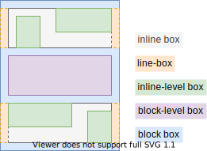
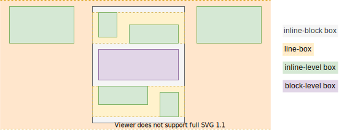

# Flow Layout

[TOC]


<!-- ToDo: revisist once css-flow is written -->
<!-- see note in https://www.w3.org/TR/css-box-4/#intro -->

## Introduction

- block and inline layout
- default layout for document
- beware: also called Normal Flow, or Block-Inline Layout, or Block Layout

size and position boxes in relation to each other so that nothing overlaps
size and position boxes based on their relationships with their sibling and ancestor boxes


## Block layout

<!-- ToDo: update with terminology from css-writing-mode -->

- boxes are laid out sequentially vertically ???RATHER PERPENDICULAR TO WRITING DIRECTION in enlish top to bottom
- boxes form a list
full width and as tall as content, can specify custom size

- vertical distance between two sibling boxes is determined by margin properties

vertical margins between adjacent boxes collapse to largest one, beware: horizontal margins never collapse
if negative the value will subtract from total
unfortunate exception, hides many bugs, could use composite selectors to only add bottom margin if there is no following sibling etc.
see CSS2 8.3.1


## Inline layout

- boxes are laid out sequentially horizontally ???RATHER IN WRITING DIRECTION in english left to right
in the direction that sentences run in that particular writing mode

- boxes form lines, wrap around to next line if line is full
as wide as contents and as tall as content, no custom size
- horizontal distance between two sibling inline-level boxes is determined by margin, border and padding properties
- vertical padding and border properties don't increase line height, overlap into adjacent lines ❗️
???
- vertical margins don't have any effect ❗
- vertical alignment of box within their line is controlled using `vertical-align` of element
- inline-level box can be split and distributed accross serveral line boxes if it exceeds line box width, see Fragmentation


## Inline formatting context

- a formatting context of inline layout
- needs to be already in a line, see Block FC
somewhere up the FC chain needs to be a block FC which establishes the line box

- beware: block-level box inside inline formatting context "breaks out", uses block FC of CB ???
see 9.2.1.1
--> can use IDT `inline-block` to let it continue inline

```html
<span>
  <em>Lorem</em>
  <strong>ipsum</strong>
  <div>dolor sit</div>
  <em>amet</em>
</span>
```

SIMILAR TO BLOCK BOX?? FORCES IFC TO BECOME BFC INSTEAD ???



beware: diagram assumes BFC is parent FC of inline box, could be much higher up in FC chain only, after many nested IFCs

## Block formatting context

if only inline-level children creates IFC, otherwise creates BFC, wraps inline-level boxes in anonymous line boxes

- a formatting context of Block and Inline Layout, i.e. superset of inline formatting context
- beware: should be called "block-inline formatting context", name is misleading, is superset of inline FC, not only block layout
there is no layout with only blocks!!!!!!!!!!!!!

- beginning at the top of a containing block ??? WHAT IS CB
??? start edge of the containing block, so the place at which sentences would begin in that writing mode

### for block-level boxes

- each box's left outer edge touches the left edge of the containing block (for right-to-left formatting, right edges touch) ??? WHAT IS CB
and the right edge touches the right edge of its containing block ???
they can overflow
i.e. full width of container

??? user agent style sheet default for many elements, e.g. `div`, `html`, `body`?

??? width and height are respected

### for inline-level boxes

- inline-level boxes are wrapped in line box
- line box: block-level box that wraps the inline-level boxes that form a line
- line boxes have no margins, touch each other
- line boxes behave like normal block-level boxes, can interact with floats in BFC
- line box is always as wide as containing block, except in presence of floats
- line box grows tall enough for all inline-level boxes it contains
- line box can be taller than the tallest inline-level box, e.g. if vertically aligned by baseline of their text content
- vertical alignment of an inline-level box within its line box if the line box is taller than itself is controlled using `vertical-align` on element associated with the inline-level box, beware: can put on element associated with the block container to inherit to all inline-level boxes ❗️
- line box can be wider than total width of inline-level boxes it contains
- horizontal distribution of inline-level boxes within their line box if the line box is wider than their total width is controlled using `text-align` on element associated with the block container
beware: only in block FC, not in inline FC, since boxes are contained in inline-level box whose width grows dynamically
- inline-level box can be split and distributed accross serveral line boxes if it exceeds line box width, see Fragmentation
<!-- ToDo: write Fragmentation -->
- if inline-level box can't be split then it overflows line box, e.g. due to `white-space: nowrap` or `white-space: pre`
- i.e. a line box itself never overflows its containing block ??? WHAT IS CB
- horizontal margins, borders and padding don't apply to split


???overflow-x controls line box width??? or containing block width???

??? width and height are not respected

??? DIFFERENCE BETWEEN CONTINUE FC AND CREATING A NEW FC???
Turning a block into a scroll container will cause it to establish an independent formatting context
using overflow to create a new BFC, overflow: auto or set other values than the initial value of overflow: visible.
Forcing the box to create a new BFC would contain the float.
better use display: flow-root


## Boxes

### Inline box

- inline-level box that establishes an IFC
- ??? its inline-level children continue in same line
wraps its inline-level children
somewhere in FC chain must be BFC

??? CONTINUE IFC OF CONTAINING BLOCK
The contents of an inline box participate in the same inline formatting context as the inline box itself.

- created by DT inline, "inline"


beware: diagram assumes BFC is parent FC of inline box, could be much higher up in FC chain only, after many nested IFCs

### Inline-block box

- inline-level box that establishes a BFC
- is a block container, just in-line instead of breaking out
- created by DT inline, "block"



since BFC the size properties are respected, vertical padding and margin don't overlap other lines anymore 🎉

### Block container

- box that establishes a BFC
- can be block-level or inline-level, see Block box and Inline-block box
- general term
- created by DT xxxxx, flow (= inline / block)

<!-- Note: spec lets a BC also establish an IFC, would mean any box is a BC, useless definition -->

### Block box

- block-level block container
- created by DT block, flow (= inline / block)


### Floats

beware: they break assumption
influence IFC ??!?!? see Github

However, floating boxes may come between the containing block edge and the line box edge.


part of inline or block FC ???

BFC:
- each box's left outer edge touches the left edge of the containing block (for right-to-left formatting, right edges touch)
This is true even in the presence of floats (although a box's line boxes may shrink due to the floats)


floats establish new block formatting contexts for their contents.


## Resources

<!-- ToDo: revisist once css-flow is written -->
<!-- see note in https://www.w3.org/TR/css-box-4/#intro -->