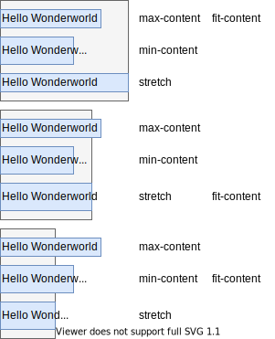

# Size

[TOC]


<!-- ToDo: revisit once https://www.w3.org/TR/css-sizing-4 has been finished -->

<!-- ToDo: check ODT dependent things only valid in Flow Layout or also in other FCs like Flex ? e.g. auto value, ODT `inline` restrictions, etc. -->

<!-- ToDo: clarify values and initial value of min / max properties, e.g. auto min size resolves to 0 but to min-content in Flex Layout -->

## Introduction

- width and height of box, see NFP/Size
- beware: misused as synonym for the length in single one of the two spacial dimensions, e.g. `block-size`, `inline-size`, etc. ⚠️
- by default adapts to content or context, see Sizing value#`auto`
- beware: if box doesn't adapt to context can overflow parent, if box doesn't adapt to content can be overflowed by content, see Overflow ❗️
- can use padding, border and margin before setting any custom size
- can set custom size of only one length, let other one adapt automatically, e.g. `width: 100%; height: auto`
- custom size can't be set in certain cases, e.g. ODT `inline`


## Sizing properties

- specify size of one of the sub-boxes, the others adapt according to padding / border / margin properties, e.g. content box, padding box, border box, or margin box
- sub-box depends on Sizing values, only for `<length-percentage>` can control, see Sizing box
- not inherited
- beware: don't use border to visualise size of box, affects layout since adds to total size, instead use browser Developer Tools ❗️
- applies to all element, except if ODT `inline`

### Size

- specify size of box
- physical: `width`, `height`
- logical: `block-size`, `inline-size`, see Writing Mode
<!-- ToDo: uncomment when size keyword is official, https://github.com/w3c/csswg-drafts/issues/820
- shorthand `size` for `width` and `height`
- beware: values have opposite order from shorthands `margin`, `padding`, `border-width`, `border-color`, `border-style`, etc. ❗️ -->
- can use relative units and fix bounds using minimum and maximum size properties

### Minimum size

- specify lower bound for size property, i.e. becomes size if size property falls below it
- physical: `min-width`, `min-height`
- logical: (`min-block-size`, `min-inline-size`, see Writing Mode
- beware: minimum size overrides maximum size if maximum size <= minimum size, no matter if where size is in the inequality, e.g. size <= maximum size <= minimum size, maximum size <= size <= minimum size, or maximum size <= minimum size <= size, i.e. minimum size is always applied ⚠️

### Maximum size

- specify upper bound for size property, i.e. becomes size if size property grows above it
- physical: `max-width`, `max-height`
- logical: `max-block-size`, `max-inline-size`, see Writing Mode
- beware: minimum size wins over maximum size if maximum size <= minimum size, minimum size is always applied, no matter what size is, e.g. size <= maximum size <= minimum size, maximum size <= size <= minimum size, or maximum size <= minimum size <= size ⚠️


## Sizing values

- values for sizing properties
- initial value: `auto` for size and minimum size properties, `none` for maximum size properties
- adapts to content or context

### `auto` / `none`

- depends on layout properties
  - `max-content` for ODT `inline`, float, absolutely / fixedly positioned element, flex / grid container, etc.
  - `stretch` for ODT `block`
  - intrinsic size for replaced elements, e.g. images
- beware: always specify maximum size for replaced elements, otherwise may overflow, e.g. images ❗️
- beware: `max-content` is zero for empty element, needs to explicitly set value, e.g. float, absolutely / fixedly positioned element, etc. ❗️
- adapts to content (or context in Block Layout of Flow Layout)

### `<length-percentage>`

- size of sizing box, see Sizing box
- beware: by default sizing box is content box ❗️
- percentage relative to size in same direction of containing block
- adapts to nothing (only percentage adapts to context)
- beware: don't set absolute size since doesn't adapt to content or context, facilitates overflow ❗️

### `min-content`

- minimum size of content box such that contents don't overflow
- adapts to content, i.e. zero if empty element ❗️

### `max-content`

- minimum size of content box such that contents don't overflow given infinite available space
- can think of as "ideal" preferred size
- beware: `min-content` <= `max-content` ❗️
- adapts to content, i.e. zero if empty element ❗️

### `stretch`

- maximum size of margin box in available space
- beware: `stretch` is not constrained by `min-`/`max-content`, i.e. `stretch` can be smaller than both ❗️
- adapts to context

### `fit-content`

- `min(max-content, max(min-content, stretch))`
- adapts to content and context




## Sizing box

- sub-box to which sizing properties refer when sizing value is of `<length-percentage>`
- controlled by `box-sizing` property
- beware: property name should have been `sizing-box` ❗️
- not inherited
- values: `content-box`, `border-box`
- initial value: `content-box`
- beware: initial value should have been `border-box` since total size of box ❗️
- beware: no `padding-box` value because of little use ❗️
- beware: no `margin-box` value because margin not part of box, see Margin ❗️
- beware: doesn't set sub-box for non-`<length-percentage>` sizing values, e.g. `min-content`, `max-content`, etc. ❗️
- beware: by default needs to add padding and border to `<length-percentage>` to get total size of box ❗️
- beware: by default box overflows if has `100%` size and non-zero padding or border (or margin), since size applies to content box ❗️
- beware: size of padding, border and margin area takes precedence over size of (sizing) box, i.e. if area of sub-boxes within (sizing) box is bigger than size of (sizing) box, then size of content box is set to zero and size of (sizing) box becomes as large as necessary to fit area of sub-boxes ⚠️

```html
<div></div>
```

```css
div {
  /* width computes to 2*30px + 2*40px = 140px */
  box-sizing: border-box;
  width: 100px;
  padding: 0 30px;
  border-width: 0 40px;
  /* just styling */
  height: 1rem;
  background-color: lightgrey;
  border-style: solid;
  border-color: red
}
```


## Resources

- [W3C - CSS Box Sizing Module Level 4](https://www.w3.org/TR/css-sizing-4/)