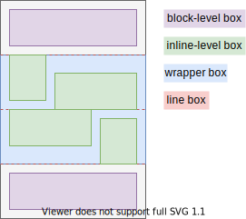
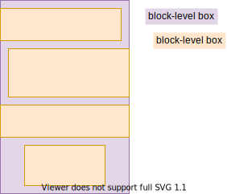

# Flow Layout

[TOC]

<!-- ToDo: revisist once css-flow is written, https://www.w3.org/TR/css-box-4/#intro -->

## Introduction

- block and inline layout
- default document layout
- beware: legacy terminology was Normal Flow, Block-Inline Layout, or Block Layout
- beware: will use default writing mode here, see Writing Mode for logical terminology, e.g. vertical is line direction, horizontal becomes text direction, width / height become block / inline size, etc.

## Block Layout

- boxes are laid out sequentially top-to-bottom
- boxes form a "list"
- boxes are full width of ???CB
- boxes fit content height
- boxes can be custom sized, but not smaller than content ???
<!-- ToDo: see css-sizing -->

- vertical distance between sibling boxes controled by padding, border and margin properties
- vertical margins between adjacent boxes collapse to largest one, negative values subtract from total
- beware: intended to allow for equal margins before, after and in between boxes, but hides many bugs, can use composite selector instead ⚠️
- beware: horizontal margins never collapse ❗️
<!-- ToDo: see margin collapse CSS2 8.3.1 -->
- beware: don't confuse with block FC, deprecated terminology ⚠️

## Inline Layout

- boxes are laid out sequentially left-to-right
- boxes form "lines", wrap around to next line when line reached width of ???CB
- boxes fit content width, not full width of ???CB
- boxes fit content height
- boxes can't be custom sized, as big as content
<!-- ToDo: see css-sizing -->

- horizontal distance between sibling boxes controled by margin, border and padding properties
- beware: vertical margins don't have any effect
- beware: vertical padding and border properties don't increase line height, overlap into adjacent lines ❗️
- beware: no margin collapse ❗️
- vertical alignment of box within its line controled using `vertical-align` of element
- beware: don't confuse with inline FC, deprecated terminology ⚠️

## Flow FC

- a formatting context of block and inline layout
- block and inline layout can be mixed, infinite possible layouts from combination of boxes following block or inline layout
- ODT of box determines its role in flow FC, see Box generation
- additional boxes are generated depending on ODT of boxes
- beware: don't view as mutually exclusive inline / block FC, deprecated terminology ⚠️

## Line boxes

lines are formed by line boxes
- line box: ???block-level box that wraps the inline-level boxes that form a line
line box: fragmentation container, not part of box tree

???NOT ANYMORE WITH ROOT INLINE BOX

- line boxes have no margins, padding, border or styling
???- line boxes behave like normal block-level boxes, can interact with floats
- line box is always as wide as containing block
except in presence of floats
- line box grows tall enough for all inline-level boxes it contains
- line box can be taller than the tallest inline-level box, e.g. if vertically aligned by baseline of their text content
- vertical alignment of an inline-level box within its line box if the line box is taller than itself is controlled using `vertical-align` on element associated with the inline-level box, beware: can put on element associated with the block container to inherit to all inline-level boxes ❗️
- line box can be wider than total width of inline-level boxes it contains
- horizontal distribution of inline-level boxes within their line box if the line box is wider than their total width is controlled using `text-align` on element associated with the block container
beware: only in block FC, not in inline FC, since boxes are contained in inline-level box whose width grows dynamically
- inline-level box can be split and distributed accross serveral line boxes if it exceeds line box width, see Fragmentation
<!-- ToDo: write Fragmentation -->
- if inline-level box can't be split then it overflows line box, e.g. due to `white-space: nowrap` or `white-space: pre`
- i.e. a line box itself never overflows its containing block ??? WHAT IS CB
- horizontal margins, borders and padding don't apply to split

???- beginning at the top of a containing block ??? WHAT IS CB
??? start edge of the containing block, so the place at which sentences would begin in that writing mode

## ODT

<!-- ToDo: Reference in Box generation -->

- type of layout principal box of element follows in flow FC
may be in ancestor FC
- [...]-level box: box that participates in a [...] formatting context, i.e. block-level box uses block layout, inline-level box uses inline layout
- determines which additional boxes are generated, e.g. wrapper boxes ???EXAMPLE
- beware: has no effect in FC other than flow ???
- beware: should have been separate property, e.g. "flow-type", `display` should have set only FC, bad design choice ⚠️⚠️⚠️

behavior of ODT depends on parent ODT and ODTs of boxes in ancestor flow FC chain (i.e. only until closest non-flow FC)
i.e. box chain whose IDT is flow(-root)

| box ODT | parent ODT | description |
| - | - | - |
| inline | block | as above |
| inline | inline | continues in same line as parent, can't change |
| block | block | as above |
| block | inline | breaks out, continues in closest grandparent FC with ODT block, can change by setting parent IDT to flow-root | 

??? why does paragraph behaves differently than div, p in p breaks out as well???

### `inline`

- if parent ODT is block, wrapped in anonymous block-level box together with sibling boxes of ODT inline, inside it fragmentation containers form lines (line box)
i.e. as few and large anonymous boxes as possible

- if parent ODT is inline, no additional boxes, continues in same "line" as parent itself
??? continues FC
??? can use `inline-block` to force independent FC

- default, except for inner display type `ruby`
- beware: user agent style sheet may define different defaults, e.g. ``, `<em>`, `<strong>`, etc.

### `block`

- if parent ODT is block, as usual ??

- if parent ODT is inline, breaks out into closest ancestor flow FC whose box as ODT block ???NEEDS TO GUARANTEE THAT THERE IS SUCH ONE
is exception, doesn't follow its FC anymore, instead follows ancestor flow FC higher up in flow FC chain, established by closest box with ODT block, no matter how deep the flow FC chain is,

uses block FC of CB ??? see 9.2.1.1

can change by making parent FC flow-root, i.e. inline-block box, see Flow-root FC

beware: diagram assumes grandparent box is block-level, could be long chain of inline-level boxes in between ❗️

- default for inner display type `ruby`
- beware: user agent style sheet may define different defaults, e.g. `
`, `
`, `<ul>`, etc.

## IDT

<!-- ToDo: move to Box generation -->

- type of FC (for child boxes) created by box
additional helper boxes may be created

- beware: should have been whole `display` property, not mix with ODT in single property, bad design choice ⚠️⚠️⚠️

## Flow-root FC

- independent flow FC from ODT of parent boxes
- if own ODT is block nothing changes ??

- if own ODT is inline, then child block-level boxes don't break out anymore
box becomes "inline-block"

since block layout the child boxes have their size properties are again respected, vertical padding and margin don't overlap other lines anymore 🎉

- beware: if box has different writing-mode than its parent, IDT `flow` computes to `flow-root`

??? DIFFERENCE BETWEEN CONTINUE FC AND CREATING A NEW FC???
Turning a block into a scroll container will cause it to establish an independent formatting context
using overflow to create a new BFC, overflow: auto or set other values than the initial value of overflow: visible.
Forcing the box to create a new BFC would contain the float.
better use display: flow-root

???overflow-x controls line box width??? or containing block width???

## Deprecated terminology

- block / inline FC: one layout type in a flow FC, not a real FC since a box can have both block and inline layout for its children, also not controled by IDT (but by ODT), don't view as FC
- inline box, block box, block container differentiated by inline or block FC they created, differentiation not needed anymore since all create a flow FC

## Resources

<!-- ToDo: revisist once css-flow is written, https://www.w3.org/TR/css-box-4/#intro -->