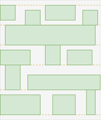
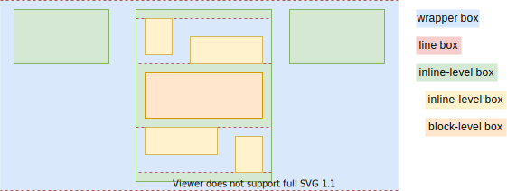

# Flow Layout

[TOC]

<!-- ToDo: revisist once css-flow is written, https://www.w3.org/TR/css-box-4/#intro -->

## Introduction

- default document layout
- comprises block and inline layout
- beware: block / inline layout exist only in flow layout, layouts in a layout, should be called "sub-layout" ❗️
- beware: use physical terminology here, assume default writing mode, for logical terminology see Writing Mode, e.g. vertical ≙ line direction, horizontal ≙ text direction, width / height ≙ block / inline size, etc.
- beware: don't confuse with deprecated terminology, see Deprecated terminology ⚠️
- beware: initial formatting context is flow, contains blockified principal box of the root element, see ODT

## Block Layout

- boxes are laid out sequentially top-to-bottom
- boxes form a "list"
- boxes are full width of FC
- boxes are fit height to content
- boxes can be custom sized, see Box
<!-- ToDo: see css-sizing -->

- vertical distance between sibling boxes controlled by padding, border and margin properties
- horizontal distance to edge of FC controlled by padding, border and margin properties
- vertical margins between adjacent boxes collapse to largest one, negative values subtract from total
- beware: avoid margin collapse, hides many bugs, instead use composite selector, bad design choice ⚠️
- beware: horizontal margins never collapse ❗️
<!-- ToDo: margin collapse, see Box -->

## Inline Layout

- boxes are laid out sequentially left-to-right
- boxes form "lines", wrap around to next line when line reached width of FC
- boxes are fit width of content, not full width of FC
- boxes are fit height to content
- boxes can't be custom sized, see Box
<!-- ToDo: see css-sizing -->

- vertical distance between boxes controlled by line height and vertical alignment, not by margin, boder and padding properties
- beware: vertical margins don't have any effect
- beware: vertical padding and border properties don't increase line height, overlap into adjacent lines ❗️
- horizontal distance between sibling boxes controlled by margin, border and padding properties
- beware: no margin collapse ❗️
- vertical alignment of box within its line controlled using `vertical-align` of element

### Line box

- fragmentation container, not part of box tree
- in a block-level wrapper box, i.e. some establishing box in continual ancestor flow FC chain must be a block-level box
- wraps inline-level boxes that form a line
- has no margins, padding, border or styling
<!-- ???- line boxes behave like normal block-level boxes, can interact with floats -->
- full width of containing block, similar to block-level box
<!-- because anonymous wrapper box doesn't establish FC? What is CB? -->
- fit height to content, similar to block-level box
<!-- except in presence of floats -->
- can be taller than the tallest box it contains, e.g. if vertically aligned by baseline of their text content
- vertical alignment of an inline-level box within its line box if the line box is taller than itself is controlled using `vertical-align` on element associated with the inline-level box, beware: can put on element associated with the block container to inherit to all inline-level boxes ❗️
- can be wider than total width of inline-level boxes it contains
- horizontal distribution of inline-level boxes within their line box if the line box is wider than their total width is controlled using `text-align` on element associated with the block container
beware: only in block FC, not in inline FC, since boxes are contained in inline-level box whose width grows dynamically
- inline-level box can be split and distributed accross serveral line boxes if it exceeds line box width, see Fragmentation
<!-- ToDo: write Fragmentation -->
- if inline-level box can't be split then it overflows line box, e.g. due to `white-space: nowrap` or `white-space: pre`
- i.e. a line box itself never overflows its containing block ??? WHAT IS CB
- horizontal margins, borders and padding don't apply to split

???- beginning at the top of a containing block ??? WHAT IS CB
??? start edge of the containing block, so the place at which sentences would begin in that writing mode

## Flow formatting context

- a formatting context of block and inline layout
- a box can use either block or inline layout, infinite possible layout combinations in flow FC
- controlled using ODT of element, see ODT
- additional helper boxes are generated for certain ODTs

- beware: if box has different `writing-mode` than its parent, IDT `flow` computes to `flow-root`

## Flow-root formatting context

- a better flow FC
- beware: should have been flow FC, but can't change for compatibility ❗️

inside floats are contained, i.e. don't bleed out anymore, no need to use scroll container hack (`overflow` other than `visible`) anymore 🎉
outside floats are kept outside, i.e. don't enter box and push away content, instead push away whole box 🎉
<!-- no need to use clearfix hack anymore -->

- margins of child boxes do not collapse across formatting context boundaries
- beware: doesn't affect margin collapse of child boxes within same FC, or parent boxes with each other ❗️

## Outer display type (ODT)

- type of sub-layout of principal box of element in flow(-root) formatting context
- can be either `block` or `inline`
- beware: has no effect if parent FC is not flow layout ???
- beware: affects layout of principal box in formatting context estbalished by parent box, not formatting context the principal box establishes for children ❗️ 
- additional helper boxes are generated for inline ODT, wrap the principal box, can depend on ODT of parent (for historic exception also on ODTs of higher ancestors)
- `inline` is default, except for IDT `ruby` default is `block`
- "block-/inline-level box": box with ODT block / inline
- beware: historic exception of box following other FC than the one its in, see block-level box in inside-level box ⚠️ 

| principal box in parent box | description |
| - | - |
| inline-level box in block-level box | wrapper block-level box with line boxes |
| inline-level box in inline-level box | no |
| block-level box in block-level box | no |
| block-level box in inline-level box | in flow FC breaks out, in flow-root FC as expected |

- blockify/inlinify: ODT is computed to be block/inline, can't change, e.g. root box, out-of-flow box, etc.
- box establishing a flow FC inside another type of FC is blockified, e.g. flex, grid FC etc., guarantees that there is at least some block-level establishing box in ancestor flow FC chain

### Inline ODT

- if parent ODT is block, anonymous block-level wrapper box is generated, wraps all sibling inline-level boxes
- line boxes in wrapper box

- if parent ODT is inline, no additional boxes
- no additional line boxes, parent forms the line for children
- parent box is sized to fit content

- beware: in flow FC border of children overlap border of parent box, like with line box, not in flow-root FC ❗️

### Block ODT

- same for flow and flow-root FC
- if parent ODT is block, no additional boxes

- if parent ODT is inline, no additional boxes
- in flow FC "breaks out" of own FC into closest ancestor flow FC in flow FC chain with a block-level establishing box
<!-- ToDo: containing block?? see 9.2.1.1 -->
<!-- ToDo: how to guarantee that there is one? -->
- historic exception, breaks assumption that a box only "sees" the FC it's in
- can change by making parent FC flow-root, i.e. parent box inline-block, see Flow-root FC

beware: diagram assumes grandparent box is block-level, flow FC chain could be longer with multiple inline-level boxes in between ❗️

- in flow-root FC doesn't break out, parent box is "inline-block" box

## Deprecated terminology

- Normal Flow: old word for Flow Layout, also sometimes Block-Inline Layout
- block / inline FC: one layout type in a flow FC, not a real FC since a box can have both block and inline layout for its children, also not controlled by IDT (but by ODT), don't view as FC, don't view flow FC as mutually exclusive either inline / block FC
- inline box, block box, block container differentiated by inline or block FC they created, differentiation not needed anymore since all create a flow FC
- continuing a FC: not defined how a layout operates on nested boxes, avoid idea of "continuing an FC", used to explain effects accross formatting context boundaries, e.g. margin collapse, floats, etc., instead can explain as weird quirks that shouldn't have been like that in the first place

## Resources

<!-- ToDo: revisist once css-flow is written, https://www.w3.org/TR/css-box-4/#intro -->

since block layout the child boxes have their size properties are again respected, vertical padding and margin don't overlap other lines anymore 🎉
