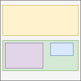

# Layout

[TOC]

## Introduction

- arrangement of boxes
- affects size and position of box

## Box generation

- for each element one or more boxes (*) are created in box tree depending on layout
- box tree hierarchy stays the same as document tree hierarchy ❗
- one box is the principal box, additional helper boxes may be created
- helper boxes are children or siblings of principal box, but not ancestors ❗️
- anonymous boxes that don't belong to any element may be created in addition to box(es) created by element
- (*) zero boxes may be created, see Box generation type
- beware: often says "the property of a box", but it's the property *of the element* that the box is generated for ❗

### Principal box

- main box of element
- contains boxes of descendant elements
- used for generated content of element
- is applied style of element, see Helper box for exceptions

### Helper box

- additional box of element
- nested in principal box, e.g. `display: list-item` generates an additional marker box within the principal box, `display: table` generates an additional table grid box within the principal wrapper table box
- inherits style from principal box through box tree
- some non-inherited properties are applied to helper box instead of principal box, e.g. border properties applied to `display: table` element are applied to its helper table grid box instead of its principal wrapper table box

### Anonymous box

- box that is not associated with an element
- inherits style from box tree parentage, since has no associated element
- wraps text content of an element that has other child elements, e.g. `
Hello <em>big</em> World!
`
- fixes up box tree when a particular nested structure is required that is not provided by the boxes generated from the element tree, e.g. a table cell box generates an anonymous table row box around itself if its parent box is not a table row box

## Regular layout

- adaptive to surrounding boxes
- nothing overlaps
- beware: can still overflow due to size constraints, see Size
- applied by a formatting context
- multiple regular layout types, e.g. flow layout, flex layout, grid layout, table layout, etc.
- beware: official terminology is "Normal Flow", won't use since unclear, historical roots from when only had Flow Layout ⚠️

### Formatting context

- a regular layout applied to a specific set of boxes
- can think of an instantiation of a regular layout, regular layout instance
- each box establishes a single formatting context for its child boxes
- can visually think of as region of content area of the establishing box
- nested FCs build a FC tree similar to box tree
- nested FCs don't affect each other except through size of establishing box
- (beware: non-layout related properties can still affect each other accross FC boundaries, e.g. margin collapse, inheritance ❗️)
- a box is constrained by area of FC, i.e. content area of establishing box
- a box only "sees" FC it's in, doesn't "know" about FCs higher up in chain
- beware: flow FC is historic exception, block-level boxes inside inline-level boxes "break out" and follow another flow FC higher up in FC chain, see Flow Layout ❗️

## Irregular layout

- layout "on top of" a regular layout, e.g. Float Layout and Positioned Layout
- takes precedence over regular layout, since each box is already in a FC
- not necessarily adaptive to surrounding boxes, e.g. absolutely / fixedly positioned element
- can create overlaps
- beware: use regular layout, only use irregular layout as last resort ❗️
- beware: unlike regular layout doesn't affect box tree ❗️
- beware: irregularly laid out box can still interact with regularly laid out box, even accross multiple formatting contexts, e.g. float interacts with line boxes of any following boxes, relatively positioned box interacts with siblings, etc. ❗️
- for stacking order see Stacking

## Display type

- controls Box generation type and type of regular layout of box(es) for element
- beware: should have separated box generation type and regular layout type in separate properties, bad design choice, e.g. `box-generation: none | contents` ⚠️
- behavior of box within its FC controlled by separate properties, e.g. `flex-flow` for flex layout, ODT for flow layout, etc.
- beware: behavior of box in Flow Layout controlled by ODT, conflated with display type, historical baggage from when only had Flow Layout, see ODT ⚠️
- beware: all elements have same initial display type, user agent style sheet overrides for "default layout", e.g. `p, div { display: block; }`, `em, span { display: inline; }`, `table { display: table; }`, `li { display: list-item; }`, etc. ❗️

### Box generation type

- controls box generation with zero boxes
- `display: none`: no boxes are generated for element and descendant
- as if element hadn't been in the document tree
- removes element from accessibility tree
- beware: affects box tree, affects layout of surrounding boxes, use `visibility` property of element to make box transparent
- beware: only affects box tree but not document tree, i.e. selectors, property inheritance, event handling, etc. are not affected ❗️
- `display: contents`: no boxes are generated for element, but are generated for descendant elements
- as if element had been replaced in the document tree by its descendants
- doesn't remove element from accessibility tree
- beware: `::before` and `::after` pseudo-elements are treated like descendant elements, `::before` is first child, `::after` is last child
- beware: only affects box tree but not document tree, i.e. selectors, property inheritance, event handling, etc. are not affected ❗️

### Regular layout type

- controls formatting context (and behavior of Flow layout)
- `display: <display-outside> || <display-inside>`
- can be in any order
- beware: only affects visual layout, doesn't change semantics of element ❗️

#### Outer display type (ODT)

- behavior of principal box in Flow layout, see Flow Layout

#### Inner display type (IDT)

- type of regular layout applied by the formatting context for the child boxes
- additional helper boxes are generated for certain layouts, can depend on ODT of element
- the desired FC is established by the most nested helper box, others are wrapper boxes
- `flow` is default, for any outer display type

| IDT | PB name | PB FC | HB name | HB FC | condition |
| - | - | - | - | - | - |
| `flow`(`-root`) | flow container box | flow layout | - | - | - |
| `flex` | flex container box | flex layout | - | - | - | - |
| `grid` | grid container box | grid layout | - | - | - | - |
| `ruby` | ruby container box | ruby layout | - | - | if ODT `inline` |
| `ruby` | wrapper box | flow layout | ruby container box | ruby layout | otherwise |
| `table` | wrapper table box | flow layout | table grid box | table layout | - |

#### Lists

- can append `list-item` to `display` for IDT `flow`(`-root`)
- generates additional marker box, can select using `::marker` pseudo element
- beware: should have separated with box generation property since doesn't affect layout, bad design choice, e.g. `box-generation: none | contents | list-item` ⚠️
- content of marker box is specified by `list-style-type` property of element
- image content of marker box is specified by `list-style-image` property of element
- position of marker box in box tree is specified by `list-style-position` property of element, can be child or sibling of principal box
- shorthand `list-style` to set all list-style properties, `*-type` becomes fallback for `*-image`
<!-- ToDo: see CSS2 12.5 -->
- beware: user agent style sheet overrides initial value of `<li>` element with `li { display: list-item; }` ❗️
- beware: list-style properties inherit, can set on parent element to inherit to any list-item children, e.g. on `<ul>`, `<ol>` to inherit to `<li>`

#### Defaulting

- initial value is `inline`, i.e. shorthand for `inline flow`
- if only one IDT or ODT is specified the other defaults
- beware: always specify both IDT and ODT for clarity ❗️

| shorthand | longhand | notes |
| - | - | - |
| `block` | `block flow` | since IDT defaults to `flow` |
| `flow-root` | `block flow-root` | since ODT defaults to `block` |
| `inline` | `inline flow` | since IDT defaults to `flow` |
| `flex` | `block flex` | since ODT defaults to `block` |
| `grid` | `block grid` | since ODT defaults to `block` |
| `table` | `block table` | since ODT defaults to `block` |
| `ruby` | `inline ruby` | since ODT defaults to `inline` ❗️|
| `list-item` | `block flow list-item` | since ODT defaults to `block` and IDT to `flow` |
| `inline list-item` | `inline flow list-item` | since IDT defaults to `flow` |

#### Single-keyword syntax

- shorthand value for ODT `inline`
- legacy, don't use anymore ❗️

| shorthand | longhand |
| - | - |
| `inline-block` | `inline flow-root` |
| `inline-flex` | `inline flex` |
| `inline-grid` | `inline grid` |
| `inline-table` | `inline table` |

## Resources

- [W3C - CSS Display Module Level 3](https://www.w3.org/TR/css-display-3/)
- [David Baron - Faster HTML and CSS: Layout Engine Internals for Web Developers](https://www.youtube.com/watch?v=a2_6bGNZ7bA)