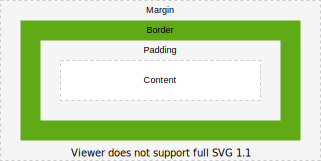

# Layout

[TOC]

<!-- ToDo: Finish -->

## Introduction

- visual arrangement of elements in a document
- viewport: area where document can be viewed, i.e. browser window excluding menu bar, etc.
- user agent offers scrolling mechanism if viewport is smaller than rendered document
- user agent adapts layout of document to viewport size automatically, e.g. text wrap ???

## Box model

- a box consists of content, padding, border and margin
- `background` of element styles background of content, padding and border area of box
- background of margin is always transparent, i.e. background of outer element shines through

- margin visually separates box from other boxes
- can layer boxes, can layout respective to each other, etc.

box tree, which represents the formatting structure of the rendered document
like photoshop layers
but nested boxes can overflow

## Elements

- an element is represented by a box
- each element generates at least a principle box
principal box contains content and boxes of descendant elements, is used when "element is positioned"

Some elements (OR DISPLAY VALUES??) may generate additional boxes in addition to the principal box (such as list-item elements, which generate an additional marker box, or table elements, which generate a principal table wrapper box and an additional table grid box). These additional boxes are placed with respect to the principal box.

- principal box contains contents of its element
- principal box generally is styled according to element, e.g. except border properties applied to a table element are applied to its table grid box, not to its principal table wrapper box

anonymous box: box that is not associated with any element, takes style from parent box (instead of parent element of its generating element) e.g. a table cell box generates an anonymous table row box around itself if its parent is not a table row box

boxes can be broken into box fragments, when overflow

- can control using `display` property, e.g. `none` generates no box, `list-item` generates an additional child marker box
display controls how many boxes and what type of boxes are generated for the element ?!

boxes are nested (or rather overlayed) like elements in document tree

- an element generates zero or more boxes
an element is a box ??
Every element has a box around it

beware: often element is synonym for its principal box ?!?!

- layout of an element is determined by positioning scheme
- positioning schemes: normal flow, float model or absolute positioning model
- element is "in-flow" if laid out in normal flow, otherwise "out-of-flow"

layout of a box is determined by
  box dimensions and type.
  positioning scheme (normal flow, float, and absolute positioning).
  relationships between elements in the document tree.
  external information (e.g., viewport size, intrinsic dimensions of images, etc.).

## Normal flow

- default
includes block formatting of block-level boxes, inline formatting of inline-level boxes, and relative positioning of block-level and inline-level boxes, standard ?!

### Formatting contexts

- region with a specific layout of boxes ??

#### Block formatting context

- boxes are laid out vertically sequentially, beginning at the top of a containing block
- each box's left margin edge touches the left content edge of the containing block (in left-to-right formatting, otherwise opposite)

#### Inline formatting contexts

- boxes are laid out horizontally sequentially, beginning at the top of a containing block

The boxes may be aligned vertically in different ways: their bottoms or tops may be aligned, or the baselines of text within them may be aligned.

line box: rectangular area that contains the boxes that form a line
always tall enough for all of the boxes it contains, might be taller than the tallest box due to alignment
When several inline-level boxes cannot fit horizontally within a single line box, they are distributed among two or more vertically-stacked line boxes. Thus, a paragraph is a vertical stack of line boxes. Line boxes are stacked with no vertical separation (except as specified elsewhere) and they never overlap.
When an inline box exceeds the width of a line box, it is split into several boxes and these boxes are distributed across several line boxes. If an inline box cannot be split then the inline box overflows the line box. When an inline box is split, margins, borders, and padding have no visual effect where the split occurs. Inline boxes may also be split into several boxes within the same line box due to bidirectional text processing.
Line boxes are created as needed to hold inline-level content within an inline formatting context.

When the height of a box is less than the height of the line box containing it, the vertical alignment of the box within the line box is determined by the 'vertical-align' property.
When the total width of the inline-level boxes on a line is less than the width of the line box containing them, their horizontal distribution within the line box is determined by the 'text-align' property.

In general, the left edge of a line box touches the left edge of its containing block and the right edge touches the right edge of its containing block. However, floating boxes may come between the containing block edge and the line box edge. Thus, although line boxes in the same inline formatting context generally have the same width (that of the containing block), they may vary in width if available horizontal space is reduced due to floats

width of a line box is determined by a containing block and the presence of floats
height of a line box is determined by the rules given in the section on line height calculations

Only _horizontal_ margins, borders, and padding are respected between these boxes

boxes that establish new inline formatting contexts for their contents:
  - block container box that contains no block-level boxes

### Box types
follow box display types

- block-level box: box that participates in a block formatting context
- block container: box that either contains only block-level boxes, or establishes an inline formatting context (i.e. contains only inline-level boxes)
- block box: box that is both block-level and a block container
- beware: not all block container are block-level boxes, e.g. inline blocks, table cells, etc.

- inline-level box: box that participates in an inline formatting context
- inline box: box that is both inline-level and whose contents participate in the same inline formatting context as itself
- beware: not all inline-level boxes are inline boxes, e.g. replaced inline-level elements, inline-block elements, inline-table elements, etc.

block-level element: element that is formatted visually as block, has a block-level principal box
inline-level element: element that 
generates inline-level boxes

do not form new blocks of content, content is distributed in lines, e.g., emphasized pieces of text within a paragraph, inline images, etc.

Block-level boxes participate in a block formatting context. Inline-level boxes participate in an inline formatting context. Table formatting contexts are described in the chapter on tables.

## Float model

a box is first laid out according to the normal flow, then taken out of the flow and shifted to the left or right as far as possible
Content may flow along the side of a float

## Absolute positioning model

a box is removed from the normal flow entirely (it has no impact on later siblings) and assigned a position with respect to a containing block

## Guidelines

- beware: vertical scrolling is more natural than horizontal scrolling

a box can be containing box for other boxes
inner box makes up content of outer
- content can overflow ?? only if other boxes ?? content resizes automatically to fit content ??

content box depends on several factors like width / height property, if box contains other elements etc.
margin box width / height = content width / height + paddings + borders + margins
width of element can either be content, padding, border or margin box, by default content, often changed to border-box

- can be visualised in browser developer tools

#### Principal box

An element whose principal box is a block container box is a block container element

#### Containing block

- box respective to which position and size of a descendant box is calculated
- beware: descendant box is positioned with respect to its containing block, but it is not confined by this containing block, it may overflow ❗️
- usually the parent element's box, e.g. ul of li, but not necessarily ????????

#### `display` property

- specifies a box's type
- may generate "principal box", respective to which descendant boxes are positioned
- may generate more boxes for descendant elements, e.g. `list-item`

element becomes block-level: 'block', 'list-item', and 'table'
element becomes block container: 'block', 'list-item', and 'table'

element becomes inline-level: 'inline', 'inline-table', and 'inline-block'
'inline' generates an inline box

#### Box type

////

#### Anonymous boxes

...
if a block container box has a block-level box inside it, then we force it to have only block-level boxes inside it

#### Positioning scheme

The flow of an element A is the set consisting of A and all in-flow elements whose nearest out-of-flow ancestor is A.

boxes that establish new block formatting contexts for their contents:
  - Floats
  - absolutely positioned elements
  - block containers (such as inline-blocks, table-cells, and table-captions) that are not block boxes
  - block boxes with 'overflow' other than 'visible' (except when that value has been propagated to the viewport)

----- 

margin, border, and padding can be broken down into top, right, bottom, and left segments

##### Margin

- `margin` sets width of margin with
- initial value is 0, beware: user agent style sheet may set a value ❗️
The percentage is calculated with respect to the width of the generated box's containing block, even for 'margin-top' and 'margin-bottom'.
vertical margins don't have any effect on inline elements
value can be negative, i.e. moves element ???

- two margins are adjoining iff
  - both belong to in-flow block-level boxes that participate in the same block formatting context
  - no line boxes, no clearance, no padding and no border separate them (Note that certain zero-height line boxes (see 9.4.2) are ignored for this purpose.)
  - both belong to vertically-adjacent box edges, i.e. form one of the following pairs:
    - top margin of a box and top margin of its first in-flow child
    - bottom margin of box and top margin of its next in-flow following sibling
    - bottom margin of a last in-flow child and bottom margin of its parent if the parent has 'auto' computed height
    - top and bottom margins of a box that does not establish a new block formatting context and that has zero computed 'min-height', zero or 'auto' computed 'height', and no in-flow - children

adjoining margins of two or more boxes (which might or might not be siblings) can combine to form a single margin. Margins that combine this way are said to collapse, and the resulting combined margin is called a collapsed margin.

vertical margins between boxes collapse.
- Adjoining vertical margins collapse, except:
  - Margins of the root element's box do not collapse.
  - If the top and bottom margins of an element with clearance are adjoining, its margins collapse with the adjoining margins of following siblings but that resulting margin does not - collapse with the bottom margin of the parent block.
  - If the top margin of a box with non-zero computed 'min-height' and 'auto' computed 'height' collapses with the bottom margin of its last in-flow child, then the child's bottom margin - does not collapse with the parent's bottom margin.

A collapsed margin is considered adjoining to another margin if any of its component margins is adjoining to that margin.
Note. Adjoining margins can be generated by elements that are not related as siblings or ancestors.

More details: https://www.w3.org/TR/CSS22/box.html#collapsing-margins

- beware: horizontal margins never collapse

The (visible!!!!) vertical distance between two sibling boxes is determined by the 'margin' properties.
Vertical margins between adjacent block-level boxes in a block formatting context collapse.

##### Padding

The 'padding' shorthand property sets the padding for all four sides while the other padding properties only set their respective side.
- `margin` sets width of margin with
- initial value is 0, beware: user agent style sheet may set a value ❗️
The percentage is calculated with respect to the width of the generated box's containing block, even for 'padding-top' and 'padding-bottom'.

##### Border 

border-width:
- specify the width of the border area
The 'border-width' shorthand property sets the border-width for all four sides while the other border-width properties only set their respective side.

same properties for color and style,
need to set border style because it's `none` by default

`border` shorthand property for setting the width, style, and color of the border

##### Bi-directionality

see https://www.w3.org/TR/CSS22/box.html#bidi-box-model

-----

- for adjacent boxes horizontal margins add, vertical margins collapse to larger margin of both by default ???

beware: documents were designed to allow printing, properties may behave differently when printed, e.g. `margin` ???

initial value of `display` is `inline` but user agent style sheet makes many a `block`

- beware: the content of a box never overflows, just other boxes inside the box can overflow ❗️

Elements can be thought of as boxes sitting on top of other boxes
can control properties of box
    padding, the space around the content. In the example below, it is the space around the paragraph text.
    border, the solid line that just outside the padding.
    margin, the space around the outside of the border.
    width
    background-color, the color behind an element's content and padding.
    color, the color of an element's content (usually text).
    text-shadow sets a drop shadow on the text inside an element.
    display sets the display mode of an element. (keep reading to learn more)

block element, meaning it takes up space on the page. A block element can have margin and other spacing values applied to it. In contrast, images are inline elements. It is not possible to apply margin or spacing values to inline elements. So to apply margins to the image, we must give the image block-level behavior using display: block;.

boxes overflow if don't fit ???, e.g. image larger than body

## Positioning

Normal flow: Inline items are laid out in the same way as the letters in words in text, one after the other across the available space until there is no more room, then starting a new line below. Block items stack vertically, like paragraphs and like the items in a bulleted list. Normal flow also includes relative positioning of block or inline items, and run-in boxes.
Floats: A floated item is taken out of the normal flow and shifted to the left or right as far as possible in the space available. Other elements then flow around the floated item, unless they are prevented from doing so by their clear property.
Absolute positioning: An absolutely positioned item has no place in, and no effect on, the normal flow of other items. It occupies its assigned position in its container independently of other items., can be fixed to point on page or on screen

-> can't use float on absolutely positioned element, i.e. position: absolute, position: fixed
-> can't use positioning properties top, bottom, left, and right on elements in normal flow, i.e. must have position: relative, absolute, fixed

absolutely positioned elements are removed from the flow of elements on the page, they don't affect each other at all, as if it was not there

### Position property

- controls positioning

Static: The default value places the item in the normal flow
Relative: The item is placed in the normal flow, and then shifted or offset from that position. Subsequent flow items are laid out as if the item had not been moved.
Absolute: Specifies absolute positioning. The element is positioned in relation to its nearest non-static ancestor.
Fixed: The item is absolutely positioned in a fixed position on the screen even as the rest of the document is scrolled

### Float property

left: The item floats to the left of the line that it would have appeared in; other items may flow around its right side.
right: The item floats to the right of the line that it would have appeared in; other items may flow around its left side.
clear: Forces an element to appear underneath ('clear') floated elements to the left (clear:left), right (clear:right) or both sides (clear:both)

- usually percentage is calculated relative to width or height of containing block
beware: e.g. percentage for `margin` is relative to _width_ of containing block, even for top and bottom margin ❗️
see definition table

box-sizing selects to which width and height apply, content box, padding box, border box, margin box ?!?!