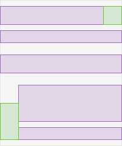

# Floats

[TOC]


<!-- ToDo: finish -->

## Introduction

- an irregular layout, "on top of" regular Flow Layout

### Floats

Content flows along the side of a float
floats are designed for one or two, use flex layout or grid layout instead

Floats: A floated item is taken out of the normal flow and shifted to the left or right as far as possible in the space available. Other elements then flow around the floated item, unless they are prevented from doing so by their clear property.


beware: they break assumption
influence IFC ??!?!? see Github

In general, the left edge of a line box touches the left edge of its containing block and the right edge touches the right edge of its containing block. However, floating boxes may come between the containing block edge and the line box edge. Thus, although line boxes in the same inline formatting context generally have the same width (that of the containing block), they may vary in width if available horizontal space is reduced due to floats

part of inline or block FC ???

BFC:
- each box's left outer edge touches the left edge of the containing block (for right-to-left formatting, right edges touch)
This is true even in the presence of floats (although a box's line boxes may shrink due to the floats)


floats establish new block formatting contexts for their contents.

if the box is floated (via float) it's taken out-of-flow


controlled by `float` and `clear` property
left: The item floats to the left of the line that it would have appeared in; other items may flow around its right side.
right: The item floats to the right of the line that it would have appeared in; other items may flow around its left side.
clear: Forces an element to appear underneath ('clear') floated elements to the left (clear:left), right (clear:right) or both sides (clear:both)


?? Floats don't affect the layout of the content inside other block formatting contexts, and clear only clears past floats in the same block formatting context.

the parent box doesn't contain float, float may stick out the bottom if it's taller than rest of content in parent
-> make parent create flow-root FC

## Introduction

<!-- ToDo: assumptions of formatting context broken by float ? -->

floated box pushes inline content away and lays over following box, background of paragraph goes underneath the floated item
???line boxes of that paragraph that have been shortened to cause the effect of wrapping content around the float

```css
p {
    background-color: tomato;
}
    
.float {
    float: left;
    width: 200px;
    border: 2px dotted black;
    padding: 10px;
} 
```

```html
<div>
    <div class="float">I am a floated box!</div>

    <p>One November night in the year 1782, so the story runs, two brothers sat over their winter fire in the little French town of Annonay, watching the grey smoke-wreaths from the hearth curl up the wide chimney. Their names were Stephen and Joseph Montgolfier, they were papermakers by trade, and were noted as possessing thoughtful minds and a deep interest in all scientific knowledge and new discovery.</p>
</div>
      
```


float and clear only apply to items inside the same formatting context


The content of that div has floated alongside the floated element. As the content of the float is taller than the content alongside it, the border of the div now runs through the float. As explained in the guide to in-flow and out of flow elements, the float has been taken out of flow so the background and border of the div only contain the content and not the float.

```css
.box {
    background-color: rgb(224, 206, 247);
    border: 5px solid rebeccapurple;
}

.float {
    float: left;
    width: 200px;
    height: 150px;
    background-color: white;
    border:1px solid black;
    padding: 10px;
}      
```

```html
<div class="box">
    <div class="float">I am a floated box!</div>
    <p>I am content inside the container.</p>
</div>
```


Absolute positioning or floating an element blockifies the box’s display type.
making a box out-of-flow causes it to blockify as well as to establish an independent formatting context

applies to principal box

Some formatting contexts inhibit floating, so that an element with float: left is not necessarily out-of-flow.




-> can't use float on absolutely positioned element, i.e. position: absolute, position: fixed
and vice versa???
