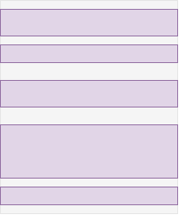
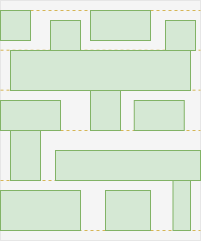
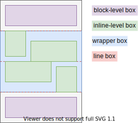
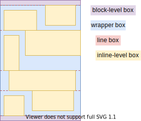
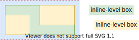
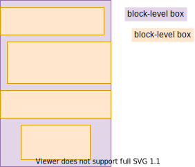
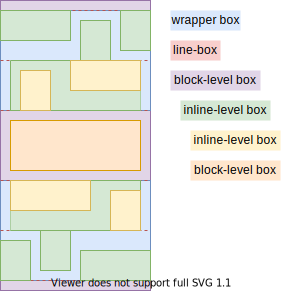
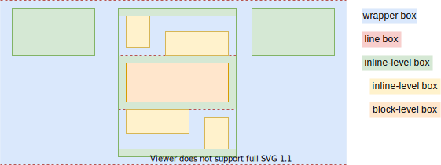

# Flow Layout

[TOC]

<!-- ToDo: revisit once css-flow is written, https://www.w3.org/TR/css-box-4/#intro -->
<!-- ToDo: use flow container and flow item terminology, also in other modules
- beware: often refers to specific kind "block-level" or "inline-level" directly rather than "flow item" ❗️
-->

## Introduction

- a regular layout, for documents
- default layout, see Layout#Display_type
- composed of block and inline layout
- beware: block / inline layout exist only in Flow layout, layouts in a layout, should be called "sub-layout" ❗️
- inline / block direction is defined by writing mode, see Writing Mode
- beware: only limited possible directions since coupled to writing mode, e.g. no bottom-to-top block direction ❗️
- beware: here use physical terminology of horizontal writing mode for simplicity, for logical terminology see Writing Mode, e.g. vertical ≙ block direction, horizontal ≙ inline direction, width / height ≙ block / inline size, etc. ⚠️
- non-positioned inline-level elements are stacked in front of non-positioned block-level elements, see Stacking
- beware: initial formatting context is flow, contains blockified principal box of the root element, see ODT ❗️
- beware: don't confuse with deprecated terminology, see Old terminology ⚠️
- beware: don't use anymore due to many bugs, e.g. `display: flow`, margin alignment, margin collapse, etc., instead use newer Flex Layout ⚠️

<!-- Demo: CSS/flowFC -->

## Block Layout

- a sub-layout of Flow Layout
- boxes are laid out sequentially top-to-bottom
- boxes form a "list"
- boxes are full width of FC
- boxes are fit height to content
- boxes can be custom sized, see [Size](4.1%20Size.md)

- vertical distance between sibling boxes controlled by padding, border and margin properties
- horizontal distance to edge of FC controlled by padding, border and margin properties
- vertical margins between adjacent boxes collapse to largest one, negative values subtract from total
- beware: margin collapse, see Margin Collapse ⚠️
- beware: block layout only sets full width, height by default grows only to fit content, e.g. needs to explicitly set `height: 100%` on root element to make full screen ❗️

## Inline Layout

- a sub-layout of Flow Layout
- boxes are laid out sequentially left-to-right
- boxes form "lines", wrap around to next line when line reached width of FC
<!-- ToDo: fix "when line reached width of FC", line is always full width, only boxes fill line up -->
- boxes are fit width of content, not full width of FC
- boxes are fit height to content
- boxes can't be custom sized, see [Size](4.1%20Size.md)

- vertical distance between boxes controlled by line height and vertical alignment, not by margin, boder and padding properties
- beware: vertical margins don't have any effect ⚠️
- beware: vertical padding and border properties don't increase line height, overlap into adjacent lines, e.g. inline-level `<a>` as only child of block-level parent isn't contained vertically ⚠️
- horizontal distance between sibling boxes controlled by horizontal margin, border and padding properties
- beware: no (horizontal) margin collapse ❗️
- vertical alignment of box within its line controlled using `vertical-align` of element

### Line box

<!-- Todo: finish, remove old terminology like "block container", parent instead of containing block-->

- fragmentation container, not part of box tree
- in a block-level wrapper box, i.e. some establishing box in continual ancestor flow FC chain must be a block-level box
- wraps inline-level boxes that form a line
- generated as new lines are needed
- has no margins, padding, border or styling
- full width of containing block, similar to block-level box
<!-- because anonymous wrapper box doesn't establish FC? What is CB? -->
- fit height to content, similar to block-level box
- can be taller than the tallest box it contains, e.g. if vertically aligned by baseline of their text content
- vertical alignment of an inline-level box within its line box if the line box is taller than itself is controlled using `vertical-align` on element associated with the inline-level box, beware: can put on element associated with the block container to inherit to all inline-level boxes ❗️
- can be wider than total width of inline-level boxes it contains
- horizontal distribution of inline-level boxes within their line box if the line box is wider than their total width is controlled using `text-align` on element associated with the block container
beware: only in block FC, not in inline FC, since boxes are contained in inline-level box whose width grows dynamically ❗️
- inline-level box can be split and distributed accross serveral line boxes if it exceeds line box width, see Fragmentation
<!-- ToDo: write Fragmentation -->
- if inline-level box can't be split then it overflows line box, e.g. due to `white-space: nowrap` or `white-space: pre`
- i.e. a line box itself never overflows its containing block ??? WHAT IS CB
- horizontal margins, borders and padding don't apply to split

???- beginning at the top of a containing block ??? WHAT IS CB
??? start edge of the containing block, so the place at which sentences would begin in that writing mode

### Text

- text itself can be thought of consisting of inline-level boxes for each word, text splits between words, overflows if a word is too long
- beware: don't confuse with anonymous wrapper box for text in element that has other child elements, see Layout#Anonymous_box ❗️
- anonymous wrapper box for text content of an element that has other child elements has ODT `inline`, e.g. `
Hello <em>big</em> World!
`

## Flow formatting context

- a formatting context of Flow Layout
- IDT `flow`
- a box can use either block or inline layout, infinite possible layout combinations in flow FC
- controlled using ODT of element, see ODT
- additional helper boxes are generated for certain ODTs

- beware: if box has different `writing-mode` than its parent, IDT `flow` computes to `flow-root` ❗️

## Flow-root formatting context

- like Flow FC but with less bugs 🎉
- IDT `flow-root`
- beware: should have been flow FC, but can't change for compatibility ❗️
- block-level element is contained in inline-level parent, see below 🎉
- floats are contained in parent, see Float Layout 🎉
- margins don't collapse across formatting context boundaries, e.g. margins of children are contained in parent, margins of empty parent don't collapse, see Margin Collapse 🎉
- beware: doesn't prevent margin collapse within FC itself, e.g. adjacent children, adjacent parents, see Margin Collapse ❗️
- beware: blockifies box ❗️

## Outer display type (ODT)

- type of sub-layout of principal box of element in flow(-root) formatting context
- can be either `block` or `inline`
- beware: affects layout of principal box in formatting context established by its parent box, not layout of its children in formatting context established by principal box ❗️
- beware: has no layout effect if parent FC is not flow FC ⚠️
- beware: has more effects than just layout, relevant even outside of flow FC, e.g. be containing block, enable size properties, etc. ❗️
- beware: should have been separate property, not conflated with IDT, e.g. "flow-type" ⚠️
- additional helper boxes are generated for inline ODT, wrap the principal box, can depend on ODT of parent (for historic exception also on ODTs of higher ancestors)
- `block` is default, except `inline` is default for IDT `ruby`
- "block-/inline-level box": box with ODT block / inline
- beware: block-level box in inside-level box is historic exception of a box that follows another FC than the one it's in ⚠️ 
- blockify/inlinify: ODT is computed to be block/inline, can't change, e.g. root box, irregularly laid out box, etc. are blockified
- box establishing a flow FC inside another type of FC is blockified, e.g. flex, grid FC etc., guarantees that there is at least some block-level establishing box in ancestor flow FC chain, e.g. for break out of block-level box in flow FC with inline-level establishing box

| principal box in parent box | summary |
| - | - |
| inline-level box in block-level box | wrapper block-level box with line boxes |
| inline-level box in inline-level box | as expected |
| block-level box in block-level box | as expected |
| block-level box in inline-level box | in flow FC breaks out, in flow-root FC as expected |

### Inline ODT

- if parent ODT is block, anonymous block-level wrapper box is generated, wraps all sibling inline-level boxes
- line boxes in wrapper box

- if parent ODT is inline, no additional boxes
- no additional line boxes, parent forms the line for children
- parent box is sized to fit content

- beware: in flow FC border of children overlap border of parent box, like with line box, not in flow-root FC ❗️

### Block ODT

- if parent ODT is block, no additional boxes
- same for flow and flow-root FC

- if parent ODT is inline, no additional boxes
- in flow FC "breaks out" of own FC into closest ancestor flow FC in flow FC chain with a block-level establishing box
<!-- ToDo: Is it the containing block?? If yes, how do you guarantee that there is one?? -->
- historic bug, breaks assumption that a box only "sees" the FC it's in
- can change by making parent FC flow-root, i.e. parent box inline-block, see Flow-root FC

beware: diagram assumes grandparent box is block-level, flow FC chain could be longer with multiple inline-level boxes in between ❗️

- in flow-root FC doesn't break out, parent box is "inline-block" box

## Old terminology

- old terminology is inherited from HTML before CSS was created, CSS visually described how existing implementations worked, didn't start from first principles, became confusing as additional layouts were added over time
- Normal Flow, Block-Inline Layout, Block-And-Inline Layout: now Flow Layout, makes it equal to other layouts, e.g. Grid Layout, etc.
- block / inline FC: now both flow FC, block / inline behavior controlled by ODT of boxes in FC instead of by FC itself, before had mixed up layout of box in parent FC and type of FC it established for children (i.e. IDT and ODT), needed anonymous wrapper boxes to explain how a (block container) box could use both block and inline layout for its children, don't view as separate FCs but single flow FC
- block container box: box establishing a block / inline FC, better name would have been "block/inline container box", now flow container box, makes it match its layout name, e.g. grid container, etc.
- block / inline box: block-/inline-level box that is also a block container, now block-/inline-level box flow container, makes it equal to block-/inline-level boxes with other IDTs than flow, e.g. block-level grid container, etc.
- "continuing an FC": now each box establishes a FC, before wasn't defined how a layout in an FC operates on nested boxes that continued the FC, used to explain effects across formatting context boundaries of flow FC, e.g. margin collapse, floats, etc., irrelevant for other types of FCs, instead think of as bugs of flow FC that are fixed by flow-root FC
- "in-/dependent FC": not needed anymore, before was conflated with "continuing an FC", used to explain effects across formatting context boundaries of flow FC, e.g. margin collapse, floats, etc., irrelevant for other types of FCs, instead think of as bugs of flow FC that are fixed by flow-root FC
- in-flow / out-of-flow box: purely visual characteristic if a box follows Flow Layout, confusing since not uniform for irregular layouts, e.g. relatively positioned elements are in-flow while floats and absolutely / fixedly positioned elements are out-of-flow, also doesn't make sense for other regular layouts at all, e.g. Grid Layout

## Resources

<!-- ToDo: add spec when it's written -->