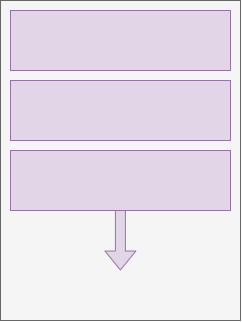
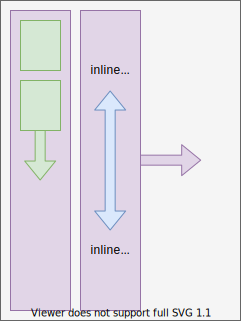
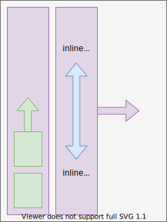
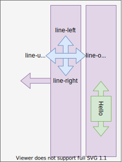

# Writing mode

[TOC]

## Introduction

- writing orientation: orientation of a line, e.g. horizontal or vertical
- line directionality: direction in which lines progress on a page, perpendicular to writing orientation, e.g. top-to-bottom or bottom-to-top, left-to-right or right-to-left
- text directionality: direction in which text progresses in a line, relative to writing orientation, i.e. (line-)left-to-(line-)right or (line-)right-to-(line-)left
- beware: line directionality and text directionality are often conflated, see [English StackExchange](https://english.stackexchange.com/questions/535835/precise-terms-for-directionality-in-a-writing-system) ⚠️

| writing orientation | line directionality | text directionality | example scripts |
| - | - | - | - |
| horizontal | top-to-bottom | left-to-right | Latin, Cyrillic, Indic |
| horizontal | top-to-bottom | right-to-left | Arabic, Hebrew |
| horizontal | bottom-to-top | left-to-right | N/A |
| horizontal | bottom-to-top | right-to-left | N/A |
| vertical | left-to-right | top-to-bottom | Mongolian |
| vertical | left-to-right | bottom-to-top | N/A |
| vertical | right-to-left | top-to-bottom | Chinese, Japanese, Korean |
| vertical | right-to-left | bottom-to-top | N/A |

- line orientation: orientation of text in a line, i.e. line-over, line-under, line-left, line-right
- text orientation: orientation of characters in text, e.g. upright, sideways, etc.
- writing mode: a particular line directionality, text directionality and text orientation
- beware: writing mode is often used for its writing orientation, e.g. "horizontal writing mode", "vertical writing mode" ❗️
- typographic mode: orientation used for typographic conventions, e.g. for baseline, beware: doesn't need to match writing orientation ❗️
- beware: unfortunate choice of properties, `writing-mode` sets fixed combination of line directionality, line orientation and typographic mode, but not text directionality and text orientation, instead should have separate properties for each and `writing-mode` should have been shorthand for all ⚠️

## Block (flow) direction

- direction of flow of boxes in block formatting context, e.g. top-to-bottom by default
- also direction of flow of rows in table formatting context
- "vertical" overflow applies to it
- defines line directionality, since line boxes are block-level boxes
- can set using `writing-mode` property
- inherited property, set on root element to inherit
- beware: also sets line orientation and typographic mode, should be separate properties ⚠️
- beware: property name is confusing, should be `block-direction` ⚠️
- beware: property values are confusing, include redundant writing orientation, can be deduced from block flow direction ⚠️

| `writing-mode` | block flow direction | image | typographic mode |
| - | - | - | - | - |
| `horizontal-tb` | top-to-bottom |  | horizontal |
| `vertical-rl` | right-to-left |  | vertical |
| `vertical-lr` | left-to-right |  | vertical |
| `sideways-rl` | right-to-left | like `vertical-rl` | horizontal |
| `sideways-lr` | left-to-right | like `vertical-lr` | horizontal |

- beware: content of replaced element doesn't change orientation, e.g. image, iframe, etc.

## Inline (base) direction

- direction of flow of boxes in inline formatting context, e.g. line-left-to-line-right by default
- also direction of flow of columns in table formatting context
- "horizontal" overflow applies to it
- defines text directionality, since text are inline-level boxes
- relative to writing orientation, i.e. perpendicular to block flow direction (line directionality) ❗️
- can set using `direction` CSS property
- beware: property name is confusing, should be `inline-direction` ⚠️

| `direction` | block flow direction | image | block flow direction | image | block flow direction | image |
| - | - | - | - | - | - | - |
| `ltr` | top-to-bottom |  | right-to-left |  | left-to-right |  |
| `rtl` | top-to-bottom |  | right-to-left |  | left-to-right |  |

- beware: in left-to-right block flow direction `ltr` and `rtl` seem to be switched, because the line orientation stays the same as in right-to-left block flow direction, see line-relative logical directions ❗️
- `sideways-rl` behaves like `vertical-rl` for both `direction`s
- `sideways-lr` behaves like `vertical-lr` with `direction`s flipped, see line-relative logical directions for further differences
- beware: semantic property of document, not presentation, don't use `direction` property, instead use `dir` attribute ⚠️
- set in document using `dir` attribute on element, set on root element such that inherits
- use `<bdo>` element with different `dir` attribute for exceptions
- use `<bdi>` element for automatically determined direction, equivalent to `dir="auto"` attribute, e.g. user input

## Text orientation

- orientation of characters in text
- can set using `text-orientation`, possible values `mixed` (default), `upright`, `sideways`
- only takes effect for vertical typographic modes, i.e. `writing-mode: vertical-rl` or `writing-mode: vertical-lr`

| `text-orientation` | image |
| - | - |
| `mixed` |  |
| `upright` |  |
| `sideways` |  |

## Dimensions and directions

define box layout for other writing modes
 make layout independent of writing mode
depending on writing mode, i.e. `writing-mode` and `direction`

### Phyiscal directions

- relative to page, independent of writing mode
- "left", "right", "top", and "bottom"

### Logical directions

#### Flow-relative

- relative to block flow direction
- block-start: side that comes earlier in block flow direction, "top of a page"
- block-end: side that comes later in block flow direction, "bottom of a page"

| `writing-mode` | block-start | block-end | image |
| - | - | - | - |
| `horizontal-tb` | top | bottom |  |
| `vertical-rl` | right | left |  |
| `vertical-lr` | left | right |  |
| `sideways-rl` | right | left | like `vertical-rl` |
| `sideways-lr` | left | right | like `vertical-lr` |

- inline-start: side that comes earlier in inline base direction, "start of a line"
- inline-end: side that comes later in inline base direction, "end of a line"
- beware: inline-* are always perpendicular to block-* ❗️

|  `writing-mode` | `direction` | inline-start | inline-end | image |
| - | - | - | - | - |
| `horizontal-tb` | `ltr` | left | right |  |
| `vertical-rl` | `ltr` | top | bottom |  |
| `vertical-lr` | `ltr` | top | bottom |  |
| `sideways-rl` | `ltr` | top | bottom | like `vertical-rl` |
| `sideways-lr` | `ltr` | bottom | top | like `vertical-lr` with `dir: rtl` |
| `horizontal-tb` | `rtl` | right | left |  |
| `vertical-rl` | `rtl` | bottom | top |  |
| `vertical-lr` | `rtl` | bottom | top |  |
| `sideways-rl` | `rtl` | bottom | top | like `vertical-rl` |
| `sideways-lr` | `rtl` | top | bottom | like `vertical-lr` with `dir: ltr` |

- `sideways-lr` behaves like `vertical-lr` with opposite `direction` ❗️
- beware: for `vertical-lr` the inline-start and inline-end are similar to `vertical-rl`, can use `sideways-lr` to flip it ⚠️

#### Line-relative

- relative to line orientation
- line-left: inline-start for left-to-right inline base direction, (or inline-end for right-to-left inline base direction)
- line-right: inline-end for left-to-right inline base direction, (or inline-start for right-to-left inline base direction)
- line-over: vector from line-left to line-right rotated by +90°, beware: not always `block-start`
- line-under: vector from line-left to line-right rotated by -90°, beware: not always `block-end`

| `writing-mode` | line-left | line-right | line-over | line-under | image |
| - | - | - | - | - | - |
| `horizontal-tb` | left | right | top | bottom |  |
| `vertical-rl` | top | bottom | right | left |  |
| `vertical-lr` | top | bottom | right | left |  |
| `sideways-rl` | top | bottom | right | left | like `vertical-rl` |
| `sideways-lr` | bottom | top | left | right |  |

- `sideways-lr` behaves like `vertical-lr` with line orientation flipped, beware: also `direction`s are opposite, not visible from last diagram ❗️
- beware: line orientation in `vertical-lr` is same as in `vertical-rl`, use `sideways-lr` to flip it ❗️

### Physical dimensions

- relative to page, independent of writing mode
- "horizontal" and "vertical"
- axes: "x-axis" and "y-axis"

### Logical dimensions

- relative to writing orientation
- block dimension: dimension parallel to block flow direction, perpendicular to inline base direction
- inline dimension: dimension parallel to inline base direction, perpendicular to block flow direction
- block / inline axis: axis in block / inline dimension

| writing orientation | block dimension | inline dimension | image |
| - | - | - | - | - | - | - | - |
| horizontal | vertical | horizontal |  |
| vertical | horizontal | vertical |  |

## Logical properties and values

- CSS specification uses logical directions and dimensions, i.e. CSS "works" similarly in other writing modes
- however many properties use physical directions or dimensions in name or value
- can't change meaning of physical properties and values, would add confusion, e.g. what does "top" mean?
- need new logical properties and values to replace physical counterparts
- physical properties and values continue to correspond to physical directions / dimensions, i.e. `margin-left` is always left, or "top" is always top
- beware: in other writing modes physical properties and values "behave" counter intuitive, e.g. in vertical writing orientation `margin-left` / `margin-right` collapse instead of `margin-top` / `margin-bottom` ❗
- use logical properties and values instead to support any writing mode
- beware: not all properties and values are replaced yet with logical equivalents, e.g. `rect()` notation of `clip` property, background properties, border-image properties, offsets of the box-shadow and text-shadow properties

### Logical properties

- properties relative to writing mode
- replace physical properties, e.g. `width`, `margin-top`, etc.
- beware: don't use logical and physical properties together, could either take both effect for separate directions / dimensions or for same direction / dimension overwrite each other ⚠️
- beware: `inset` is physical shorthand for `top`, `bottom`, `left`, `right`, not a logical shorthand for `inset-*` ❗️

| logical property | physical property | notes |
| - | - | - |
| `block-size`, `inline-size` | `width`, `height` | beware: "size" is used for a length in the single block / inline dimension, bad naming choice ⚠️ |
| `min-block-size`, `min-inline-size` | `min-width`, `min-height` | |
| `max-inline-size`, `max-block-size` | `max-width`, `max-height` | |
| `inset-block-start`, `inset-block-end`, `inset-inline-start`, `inset-inline-end` | `top`, `bottom`, `left`, `right` | |
| `inset-block`, `inset-inline` | shorthand for `inset-block-*`, `inset-inline-*` | like `inset` for single dimension |
| `margin-block-start`, `margin-block-end`, `margin-inline-start`, `margin-inline-end` | `margin-top`, `margin-bottom`, `margin-left`, `margin-right` | |
| `margin-block`, `margin-inline` | shorthand for `margin-block-*`, `margin-inline-*` | like `margin` for single dimension |
| `padding-block-start`, `padding-block-end`, `padding-inline-start`, `padding-inline-end` | `padding-top`, `padding-bottom`, `padding-left`, `padding-right` | |
| `padding-block`, `padding-inline` | shorthand for `padding-block-*`, `padding-inline-*` | like `padding` for single dimension |
| `border-block-start-width`, `border-block-end-width`, `border-inline-start-width`, `border-inline-end-width` | `border-top-width`, `border-bottom-width`, `border-left-width`, `border-right-width` | |
| `border-block-width`, `border-inline-width` | shorthand for `border-block-*-width`, `border-inline-*-width` | like `border-width` for single dimension |
| `border-block-start-style`, `border-block-end-style`, `border-inline-start-style`, `border-inline-end-style` | `border-top-style`, `border-bottom-style`, `border-left-style`, `border-right-style` | |
| `border-block-style`, `border-inline-style` | shorthand for `border-block-*-style`, `border-inline-*-style` | like `border-style` for single dimension |
| `border-block-start-color`, `border-block-end-color`, `border-inline-start-color`, `border-inline-end-color` | `border-top-color`, `border-bottom-color`, `border-left-color`, `border-right-color` | |
| `border-block-color`, `border-inline-color` | shorthand for `border-block-*-color`, `border-inline-*-color` | like `border-color` for single dimension |
| `border-block-start`, `border-block-end`, `border-inline-start`, `border-inline-end` | `border-top`, `border-bottom`, `border-left`, `border-right` | |
| `border-block`, `border-inline` | shorthand for `border-block-*`, `border-inline-*` | like `border` for separate dimensions |
| `border-start-start-radius`, `border-start-end-radius`, `border-end-start-radius`, `border-end-end-radius` | `border-top-left-radius`, `border-bottom-left-radius`, `border-top-right-radius`, `border-bottom-right-radius` | |

- beware: logical properties for `inset`, `margin`, `padding`, `border-width`, `border-style`, `border-color` are still under discussion, see [#1282](https://github.com/w3c/csswg-drafts/issues/1282)

### Logical values

- values relative to writing mode
- replace physical values, i.e. "top", "bottom", "left", "right"
- see Logical directions
- beware: can't combine logical and physical values, would leave values defined twice or undefined ❗️
- properties that take logical values: `text-align`, `text-indent`, `float`, `clear`, `resize`, `vertical-align`, `text-decoration`, `border-spacing`, `line-height`, `caption-side`
- percentages are calculated with respect to logical size of containing block instead of physical width / height

## Resources

- [W3C - CSS Writing Modes Level 4](https://www.w3.org/TR/css-writing-modes-4/)
- [W3C - CSS Logical Properties and Values Level 1](https://www.w3.org/TR/css-logical-1/)