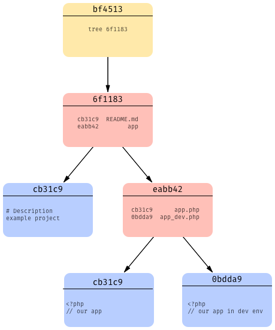
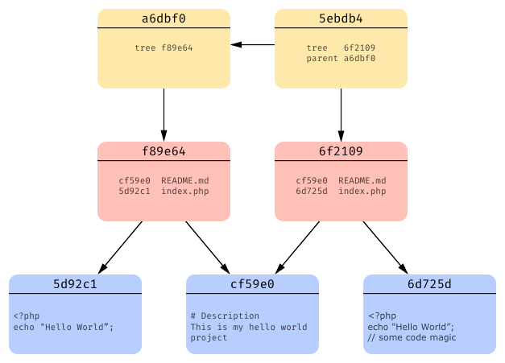
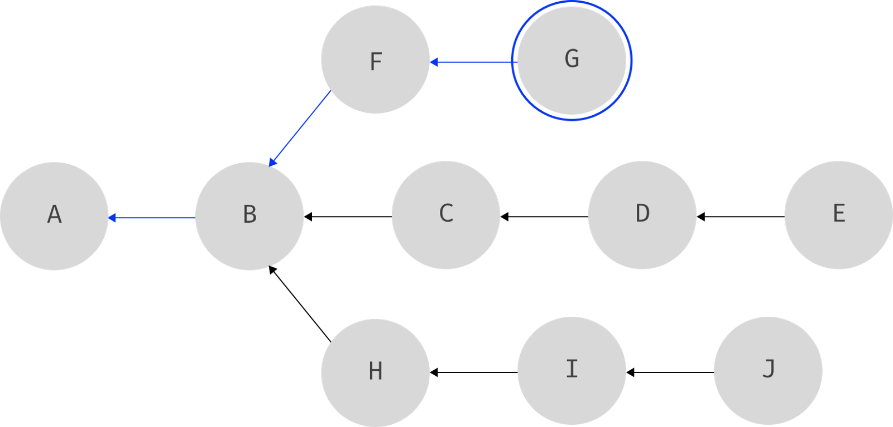
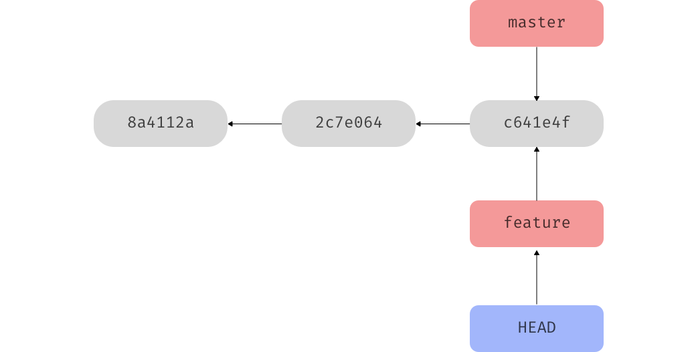

# Git theory

[TOC]

## Idea

- Version history for each file
- Enabling parallel work on same file

## What is Git?

- Distributed version control system
- Most efficient system, quasi standard
- Strange syntax is pulled straight out of Linus Torvalds' head
- History is represented as DAG

## Terminology

- repository: data store, includes complete history and metadata (? .git or working directory)
- commit: snapshot of entire repository at specific moment in time
- branch: fork in history, not own working directory, just seems like separate working directory, staging area, and project history (?)
- merge: combining two branches into one
- clone: a local copy of a repository
- fork: a copy of a repository from a different user (?)
- stash: temporarily shelves, when not ready to commit, like drafts, only local to own repository not pushed, under the hood are just commits
- checkout: setting up working directory from stage or repository (?)

## Ideas

- Snapshots: snapshots of entire data at any point in time, not only differences, much simpler to go back in time, if files have not changed Git just references the previous identical file it has already stored, also metadata to see who changed what when
- Locality: almost everything is local, no need for a server, collaborating with other repositories is just merging branches (?)
- Integrity: Git stores data as 40 character SHA-1 hash of file content (in transition to SHA-256 since it’s „[shattered](https://security.googleblog.com/2017/02/announcing-first-sha1-collision.html)“ since 2017 exploitable), not just file name, can’t corrupt or loose files without knowing, there wouldn’t be a clear order number with multiple parallel repositories anyways
- Safety: Git generally only adds data, doesn’t change or delete anything

## Data model
- all version control in one folder .git within respository, deleting this folder deletes whole history except current working copy, only this needs to be copied to clone a repository, working tree and staging area are then generated from it (uncommitted changes are lost!)
- blob object: file containing entire content of a committed file, has checksum as name to be able to point to it
- tree object: file containing list of file names with pointers to corresponding blobs, one for every directory
- commit object: file containing pointers to all tree objects, metadata about commit (author, time, message), and pointer to previous commit

- for every commit git creates these objects, if a file hasn’t changed it just points the tree objects to the previous blob files instead of creating a new one, if in the meantime a file was deleted it just won’t create a blob object and entry in the tree object, also it compresses the files in binary

- chain of commits needs not be linear, can have branches

- In Git a branch is just a pointer to _last_ commit on that branch, Graph theory guarantees that can reconstruct branch chain from it since DAG can only go forwards, just a file containing branch name and commit hash it's pointing to instead of whole copy of directory
- HEAD is just a pointer to the branch that is currently checked out, it’s in „detached HEAD state“ if it directly points to a commit instead of a branch, often talks about moving HEAD pointer to another commit but actually only current branch pointer is moved to which HEAD is pointing constantly

## The three areas

### Working tree / directory
- project directory, files currently worked on
- a checkout of a commit, after switching branches Git recreates working directory from last commit on current branch (i.e. where HEAD is currently pointing at)

### Staging area / directory
- preview of your next commit, select files for next commit
- internally is just one file called `index`, for every file keeps track of versions in all three areas, compares changes, can see information with `git status`
- after adding a file to the staging area its blob object is already created and saved in `index`

### Project history / repository
- datastore of all commits
- internally subfolders of .git directory
- a commit is a snapshots of all files, only takes changes from staging area
- upon committing, a commit and tree object are created referencing to the already created blob objects, could even delete files in working directory after staging because blob objects already exists
- always needs to commit to save changes (!)

## Working tree
- tracked file: file which has been previously staged or committed, by default after cloning a repository all files are tracked
   - untracked file: file which has never been staged or committed
   - ignored file: file which Git has been explicitly told to ignore

- working copy
- local repository
- remote repository

## Merge

### 3-way merge
- creates new commit from multiple parent commits, on current branch, can then delete other branch
- Git walks back in graph until finds first common ancestor to both branch tips, compares file by file both branch tips to common ancestor, takes only changed ones
- if one file is changed on both, compares line after line to common ancestor, takes only changed ones
- if same line changed on both, conflict must be resolved manually
- afterwards need to still test code, merge can do code errors can happen if changed part  one file somehow affects new code in other file (e.g. new function from one commit references old variable name that was changed with other commit, etc.)

 ### fast forward merge
- When one branch tip is an ancestor of the other one, i.e. on the same graph line
- just needs to update the pointer of the lagging behind branch tip and „fast forward“ to other branch tip

## Remote
- Git does everything locally, it doesn’t distinguish remote repositories from any other repository like in another directory, there is no central server, when doing any operation with a remote repository needs to first fetch and then do it locally
- a remote is just an alias for an URL of the remote repository, by default „origin“
- all branches on the remote get named „\<remote\>/\<branch\>“ e.g. „origin/master“ to keep them separate from the local branches
- fetches newest data, does merge locally, then pushes

## Other
- if in detached head state can commit, is like an „anonymous“ branch, needs to create branch out of it, otherwise it will be lost with next checkout to another commit because there is no reference to this branch tip

## Ressources
- Zvonimir Spajic - [Understanding Git](https://hackernoon.com/https-medium-com-zspajich-understanding-git-data-model-95eb16cc99f5)
- Mark Lodato - [A Visual Git Reference](http://marklodato.github.io/visual-git-guide/index-en.html)
- David Mahler - [Introduction to Git](https://www.youtube.com/watch?v=uR6G2v_WsRA)
- Edward Thomson - [Deep Dive into Git](https://www.youtube.com/watch?v=fBP18-taaNw)
- Scott Chacon - [Introduction to Git](https://www.youtube.com/watch?v=ZDR433b0HJY)