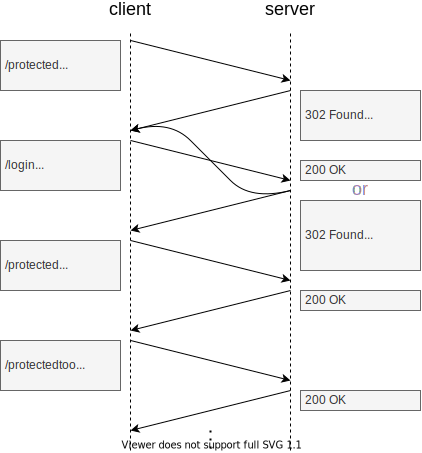

# 13.1 HTML form-based authentication

[TOC]

<!-- todo: replace in 13. Authentication -->

## Introduction

- uses temporary symmetric key
prevents sending username and password
    infinite attack window since password doesn't change
    infinite attack surface, since all requests contain password, all endpoints on server see password
    permanent access since password doesn't change

- needs login to generate symmetric key
needs custom login page to authenticate user

- server-side can be stateful or stateless
- symmetric key must be stored on client, see below for different methods

- beware: symmetric key allows full access to account for duration of validity
- beware: client storage isn't secure, can always extract key while it's there

pros:
- functionality, because can customise login page, transmit credentials however wants, e.g. appearance, validation, description, client JS, etc.
- security, because can customise login page, e.g. multiple factors, etc.
- cheap, because server needs to validate only key, doesn't do full authentication again

cons
- complex, because needs custom login page, e.g. remember redirect target, e.g. in server session, hidden field in login form, etc.
- security, because needs custom login page, e.g. XSS attack, phishing attack, etc.
- latency, because needs additional roundtrip for login page
- attackable, because login details visible to login page, instead of only to UA and server, e.g. JS can read

beware: only use over HTTPS, to verify identify

## Login

- server redirects to login page, submits credentials through form
- if failed, stays on same page with `401 Unauthenticated`
- if successful, redirects back to where came from with `301 Found`, with symmetric key
- beware: don't use `200 OK` if login failed ❗️

how auth endpoint generates symmetric key is invisible to user, could rely on third party, etc., e.g. OAuth

## Key

short time to live

### session based
- symmetric key is random session ID
- server keeps session list of session ID with associated user
- usually used with Cookie-based auth
- pros:
    - revokable, because server can delete session at any time, e.g. logout, role change, password reset, etc.
- cons:
    - scaling, because server needs to keep state, stateful, e.g. in memory

### token based

- symmetric key is user identifying information and expiration date signed by server, e.g. JWT
- usually used with Custom storage-based auth
- pros:
    - scaling, because server doesn't need to keep state, stateless, but needs to store key used for signatures!
    - permissions, because can include arbitrary information in signed thing
- cons:
    - not revokable, because valid until expires
    no logout route, can just delete on client, but if token was stolen because remains valid to server until expires

- could have deny list (better than allow list since much less) for revoked (or valid) tokens on server, makes logout work again, but undermines statelessness, then is back again to session based key.

- can also use for authorization ??? ANYTHING THAT IDENTIFIES USER CAN USE AS AUTHORIZATION, I.E. ALSO COOKIE
code permissions into it, saves database calls
- beware: only store data needed for identification, not more user data since can all be stolen, e.g. Name,
beware: token is usually not encrypted just signed

beware: use strong secret for signature hashing
if single service can use symmetric secret for signature
if multiple services, use private key from private-public keypair for signature and share only public key with other service

rotate secret periodically
start using new secret for new tokens, check new and old secrets for max lifetime of a token since change, because may get token still signed with old key
    use key identifier to not need to check all old secrets, store secret on server with key identifier, send key identifier in token, can use right secret for each token 

can use when auth server is not own server
own server verifies signature using public key of auth server

## Transmission and Storage

send in header
don't send in URL, may be shared, bookmarked, etc.

receives in header or body

### Cookie-based authentication

- server sends symmetric key as cookie, in header
- client sends it as cookie on every subsequent request
- usually uses session ID, but not necessarily

pros:
- easy, because automatically transmitted, e.g. no JS
- no JS, all requests, doesn't need JS since transmitted automatically
- XSS secure (if set `HttpOnly`)

const:
- easy, because automatically transmitted, can't decide on which domains and paths, can't decide when (e.g. on JS but not on top-level navigation for CSRF reasons), only works on UAs with cookie, e.g. API accessed by native apps, etc.
- CSRF vulnerable, because automatically transmitted
-> in SPA (written in JS) can use CSRF-cookie (anti-forgery token) as protection, random token set in cookie, JS sends token back in custom request header or in hidden form field, since only JS on own page can read cookie
  but needs JS to make requests

### Custom storage-based authentication

- server sends symmetric key as token, in body
- client sends it in `Authorization: Bearer <token>` request header, on own requests
- usually token, but not necessarily
- stored in custom storage, e.g. Web storage

- often used for SPAs (since written in JS)
and APIs who has clients that may not be browsers, i.e. no cookies

pros:
- manual, because needs custom request to include header, mitigates CSRF, e.g. multiple domains
- universal, because doesn't rely on cookie functionality, e.g. native apps

cons:
- Web storage, needs to store manually, e.g. setting, deleting, etc.
- JS only, because needs custom request to include header
- XSS attackable, since uses JS and Web storage
- doesn't work for sub-domains, since Web storage is only on exact domain

- can also use cookie for storage instead of Web storage because accessible on all subdomains, as before but just loads from cookie instead of Web storage, server ignores cookie in requests, wastes bandwith by including twice as cookie

## Best practices

often uses multiple keys
one access key, less securely stored, but short lived
one refresh key, more securely stored, long lived

### Two cookies
<!-- cookie based, for traditional websites, etc. -->

<!-- todo: two cookies, short lived insecure access cookie, long lived but more secure -->

on login to auth.example.com generates two cookies
access cookie, HttpOnly, secure, scope /, 15 min duration
refresh cookie, HttpOnly, secure, scope auth.example.com/refresh, session ID duration

JS timeout, just before access cookie expires,
call /refresh endpoint, get new access cookie and refresh cookie
??? WHAT IF JS DEACTIVATED
<!-- ??? alternatively refresh access cokie with every request where valid, would need to have auth logic on every route... NOT GOOD -->
.....

-> No XSS since secure cookies
-> CSRF risk, although minimal due to short duration of access cookie, would need double attack within 15 min first to /refresh, then to endpoint

### Two tokens, Memory and Cookie-based
<!-- token based, for API, custom requests, etc. -->

instead of storing access token in Web storage can also keep in memory, no XSS
give access token short time to live, refresh access token just before expires
keep time of access token very short, e.g. 15 mins, refresh access token just before expires
on login on auth server generates token as well as longer lived refresh_token
    refresh_token stored on server like session ID, !!! actually is just a session id
    refresh_token is HttpOnly cookie, restricted to specific domain and path of auth server, e.g. auth.example.com/refresh
    expiry time of refresh token like session id ??? HOW MUCH, 1 DAY?
call /refresh every 14 mins in background, otherwise API forwards to login every 15 mins because access token expires
get new access token
    also refresh token rotation: invalidates old refresh_token, gets new refresh_token, otherwise refresh token would be eternally valid, just as good as password
on application start look for refresh_token, if there use to /refresh  (e.g. otherwise needs to login when closing and reopening window because deletes memory), otherwise go to login
on logout, role change, etc. also revoke refresh_token on server
-> beware: refresh_token is even better key to steal than access token because lives longer, but since HttpOnly cookie is safe from XSS (not CSRF but doesn't matter because only valid for single auth domain that doesn't do any mutations)
-> server is stateful again, for refresh token
-> CSRF and XSS safe, like having a long-lived access token in non-JS accessible storage

PROBLEM: during 15 mins can not revoke access, e.g. role change, password reset, ...
PROBLEM: still needs cookies, what on native apps ?! 

## Resources

- [Hasura - The Ultimate Guide to handling JWTs on frontend clients](https://hasura.io/blog/best-practices-of-using-jwt-with-graphql/)