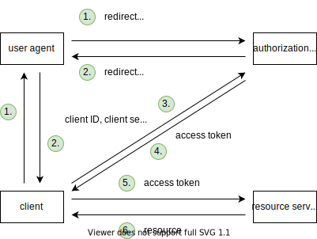
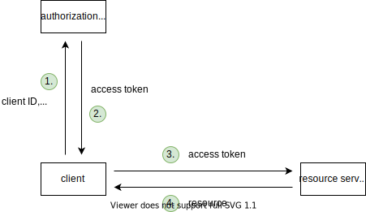

# OAuth 2.1

[TOC]

## Introduction

- collection of standards for access delegation
- access to identity (resource) or access to (non-identity) resource
- beware: not only for authorization or authentication, can't separate ⚠️
- uses access token as deputy credentials

## Terminology

### Resource owner (RO)

- owner of the protected resource
- beware: should have been called user, since doesn't necessarily "own" resource, e.g. non-personalised API ❗️
- beware: not necessarily human, see Client for client = RO ❗️

### Resource server (RS)

- service that provides the protected resource of RO, e.g. API
- beware: should have been called resource provider (RP) ❗️

### Authorization server (AS)

- service that provides identity and permissions of RO
- beware: should have been called auth provider (AP), since doesn't only do authorization ❗️
- RS has one AS
- beware: use separate microservices for AS and RS, instead of running both on same server, see Cloud#Microservices ❗️

### Client

- service that accesses resource on behalf of RO, e.g. application
- beware: should have been called service provider (SP) ❗️
- if client != RO, then user-to-machine communication
- if client = RO, then machine-to-machine communication
- beware: client is from perspective of RS not of UA, i.e. client can be back-end or front-end ⚠️
- beware: doesn't specify "front-end client" in UA which user interacts with, usually from same provider as client but not necessarily, e.g. addon in Gmail ❗️
- beware: if client is back-end and "front-end client" is from same provider, then doesn't specify how back-end client keeps state with "front-end client", e.g. typical session cookie, see HTML Auth ❗️
- public client: client without client secret and without confirmed identity, e.g. client is front-end (PWA, native app) etc.
- confidential client: client with client secret and confirmed identity, e.g. client is back-end (traditional website) etc.
- credentialed client: client with client secret but without confirmed identity, e.g. client is front-end and dynamically registered at AS (native app), etc.
<!-- todo: consider deleting first- and third-party, unneccessary confusion -->
- first-party client: client from same provider as RS (& AS), e.g. own client for own API
- third-party client: client from different provider as RS (& AS), e.g. own client for foreign API

### Front- and Back Channel

- front channel: redirect requests through browser, visible in address bar, XSS-attackable
- back channel: direct requests not through browser, not visible in address bar, not XSS-attackable
- beware: here browser means user-facing part of browser, for client that is "front-end client" back channel is Fetch API ❗️

## Motivation

- give client access to RO's resource on RS, e.g. Yelp to Google Contacts
- expose RO's credentials only to AS, not to client, i.e. needs front channel
- beware: here shows only user-to-machine, i.e. client != RO ❗️

### Direct access

- client has credentials of RO
- client acts like RO

- client sees credentials of RO
- RS needs to keep credentials of RO
- client gets unlimited access, infinite duration, full permission
- disadvantages:
    - less secure, because can't limit access of client
    - doesn't scale, because RS handles credentials itself
- advantages:
    - simple, because no additional layer of indirection

### Delegated access

- client has deputy credentials of RO
- client is separate from RO
- needs additional auth provider, layer of indirection

- client doesn't see credentials of RO
- RS doesn't need to keep credentials of RO
- client gets limited access, finite duration, granular permissions
- advantages:
    - more secure, because can limit access of client
    - scales, because only AS handles credentials
- disadvantages:
    - complex, because additional layer of indirection

### Access token (AT)

- deputy credentials with scope and lifetime
- opaque to client, just transparent to AS and possibly RS
- beware: client must never rely on information in self-contained token, instead use OpenID Connect `/userinfo` endpoint, see OpenID Connect ⚠️
- should use short lifetime, such that client needs to auth with AS often, i.e. in user-to-machine can rely on AS to keep long session with UA, shifts attacker focus on single session with AS instead of client(s) with RS
- can be reference or self-contained
- no standardized format, usually signed JWT for self-contained token, i.e. can use signed JWT to switch easily between treating it as reference or self-contained token
- beware: on public client can't store since JS-accessible storage is XSS-attackable, instead keep it in memory ⚠️
- should use proof of possession to make stealing useless, e.g. Mutual TLS, DPOP, etc.

#### Reference token

- stateful, identifier for state on AS
- opaque to RS
- RS can't validate itself, needs token introspection, see Token introspection
- advantages:
    - revocable, because AS informs RS that revoked with token introspection
- disadvantages:
    - high latency, because RS needs one roundtrip to AS for each request
    - high storage, because AS needs to keep state
- RS can use short cache if accepts that can't immediately reject revoked tokens to combat high latency
- use for small-scale RS, or when AS = RS

#### Self-contained token

- stateless, signed state itself
- transparent to RS
- RS can validate itself, checks signature and expiry time, no need for Token introspection
- advantages:
    - low latency, because RS doesn't need roundtrip to AS for each request
    - low storage, because AS doesn't needs to keep state
- disadvantages:
    - not revocable, because AS can't inform RS that revoked without token introspection
- RS can still choose to do token introspection to allow for revocability, can even choose to do only for important scopes (e.g. write but not read)
- beware: token introspection more efficient than for reference token, since needs to do only for valid or revoked tokens, expired and modified tokens are filtered out already by validity check ❗️
- RS can use short cache if accepts that can't immediately reject revoked tokens to combat high latency, can even choose to do only for important scopes (e.g. write but not read)
- use for large-scale RS, or when AS ! = RS

#### Token introspection

- validation of AT by AS
- RS sends AT to AS
- AS returns validity status and expiry time, usually as JSON
- protect introspection endpoint otherwise everyone can verify tokens, e.g. on AS use same logic as for token endpoint, on RS use new set of client credentials

## Access flows

### Authorization code flow with PKCE

- for user-to-machine communication, i.e. client != RO
- for public and confidential clients
- front channel transmits only authorization code, back channel transmits AT
- steps:
    - (client fails to access resource on RS because of invalid / missing AT)
    - client generates random PKCE secret for the current flow, stores PKCE secret temporarily, e.g. session storage, session cookie, etc.
    - client redirects UA to AS (OAuth URL) with hash of PKCE secret, client ID, response type, scope, callback URL in query parameter of URL, AS saves hash of PKCE secret temporarily
    - UA logs into AS, accepts permission prompt (if never done before)
    - AS redirects UA back to client (callback URL), authorization code in query parameter of URL
    - client sends authorization code along with PKCE secret and client ID to AS, usually in body of POST request, AS verifies that hash of PKCE secret is same as hash from earlier
    - AS returns AT, usually in JSON
    - client sends AT to RS, usually in `Authorization: Bearer <token>` header
    - RS returns resource
- client can also send state parameter to AS, AS echoes back, e.g. client can use state to remember destination URL

- authorization code is single-use, short lived, e.g. 1 min
- advantages:
    - secure, because UA can't get AT without knowing PKCE secret
- disadvantages:
    - needs browser, because relies on redirects to AS and back
- PKCE verifies integrity of flow, otherwise authorization code injection attack where swaps authorization codes from two distinct flows, attacker can log in as user or user can be logged in as attacker, see [OAuth Happy Hour - Authorization Code Injection Demo](https://youtu.be/moQidjdV5cw?t=562)
- PKCE protects against state-changing CSRF requests, since client can't complete flow it didn't initialise because PKCE secret is missing, replaces older method using state value
- beware: public client with PKCE is still XSS-attackable, e.g. could still make authorization code injection attack by stealing PKCE secret alongside authorization code since PKCE secret must be stored in JS-accessible storage, or could plant PKCE secret for state-changing CSRF request ⚠️
- client can register with AS beforehand, guarantees authentic clients, e.g. for any client can pin callback URL and rely on confirmed identity of domain, or for confidential client can use client secret that sends when exchanging authorization code against AT

### Client credentials flow

- for machine-to-machine communication, i.e. client = RO
- for confidential clients only
- beware: for public clients no solution, could just as well leave RS unprotected ⚠️
- back channel transmits AT
- steps:
    - (client fails to access resource on RS because of invalid / missing AT)
    - client sends client ID and client secret to AS, usually in body of POST request
    - AS returns AT, usually in JSON
    - client sends AT to RS, usually in `Authorization: Bearer <token>` header
    - RS returns resource

### Device code flow

<!-- todo: finish -->

<!-- ToDo: finish -->

## Refresh token

should only use on confidential clients!
    although might use on public client with rotation, e.g. mobile apps, in browser-based apps can just do flow because redirect happens so fast 
<!-- DELETE in CCF usually not used, but might make sense if has multiple instances of client, and wants to revoke only ATs for a specific instance, then can just revoke ATs connected to that RT -->
only for user-to-machine communication, i.e. client != RO
not necessary for machine-to-machine communication, i.e. client = RO SINCE can just use ccs directly

should require presenting client secret OR rotation

AS needs to keep track which ATs where obtained by a given RT
to be able to revoke all ATs when RT is detected as compromised

in ACF need to request own scope
returns refresh token alongside AT
- if no refresh token, then client repeats flow when AT is invalid, relies on AS to keep long-lived yet secure session with UA
- if has refresh token, then client repeats flow when refresh token is invalid, when AT is invalid uses refresh token to obtain new one, see Refresh token
when refresh token turns out to be invalid, then start new flow again
    client doesn't need to know expiration time because doesn't matter, always new flow

?? WHAT HAPPENS TO AT THAT'S STILL VALID WHILE RS IS GETTING NEW ONE ??

- like a reusable authorization code
- client sends to AS (along with client ID and client secret), gets new AT and possibly new refresh token
- allows client to get new AT without RO and repeating whole flow
- needs when client operates without RO present, e.g. clean up contacts at midnight
- beware: see IF
- opaque to client, just transparent to AS
- long lifetime, such that client doesn't need to do flow often
    set a max lifetime!!
- beware: don't use with public client since can't store securely, don't use with CCF since can just as well use regular flow ⚠️
    beware: on public client can't store refresh token since JS-accessible storage is XSS-attackable, instead keep it in memory, i.e. can silent renew only until page reload / page close ⚠️

- beware: AS needs to revoke refresh token when AT is revoked ❗️
- refresh token should either be rotated or sender-constrained
    - rotated: AS issues new refresh token with every new AT, stores old refresh tokens, when sees old refresh token being used knows that client was breached (either attacker has old one because client has recent one, or other way around), if breached revokes this refresh token and all all access tokens issues by that refresh token (?? has only ever one valid using a refresh token)
    - sender-contrained: client needs to provide proof of possession to AS, e.g. client secret, mutual TLS, etc.
- beware: AS usually requires additional scope to request refresh token, e.g. `offline_access`

- beware: can't use on public client, since would store insecurely
COULD IF ONE-TIME USE, but still risky, valid until user uses app next time

## Logout

<!-- todo: ??? -->
<!-- difference between self-contained token and reference token ?!?! -->

depends on UX
logout of AS logs out everywhere
logout of single client, comes back, magically logged in because automatically redirected to AS and back -> No point in logout...

must differentiate between
- logout from client: call /logout on client to invalidate current session
- logout from AS: call /logout on AS
- logout from all SPs that use same AS: call /logoutAll on AS which calls /logout on all other SPs, pass along user info (`sub` claim in JWT)

revocation may invalidate consent as well, depends on AS

## OpenID Connect

<!-- identification NOT AUTHENTICATION
reading out identity as client
AS has verified identity already (authentication )

access of client to RS (resource) vs. access of client to AS (identity)

may want one or other or both
if resource, then OAuth scopes, use AT, no id token
if identity, then only OpenID Connect scopes, use id token, ignore AT
if both, then both scopes, use both tokens
 -->

audience of AT is resource server, not client, client just uses opaquely
audience of id token is client, not resource server, client doesn't send to resource server

<!-- todo: ?? use case: access third-party resource, access first-party resource 
first-party client ??
-->
- extension of OAuth 2.0
- standard for delegated access to identity of RO
<!-- todo: reconsider term "Sign-On" and definition of "Single Sign-On" -->
- Sign-On: special case where RS = AS and resource is RO's identity
allows client to offload identity management to AS, no need to keep user credentials itself, user only needs to have account with AS, ready to go
 
- beware: can use purely on top of OAuth, i.e. like having two RSs
- beware: client doesn't need to use user info for Single Sign-On, e.g. can use to mandate authentication strength (recent authentication date, strong authentication method), etc.
- Single Sign-On: Sign-On with multiple clients for same AS, e.g. Google, Apple, etc.
    Single Sign-On, when RO uses same AS for multiple clients ???? IS THAT REALLY SSO?
    after first client needs to only grant access, login already from session with AS

beware: if client allows multiple AS for login, gets different `sub` for different ASs, needs to deduplicate, e.g. sending email asking if wants to merge accounts, or in client ask to link any other ASs etc.

OAuth also good for access of first-party clients, separates concerns, concentrates login to single point,
beware: treat first-party clients like third-party clients
only place where RO ever enters credentials
can focus security on single point
separate concerns
single place that can evolve quickly, e.g. add 2FA
needs to secure credential input into client , doesn't scale
doesn't scale with extending security
best example is Google

<!-- todo: mention ID token is pretty much like self-contained AT -->

### Userinfo endpoint

- user info endpoint on authorization server, contains user info
- client can read user info using AT
- format is usually JSON

### Identity token

- self-contained token for user info
- beware: not revocable, see Self-contained token
- format is signed JWT
- ??? beware: doesn't mandate format for other tokens ❗️
- beware: client must not identify user from claims that can change, e.g. Apple apps identifying user from `email` claim, see [Aaron Parecki - The Real Cause of the Sign In with Apple Zero-Day](https://aaronparecki.com/2020/05/31/30/the-real-cause-of-the-sign-in-with-apple-zero-day) ❗️

beware: only rely on `sub` claim as user ID, email etc. may change

beware: nedlessly complicated, userinfo endpoint is enough, doesn't need identity token, signature is useless

### ACF

- adds more scopes, some registered, rest custom, e.g. `openid`, `profile`, `email`, etc.
beware: polutes OAuth since reuses same scope that access to resource server uses, could use alongside access to RS , mixes things up
-> should have been GraphQL query instead
- gets back identity token alongside AT
infos depend on scopes, `openid` usually only `sub`, `profile` gives name, `email` gives email, etc.
can hit /userinfo with AT for full info ?? GETS FULL USER INFO OR ONLY WHAT SCOPES REQUESTED?

for login just ignores AT (if doesn't request more from /userinfo endpoint)
- beware: signed JWT doesn't make sense, could just as well be JSON ⚠️
gets JSON from userinfo endpoint, unneccessary second request, should have returned alread here directly

## Future Work

- AS shouldn't need to know which clients RO access
- client shouldn't by default be able to get whole RO identity from AS, only relevant details allowed by RO, e.g. only age, but not address, or even only boolean if age larger than X,  etc.
- private key on device

## Implementation

RS & AS are under the same hood, synchronize scopes & introspection endpoint / public key
developer builds either client, or RS (with AS)

- beware: consider making public client a confidential client by creating a back-end even if it's just for OAuth, separates auth logic away, AT flow is safe from XSS attacks, can use refresh tokens, etc., e.g. can use serverless functions, etc. ⚠️

### Client

- beware: don't build own auth logic, use existing vetted libraries, e.g. AppAuth, etc. ❗️

- get AT from AS with right scopes
- make request to RS
- handle successful / failure request to AS as well as to RS 

### RS

- beware: don't build own auth logic, use existing vetted libraries, e.g. ??, etc. ❗️

- check for valid AT
- check for right scopes for operation
    e.g. read, write, etc.
- do operation, return result

API
middleware
    - has auth header? no -> 401
    - extract token from auth header (split at " ", discard first part)
    - verify token (using auth library, needs to initialise first, also set up `.env` with secrets, e.g. `const { claims } = await oktaJwtVerifier.verifyAccessToken(token, process.env.OKTA_AUDIENCE)`) -> does all the heavy lifting like token introspection ?!?!
    - has claims? no -> 401
    - has correct claims for operation? no -> 401

RS doesn't mind flow it's going to be used, can be CCF, but also ACF
BUT NEEDS TO USE SECRETS OF WHO? OF CLIENT?!?!

### AS

- beware: when building RS don't build own AS, use existing vetted providers, e.g. Okta, Auth0, FusionAuth, Google Identity Platform, Amazon Cognito, etc. ❗️

- offer login to RO, show scopes, MFA, etc.
- keep session with RO, session cookie, PKCE hash, etc.
- return authorization code
- verify authorization code against client data and PKCE hash
- return AT

in user-to-machine can rely on AS to keep long session with UA, shifts attacker focus on single session with AS instead of client(s) with RS
AS creates session with RO 
leave to AS how to make that session last long while being secure

if same AS is used for multiple RS needs to use Resource Indicators, e.g. Google for Google Contacts and YouTube

shows concent screen to RO
beware: public ASs should show detailed consent screen, e.g. otherwise phishing client could impersonate legitimate client, e.g. [New Google Docs phishing scam](https://www.reddit.com/r/google/comments/692cr4/new_google_docs_phishing_scam_almost_undetectable/)
Google doesn't show callback URL
see GitHub shows callback URL
    block misleading names, e.g. of own clients
    show AS name (own), e.g. Google
    show RO name, e.g. My Private Account
    list scopes, without overwhelm, possibly allow to edit
    show client name, redirect URL, more client information from registry with AS

needs to store authorization code tied to RO

- offer client registration, associate client id with callback URL(s), etc.
- offer client unregistration, revoke all access tokens (and refresh tokens)
- token lifetime, may decide based on different user groups (admin shorter), etc.
- do login, 2fa, etc
- permission prompt
- allow user to revoke clients, revokes all access (and refresh) tokens
- scopes, synchronised with RS
- endpoints for token, id, refresh, etc.
- keep session
- don't give token if callback URL doesn't match
- rotate keys
- invalidate access tokens when authorization code is redeemed twice
- if self-contained AT and/or id token use correct claims, e.g. unique `sub` claim in id token, etc.
- AT expiry time, refresh token expiry time
- how to handle refresh tokens, e.g. online access only, then revoke refresh token when UA session with AP expires / logout, etc.
- refresh token rotation, revoke when old one is used, beware: don't revoke when one in another instance is used
- invalidate consents after user didn't use client for long time 
- etc.

- may publish discovery document, clients can get info dynamically, e.g. endpoint URLs, public keys, etc.

- token endpoint needs correct CORS, otherwise SPAs can't use it 

- beware: AS should never issue same AT twice ❗️

- beware: client needs to register beforehand with AS, i.e. client ID, client secret (if public client), allowed callback URL(s), etc.
<!-- Public clients have no secret
Registered at AS only for ?? Associating client ID with callback URL
But could just as well use callback URL as identifier, wouldn’t need to register
-> IndieAuth
https://indieauth.net
-->

## Resources

- [Nate Barbettini - OAuth 2.0 and OpenID Connect (in plain English)](https://www.youtube.com/watch?v=996OiexHze0)
- [Nate Barbettini - OAuth 2.0 <debugger/>](https://oauthdebugger.com)
- [Nate Barbettini - OpenID Connect <debugger/>](https://oidcdebugger.com)
- [Aaron Parecki - Securing Your APIs with OAuth 2.0](https://www.youtube.com/watch?v=PfvSD6MmEmQ)
- [Aaron Parecki - How OAuth Works](https://www.youtube.com/playlist?list=PLRyLn6THA5wN05b3qJ6N0OpL3YbritKI-)
- [Aaron Parecki - OAuth 2.0 Simplified](https://www.oauth.com)
- [Philippe De Ryck - Introduction to OAuth 2.0 and OpenID Connect](https://www.youtube.com/watch?v=GyCL8AJUhww)

Qs

- If I use a refresh token to get a new AT before the old AT expires, does the AS automatically revoke the old AT?
- Access OpenID Connect /userinfo endpoint with AT without openid scope? Identity token is nedlessly complicated to put into token, when I can just get it from /userinfo as JSON.