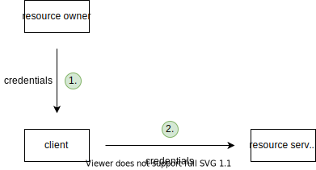

# OAuth 2.1

[TOC]

<!-- ToDo: keep an eye on GNAP, write 13.4 GNAP once GNAP is released

differences:
- client sends data to AS as token endpoint as JSON instead of in query string, e.g. scopes can have hierarchy for multiple RSs, etc.
- for user-to-machine, client sends data to AS beforehand on trusted back channel, transmits only opaque identifier on front channel
- ...
 -->

## Introduction

- collection of standards for access delegation
- access to identity (resource) or access to (non-identity) resource
- beware: not only for authorization or authentication, can't separate ⚠️
- uses access token as deputy credentials

## Terminology

### Resource owner (RO)

- owner of the protected resource
- beware: should have been called user, since doesn't necessarily "own" resource, e.g. non-personalised API ❗️
- beware: not necessarily human, see Client for client = RO ❗️

### Resource server (RS)

- service that provides the protected resource of RO, e.g. API
- beware: should have been called resource provider (RP) ❗️

### Authorization server (AS)

- service that provides identity and permissions of RO
- beware: should have been called auth provider (AP), since doesn't only do authorization ❗️
- RS has one AS
- beware: use separate microservices for AS and RS, instead of running both on same server, see Cloud#Microservices ❗️
- AS can be used for multiple RSs, e.g. Google for Gmail, YouTube, etc.

### Client

- service that accesses resource on behalf of RO, e.g. application
- beware: should have been called service provider (SP) ❗️
- if client != RO, then user-to-machine communication
- if client = RO, then machine-to-machine communication
- beware: client is from perspective of RS not of UA, i.e. client can be back-end or front-end ⚠️
- beware: doesn't specify "front-end client" in UA which user interacts with, usually from same provider as client but not necessarily, e.g. addon in Gmail ❗️
- beware: if client is back-end and "front-end client" is from same provider, then doesn't specify how back-end client keeps state with "front-end client", e.g. typical session cookie, see HTML Auth ❗️
- public client: client without client secret and without confirmed identity, e.g. client is front-end (PWA, native app) etc.
- confidential client: client with client secret and confirmed identity, e.g. client is back-end (traditional website) etc.
- credentialed client: client with client secret but without confirmed identity, e.g. client is front-end and dynamically registered at AS (native app), etc.
<!-- todo: consider deleting first- and third-party, unneccessary confusion -->
- first-party client: client from same provider as RS (& AS), e.g. own client for own API
- third-party client: client from different provider as RS (& AS), e.g. own client for foreign API

### Front- and Back Channel

- front channel: redirect requests through browser, visible in address bar, XSS-attackable
- back channel: direct requests not through browser, not visible in address bar, not XSS-attackable
- beware: here browser means user-facing part of browser, for client that is "front-end client" back channel is Fetch API ❗️

## Motivation

- give client access to RO's resource on RS, e.g. Yelp to Google Contacts
- expose RO's credentials only to AS, not to client, i.e. needs front channel
- beware: here shows only user-to-machine, i.e. client != RO ❗️

### Direct access

- client has credentials of RO
- client acts like RO

- client sees credentials of RO
- RS needs to keep credentials of RO
- client gets unlimited access, infinite duration, full permission
- disadvantages:
    - less secure, because can't limit access of client
    - doesn't scale, because RS handles credentials itself, e.g. login, MFA, passwords, etc.
- advantages:
    - simple, because no additional layer of indirection

### Delegated access

- client has deputy credentials of RO
- client is separate from RO
- needs additional auth provider, layer of indirection

- client doesn't see credentials of RO
- RS doesn't need to keep credentials of RO
- client gets limited access, finite duration, granular permissions
- advantages:
    - more secure, because can limit access of client
    - scales, because only AS handles credentials, e.g. login, MFA, passwords, etc.
- disadvantages:
    - complex, because additional layer of indirection

## Access token (AT)

- deputy credentials with scope and lifetime
- opaque to client, just transparent to AS and possibly RS
- beware: client must never rely on information in self-contained token, instead use OpenID Connect `/userinfo` endpoint, see OpenID Connect ⚠️
- should use short lifetime, such that client needs to auth with AS often, minimises attack window after last communication with AS
- can be reference or self-contained
- no standardized format, usually signed JWT for self-contained token, i.e. can use signed JWT to switch easily between treating it as reference or self-contained token
- beware: on public client can't store since JS-accessible storage is XSS-attackable, instead keep it in memory ⚠️
- should use proof of possession to make stealing useless, e.g. Mutual TLS, DPOP, etc.

### Reference token

- stateful, identifier for state on AS
- opaque to RS
- RS can't validate itself, needs token introspection, see Token introspection
- advantages:
    - revocable, because AS informs RS that revoked with token introspection
- disadvantages:
    - high latency, because RS needs one roundtrip to AS for each request
    - high storage, because AS needs to keep state
- RS can use short cache if accepts that can't immediately reject revoked tokens to combat high latency
- use for small-scale RS, or when AS = RS

### Self-contained token

- stateless, signed state itself
- transparent to RS
- RS can validate itself, checks signature and expiry time, no need for Token introspection
- advantages:
    - low latency, because RS doesn't need roundtrip to AS for each request
    - low storage, because AS doesn't needs to keep state
- disadvantages:
    - not revocable, because AS can't inform RS that revoked without token introspection
- RS can still choose to do token introspection to allow for revocability, can even choose to do only for important scopes (e.g. write but not read)
- beware: token introspection more efficient than for reference token, since needs to do only for valid or revoked tokens, expired and modified tokens are filtered out already by validity check ❗️
- instead of token introspection could use event stream, AS publishes event when a AT is revoked with expiry time of AT, RS caches revoked AT until expiry time, RS validates ATs against that cache, use protected event channel
- beware: cache of revoked ATs through event stream needs to be stored persistently, otherwise server restart makes revoked but not yet expired tokens valid again ❗️
- RS can use short cache if accepts that can't immediately reject revoked tokens to combat high latency, can even choose to do only for important scopes (e.g. write but not read)
- use for large-scale RS, or when AS ! = RS

### Token introspection

- validation of AT by AS
- RS sends AT to AS
- AS returns validity status and expiry time, usually as JSON
- protect introspection endpoint otherwise everyone can verify tokens, e.g. on AS use same logic as for token endpoint, on RS use new set of client credentials

## Access flows

- OAuth itself specifies only access to (non-identity) resource
- OpenID Connect specifies access to identity (resource), see OpenID Connect
- scopes define permission of client at RS
- scopes also select RSs if uses AS for multiple RSs, e.g. `A-upload`, `B-upload`
- beware: must use unique scopes across all RSs since mixes scopes from multiple RSs ❗️

### Authorization code flow with PKCE

- for user-to-machine communication, i.e. client != RO
- for public and confidential clients
- front channel transmits only authorization code, back channel transmits AT
- steps:
    - (client fails to access resource on RS because of invalid / missing AT)
    - client generates random PKCE secret for the current flow, stores PKCE secret temporarily, e.g. session storage, session cookie, etc.
    - client redirects UA to AS at authorization endpoint with hash of PKCE secret, client ID, response type, scope, callback URL in query parameter of URL, AS saves hash of PKCE secret temporarily
    - UA logs into AS, accepts permission prompt (if never done before)
    - AS redirects UA back to client (callback URL), authorization code in query parameter of URL
    - client sends authorization code along with PKCE secret and client ID to AS, usually in body of POST request, AS verifies that hash of PKCE secret is same as hash from earlier
    - AS returns AT, usually in JSON
    - client sends AT to RS at token endpoint, usually in `Authorization: Bearer <token>` header
    - RS returns resource
- client can also send state parameter to AS, AS echoes back, e.g. client can use state to remember destination URL

- authorization code is single-use, short lived, e.g. 1 min
- advantages:
    - secure, because UA can't get AT without knowing PKCE secret
- disadvantages:
    - needs browser, because relies on redirects to AS and back
- PKCE verifies integrity of flow, otherwise authorization code injection attack where swaps authorization codes from two distinct flows, attacker can log in as user or user can be logged in as attacker, see [OAuth Happy Hour - Authorization Code Injection Demo](https://youtu.be/moQidjdV5cw?t=562)
- PKCE protects against state-changing CSRF requests, since client can't complete flow it didn't initialise because PKCE secret is missing, replaces older method using state value
- beware: public client with PKCE is still XSS-attackable, e.g. could still make authorization code injection attack by stealing PKCE secret alongside authorization code since PKCE secret must be stored in JS-accessible storage, or could plant PKCE secret for state-changing CSRF request ⚠️
- client can register with AS beforehand, guarantees authentic clients, e.g. for any client can pin callback URL and rely on confirmed identity of domain, or for confidential client AS can require client secret at token endpoint
- when AT is expired or revoked, client must repeat flow, e.g. rely on AS to keep long-lived yet secure session with UA, redirects back without interaction from RO
- when AT is only expired, can alternatively use RT

### Client credentials flow

- for machine-to-machine communication, i.e. client = RO
- for confidential clients only
- beware: for public clients no solution, could just as well leave RS unprotected ⚠️
- back channel transmits AT
- steps:
    - (client fails to access resource on RS because of invalid / missing AT)
    - client sends client ID and client secret to AS, usually in body of POST request
    - AS returns AT, usually in JSON
    - client sends AT to RS, usually in `Authorization: Bearer <token>` header
    - RS returns resource

- when AT is expired or revoked, client can repeat flow
- when AT is only expired, can alternatively use RT (but doesn't make much sense since already has credentials!)

### Device code flow

<!-- todo: finish -->

## Refresh token (RT)

- deputy credentials for an AT
- allows client to skip flow to get new AT
- client can use to get new AT with same scope and lifetime after old AT expired
    - only useful for user-to-machine communication since machine-to-machine communication can just use credentials directly
    - doesn't need RO credentials, no front-channel redirect to AS, e.g. silent renew in background, on back-end when RO is not present, etc.
    - can think of RT like reusable authorization code
- client can use to get new AT with narrower scope or shorter lifetime while old AT is still valid, multiple ATs at same time
- beware: can have multiple valid ATs at a time but only single valid RT at a time ❗️
- steps:
    - AS returns RT alongside AT in flow
    - client sends RT to AS at token endpoint
    - AS returns new AT (and maybe RT)
- usually AS doesn't issue RT by default, client needs to indicate somehow, e.g. additional scope
- opaque to client, just transparent to AS
- beware: RT is never sent to RS ❗️
- should use longer lifetime, such that client can use for multiple ATs
- beware: don't use sliding expiry time, otherwise could be kept valid indefinitely ⚠️
- when RT is expired or revoked, client must repeat flow, no other choice
- needs to store safely, e.g. front-end client JS-accessible storage is XSS-attackable
- on front-end client must keep in memory, e.g. until tab refresh / close, or in service worker until browser close, or store as HttpOnly cookie if AS is configured to set and read cookie
- should use rotation or sender constraints
- rotation: AS issues new RT with every new AT, AS stores old RTs, if old RT is used knows that was breached (either attacker or client has current one), revoke all RTs, see Revocation
- sender constraints: client provides proof of possession to AS, e.g. client secret, mutual TLS, etc.
- beware: an AT can live longer than the RT it's based on if created shortly before RT expired ❗️

## Revocation

- invalidates token
- client sends token to AS at revocation endpoint
- protect revocation endpoint like token endpoint otherwise everyone can revoke tokens
- concrete behavior up to AS
- revoking AT usually revokes that AT only, if based on RT may also revoke its RT and all ATs based on that RT
- revoking RT usually revokes that RT and all ATs based on RT
- beware: revoking an RT doesn't necessarily revoke all ATs, since ATs issued shortly before an RT expires may live longer than RT ⚠️
- for user-to-machine communication, AS usually doesn't invalidate consent of RO
- should implement admin "revoke all" feature to revoke all ATs and RTs of all users in case of emergency
- for user-to-machine communication, logout functionality in client usually revokes all ATs and RTs for that client and deletes them locally
- beware: logout might not behave as expected if UA has active session with AS, since next login is automatic, redirects back without interaction from RO ❗️
- beware: don't confuse client and AS, log out from client does not log out from AS and vice versa ❗️
- need to consider different instances of client, e.g. two browsers, etc., logout only current client instance or all
- need to consider different clients, e.g. web client, mobile client, etc., logout only current client or all

## OpenID Connect

- extension of OAuth 2.0 for access to identity (resource) in user-to-machine communication
- special case of RS = AS and resource = RO's identity
- beware: not only for authorization or authentication, can't separate ⚠️
- beware: only for user-to-machine communication, i.e. only ACF flow ❗️
- can use to check authentication strength, e.g. recent authentication date, strong authentication method, etc.
- can use for (Single) Sign-On, only needs single account at AS, automatically logged into client since only redirect without interaction from RO (if logged into AS and granted access to clients), e.g. Google for Gmail, YouTube, etc.

### Identity resource

- RS (= AS) offers single userinfo endpoint, usually `/userinfo`
- returns user info, depending on scopes of AT, but always `sub` claim with unique identifier
- response format is JSON
- requires `openid` scope, optional `profile`, `email`, `address`, `phone` and/or custom scopes
- beware: like always client can use AT for multiple RS(s), since AS is just like another RS that AS is used for ⚠️
- beware: client must identify user only using `sub` claim, all other claims may change, e.g. [Aaron Parecki - The Real Cause of the Sign In with Apple Zero-Day](https://aaronparecki.com/2020/05/31/30/the-real-cause-of-the-sign-in-with-apple-zero-day) because Apple apps identified user from `email` claim ❗️
- beware: if client offers multiple ASs needs to keep user database since user might not choose same AS, needs to deduplicate user database since `sub`s are different for different ASs, e.g. ask user to link other ASs to get their `sub` claim, or send email asking if wants to merge ❗️
- could make GraphQL endpoint

### ID Token

- self-contained token with user info
- format is signed JWT
- AS sends back along AT
- transparent to client
- only intended for client, not send to other RS
- beware: token is redundant, could just as well have be plain JSON, since transmits user info via trusted back channel with AS ❗️
- beware: don't use, use userinfo endpoint instead, ignore ID token ❗️

<!-- ToDo: finish -->

## Implementation

RS & AS are under the same hood, synchronize scopes & introspection endpoint / public key
developer builds either client, or RS (with AS)

- beware: consider making public client a confidential client by creating a back-end even if it's just for OAuth, separates auth logic away, AT flow is safe from XSS attacks, can use refresh tokens, etc., e.g. can use serverless functions, etc. ⚠️

### Client

- beware: don't build own auth logic, use existing vetted libraries, e.g. AppAuth, etc. ❗️

- get AT from AS with right scopes
- make request to RS
- handle successful / failure request to AS as well as to RS 

beware: fails silently if scope is not recognised ??

### RS

- beware: don't build own auth logic, use existing vetted libraries, e.g. ??, etc. ❗️

- check for valid AT
- check for right scopes for operation
    e.g. read, write, etc.
- do operation, return result

API
middleware
    - has auth header? no -> 401
    - extract token from auth header (split at " ", discard first part)
    - verify token (using auth library, needs to initialise first, also set up `.env` with secrets, e.g. `const { claims } = await oktaJwtVerifier.verifyAccessToken(token, process.env.OKTA_AUDIENCE)`) -> does all the heavy lifting like token introspection ?!?!
    - has claims? no -> 401
    - has correct claims for operation? no -> 401

RS doesn't mind flow it's going to be used, can be CCF, but also ACF
BUT NEEDS TO USE SECRETS OF WHO? OF CLIENT?!?!

### AS

- beware: when building RS don't build own AS, use existing vetted providers, e.g. Okta, Auth0, FusionAuth, Google Identity Platform, Amazon Cognito, etc. ❗️

- offer login to RO, show scopes, MFA, etc.
- keep session with RO, session cookie, PKCE hash, etc.
- return authorization code
- verify authorization code against client data and PKCE hash
- return AT

in user-to-machine can rely on AS to keep long session with UA, shifts attacker focus on single session with AS instead of client(s) with RS
AS creates session with RO 
leave to AS how to make that session last long while being secure

if same AS is used for multiple RS needs to use Resource Indicators, e.g. Google for Google Contacts and YouTube

shows concent screen to RO
beware: public ASs should show detailed consent screen, e.g. otherwise phishing client could impersonate legitimate client, e.g. [New Google Docs phishing scam](https://www.reddit.com/r/google/comments/692cr4/new_google_docs_phishing_scam_almost_undetectable/)
Google doesn't show callback URL
see GitHub shows callback URL
    block misleading names, e.g. of own clients
    show AS name (own), e.g. Google
    show RO name, e.g. My Private Account
    list scopes, without overwhelm, possibly allow to edit
    show client name, redirect URL, more client information from registry with AS

needs to store authorization code tied to RO

- offer client registration, associate client id with callback URL(s), etc.
- offer client unregistration, revoke all access tokens (and refresh tokens)
- token lifetime, may decide based on different user groups (admin shorter), etc.
- do login, 2fa, etc
- permission prompt
- allow user to revoke clients, revokes all access (and refresh) tokens
- scopes, synchronised with RS
- endpoints for token, id, refresh, etc.
- keep session
- don't give token if callback URL doesn't match
- rotate keys
- invalidate access tokens when authorization code is redeemed twice
- if self-contained AT and/or id token use correct claims, e.g. unique `sub` claim in id token, etc.
- AT expiry time, RT expiry time
- how to handle refresh tokens, e.g. online access only, then revoke RT when UA session with AP expires / logout, etc.
- RT rotation, revoke when old one is used, beware: don't revoke when one in another instance is used
- invalidate consents after user didn't use client for long time 
- etc.

- verify email, don't log in until verified
- allow admin to force password change, don't log in until password is changed
- allow MFA, don't log in until MFA is put in

- may publish discovery document, clients can get info dynamically, e.g. endpoint URLs, public keys, etc.

- token endpoint needs correct CORS, otherwise PWAs can't use it because back-channel `fetch` request from front-end client
userinfo endpoint as well

- beware: AS should never issue same AT or RT twice or to multiple clients ❗️

- beware: client needs to register beforehand with AS, i.e. client ID, client secret (if public client), allowed callback URL(s), etc.
<!-- Public clients have no secret
Registered at AS only for ?? Associating client ID with callback URL
But could just as well use callback URL as identifier, wouldn’t need to register
-> IndieAuth
https://indieauth.net
-->

- AS need to keep track of which ATs were issued for RT to be able to revoke all ATs when RT is revoked

## Resources

- [Aaron Parecki - Securing Your APIs with OAuth 2.0](https://www.youtube.com/watch?v=PfvSD6MmEmQ)
- [Aaron Parecki - How OAuth Works](https://www.youtube.com/playlist?list=PLRyLn6THA5wN05b3qJ6N0OpL3YbritKI-)
- [Aaron Parecki - OAuth 2.0 Simplified](https://www.oauth.com)
- [Nate Barbettini - OAuth 2.0 and OpenID Connect (in plain English)](https://www.youtube.com/watch?v=996OiexHze0)
- [Nate Barbettini - OAuth 2.0 <debugger/>](https://oauthdebugger.com)
- [Nate Barbettini - OpenID Connect <debugger/>](https://oidcdebugger.com)
- [Philippe De Ryck - Introduction to OAuth 2.0 and OpenID Connect](https://www.youtube.com/watch?v=GyCL8AJUhww)

Qs

- Does Okta offer setting a RT in a HttpOnly cookie when used for browser-based client without secure storage? Because client doesn't need to read RT, so cookie would be enough.
- Can a client mix OAuth and OpenID Connect scopes, such that the AT be used to access the RS and the AS (/userinfo endpoint) at the same time?
- Does the OpenID Connect /userinfo endpoint return only the information for which the AT has scope or everything? Otherwise scope wouldn't make much sense...