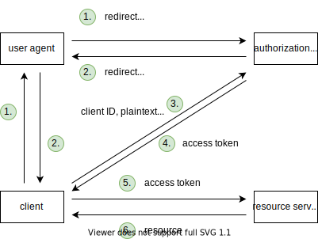

# Auth

[TOC]

<!-- ToDo: finish -->
<!-- todo: improve header -->

## Introduction

- standard for access delegation
- beware: not only for one or the other auth, can't separate ❗️

## Terminology

- resource owner: owner of the protected resource, user of client and resource server
- client: service that wants access to resource on behalf of user, should have been called service provider (SP)
- authorization server: service that provides authentication and authorization for resource, should have been called auth provider (AP)
- resource server: service that provides the protected resource of user, should have been called resource provider (RP)
- beware: client is not necessarily a "front-end client", can be back-end and/or front-end ⚠️
- beware: doesn't specify "front-end client" (esp. when client is back-end only), usually from same provider as client but not necessarily ⚠️
- beware: can have authorization server = resource server, but shouldn't couple tightly for security and scaling, see Cloud#Microservices ❗️

## Motivation

- goal is to give client access to resource on resource server, e.g. Yelp to Google Contacts
- beware: doesn't specify access of resource owner to "front-end client" (esp. when client is back-end only) ⚠️
- Single Sign-On: special case when resource server = identity server and resource is resource owner's identity
- beware: not flow of requests, resource owner is not an entity in request flow, client might consist of two entities (back-end and front-end) or one (front-end), front-end would send first request instead of resource owner, etc. ⚠️

### Direct access

- client has credentials of resource owner
- client acts like resource owner

- client sees credentials of resource owner
- client gets unlimited access, infinite duration, full permission
- resource server must keep credentials
-> insecure, doesn't scale

### Delegated access

- client has deputy credentials of resource owner
- client is separate from resource owner
- needs additional auth provider, layer of indirection

- client doesn't see credentials of resource owner
- client gets limited access, finite duration, granular permissions
- resource server doesn't need to keep credentials
-> secure, scales

## Authorization server

authorization server creates session with resource owner 
leave to authorization server how to make that session last long while being secure

Single Sign-On, when resource owner uses same authorization server for multiple clients
after first client needs to only grant access, login already from session with authorization server

often authorization server is provided by same company as resource server, e.g. Google, GitHub
but not necessarily, e.g. Okta, Auth0, etc.

### Access token

- deputy credentials
- identifier for scope and lifetime of deputy credentials
- opaque to client, just transparent to authorization server and possibly resource server
- short lifetime such that client needs to re-auth with authorization server frequently, e.g. 10-15 min
- rely on authorization server to keep long session with UA, shifts attacker focus on single session with authorization server instead of client(s) with resource server
- can be revokable or not revokable
- no standardized format, for self-contained token choses usually signed JWT

#### Reference token
<!-- todo: (session token in 13.1) -->

- stateful, identifier for metadata on authorization server
- resource server must validate access token with authorization server for each request, send access token to authorization server, "token introspection"
- opaque, only authorization server needs to be able to read
- advantages:
    - revokable, because authorization server can inform resource server about rejection
- disadvantages:
    - high latency, because resource server needs one roundtrip to authorization server for each request
- beware: resource server can use short cache if accepts that can't immediately reject revoked tokens to combat high latency ❗️

#### Self-contained token
<!-- todo: (auth token in 13.1) -->

- stateless, metadata itself
- signed and expiry time
- resource server can validate access token itself, check expiry time and signature
- transparent, resource server needs to be able to read (besides authorization server)
- advantages:
    - low latency, because resource server doesn't need roundtrip to authorization server
- disadvantages:
    - not revokable, because authorization server can't inform resource server about rejection
- beware: if authorization server could inform resource server about rejection would just be reference token ❗️

## Flows

- client needs to register beforehand with authorization server, exchange client ID and client secret, pin allowed callback URL(s)

### Authorization code flow

- client is back-end, e.g. SPA with back-end
- beware: front-end in UA isn't specified, usually but not necessarily front-end of client ⚠️
beware: doesn't specify how keeps state with front-end since doesn't know what front-end is, e.g. if front-end of client can keep state via session cookie
- front-channel transmits only authorization code, back-channel transmits access token
- steps:
    - (client fails to access resource on resource server because of invalid / missing access token)
    - client redirects user agent to authorization server (oauth URL), where user agent logs in, all data (client ID, response type, scope, callback URL, etc.) in query parameter of URL
    - authorization server redirects user agent back to client (callback URL), authorization code in query parameter of URL
    - client sends authorization code along with client ID and client secret to authorization server
    - authorization server returns access token and optional refresh token
    - client sends access token to resource server
    - resource server returns resource
- if no refresh token, then client repeats flow when access token is invalid, relies on authorization server to keep long-lived yet secure session with user agent
- if has refresh token, then client repeats flow when refresh token is invalid, when access token is invalid uses refresh token to obtain new one, see Refresh token

- authorization code is single-use, short lived, e.g. 1 min
- authorization code is useless without client secret
- advantages:
    - secure, because user agent can't get access token
- disadvantages:
    - needs back-end, because needs to store access token
    - needs browser, because relies on redirects to authorization server and back

<!--
use ACF with PKCE for Native app
    ?? has no backend ??, stores access token on client ?? SAME LIKE IMPLICIT FLOW
    -->

#### Refresh token

- like a reusable authorization code
- client sends to authorization server, gets new access token (and refresh token)
- allows client to get new access token without resource owner and repeating whole flow
- needs when client operates without resource owner present, e.g. clean up contacts at midnight
- beware: see IF
- opaque to client, just transparent to authorization server
- long lifetime, e.g. 1 year
- beware: don't use with IF since can't store securely, don't use with ROPCF and CCF since can just as well use regular flow ⚠️
- beware: authorization server needs to revoke refresh token when access token is revoked ❗️
- authorization server should issue new refresh token with every new access token, store old refresh token, when sees old refresh token being used knows that client was breached (either attacker has old one because client has recent one, or other way around) and can revoke all tokens

### Implicit flow

- client is front-end, e.g. SPA without back-end
- front-channel transmits access token
- beware: there is no back-channel, since client is itself the client ❗️
- steps:
    - same as ACF, but instead of authorization token authorization server returns access token in fragment of callback URL
- beware: access token is in fragment, such that not transmitted to Web server of client ❗️

client repeats flow when invalid
- rely on authorization server to keep long-lived yet secure session with user agent, instead of client needing its own

- advantages:
    - doesn't need back-end, because stores access token on front-end
- disadvantages:
    - insecure, because user agent can get access token
    - needs browser, because relies on redirects to authorization server and back
- beware: never use IF and transmit access token to server if client is server, instead use ACF ⚠️

<!--
problem: need to auth every 15 mins
-> non-uniform opinions about you to solve that
-->

### Resource owner password credentials flow
(back channel only)

???

### Client credentials flow
(back channel only)

???
client trades client credentials (client ID + client secret) against token with authorization server, client uses token to access resource server
direct access, no user involved, machine-to-machine, no delegation

use for microservices / API

## Logout

<!-- todo: ??? -->
<!-- difference between self-contained token and reference token ?!?! -->
must differentiate between
- logout from client: call /logout on client to invalidate current session
- logout from authorization server: call /logout on authorization server
- logout from all SPs that use same authorization server: call /logoutAll on authorization server which calls /logout on all other SPs, pass along user info (`sub` claim in JWT)

## OpenID Connect

- extension of OAuth 2.0
- standard for delegated access to identity of resource owner, e.g. for Single Sign-On
- beware: client doesn't need to use user info for Single Sign-On, e.g. can use to mandate authentication strength (recent authentication date, strong authentication method), etc.

### Authorization server endpoints

- user info endpoint, contains user info, client can read using access token
- discover document, contains OpenID Connect specification, e.g. 
- format is usually JSON

### Identity token

- self-contained token for user info
- beware: not revokable, see Self-contained token
- format is signed JWT
- ??? beware: doesn't mandate format for other tokens ❗️

### ACF

- adds `openid` as scope
- gets back identity token alongside access token

### IF

- adds `openid` as scope
- adds `id_token` as `response_type`
- gets back identity token alongside access token

### Hybrid Flow

- like ACF, but gets back identity token already alongside authorization code
- beware: leaks identity token to UA, UA can manipulate before sending to client ⚠️
- beware: client must check that audience of identity token is its client ID, otherwise would falsely accept a valid identity token from another client with same authorization server ⚠️

## Resources

- [Philippe De Ryck - Introduction to OAuth 2.0 and OpenID Connect](https://www.youtube.com/watch?v=GyCL8AJUhww)
- [Nate Barbettini - OAuth 2.0 and OpenID Connect (in plain English)](https://www.youtube.com/watch?v=996OiexHze0)
- [Nate Barbettini - OAuth 2.0 <debugger/>](https://oauthdebugger.com)
- [Nate Barbettini - OpenID Connect <debugger/>](https://oidcdebugger.com)