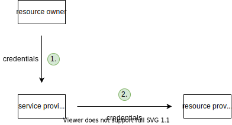
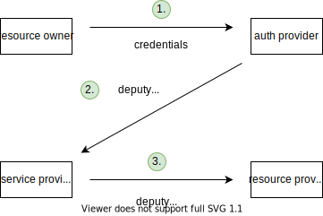

# Auth

[TOC]

<!-- ToDo: finish -->
<!-- todo: integrate 13. -->

## Introduction

- authentication and authorization
- authentication: verification of identity
- authorization: verification of permissions
- can't have one without the other, doesn't make sense
- must be done with each request since HTTP is stateless
- beware: only ever use over HTTPS ⚠️

## Terminology

- use OAuth terminology, since only clearly defined terminology

### Resource owner (RO)

- owner of the protected resource, has credentials
- beware: should have been called user, since doesn't necessarily "own" resource, e.g. non-personalised API ❗️
- beware: not necessarily human, see Client for client = RO ❗️
<!-- todo: "RO" in Motivation uses "front-end client" -->

### Resource server (RS)

- service that provides the protected resource of RO, e.g. API
- beware: should have been called resource provider (RP) ❗️

### Authorization server (AS)

- service that provides identity and permissions of RO
- beware: should have been called auth provider (AP), since doesn't only do authorization ❗️
- RS has one AS
- beware: use separate microservices for AS and RS, instead of running both on same server, see Cloud#Microservices ❗️
- AS can be used for multiple RSs, e.g. Google for Gmail, YouTube, etc.

### Client

- service that accesses resource on behalf of RO, e.g. application
- beware: should have been called service provider (SP) ❗️
- beware: client is special term, doesn't mean UA ⚠️
- if client != RO, then user-to-machine communication
- if client = RO, then machine-to-machine communication
- beware: client is from perspective of RS not of UA, i.e. client can be back-end or front-end ⚠️
- beware: doesn't specify "front-end client" in UA which user interacts with, usually from same provider as client but not necessarily, e.g. addon in Gmail ❗️
- beware: if client is back-end and "front-end client" is from same provider, then doesn't specify how back-end client keeps state with "front-end client", e.g. typical session cookie, see HTML Auth ❗️
- public client: client without client secret and without confirmed identity, e.g. client is front-end (PWA, native app) etc.
- confidential client: client with client secret and confirmed identity, e.g. client is back-end (traditional website) etc.
- credentialed client: client with client secret but without confirmed identity, e.g. client is front-end and dynamically registered at AS (native app), etc.
<!-- todo: consider deleting first- and third-party, unneccessary confusion -->
- first-party client: client from same provider as RS (& AS), e.g. own client for own API
- third-party client: client from different provider as RS (& AS), e.g. own client for foreign API

### Front- and Back Channel

- front channel: redirect requests through browser, visible in address bar, XSS-attackable
- back channel: direct requests not through browser, not visible in address bar, not XSS-attackable
- beware: here browser means user-facing part of browser, for client that is "front-end client" back channel is Fetch API ❗️

## Types

- user-to-machine (U2M): client != RO, i.e. client doesn't have credentials
- machine-to-machine (M2M): client = RO, i.e. client has credentials since is RO itself
- direct: client uses credentials, there is no AS, i.e. RS handles credentials
<!-- todo: may there be even no client? -->
- delegated: client uses deputy credentials, there is an AS, i.e. RS handles token
- beware: client and/or AS can live on same back-end as RS ❗️

| | U2M | M2M |
| - | -- | -- |
| direct | HTTP auth | HTTP auth, API keys |
| delegated | OAuth ACF | OAuth CCF |

<!-- todo: Where does form-based fit in? both direct and delegated?
for form-based, is client = RS or client = RO? Or neither or both?

OAuth just
- standardized FB, make more secure on front channel using auth code only
- clearly separated AS from RS and client, can do microservices, use third-party AS, use third-party client, etc.

Where does non-identity and identity resource come into play? For delegated access had no identity resource until OAuth!!! Otherwise OpenID Connect wouldn't have been invented after OAuth!!!
-->

- use delegated access, see OAuth

## Motivation

- give client access to RO's resource on RS, e.g. Yelp to Google Contacts
- expose RO's credentials only to AS, not to client, i.e. needs front channel
- in diagram, last step is repeated for every request, previous steps are done only once

### Direct access

- client has credentials of RO
- client acts like RO

- client sees credentials of RO 👎
- RS needs to keep credentials of RO 👎
- client gets unlimited access, infinite duration, full permission 👎
- disadvantages:
    - less secure, because can't limit access of client
    - doesn't scale, because RS handles credentials itself, e.g. login, passwords, MFA, etc.
- advantages:
    - simple, because no additional layer of indirection

### Delegated access

- client has deputy credentials of RO
- client is separate from RO
- needs additional auth provider, layer of indirection

- client doesn't see credentials of RO 👍
- RS doesn't need to keep credentials of RO 👍
- client gets limited access, finite duration, granular permissions 👍
- advantages:
    - more secure, because can limit access of client
    - scales, because only AS handles credentials, e.g. login, passwords, MFA, etc.
- disadvantages:
    - complex, because additional layer of indirection

## Resources

<!-- todo: api keys ? -->

e.g. API keys are bad if in URL, since can leak, see Session
