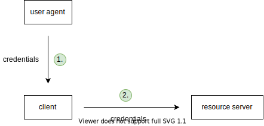
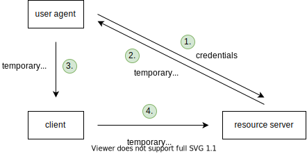

# Authorization

[TOC]

<!-- ToDo: finish -->

## Introduction

- verification of permissions
- needs a permission scheme, e.g. admin, user, guest, etc.
- needs authentication already done
- beware: don't confuse with authentication, see Authentication ❗️

## HTTP authorization

- `403 Forbidden` response if authenticated correctly but not authorized ❗️
?!?! may read user from `Authorization` header or cookie

<!-- todo: integrate with Authentication -->

------

## Introduction

- need secure way of authentication and authorization
- bad delegated access gives client the user's credentials, client is indistinguishable from user

- good delegated access gives client only temporary credentials, client is temporary visitor on behalf of user

- beware: above examples are simplified, resource server can be different from authentication server, see later ❗️

## Terminology

- user agent ??: client of user, front-end
- client: service provider, SP, might be back-end (e.g. Yelp), or front-end (e.g. back-end less Web app)
    third-party application that wants access to resource of user
- auth server: identity provider, IP, determines authentication & authorization
    application that holds identity of user
- resource server: resource provider, RP
    application that holds resource of user
beware: client is bad naming choice, if back-end is separate from UA, if front-end then client = UA
 front-end refers to third-party application instead of instance in user agent, this third-party 

beware: OAuth terminology uses "client" for service provider, and no real word for actual client that user interacts with
beware: can have SP = IP = RP on same server, but conceptually do different jobs 

<!-- TODO: ADOPT OAUTH "CLIENT" AS TERMINOLOGY, MUCH BETTER THAN RESOURCE PROVIDER -->
OAuth used for primarily authentication (and authorization since implied) often ?ALWAYS has SP = RP, e.g. Yelp, GitHub Login
OAuth used for primarily authorization (and authentication since implied) often ?ALWAYS has SP != RP, e.g. Yelp, GitHub Login, Google Contacts

can't have authentication / authorization separate, can't have one without the other, doesn't make sense
    how could authorize, if doesn't know identity, needs authentication
    what would authentication serve, if doesn't know permissions, wants also authorization
any login is always both authentication / authorization, including OAuth (+- OpenID Connect), can't separate
difference between OAuth and OAuth + OpenID Connect
- OAuth: used for authentication / authorization of SP (on behalf of user) to RP, i.e. RP != SP
- OAuth + OpenID Connect: used for authentication / authorization of user to SP, i.e. RP = SP
i.e. difference is who is authenticated / authorized to whom
!!! WRONG, RP can still be different from SP with OpenID Connect, it just adds identity information as an identity token

## OAuth 2.0

<!-- todo: correct, both authentication and authorization -->
- standard for delegated authorization
    DELEGATED ACCESS ON BEHALF OF THE USER
granular, revokable permissions
not possible if gives credentials themselves
instead of giving password to client, client using password at resource server,
        user gives password to resource server, gets temporary key, gives temporary key to client, client can use to access resource server
-> another layer of indirection is separating resource server from authentication server

gets access token

misused for authentication
 e.g. IP creates session with client, single sign-on for multiple SPs
bad, because but no standardization for SP to get user information
-> OpenID Connect

LOGOUT
must differentiate between
- logout from SP: call /logout on SP to invalidate current session
- logout from IP: call /logout on IP
- logout from all SPs that use same IP: call /logoutAll on IP which calls /logout on all other SPs, pass along user info (`sub` claim in JWT)

only ACF allows(??) for refresh token, since other flows can't store securely (back channel only don't need refresh token, since not on behalf of user )
refresh token needed, when SP needs access to RP without client, e.g. clean up email at midnight
    SP takes refresh token to IP, gets new access token
    refresh token is very long lived (e.g. 1 year)
    beware: only use refresh token with Authorization code flow, otherwise stored on client, keys to castle!!!
otherwise when access token expires and client accesses RP, RP (?OR SP) can just redirect through auth flow again, IP gives new access token, just redirects if client has still session with IP
I.E. REFRESH TOKENS NOT NEEDED IF USES OAUTH FOR AUTHENTICATION SINCE RP = SP, rely on session of IP with client, IP must figure out how to make it long-lived and still secure, basically shifts the problem to the IP
refresh tokens need to be revoked as well if access token is revoked
get new refresh token as well with every access token, this way notices when refresh token is stolen if using refresh token returns error
    -> make access token short lived, automatically block account when refresh token is detected to be compromised

access token lifetime ca. 10-15 mins

access token is not intended to be read (understand) by client, opaque, only by RP (and IP who issued it)

////

access token can be stateful or stateless,
    if stateful, then RP needs to ask IP if still valid, requires network request, latency
        but can revoke
    if stateless, then RP can check signature, as long as isn't expired
        but can't revoke (because otherwise would need to ask IP if still valid for each request, is essentially stateful token)
OAuth doesn't mandate one or the other

session token = reference token
    pointer to metadata of client on IP
"token" token = self-contained token
    metadata of client itself

access token can be reference token or self-contained token
(---> SEE! HOW I GUESS IN 13.1 MAN. AUTH.MD)
-##### REFERENCE TOKEN
client must send access token to RP since identifies metadata on IP (see "access token can be stateful or stateless"), same process like you guessed with session ID
called "Token introspection"
one roundtrip for every request to RP, latency
    usually caches for a short time, a few minutes, but loses control of revocation in this time
but allows IP to revoke access token at any time

-##### SELF-CONTAINED TOKEN
client doesn't need to send to RP, can validate itself
usually JWT, signed
contains all metadata
has expiry time, should be short
but can't revoke anymore, because RP doesn't check in with IP, otherwise could just as well use a reference token
////

choose as little scopes as needed, principle of least privilege

### OpenID Connect

<!-- todo: correct, both authentication and authorization 

just defines standard to expose user info to SP (= RP)
-->
- extension of OAuth for authentication
same OAuth flows

gets back access token AND identity token (id token)
id token has user info (format is signed JWT)
also /userinfo endpoint on IP to get more user info with access token

technically just needs to add `openid` as scope
    in Implicit Flow specify additional `id_token` in `response_type`

Hybrid Flow just gets identity token with authorization code, instead of with access token
    identity token arrives with authorization code at client, but 1. leaks identity token to browser, 2. browser may send falseous identity token
    beware: client must check that audience of identity token is actually for its client ID, otherwise browser can send any identity token to log in 

also adds metadata / discovery document to IP, JSON
    contains documentation of endpoints
    contains URL of RP (set by dev of SP earlier?!), that SP then reads out, and sends its received access token to

?? mandates JWT for other tokens as well ??

"client: can decide what to do based on identity token, e.g. authentication date with IP too old, authentication method with IP too insecure, etc.

?!?! "client" doesn't need to use access token, can just use identity token if that contains enough info, e.g. `Hello Peter`
    or just use later instead of immediately

### ??

Website with backend: ACF
    website uses session cookie on client, keeps access token on backend in state
Website without backend: implicit flow
Native app: ACF with PKCE
    ?? has no backend ??, stores access token on client ?? SAME LIKE IMPLICIT FLOW
Microservices / API: client credentials flow

/// OAUTH

was intended for authorization of third party
later "abused" for social logins
-> build OpenID Connect as standard

recommended to use Authorization code flow, because access token stays away from client

### Authorization code flow
if has back-channel
(back + front channel)

SP redirects client to IP (with callback, response type "code", scope, client ID), client login to IP, IP redirects client back to SP (to callback) with "one-time code" ("authorization grant", authorization code) in query parameter of callback URL
SP takes one-time code + client secret to IP to get access token, SP accesses resource on resource server using access token
access token never leaves SP, access token stays on SP, not on client
    attacker can't use authorization code without client secret

"client ID": identifier for SP to IP
"client secret": secret key only known to IP and SP
beware: don't confuse "client" with actual client of SP, "client" here is client of IP which is SP itself
"client" is the service itself and not the browser. In his example, the "client" is the back-end server of Yelp and not the website of Yelp that's open in your browser!
beware: terminology is confusing

IP requires beforehand setup of SP, store client secret, legal callback URLs (to avoid phishing)

### Implicit flow
if has no back-channel, purely client-side app which directly calls APIs
(front channel only)

same as ACF, but IP gives client directly access token instead of one-time code
since there is no backchannel
access token in URL fragment instead of URL query, not send to server!!!

client is actually client on browser

problem: need to auth every 15 mins
-> non-uniform opinions about you to solve that

beware: never use implicit flow with back-end, ship access code to back-end, instead use authorization code flow!!!

### Resource owner password credentials flow
(back channel only)

???

### Client credentials flow
(back channel only)

???
SP trades client credentials (client ID + client secret) against token with IP, SP uses token to access RP
direct access, no user involved, machine-to-machine, no delegation

## Resources

- [Philippe De Ryck - Introduction to OAuth 2.0 and OpenID Connect](https://www.youtube.com/watch?v=GyCL8AJUhww)
- [Nate Barbettini - OAuth 2.0 and OpenID Connect (in plain English)](https://www.youtube.com/watch?v=996OiexHze0)
- [Nate Barbettini - OAuth 2.0 <debugger/>](https://oauthdebugger.com)
- [Nate Barbettini - OpenID Connect <debugger/>](https://oidcdebugger.com)