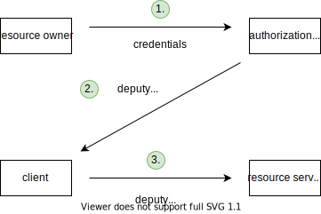

# Auth

[TOC]

<!-- ToDo: finish -->
<!-- todo: integrate 13. -->

## Introduction

- authentication and authorization
- authentication: verification of identity
- authorization: verification of permissions
- can't have one without the other, doesn't make sense
- must be done with each request since HTTP is stateless

## Terminology

- resource owner: owner of the protected resource, user of SP and RP
- service provider (SP): service that wants access to resource on behalf of user, may be a server with a client or just a client (e.g. SPA)
- auth provider (AP): service that provides authentication and authorization for resource
- resource provider (RP): service that provides the protected resource of user

## Access Flow

- ???
- goal is always to log in SP into RP
  doesn't deal with logging RO into SP (in case where SP has client and server)

- beware: SP is client that RO interacts with, optionally also back-end server, can comprise two entities ⚠️
- ?? use case 1: SP is server with a client, SP server logs into RP, e.g. Yelp, GitHub Login, Google Contacts
- ?? use case 2 ("social login"): SP is client only, SP client logs into RP, RP is back-end of SP, e.g. Yelp, GitHub Login
- beware: can have AP = RP, but shouldn't couple tightly for security and scaling, see Microservices

- beware: not flow of requests, RO is not an entity in request flow, SP might consist of two entities (server and client) or one (client), client would send first request instead of RO, etc. ⚠️

### Direct access

- SP has credentials of resource owner
- SP acts like resource owner

- SP sees credentials of resource owner
- SP gets unlimited access, infinite duration, full permission
- resource server must keep credentials
-> insecure, doesn't scale

### Delegated access

- SP has deputy credentials of resource owner
- SP is separate from resource owner
- needs additional auth provider, layer of indirection

- SP doesn't see credentials of resource owner
- SP gets limited access, finite duration, granular permissions
- resource server doesn't need to keep credentials
-> secure, scales

## OAuth 2.0

- standard for access delegation
- beware: not only for one or the other auth, can't separate ❗️
- OpenID Connect: extension for identity layer
    allow client to get user information from auth server

<!-- BEWARE: AFTER HERE, THE TERMINOLOGY CHANGES TO OAUTH -->
<!-- todo: update IP, RO, RP -->

- calls client = SP, authorization server = AP, resource server = RP
- beware: calls SP a "client", doesn't have word for actual client, misleading ⚠️
- beware: calls auth server a "authorization server", although also provides authentication, misleading ⚠️

## Authorization server

IP creates session with client
leave to IP how to make that session last long while being secure

Single Sign-On, when RO uses same IP for multiple clients
after first client needs to only grant access, login already from session with IP

often IP is provided by same company as RP, e.g. Google, GitHub
but not necessarily, e.g. Okta, Auth0, etc.

### Access token

- deputy credentials
- identifier for scope and lifetime of deputy credentials
- opaque to client, just transparent to IP and possibly RP
- short lifetime such that client needs to re-auth with IP frequently, e.g. 10-15 min
- rely on IP to keep long session, shifts attacker focus on single session with IP than client(s) with RP

#### Reference token
<!-- (session token in 13.1) -->

- stateful, identifier for metadata of RO on IP
- RP must validate access token with IP for each request, send access token to IP, "token introspection"
- opaque, only IP needs to be able to read
- format is whatever, since opaque
- advantages:
    - revokable, because IP can inform RP about rejection
- disadvantages:
    - high latency, because RP needs one roundtrip to IP for each request
- beware: RP can use short cache if accepts that can't immediately reject revoked tokens to combat high latency ❗️

#### Self-contained token
<!-- (auth token in 13.1) -->

- stateless, metadata of RO itself
- signed and expiry time
- RP can validate access token itself, check expiry time and signature
- transparent, RP needs to be able to read (besides IP)
- format is signed JWT usually
- advantages:
    - low latency, because RP doesn't need roundtrip to IP
- disadvantages:
    - not revokable, because IP can't inform RP about rejection
- beware: if IP could inform RP about rejection would just be reference token ❗️

<!-- TODO: ADOPT OAUTH "CLIENT" AS TERMINOLOGY, MUCH BETTER THAN RESOURCE PROVIDER -->

## Flows

revokable / not revokable

recommended to use Authorization code flow, because access token stays away from client

### Authorization code flow
if has back-channel
(back + front channel)

SP accesses RP without / with expired / invalid access token
SP redirects client to IP (with callback, response type "code", scope, client ID), client login to IP, IP redirects client back to SP (to callback) with "one-time code" ("authorization grant", authorization code) in query parameter of callback URL
SP takes one-time code + client secret to IP to get access token, SP accesses resource on resource server using access token
access token never leaves SP, access token stays on SP, not on client
    attacker can't use authorization code without client secret

"client ID": identifier for SP to IP
"client secret": secret key only known to IP and SP
beware: don't confuse "client" with actual client of SP, "client" here is client of IP which is SP itself
"client" is the service itself and not the browser. In his example, the "client" is the back-end server of Yelp and not the website of Yelp that's open in your browser!
beware: terminology is confusing

IP requires beforehand setup of SP, store client secret, legal callback URLs (to avoid phishing)

use for Website with backend
    website uses session cookie on client, keeps access token on backend in state

use ACF with PKCE for Native app
    ?? has no backend ??, stores access token on client ?? SAME LIKE IMPLICIT FLOW

### Implicit flow
if has no back-channel, purely client-side app which directly calls APIs
(front channel only)

same as ACF, but IP gives client directly access token instead of one-time code
since there is no backchannel
access token in URL fragment instead of URL query, not send to server!!!

client is actually client on browser

problem: need to auth every 15 mins
-> non-uniform opinions about you to solve that

beware: never use implicit flow with back-end, ship access code to back-end, instead use authorization code flow!!!

use for Website without backend

### Resource owner password credentials flow
(back channel only)

???

### Client credentials flow
(back channel only)

???
SP trades client credentials (client ID + client secret) against token with IP, SP uses token to access RP
direct access, no user involved, machine-to-machine, no delegation

use for microservices / API

#### ?? Logout

must differentiate between
- logout from SP: call /logout on SP to invalidate current session
- logout from IP: call /logout on IP
- logout from all SPs that use same IP: call /logoutAll on IP which calls /logout on all other SPs, pass along user info (`sub` claim in JWT)

#### ?? Refresh tokens

only ACF allows(??) for refresh token, since other flows can't store securely (back channel only don't need refresh token, since not on behalf of user )
refresh token needed, when SP needs access to RP without client, e.g. clean up email at midnight
    SP takes refresh token to IP, gets new access token
    refresh token is very long lived (e.g. 1 year)
    beware: only use refresh token with Authorization code flow, otherwise stored on client, keys to castle!!!
otherwise when access token expires and client accesses RP, RP (?OR SP) can just redirect through auth flow again, IP gives new access token, just redirects if client has still session with IP
I.E. REFRESH TOKENS NOT NEEDED IF USES OAUTH FOR AUTHENTICATION SINCE RP = SP, rely on session of IP with client, IP must figure out how to make it long-lived and still secure, basically shifts the problem to the IP
refresh tokens need to be revoked as well if access token is revoked
get new refresh token as well with every access token, this way notices when refresh token is stolen if using refresh token returns error
    -> make access token short lived, automatically block account when refresh token is detected to be compromised

### OpenID Connect

<!-- todo: correct, both authentication and authorization 

just defines standard to expose user info to SP (= RP)
-->

gets back access token AND identity token (id token)
id token has user info (format is signed JWT)
also /userinfo endpoint on IP to get more user info with access token

technically just needs to add `openid` as scope
    in Implicit Flow specify additional `id_token` in `response_type`

Hybrid Flow just gets identity token with authorization code, instead of with access token
    identity token arrives with authorization code at client, but 1. leaks identity token to browser, 2. browser may send falseous identity token
    beware: client must check that audience of identity token is actually for its client ID, otherwise browser can send any identity token to log in 

also adds metadata / discovery document to IP, JSON
    contains documentation of endpoints
    contains URL of RP (set by dev of SP earlier?!), that SP then reads out, and sends its received access token to

?? mandates JWT for other tokens as well ??

"client: can decide what to do based on identity token, e.g. authentication date with IP too old, authentication method with IP too insecure, etc.

?!?! "client" doesn't need to use access token, can just use identity token if that contains enough info, e.g. `Hello Peter`
    or just use later instead of immediately

## Resources

- [Philippe De Ryck - Introduction to OAuth 2.0 and OpenID Connect](https://www.youtube.com/watch?v=GyCL8AJUhww)
- [Nate Barbettini - OAuth 2.0 and OpenID Connect (in plain English)](https://www.youtube.com/watch?v=996OiexHze0)
- [Nate Barbettini - OAuth 2.0 <debugger/>](https://oauthdebugger.com)
- [Nate Barbettini - OpenID Connect <debugger/>](https://oidcdebugger.com)

<!-- OLD OLD OLD -->

## HTTP authorization

- `403 Forbidden` response if authenticated correctly but not authorized ❗️
?!?! may read user from `Authorization` header or cookie