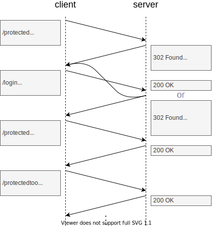

# HTML form-based auth

[TOC]

<!-- todo: make work on non-browser client -->

<!-- todo: define as AS = RS? refer to OAuth for AS != RS,
simplifies just reference token, just cookie, etc.

"... for AS = RS
for AS != use OAuth
beware: could adapt for AS != RS, e.g. custom token instead of cookie, even self-contained token
  but always incomplete, OAuth is best practice
-->

## Introduction

- non-standardised delegated access for U2M and non-back-end client
<!-- todo: want to use "front-end client", but already used for thing running on browser -->

- traditionally used for monolith, i.e. RS = AS
  ?? can use for RS != AS ?? sure, just may not use cookie then, better just use OAuth
  ?? can use s-c token but usually reference token since usually AS = RS
- beware: today use OAuth
use only for login to AS as part of OAuth ❗️
- ??? beware: here will call server "AS" such that can read within OAuth context as well, but remember that in monolith RS = AS = all the same single server

- beware: difficult to do right and keep secure, don't do manually, instead use existing vetted AS for OAuth ❗️

- uses login page, see Login Page
- uses session, see Session
  ?? session token (e.g. cookie) works only since AS and RS are on same domain ??
?? always uses session ?? not in direct auth

## Access flow

- redirect to login page
- do login process
- create session
- redirect back to original page

remember redirect target, e.g. in server session, hidden field in login form, parameter in POST URL, etc.

## Login

- page of AS
- has form for user credentials
  make form accessible, e.g. keyboard, copy & paste, password manager, etc.
- form posts to /login endpoint
beware: don't use get, otherwise visible in URL

### Motivation

often prefered over HTTP Auth browser popup
also can style same for non-browser clients, e.g. native app

adv:
  - customisable, because can create custom login, e.g. appearance, validation, MFA, etc.
cons:
  - complex, because needs to create login page
  - attack vector, because page sees user credentials, e.g. XSS, phishing, etc.

### Verification

- validate the user credentials
verify against database, hash + salt

- beware: must send plaintext credentials to AS
don't hash on client, otherwise hash itself becomes the credentials and since stores hash in database is as if stored password in cleartext

- beware: timing attacks
always hash even if user doesn't exist, otherwise timing attack, can see if user exists

make string comparison constant in time, i.e. depend only on length of string, not which character is wrong, otherwise timing attack, can recover secret string, e.g. in password check, auth token check, etc.
-> very advanced attack, need high sample count to filter out network noise, can mitigate with proper rate limit

### 

if verification successful
  create session
  redirects back to where came from with `301 Found` and session token

if verification failed
  return `401 Unauthenticated` with same page with failure message
  beware: don't leak if user exists or not, just "invalid login"
  beware: don't use `200 OK` if login failed ❗️

### Session

- AS creates session, see Session

- beware: don't confuse session token with tokens in OAuth, is purely custom to AS with UA, not part of OAuth ⚠️
<!-- - in OAuth allows that doesn't need to log in again into AS
todo: move above to OAuth
 -->

## Signup

## User interface

routes for user to update, delete
require credentials again for sensitive operations, otherwise CSRF attack

## Implementation

<!-- todo: integrate with Session#Implementation -->

- log invalid login, flag IP addresses same as login throttling with invalid usernames, see Login Page