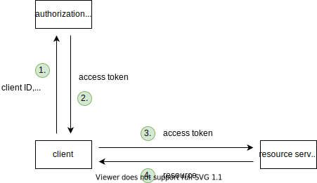

# OAuth 2.1

[TOC]

<!-- ToDo: write 13.4 GNAP once GNAP is released

differences:
- client sends data to AS as token endpoint as JSON instead of in query string, e.g. scopes can have hierarchy for multiple RSs, etc. 🎉
- for user-to-machine, client sends data to AS beforehand on trusted back channel, transmits only opaque identifier on front channel 🎉
- ...
 -->

## Introduction

- collection of standards for access delegation
- for user-to-machine and machine-to-machine communication
- access to identity (resource) or access to (non-identity) resource
- beware: not only for authorization or authentication, can't separate ⚠️
- OAuth itself specifies only access to (non-identity) resource
- OpenID Connect specifies access to identity (resource), see OpenID Connect

## Access token (AT)

- deputy credentials with scope and lifetime
- opaque to client, just transparent to AS and possibly RS
- beware: client must never rely on information in self-contained token, instead use OpenID Connect `/userinfo` endpoint, see OpenID Connect ⚠️
- should use short lifetime, such that client needs to auth with AS often, minimises attack window after last communication with AS
- can be reference or self-contained
- no standardized format, usually signed JWT for self-contained token, i.e. can use signed JWT to switch easily between treating it as reference or self-contained token
- needs to store safely, e.g. front-end client JS-accessible storage is XSS-attackable
- on front-end client must keep in memory, e.g. until tab refresh / close, or in service worker until browser close, or store as HttpOnly cookie if RS is on same domain as client and configured to read cookie
- should use proof of possession to make stealing useless, e.g. Mutual TLS, DPOP, etc.

### Reference token

- stateful, identifier for state on AS
- opaque to RS
- RS can't validate itself, needs token introspection, see Token introspection
- advantages:
    - revocable, because AS informs RS that revoked with token introspection
    - low bandwith, because contains only identifier
- disadvantages:
    - high latency, because RS needs one roundtrip to AS for each request
    - high storage, because AS needs to keep state
- RS can use short cache if accepts that can't immediately reject revoked tokens to combat high latency
- use for small-scale RS, or when AS = RS

### Self-contained token

- stateless, signed state itself
- transparent to RS
- RS can validate itself, checks signature and expiry time, no need for Token introspection, at most load public key for signature from AS at startup
<!-- todo: elaborate on signature

AS uses secret to hash
either symmetric secret that shares with RS, good for own AS and single RS
or public private keypair, shares public key with RS, good for separate parties for AS and RS, for multiple RS

AS has API that RS can load key from on startup
usually multiple keys that rotate periodically
usually key and key identifier, also key identifier written in token, such that RS can use right key, doesn't need to check every key
rotation: AS starts using new key, publishes old key at least as long as max token lifetime from time of switch (time of issue of last token with old key)

use key management service, handles safe storage of keys and rotation, e.g. Hashicorp Vault, Google Cloud Key Management, etc.

 -->
- advantages:
    - low latency, because RS doesn't need roundtrip to AS for each request
    - low storage, because AS doesn't needs to keep state [^1]
- disadvantages:
    - not revocable, because AS can't inform RS that revoked without token introspection
    - high bandwith, because contains state itself
- RS can still choose to do token introspection to allow for revocability, can even choose to do only for important scopes (e.g. write but not read)
- beware: token introspection more efficient than for reference token, since needs to do only for valid or revoked tokens, expired and modified tokens are filtered out already by validity check ❗️
- instead of token introspection could use event stream, AS publishes event when a AT is revoked with expiry time of AT, RS caches revoked AT until expiry time, RS validates ATs against that cache, use protected event channel
- beware: cache of revoked ATs through event stream needs to be stored persistently, otherwise server restart makes revoked but not yet expired tokens valid again ❗️
- RS can use short cache if accepts that can't immediately reject revoked tokens to combat high latency, can even choose to do only for important scopes (e.g. write but not read)
- use for large-scale RS, or when AS ! = RS
- beware: don't store sensible data that client shouldn't see ❗️

[^1]: usually AS still keeps state, because token contains only part of state that's relevant to RS ❗️

### Token introspection

- validation of AT by AS
- RS sends AT to AS
- AS returns validity status and expiry time, usually as JSON
- protect introspection endpoint otherwise everyone can verify tokens, e.g. on AS use same logic as for token endpoint, on RS use new set of client credentials
- could also keep deny list on RS, AS sends any revoked tokens to RS, e.g. event stream
- beware: deny list would be fail-open behavior, RS accepts token as long as no message from AS, e.g. packet loss, DDOS on AS, etc. ⚠️

## Access flows

- flow how client uses AT
- uses access token as deputy credentials
- scopes define permission of client at RS
- scopes also select RSs if uses AS for multiple RSs, e.g. `A-upload`, `B-upload`
- beware: must use unique scopes across all RSs since mixes scopes from multiple RSs ❗️
- can use Resource Indicators instead of scopes to selects RSs, but only if uses same scopes for all RSs or only uses single RS

### Authorization code flow with PKCE

- for user-to-machine communication, i.e. client != RO
- for public and confidential clients
- front channel transmits only authorization code, back channel transmits AT
- steps:
    - (client fails to access resource on RS because of invalid / missing AT)
    - client generates random PKCE secret for the current flow, stores PKCE secret temporarily, e.g. session storage, session cookie, etc.
    - client redirects UA to AS at authorization endpoint with hash of PKCE secret, client ID, response type, scope, callback URL in query parameter of URL, AS saves hash of PKCE secret temporarily
    - UA logs into AS, accepts permission prompt (if never done before)
    - AS redirects UA back to client (callback URL), authorization code in query parameter of URL
    - client sends authorization code along with PKCE secret and client ID to AS, usually in body of POST request, AS verifies that hash of PKCE secret is same as hash from earlier
    - AS returns AT, usually in JSON
    - client sends AT to RS at token endpoint, usually in `Authorization: Bearer <token>` header
    - RS returns resource
- client can also send state parameter to AS, AS echoes back, e.g. client can use state to remember destination URL

- authorization code is single-use, short lived, e.g. 1 min
- advantages:
    - secure, because UA can't get AT without knowing PKCE secret
- disadvantages:
    - needs browser, because relies on redirects to AS and back
- PKCE verifies integrity of flow, otherwise authorization code injection attack where swaps authorization codes from two distinct flows, attacker can log in as user or user can be logged in as attacker, see [OAuth Happy Hour - Authorization Code Injection Demo](https://youtu.be/moQidjdV5cw?t=562)
- PKCE protects against state-changing CSRF requests, since client can't complete flow it didn't initialise because PKCE secret is missing, replaces older method using state value
- beware: public client with PKCE is still XSS-attackable, e.g. could still make authorization code injection attack by stealing PKCE secret alongside authorization code since PKCE secret must be stored in JS-accessible storage, or could plant PKCE secret for state-changing CSRF request ⚠️
- client can register with AS beforehand, guarantees authentic clients, e.g. for any client can pin callback URL and rely on confirmed identity of domain, or for confidential client AS can require client secret at token endpoint
- when AT is expired or revoked, client must repeat flow, e.g. rely on AS to keep long-lived yet secure session with UA, redirects back without interaction from RO
- when AT is only expired, can alternatively use RT

### Client credentials flow

- for machine-to-machine communication, i.e. client = RO
- for confidential clients only
- beware: for public clients no solution, could just as well leave RS unprotected ⚠️
- back channel transmits AT
- steps:
    - (client fails to access resource on RS because of invalid / missing AT)
    - client sends client ID and client secret to AS, usually in body of POST request
    - AS returns AT, usually in JSON
    - client sends AT to RS, usually in `Authorization: Bearer <token>` header
    - RS returns resource

- when AT is expired or revoked, client can repeat flow
- when AT is only expired, can alternatively use RT (but doesn't make much sense since already has credentials!)

### Device code flow

<!-- todo: finish -->

## Refresh token (RT)

- deputy credentials for an AT
- allows client to skip flow to get new AT
- client can use to get new AT with same scope and lifetime after old AT expired
    - only useful for user-to-machine communication since machine-to-machine communication can just use credentials directly
    - doesn't need RO credentials, no front-channel redirect to AS, e.g. silent renew in background, on back-end when RO is not present, etc.
    - can think of RT like reusable authorization code
- client can use to get new AT with narrower scope or shorter lifetime while old AT is still valid, multiple ATs at same time
- beware: can have multiple valid ATs at a time but only single valid RT at a time ❗️
- steps:
    - AS returns RT alongside AT in flow
    - client sends RT to AS at token endpoint
    - AS returns new AT (and maybe RT)
- usually AS doesn't issue RT by default, client needs to indicate somehow, e.g. additional scope
- opaque to client, just transparent to AS
- beware: RT is never sent to RS ❗️
- should use longer lifetime, such that client can use for multiple ATs
- beware: don't use sliding expiry time, otherwise could be kept valid indefinitely ⚠️
- when RT is expired or revoked, client must repeat flow, no other choice
- needs to store safely, e.g. front-end client JS-accessible storage is XSS-attackable
- on front-end client must keep in memory, e.g. until tab refresh / close, or in service worker until browser close, or store as HttpOnly cookie if AS is configured to set and read cookie, cookie is restricted to refresh endpoint path
- must use rotation or sender constraints
- rotation: AS issues new RT with every new AT, AS stores old RTs, if old RT is used knows that was breached (either attacker or client has current one), revoke all RTs, see Revocation
- sender constraints: client provides proof of possession to AS, e.g. client secret, mutual TLS, etc.
- beware: an AT can live longer than the RT it's based on if created shortly before RT expired ❗️
- on start of client, if client has refresh token (if in HttpOnly cookie can't check), can send to AS to get new AT

## Revocation

- invalidates token
- client sends token to AS at revocation endpoint
- protect revocation endpoint like token endpoint otherwise everyone can revoke tokens
- concrete behavior up to AS
- revoking AT usually revokes that AT only, if based on RT may also revoke its RT and all ATs based on that RT
- revoking RT usually revokes that RT and all ATs based on RT
- beware: revoking an RT doesn't necessarily revoke all ATs, since ATs issued shortly before an RT expires may live longer than RT ⚠️
- for user-to-machine communication, AS usually doesn't invalidate consent of RO
- implement admin "revoke all" feature to revoke all ATs and RTs of all users in case of breach
- for user-to-machine communication, logout functionality in client usually revokes all ATs and RTs for that client and deletes them locally
- beware: logout might not behave as expected if UA has active session with AS, since next login is automatic, redirects back without interaction from RO ❗️
- beware: don't confuse client and AS, log out from client does not log out from AS and vice versa ❗️
- need to consider different instances of client, e.g. two browsers, etc., logout only current client instance or all
- need to consider different clients, e.g. web client, mobile client, etc., logout only current client or all

## OpenID Connect

- extension of OAuth 2.0 for access to identity (resource) in user-to-machine communication
- special case of RS = AS and resource = RO's identity
- beware: not only for authorization or authentication, can't separate ⚠️
- beware: only for user-to-machine communication, i.e. only ACF flow ❗️
- can use to check authentication strength, e.g. recent authentication date, strong authentication method, etc.
- can use for (Single) Sign-On, only needs single account at AS, automatically logged into client since only redirect without interaction from RO (if logged into AS and granted access to clients), e.g. Google for Gmail, YouTube, etc.

### Identity resource

- RS (= AS) offers single userinfo endpoint, usually `/userinfo`
- returns user info, depending on scopes of AT, but always `sub` claim with unique identifier
- response format is JSON
- requires `openid` scope, optional `profile`, `email`, `address`, `phone` and/or custom scopes
- beware: like always client can use AT for multiple RS(s), since AS is just like another RS that AS is used for ⚠️
- beware: client must identify user only using `sub` claim, all other claims may change, e.g. [Aaron Parecki - The Real Cause of the Sign In with Apple Zero-Day](https://aaronparecki.com/2020/05/31/30/the-real-cause-of-the-sign-in-with-apple-zero-day) because Apple apps identified user from `email` claim ❗️
- beware: if client offers multiple ASs needs to keep user database since user might not choose same AS, needs to deduplicate user database since `sub`s are different for different ASs, e.g. ask user to link other ASs to get their `sub` claim, or send email asking if wants to merge ❗️
- could make GraphQL endpoint

### ID Token

- self-contained token with user info
- format is signed JWT
- AS sends back along AT
- transparent to client
- only intended for client, not send to other RS
- beware: token is redundant, could just as well have be plain JSON, since transmits user info via trusted back channel with AS ❗️
- beware: don't use, use userinfo endpoint instead, ignore ID token ❗️

## Implementation

- builds either client or RS (with existing AS)

### Client

- beware: don't build own auth logic, use existing vetted libraries, e.g. AppAuth, etc. ❗️
- consider making browser-based public client a confidential client, create a back-end just for OAuth, e.g. using serverless functions, etc.

#### Overview

- request AT from AS with right scopes
- handle success / failure from AS
- request to RS with AT
- handle success / failure from RS

### RS

- middleware in API, either before each route or only in protected routes
- indifferent to type of Access flow, e.g. ACF, CCF, etc.
- beware: don't build own token verification, use existing vetted libraries, e.g. ??, etc. ❗️

#### Overview

- read AT
- check validity of AT
- check scopes of AT for requested operation, e.g. read, write, etc.

#### Detail

<!-- todo: consider deleting, or put into example app -->

- has auth header? no -> 401
- extract token from auth header, e.g. split after "Bearer ", discard first part
- verify token, e.g. using auth library, needs to initialise first, set up `.env` with secrets, e.g. `const { claims } = await oktaJwtVerifier.verifyAccessToken(token, process.env.OKTA_AUDIENCE)`
- has claims? no -> 401
- has correct claims for operation? no -> 401

### AS

- beware: don't build own AS, use existing vetted providers, e.g. Okta, Auth0, FusionAuth, Google Identity Platform, Amazon Cognito, etc. ❗️
- beware: here describe only random selection of things to implement that aren't yet obvious from above text ❗️

#### Overview

- client un/registration for client
- login, passwords, session management, see HTML form-based auth
- client session and consent revocation for RO, revokes individual or all tokens
- access flows
- keep scopes up-to-date with RS(s)
- if self-contained ATs, rotate keys

#### Client registration

- name, block misleading names, e.g. of own clients
- callback URL(s)
- give client ID
- give client secret if public client

#### Consent Screen

- show own name (AS)
- show RO name, e.g. could have multiple accounts
- shows client name, callback URL, etc. from client registration
- shows scopes requested (and for which RS), don't overwhelm but be detailed, possibly allow to edit
- beware: differentiate from own clients, otherwise phishing client, see [New Google Docs phishing scam](https://www.reddit.com/r/google/comments/692cr4/new_google_docs_phishing_scam_almost_undetectable/)

#### Access flows

- CORS for endpoints used by client through back channel, otherwise front-end client can't use it, e.g. token endpoint, userinfo endpoint, etc.
- error if callback URL is not registered for client
- error if authorization code is reedemed twice, should invalidates previously issued AT
- token lifetime, e.g. may depend on scopes, user group, etc.
- may invalidate consent after user hasn't used client for long time
- beware: AS should never issue same AT or RT twice or to multiple clients ❗️
- publish discovery document, clients can get info dynamically, e.g. endpoint URLs, public keys, etc.

## Resources

- [Aaron Parecki - Securing Your APIs with OAuth 2.0](https://www.youtube.com/watch?v=PfvSD6MmEmQ)
- [Aaron Parecki - How OAuth Works](https://www.youtube.com/playlist?list=PLRyLn6THA5wN05b3qJ6N0OpL3YbritKI-)
- [Aaron Parecki - OAuth 2.0 Simplified](https://www.oauth.com)
- [Nate Barbettini - OAuth 2.0 and OpenID Connect (in plain English)](https://www.youtube.com/watch?v=996OiexHze0)
- [Nate Barbettini - OAuth 2.0 <debugger/>](https://oauthdebugger.com)
- [Nate Barbettini - OpenID Connect <debugger/>](https://oidcdebugger.com)
- [Philippe De Ryck - Introduction to OAuth 2.0 and OpenID Connect](https://www.youtube.com/watch?v=GyCL8AJUhww)