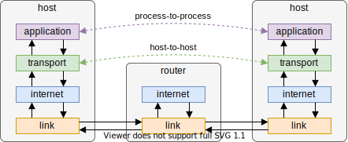

# Internet

[TOC]

## Internet protocol suite

- protocol suite for an interconnected network
- consists of four layers
- used to build the Internet

### Link layer

- defines communication between network interfaces, e.g. Ethernet, Wi-Fi, PPP, etc.
- how to actually transmit data over electromagnetic waves, e.g. voltage, light, radio waves, etc.
- defines most general packets, unique address for every network interface, packets are sent to all network interfaces but saved only by intended recipient, e.g. shouting to friend within a crowd
- usually stateless

### Internet layer

- defines communication between multiple networks, e.g. IP, etc.
- defines networks, unique address for every node on network, packets are forwarded from one router to the next until they reach their destination, e.g. physical mail
- usually stateless

### Transport layer

- defines communication between multiple hosts, e.g. TCP, UDP, etc.
- defines communication channels on "ports", data is sent as chunks in multiple packets
- assembles packets in correct order, since the internet layer could send them via different routes resulting in out-of-order delivery
- guarantees reliability by notifiying sender of successful delivery
- implements flow control to handle backpressure
- creates ports to separate packets from separate senders
- usually stateful

### Application layer

- defines communication between multiple applications, e.g. HTTP, DNS, FTP, BitTorrent, Tor, SSH, IMAP, TLS, etc.
- defines transmission of concrete files between two specific ports, e.g. potential encryption, data format, etc.
- usually stateful

### End-to-end principle

- application-specific features are implemented by end nodes, not whole network
- complexity is pushed to end nodes, intermediary nodes relay packets like black boxes
- trade offs:
  - packet delivery between intermediary nodes can't be guaranteed
  - no packet caching, i.e. can't transmit one packet to multiple nodes, needs to send separate ones
  - authenticate packets, i.e. need to have firewall to protect against flooding
  - etc.

## Internet

- universal interconnected network using the IP suite
- foundation for all digital interconnected services
- used by the Web, e-mail, file sharing, etc.  
- decentralised since IP suite is decentralised, though IP addresses and domain names are centralised by Internet Corporation for Assigned Names and Numbers (ICANN)

## Domain Name System (DNS)

- maps numeric IP addresses to alphabetic domain names, "the telephone book of the Internet", e.g. `93.184.216.34` to `example.com`
- makes network addresses memorable, makes Internet easier to use, imagine there were no addresses on Earth and you need to send a postcard to a location using geographic coordinates like latitude and longitude, would be hard to remember
- can resolve domain name to different addresses over time, e.g. change IP address without changing domain name
- can resolve domain name to different addresses at same time, e.g. route user to regional server closest to user
- domain names are tree-like structure, first root domain, then top-level domains (TLDs), then individual domains
- for each zone in the tree there is a DNS server, multiple for redundancy, e.g. root nameservers, TLD nameservers, `example.com` domain nameservers, `mail.example.com` subdomain nameservers, etc.
- DNS protocol is used to request DNS servers to resolve a domain name
- for application to translate a domain name, it sends it to DNS resolver server
- DNS resolver asks one of the root nameservers for TLD nameserver, then one of the TLD nameserver for domain nameserver, then one of the domain nameservers for domain name
- application caches DNS queries to accelerate future requests, however needs to query again after some time since IP address could have changed
- can rent domain name from ICANN through a domain name registrar, can't buy permanently

## QUIC

(see also beforehand [HTTP](#))

- future transport layer protocol
- multiplexed streams over single connection
- a stream is reliable, in order, has congestion control, can be canceled, all without blocking other streams
- entire connection has congestion control as well
- TLS is built into connection, with caching and resuming
- (implemented in user-space instead of kernel-space, on top of UDP, for compatibility with existing network infrastructure and faster iteration)

## Client

- application that requests access to a resource at application layer
- resource is provided by server

## Server

- application that provides access to a resource at application layer
- resource is consumed by client
- offloads work from individual clients into a shared service

### Proxy server

- intermediate server on network
- forwards (potentially modified) request to server or serves it itself
- can act on behalf of the server, e.g. caching, filtering, load balancing, authentication, logging, etc.
- can act on behalf of the client, e.g. mask true origin of request

## CDN (Content Delivery / Distribution Network)

- geographically distributed network of proxy servers
- proxy servers store copy of a resource from an origin server, i.e. spreads load from origin server
- proxy server usually fetches resource from origin server on first request, serves subsequent from copy in own cache, i.e. slower on very first request
- proxy server physically closest to user handles request for a resource, i.e. reduces network latency
- often do more optimisations, e.g. compress file size, use best encryption standards, DDOS mitigation, etc.
- advantages: improves latency, increases availability, decreases load (on origin server)
- disadvantages: relies on third party, could modify response, could experience outages, could get breached, etc.
- see [CloudFlare](https://cloudflare.com/), [Netlify](https://www.netlify.com/), [Fastly](https://www.fastly.com/) etc.
- makes sense only for chacheable resources, e.g. static websites, not dynamic websites

## Resources

- [Wikipedia - Internet protocol suite](https://en.wikipedia.org/wiki/Internet_protocol_suite) and subpages
- [René Pickhardt - Web Science](https://en.wikiversity.org/wiki/Web_Science)
- [Ben Eater - Networking tutorial](https://www.youtube.com/playlist?list=PLowKtXNTBypH19whXTVoG3oKSuOcw_XeW)
- [How DNS works](https://howdns.works/)