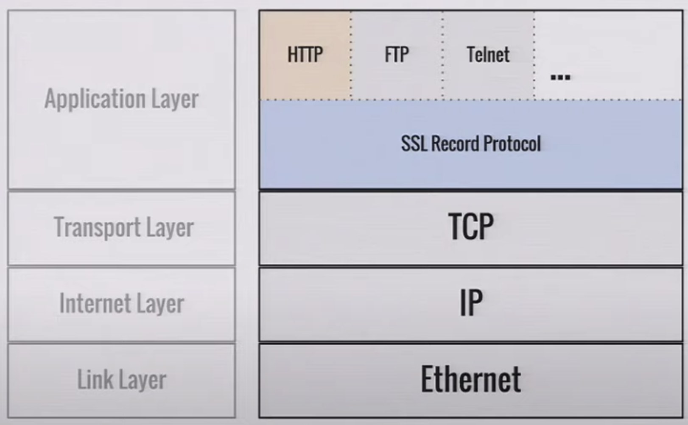

# TLS

[TOC]

<!-- ToDo: finish -->

## Introduction

- an application layer protocol to encrypt its data
- goes between application layer and transport layer

- by default the application layer protocols are not encrypted, e.g. HTTP, FTP, DNS, etc. pp.
- not encrypted at all, e.g. HTTP is open, anybody on line can read freely, e.g. on same Wi-Fi network

- always encrypt to prevent man in the middle attacks ❗️

## HTTPS

- HTTP over TLS

## Certificates

server uses a certificate to prove the website's identity to browsers

## Certificate Authority (CA)

- provides TLS certificates
- trusted by Web browser, only 64? at time of writing

- CA is attack vector, if hacked can issue certificate for any website, can pin CA, though makes harder to switch CA later

- need to prove that own the domain

agent proves to the CA that the web server controls a domain

- some non-profit CAs provide TLS certificates for free, e.g. [Let's Encrypt](https://letsencrypt.org/)

## Resources

- [Wikipedia - TLS](https://en.wikipedia.org/wiki/Transport_Layer_Security)