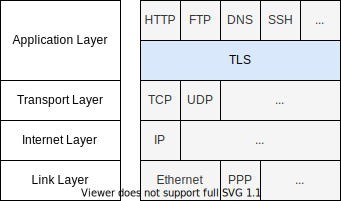

# Transport Layer Security (TLS)

[TOC]


## Introduction

(see also beforehand [Encryption 101](../Other/Encryption%20101.md))

- an encryption protocol
- layer between transport layer and application layer
- communications consists of "records"
- payload of record is the encrypted application layer data
- beware: as its own layer, one record doesn't necessarily contain one application layer packet or is contained in one transport layer packet ❗️



- provides confidentiality, authenticity and integrity of application data
- provides identification of communicating parties
- (previously called SSL)


## TLS session

- client initiates handshake with server
- if successful, proceeds with transmission of encrypted application data
- can transfer multiple records per session, at least until underlying transport layer session is ended
- beware: HTTP uses a new transport layer protocol session per request by default, i.e. for HTTPS needs to make new TCP 3-way handshake as well as TLS handshake for every request, always send `Connection: keep-alive` header in HTTP request to reuse existing transport layer session for multiple requests such that can use a single TLS session ⚠️
- port of transport layer needs to be different than without TLS, since now TLS protocol is interface of application layer, e.g. HTTPS on port 443 by default
- uses both symmetric and asymmetric encryption
- for each session the handshake negotiates a new session key
- beware: public-private keypair is used only in handshake, not needed once session is established


## Handshake

- negotiates session key for application data transmission
- uses asymmetric encryption with private-public keypair
- varies with protocol version and key exchange protocol, see [Wikipedia - TLS](https://en.wikipedia.org/wiki/Transport_Layer_Security#Protocol_details)
- forward secrecy dependends on chosen key exchange protocol, e.g. ECDHE 👍
- some key exchange protocols don't need the private key, only needed for identification, i.e. client private key not needed at all if not authenticated, e.g. ECDHE 👍
- doesn't use authentication, since handshake just fails if messages are manipulated, i.e. no digital signatures
- uses certificates for identification, usually only of server since client identity is not relevant
- can resume previous session by providing session ID, reuses previous negotiation to generate the current session key, session key is still new
- can specify various extensions, e.g. SNI


## Transmission

- transmits encrypted application data
- uses symmetric encryption with session key from handshake
- uses MAC in application data for authentication


## Cipher Suite

- set of ciphers used in TLS session

```plaintext
TLS_ECDHE_RSA_WITH_AES_128_GCM_SHA256
^^^ ^^^^^ ^^^      ^^^^^^^^^^^^^^^^^^
1   2     3        4

1. Protocol
2. Key exchange protocol
3. Certificate cipher
4. Symmetric encryption cipher, key size, mode, MAC hash function
```

- ephemeral if a new private-public keypair is generated for each handshake, instead of using the real private-public keypair, the ephemeral public key would be signed with the certificate's private key for authentication, e.g. ECDHE 👍
- beware: the key exchange protocol `RSA` doesn't provide forward secrecy, choose `ECDHE` etc. ❗️


## Server Name Indication (SNI)

- extension to handshake protocol
- client can specify domain name of server, in addition to later in application layer protocol, e.g. HTTP request `Host` header
- allows for multiple servers behind single IP, e.g. virtual hosts, because otherwise server doesn't know which certificate to respond with, would need to choose an arbitrary one with the risk of choosing one that later doesn't coincide with the target server
- beware: leaks subdomain name of target server
- use ESNI to encrypt SNI using server's public key, public key must be stored in server's DNS record


### Certificates

- usually only for server authentication
- client authentication is done using login and cookies
- client certificates can limit access, one need to set up own trust chain, e.g. IoT devices
- CA issues server certificates
- CA must be trusted by a root CA, certificate chain
- list of trusted root CA certificates is hardcoded in OS or client
- types of certificates: single domain, wildcard, multi-domain
- levels of validation: domain validation, organization validation, extended validation
- certificates were historically paid, but some free initiatives, e.g. [CloudFlare](https://cloudflare.com/), [Let's Encrypt](https://letsencrypt.org/), etc.
- beware: a CA can issue certificates for every domain, even if already exists, attacker can create duplicate certificate if controls domain, then use with phishing or DNS spoofing ❗️
- can use CA pinning, specify allowed CAs in DNS record of domain, other CAs won't issue certificates for domain, makes later switching of CA harder though, beware: doesn't protect against compromise of any CA


## Usages

- application layer protocols are not encrypted by default, e.g. HTTP, FTP, DNS, etc. ⚠️

### HTTPS

- HTTP over TLS
- browsers and SE penalize for not using HTTPS

#### Motivation

- HTTP provides no confidentiality, authenticity and integrity of transmitted data
- can read communication, e.g. read passwords on LAN, in ISP, etc.
- can modify communication, e.g. inject ads in website, etc.
- HTTP provides no identification of website
- can spoof website, e.g. man-in-the-middle attack

### DOT

- DNS over TLS
- alternatively DoH (DNS over HTTPS) to avoid DNS blocking, since disguised as regular HTTPS traffic

#### Motivation

- DNS provides no confidentiality, authenticity and integrity of transmitted data
- can read communication, e.g. domain names, etc.
- can modify communication, e.g. change domain name to malicious copy, etc.
- DNS provides no identification of DNS resolver
- can spoof DNS resolver, e.g. man-in-the-middle attack


## Concrete threads

- metadata in general, e.g. identities, time, quantity, etc.
- metadata from transport layer and below, e.g. location
  → use VPN / TOR to conceal source IP and destination IP, however only shifts trust from ISP to VPN / exit node
- metadata on website, e.g. browser fingerprinting, etc.
- client, e.g. add-ons that read screen / keyboard, mixed content from third parties, active content can change login form to submit over HTTP, content on server, content on CDNs, etc.
- client OS, e.g. read key from memory / disk, read message before encryption / after decryption, unencrypted cloud backups, install root certificates, patch client, etc.
- server, e.g. SQL injection, etc.
- server OS, e.g. read message before encryption / after decryption, etc.
- CA
- any combination of above, e.g. hack domain without CA pinning, get duplicate certificate from a CA, route users to malicious domain using DNS spoofing, etc.


## Resources

- [Wikipedia - TLS](https://en.wikipedia.org/wiki/Transport_Layer_Security)
- [The Illustrated TLS Connection](https://tls.ulfheim.net/), [The New Illustrated TLS Connection](https://tls13.ulfheim.net/)
- [HPBN - TLS](https://hpbn.co/transport-layer-security-tls/)