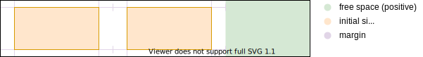

# Flex Layout


## Introduction

- a regular layout, for applications
- one-dimensional layout since uses lines, for two-dimensional layout see Grid Layout
- replaces Flow Layout, see Flow Layout comparison 🎉
- beware: should have been named "Line Layout" to be consistent with "Grid Layout" ❗️


## Directions

- main axis and perpendicular cross axis
- boxes are laid out along main axis, from main-start direction towards main-end direction
- lines are laid out along cross axis, from cross-start direction towards cross-end direction
- can set main / cross axis to any of the 8 possible combinations, i.e. even bottom-to-top 🎉
- main / cross axis is in Flex Layout what inline / block axis is in Flow Layout
- beware: main axis doesn't necessarily correspond to inline axis, similarly cross axis not to block axis ❗️
- beware: there are no "flex-flow-relative" properties that are relative to main / cross axis like there are logical properties that are relative to block / inline axis in Flow Layout (except `flex-basis`), if main / cross axis changes needs to change any direction-aware property, e.g. size, margin, padding, border, etc. ⚠️⚠️⚠️
- beware: affects only visual rendering, keyboard navigation and screen reader still use document tree order ❗️
- beware: doesn't affect stacking order since doesn't change order of boxes but only the directions, see Order ❗️

<!-- Demo: flexdirections -->

### Lines

- similar to line in Flow Layout, except hypothetical container instead of anonymous box 🎉
- main size is full size of content box of flex container
- cross size is minimum size to contain all boxes on the line
- boxes can wrap around to next line when current line is full
- boxes in each line are laid out independently from boxes in other lines, e.g. flexible sizing, alignment, etc.
- beware: boxes in different lines may not line up, if desired see Grid Layout instead ❗️
- beware: in single-line flex container the cross size of the line is always the cross size of the flex container ❗️

### Main direction

- specifies main axis with main-start and main-end directions
- `flex-direction`
- not inherited
- applies only to flex containers
- relative to logical inline / block directions instead of physical directions, see Writing Mode
- beware: can always set all 8 possible flex-flow directions no matter the given block and inline directions, but still adapts if they change, wouldn't have adapted if it had been relative to physical directions, i.e. Flex layout adapts to writing mode ❗️
- values: `row`, `row-reverse`, `column`, `column-reverse`
- initial value: `row`, i.e. defaults to Inline Layout of Flow Layout
- beware: values should have been named better, in vertical writing mode `row` / `column` corresponds to vertical / horizontal direction ❗️

#### `row`

- main axis = inline axis of current writing mode
- main-start = inline-start, main-end = inline-end

#### `row-reverse`

- same as `row`, except main-start and main-end directions are reversed

#### `column`

- main axis = block axis of current writing mode
- main-start = block-start, main-end = block-end

#### `column-reverse`

- same as `column`, except main-start and main-end directions are reversed

### Cross direction

- specifies cross axis with cross-start and cross-end directions
- also specifies if flex container can contain multiple lines or only single line ("single-line" or "multi-line")
- beware: boxes in single-line flex container overflow instead of wrapping to new line ❗️
- beware: should have been two separate properties, conflates line direction with line wrapping ❗️
- `flex-wrap`
- not inherited
- applies only to flex containers
- relative to logical inline / block directions instead of physical directions, see Writing Mode
- values: `wrap`, `wrap-reverse`, `nowrap`
- initial value: `nowrap`
- beware: default should have been `wrap`, differs from Flow Layout ⚠️
- beware: missing value `nowrap-reverse` for single-line flex container with cross direction of `wrap-reverse`, although would have different effect than `nowrap` only in cross alignment ❗️

#### `wrap`

- cross-start = inline/block-start, whatever is in cross direction
- flex container is multi-line

#### `wrap-reverse`

- same as `wrap`, except cross-start and cross-end directions are reversed

#### `nowrap`

- cross-start = inline/block-start, whatever is in cross direction
- flex container is single-line

### Shorthand

- specifies main and cross direction
- `flex-flow`
- order of values doesn't matter
- just like individual properties
- beware: resets omitted properties to their initial value ❗️


## Order

- specifies order in which boxes are laid out
- `order`
- not inherited
- applies only to flex items
- values: `<integer>`
- initial value: `0`
- element with lower number comes first in main-start direction
- elements with same number are laid out by order in document tree, earlier one is towards main-start
- beware: can use negative numbers to always show first since default is zero ❗️
- beware: elements with positive order number come after non-ordered elements since default is zero ❗️
- beware: affects only visual rendering, keyboard navigation and screen reader still use document tree order ❗️
- can use to reorder presentation but not semantics, e.g. show image before title
- beware: order of stacking is same as Order, not order of document tree, see Stacking ❗️


## Main size

- main size of box can be flexible between minimum and maximum size
- from initial size can grow to fill or shrink to fit free space
- free space can be positive or negative
- grow / shrink factor determines how much size of box grows / shrinks relative to other flexible boxes
- can think of "final" grown / shrunk box size as resizing from initial size, only comes after computation of initial size
- beware: (fixed) margins don't grow / shrink, use alignment instead of flexible size ❗️
- beware: only main size can be flexible, not cross size since one-dimensional layout, instead see Grid Layout ❗️
- beware: minimum main size `auto` value of flex item that is not a scroll container resolves to `min-content` (with some adjustments) instead of zero ⚠️
- beware: default minimum main size differs from Flow Layout ❗️
- beware: here use "size" for "main size" for simplicity ❗️

<!-- Demo: CSS/flexsize -->
<!-- Demo: CSS/flexbasis -->

### Initial size

- flex-flow-relative alias for main size of flex item
- overwrites logical / physical property for main size in current writing mode
- beware: otherwise equivalent to logical / physical main size property, i.e. constrained by minimum / maximum main size, uses sizing box, etc., see Size ❗️
- beware: no flex-flow-relative property for cross size or minimum / maximum sizes ⚠️
- `flex-basis`
- not inherited
- applies only to flex items
- values: `<'width/height/block-size/inline-size'>`, `content`, i.e. identical to size properties plus `content`
- percentage relative to main size of containing block
- initial value: `auto`
- beware: should have been named better to reflect that it's a flex-flow-relative alias for main size ❗️

#### `auto`

- computes to value of logical / physical property for main size
- except if that value is `auto` itself, then computes to `content`
- beware: `flex-basis` defaults to value for logical / physical property for main size (if it's non-`auto`) ❗️
- beware: `auto` value for logical / physical main size property can never apply since `flex-basis` computes to `content`, doesn't need to be defined ❗️

#### `content`

- computes to `max-content` with some adjustments to handle aspect ratios, intrinsic sizing constraints and orthogonal flows
- beware: default size of flex item is like element in Inline Layout of Flow Layout (or Float Layout, or Absolute / Fixed Positioning) (if no adjustments) ❗️

```html
<div class="container">
  <div class="item">Lorem ipsum</div>
</div>
```

```css
.container {
  display: flex;
  /* make main axis horizontal, already default */
  /* writing-mode: horizontal-tb */
  /* flex-direction: row; */
  /* flex-wrap: nowrap; */
}

.item {
  background-color: lightgrey;
  border: 1px solid black;
  margin: 1%;
  /* disable flexible size */
  flex-grow: 0;
  flex-shrink: 0;
}

.item {
  /* --- CASE 1 --- */
  width: 50%;
  /* overwrites width */
  flex-basis: min-content;

  /* --- CASE 2 --- */
  width: 50%;
  /* computes to width since is auto */
  /* flex-basis: auto; */

  /* --- CASE 3 --- */
  /* width: auto; */
  /* computes to content since width is auto */
  /* flex-basis: auto; */
}
```

### Grow factor

- specifies factor of positive free space that is distributed to main size of element
- beware: can grow only between initial size and maximum size (`none`, by default) ❗️
- zero disables any growth
- `flex-grow`
- not inherited
- applies only to flex items
- values: `<number>`
- can not be negative
- initial value: `0`, i.e. disabled by default, similar to Flow Layout
- enables growth if difference between content box size of flex container and sum of margin box sizes of all flex items in current line is positive
- beware: in above condition `auto` margins are treated as zero ❗️
- beware: in above condition uses initial size of box, not necessarily `flex-basis` since can be bound by minimum / maximum size ❗️



- positive free space: difference between content box size of flex container and sum of `flex-basis` of all flex items, `flex-basis` is bound above by maximum size, difference is positive since at most is value of above condition
- beware: no lower bound on `flex-basis` to minimum size, can be any non-negative value, element sizes can get underestimated, part of box can get counted as space, i.e. positive free space can be larger than the actual free space available ⚠️
- modified size: sum of `flex-basis` and grow factor of positive free space [\*], is larger or equal to `flex-basis` since additional summand is positive
- modified size is bound by minimum / maximum size ❗️
- can think of the fraction of positive free space as being added to `flex-basis` part of box, may be smaller / larger than initial size if constrained by minimum / maximum size
- [\*] if sum of factors is smaller than 1 uses only that fraction of positive free space instead of everything, i.e. positive free space is left over
- beware: use only factors >= 1 to always guarantee that 100% of free space is distributed ⚠️

### if `flex-basis >= maximum size`

- then doesn't grow since `modified size >= flex-basis >= maximum size`

### if `minimum size <= flex-basis <= maximum size`

- if `(flex-basis <=) maximum size <= modified size`, then previous section
- if `(flex-basis <=) modified size <= maximum size`, then fraction of positive free space is added to initial size, since `flex-basis` is initial size


- two boxes with different initial sizes grow at same rate and keep their relative size difference

```html
<div class="container">
  <div class="item">Loremipsum</div>
  <div class="item">dolor</div>
</div>
```

```css
.container {
  display: flex;
}

.item {
  background-color: lightgrey;
  border: 1px solid black;
  margin: 1%;
  flex-shrink: 0;
  /* for simplicity same grow factor */
  flex-grow: 1;
}

.item:first-child {
  /* flex-basis >= minimum size (min-content by default) */
  flex-basis: 100px;
  /* min-width: min-content; */
}

.item:nth-child(2) {
  /* flex-basis >= minimum size (min-content by default) */
  flex-basis: 50px;
  /* min-width: min-content; */
}
```

### if `flex-basis <= minimum size`

- if `(flex-basis <=) minimum size <= modified size`, then previous section
- if `(flex-basis <=) modified size <= minimum size`, then doesn't grow until positive free space is large enough such that `modified size >= minimum size`
- can think of `flex-basis` part of box as needing to be "filled up" to initial size (i.e. minimum size) first, and only then can box grow


- two boxes with different initial sizes (i.e. due to different minimum sizes) grow at different rates until they lose their relative size difference, only then they grow at the same rate

```html
<div class="container">
  <div class="item">Loremipsum</div>
  <div class="item">dolor</div>
</div>
```

```css
.container {
  display: flex;
}


.item {
  background-color: lightgrey;
  border: 1px solid black;
  margin: 1%;
  flex-shrink: 0;
  /* for simplicity same grow factor */
  flex-grow: 1;
  /* flex-basis <= minimum size (min-content by default) */
  /* initial sizes are different since now minimum size! */
  flex-basis: 0;
  /* min-width: min-content; */
}
```

- beware: grow factor doesn't guarantee "actual growth", since can wait for other box to grow first to lose their relative size difference ❗️
- beware: `flex-basis` seems to affect growth instead of initial size since initial size is just always minimum size ❗️


### Shrink factor

- specifies factor of negative free space that is distributed to main size of element
- beware: can shrink only between initial size and minimum size (`min-content` by default) ❗️
- zero disables any shrinking
- `flex-shrink`
- not inherited
- applies only to flex items
- values: `<number>`
- can not be negative
- initial value: `1`, i.e. enabled by default, unlike Flow Layout ❗️
- beware: for `auto` main size no effect since initial size (`content`) is already minimum size (`min-content`) ❗️
- enables shrinking if difference between content box size of flex container and sum of margin box sizes of all flex items in current line is negative, i.e. if boxes overflow container
- beware: in above condition `auto` margins are treated as zero ❗️
- beware: in above condition uses initial size of box, not necessarily `flex-basis` since can be bound by minimum / maximum size ❗️


- negative free space: difference between content box size of flex container and sum of `flex-basis` of all flex items, `flex-basis` is bound below by minimum size, difference is negative since at least is value of above condition
- beware: no upper bound on `flex-basis` to maximum size, can be any non-negative value, element sizes can get overestimated, part of space can get counted as box, i.e. negative free space can be larger than the actual overflow ⚠️
- modified size: sum of `flex-basis` and grow factor of negative free space [\*], is smaller or equal to `flex-basis` since additional summand is negative
- modified size is bound by minimum / maximum size ❗️
- can think of the fraction of negative free space as being added to `flex-basis` part of box, may be smaller / larger than initial size if constrained by minimum / maximum size
- [\*] if sum of factors is smaller than 1 uses only that fraction of negative free space instead of everything, i.e. negative free space is left over, boxes still overflow
- beware: use only factors >= 1 to always guarantee that 100% of free space is distributed ⚠️

### if `flex-basis <= minimum size`

- then doesn't shrink since `modified size <= flex-basis <= minimum size`

### if `minimum size <= flex-basis <= maximum size`

- if `modified size <= minimum size (<= flex-basis)`, then previous section
- if `minimum size <= modified size (<= flex-basis)`, then fraction of negative free space is added to initial size, since `flex-basis` is initial size


- two boxes with different initial sizes shrink at same rate and keep their relative size difference

```html
<div class="container">
  <div class="item">Loremipsum</div>
  <div class="item">dolor</div>
</div>
```

```css
/* can't emulate negative free space unlike with positive free space
   would need to animate changing flex-basis */
.container {
  display: flex;
  width: 300px;
  border: 1px solid red;
}

.item {
  background-color: lightgrey;
  border: 1px solid black;
  margin: 1%;
  flex-grow: 0;
  /* for simplicity same shrink factor */
  flex-shrink: 1;
}

.item:first-child {
  /* flex-basis <= maximum size (none by default) */
  flex-basis: 300px;
  /* max-width: none; */
}

.item:nth-child(2) {
  /* flex-basis <= maximum size (none by default) */
  flex-basis: 100px;
  /* max-width: none; */
}
```

### if `flex-basis >= maximum size`

- if `modified size <= maximum size (<= flex-basis)`, then previous section
- if `maximum size <= modified size (<= flex-basis)`, then doesn't shrink until negative free space is large enough such that `modified size <= maximum size`
- can think of `flex-basis` part of free space as needing to be "drained" to initial size (i.e. maximum size) first, and only then can box shrink


- two boxes with different initial sizes (i.e. due to different maximum sizes) shrink at different rates until they lose their relative size difference, only then they shrink at the same rate

```html
<div class="container">
  <div class="item">Loremipsum</div>
  <div class="item">dolor</div>
</div>
```

```css
/* can't emulate negative free space unlike with positive free space
   would need to animate changing max-width */
.container {
  display: flex;
  width: 300px;
  border: 1px solid red;
}

.item {
  background-color: lightgrey;
  border: 1px solid black;
  margin: 1%;
  flex-grow: 0;
  /* for simplicity same shrink factor */
  flex-shrink: 0;
}

.item:first-child {
  /* flex-basis >= maximum size */
  flex-basis: 300px;
  max-width: 250px;
}

.item:nth-child(2) {
  /* flex-basis >= maximum size */
  flex-basis: 500px;
  max-width: 100px;
}
```

- beware: shrink factor doesn't guarantee "actual shrinking", since can wait for other box to shrink first to lose their relative size difference ❗️
- beware: `flex-basis` seems to affect shrink instead of initial size since initial size is just always maximum size ❗️


### Shorthand

- specifies initial size and flexibility
- `flex`
- order of values doesn't matter, except value for `flex-shrink` can follow only immediately after value for `flex-grow`
- beware: can't set `flex-shrink` without setting `flex-grow` ❗️
- not inherited
- initial value: `0 1 auto`, i.e. same as for individual properties
- beware: resets all omitted flex size properties to relevant part of "reset value" `1 1 0`, i.e. different than initial value ⚠️
- beware: `none` computes to `0 0 auto`, i.e. like Flow Layout ❗️
- beware: should have been called `flex-size` ❗️
- beware: unitless zero that is not preceeded by two values is interpreted as flex factor, need to add unit if wants to be interpreted as flex-basis ❗️
  - `1 0` is not `flex-grow flex-basis` but `flex-grow flex-shrink`, use `1 0px` instead
  - `0 1 1` is not `flex-basis flex-grow flex-shrink` but `flex-grow flex-shrink flex-basis`, falls back to initial value since invalid value (`1` is invalid value for `flex-basis`), use `0px 1 1` instead
  - etc.


## Alignment

<!-- todo: baseline, see css-alignment 4.2, 5.4, 9, css-align -->
<!-- todo: overflow, see css-alignment 5.3, css-overflow -->

- positioning of boxes within free space
- beware: works with both positive / negative free space, i.e. can align overflow ❗️
- beware: alignment properties have no effect if there is no free space ❗️
- use terms "justify" / "align" for alignment along main / cross axis
- beware: differs from other layouts were uses "justify" / "align" for alignment along inline / block axis, i.e. for `flex-direction: column(-reverse)` is exactly oppositely along block / inline axis ⚠️
- final step after determining size of boxes, margins, gutters, etc.

### Content distribution

- alignment of content within content box of flex container
- beware: flexible sizing may have "eaten up" free space in flex container, except if grown / shrunk size hit limit of maximum / minimum size, or if distributes less than 100% of free space due to sum of flex factors being smaller than one ❗️
- beware: no free space if size of flex container is itself content-based, e.g. default block size in Flow Layout ❗️

#### `align-content`

- specifies alignment of flex lines in flex container along cross axis
- not inherited
- applies to multi-line flex containers
- beware: doesn't apply to single-line flex container since single line is always full cross size ❗️
- values: `normal`, `stretch`, `space-between`, `space-around`, `space-evenly`, `center`, `start`, `end`, `flex-start`, `flex-end`
- initial value: `normal`

##### `normal`

- behaves as `stretch`

##### `stretch`

- flex lines grow to fill the container in the cross dimension
- size is grown equally, not proportionally

##### `start` / `end`

- flex lines are packed to the flex container’s start / end side in the cross dimension
- beware: for `flex-wrap: wrap-reverse` differs from `flex-start` / `-end` ❗️
- beware: don't use, instead use `flex-start` / `-end` ❗️

##### `flex-start` / `-end`

- flex lines are packed to the flex container’s cross-start / end side in the cross dimension
- beware: not a legacy version of the `start` / `end` value ❗️

#### `justify-content`

- specifies alignment of flex items in a flex line along main axis
- beware: confusing, since aligns items instead of lines, like `justify-items` with different values and without `justify-self` for children ⚠️
- not inherited
- applies to flex containers
- beware: applies to all lines since can't target individual lines, see Grid Layout instead ❗️
- values: `normal`, `stretch`, `space-between`, `space-around`, `space-evenly`, `center`, `start`, `end`, `flex-start`, `flex-end`
- initial value: `normal`

##### `normal`

- behaves as `stretch`

##### `stretch`

- behaves as `flex-start`
- for stretching use `flex-grow` instead
- beware: shouldn't have existed in Flex Layout ❗️

##### `start` / `end`

- flex items are packed to the flex container’s start / end side in the main dimension
- beware: for `flex-direction: *-reverse` differs from `flex-start` / `-end` ❗️
- beware: don't use, instead use `flex-start` / `-end` ❗️

##### `flex-start` / `-end`

- flex items are packed to the flex container’s main-start / end side in the main dimension
- beware: not a legacy version of the `start` / `end` value ❗️

#### `place-content`

- shorthand for `align-content` and `justify-content`
- first `align-content`, then optional `justify-content`
- if `justify-content` is omitted is set to `align-content`

### Self-alignment

- alignment of margin box of flex item within its parent
- beware: `auto` margins "eat up" any positive free space in flex line, but not negative ❗️
- beware: no free space if flex line doesn't stretch or not other items in line with larger cross sizes, because size of flex line is itself content-based ❗️

#### `align-self`

- specifies alignment of flex item in flex line along cross axis
- not inherited
- applies to flex items
- values: `auto`, `normal`, `stretch`, `center`, `start`, `end`, `self-start`, `self-end`, `flex-start`, `flex-end`
- initial value: `auto`

##### `auto`

- computes to value of `align-items` of parent

##### `normal`

- behaves as `stretch`

##### `stretch`

- flex item with `auto` cross size grows to fill the flex line in the cross dimension
- constrained by its minimum / maximum cross size
- beware: can cause item to shrink to fit container as well ❗️

```html
<div class="container">
  <div class="item">Lorem ipsum</div>
</div>
```

```css
.container {
  display: flex;
  border: 1px solid red;
  height: 1rem;
}

.item {
  background-color: cornflowerblue;
  border: 1px solid blue;
  font-size: 2rem;
  /* TOGGLE ME, by default is stretch */
  /* align-self: flex-start; */
}
```

##### `start` / `end`

- flex item is shifted to the flex container’s start / end side in the cross dimension
- beware: for `flex-wrap: wrap-reverse` differs from `flex-start` / `-end` ❗️
- beware: don't use, instead use `flex-start` / `-end` ❗️

##### `flex-start` / `-end`

- flex item is shifted to the flex container’s cross-start / end side in the cross dimension
- beware: not a legacy version of the `start` / `end` value ❗️

##### `self-start` / `-end`

- flex item is shifted to its own start / end side in the cross dimension
- beware: for flex item with opposite writing orientation and text directionality than parent differs from `start` / `end`, e.g. for parent with `writing-mode: horizontal-tb` and `direction: ltr` either `writing-mode: vertical-*` and `direction: rtl` or `writing-mode: sideways-lr`/`rl` and `direction: ltr`/`rtl` ❗️

#### `justify-self`

- doesn't exist, since can't justify itself relative to other boxes
- instead use `flex-grow` for stretching and `justify-content` or `auto` margins for alignment

#### `place-self`

- doesn't exist, since `justify-self` doesn't exist

### Default alignment

- alignment of margin box of flex items within their parents

#### `align-items`

- specifies alignment of flex items in flex line along cross axis
- shorthand that sets the initial value of `align-self` on all children elements
- not inherited
- applies to flex container
- values: like `align-self` but without `auto`
- initial value: `normal`, i.e. by default items grow to cross size of tallest item (if not `auto` sized or bound by their maximum size or size of container) ❗️

#### `justify-items`

- doesn't exist, since `justify-self` doesn't exist
- instead use `flex-grow` for stretching and `justify-content` for alignment

#### `place-items`

- doesn't exist, since `justify-items` doesn't exist


## Gutters

<!-- todo: check for Flex Layout, was C&P from Grid Layout -->
<!-- todo: beware: positive free space subtracts gutters -->

- fixed-length space between flex items / lines
- beware: only between items / lines, not between outermost items / lines and container ❗️
- replaces margin of individual item
- beware: can't specify individually for each item / line, need to resort to margin of individual item ❗️
- beware: final space between flex items / lines may be larger due to content-distribution properties ❗️

### `row-gap`, `column-gap`

- specify gutters in row, column
- not inherited
- applies to flex containers
- values: `normal`, `<length-percentage>`
- initial value: `normal`
- `normal` computes to `0`
- percentage relative to corresponding dimension of the content area of the flex container

### `gap`

- shorthand for `row-gap` and `column-gap`
- first `row-gap`, then optional `column-gap`
- if `column-gap` is omitted is set to `row-gap`


## Margins

- work like in Inline Layout of Flow Layout, but without any bugs
- work in cross direction as well, not just in main direction
- `auto` works in cross direction as well, not just in main direction, i.e. `margin: auto X` centers vertically
- no margin collapse
- applied after final size of box is determined but prior to alignment
- beware: don't use, historical baggage from Flow Layout, instead use gutters for spacing and alignment properties for alignment, see Gutters ⚠️

### `auto`

- positive free space is distributed equally between all `auto` margins
- beware: flexible sizing may have "eaten up" free space, except if grown / shrunk size hit limit of maximum / minimum size, or if distributes less than 100% of free space due to factors being smaller than one ❗️
- beware: has only effect if there is positive free space, not if there is negative free space, i.e. overflowing boxes ignore their `auto` margins ❗️
- beware: two adjoining `auto` margins create twice the space of a single `auto` margin since no margin collapse ❗️
- can use to center one box or space out multiple boxes, e.g. create gap that pushes boxes to opposite ends

```html
<div class="container">
  <div class="item">Lorem ipsum</div>
  <div class="item">Lorem ipsum</div>
  <div class="item right">Lorem ipsum</div>
  <div class="item">Lorem ipsum</div>
</div>
```

```css
.container {
  border: 1px solid red;
  display: flex;
  /* already default */
  /* flex-direction: row; */
  /* flex-wrap: nowrap; */
}

.item {
  background-color: lightgrey;
  border: 1px solid black;
  /* disable flexible sizing */
  flex-grow: 0;
  flex-shrink: 0;
  /* already default */
  /* flex-basis: content; */
}

.right {
  margin-left: auto;
}
```


## Flow Layout comparison

- removes Block Layout, only uses Inline Layout, i.e. no more two sub-layouts, no two kinds of boxes, no ODT, no block-level element "breaks out of" inline-level element, etc. 🎉
- removes Float Layout 🎉
- removes Margin Collapse 🎉
- adds flow directions, all directions, not limited to writing mode 🎉
- adds flexible sizing 🎉
- adds alignment, both vertical and horizontal 🎉
- adds order 🎉
- adds optional lines, wrapping not mandatory 🎉
- adds stable collapsing, preserves flex container’s cross size if flex item uses `visibility: collapse` 🎉


## Resources

- [W3C - CSS Flexible Box Layout Module Level 1](https://www.w3.org/TR/css-flexbox-1/)
- [W3C - CSS Box Alignment Module Level 3](https://www.w3.org/TR/css-align-3/)
- [Philip Walton - Solved by Flexbox](https://philipwalton.github.io/solved-by-flexbox/)