# Data Types

<!-- ToDo: add more functions besides url(), e.g. min(), max(), clamp() which are like min/max-width for any property -->


## Introduction

- set of values, groups "similar" ones
- notation similar to HTML element, e.g. `<string>`, `<number>`, `<color>`, `<image>`, etc. ❗️
- (definition of string, integer, floating-point number similar to JavaScript, see Data Types in [JavaScript Core/Introduction](../JavaScript%20Core/1.%20Introduction.md#Data_Types))


## Identifiers

- `<ident>` for pre-defined identifiers, `<custom-ident>` for author-defined identifiers < data type
- keywords, e.g. `auto`, `start`, `center`, `inherit`, etc.
- unquoted text
- case insensitive for `<ident>`, case sensitive for `<custom-ident>`
- `<custom-ident>` can't be pre-defined keyword or `default`
- `<dashed-ident>` is `<custom-ident>` starting with two dashes, prevents collision with future pre-defined identifiers


## Strings

- `<string>` < data type
- quoted text
- double quotes or single quotes
- beware: same quotes as delimiters in string need to be escaped using `\` ❗️
- case sensitive


## URLs

- `<url>` < data type
- value of `url()` function, `url( <string> <url-modifier>* )`
- beware: legacy places allowed `<string>` itself, e.g. for `@import` ❗️
- beware: base URL in external style sheet is URL of style sheet itself, not of document that uses style sheet ❗️


## Integers

- `<integer>` < data type
- integer
- leading zero for multi-digit integer part is ignored, e.g. `02` is `2`


## Floating-point number

- `<number>` < data type
- floating-point number
- leading zero for multi-digit integer part is ignored, e.g. `02` is `2`
- leading zero for purely fractional number can be omitted, e.g. `0.141` or `.141`


## Percentage

- `<percentage>` < data type
- number followed by %
- fraction of another reference value (of numeric data type)
- resolves to same data type as reference value
- beware: often uses `<*-percentage>` data type as shorthand for `<*> | <percentage>`, when property accepts both `<*>` data type and `<percentage>` of it, e.g. `<length-percentage>` ❗️
- beware: reference value is not necessarily of a property of the parent element ❗️
- beware: reference value is not necessarily for same property as the current value being set, e.g. width of containing block ❗️


## Ratio

- `<ratio>` < data type
- two numbers separated by `/`
- multiplicative relationship between two numeric values of same data type
- resolves to same data type as consituent values
- both values are free to change as long as their ratio holds
- like specifying the percentage of one value to the other
- second value defaults to `1` if omitted


## Dimension

- `<dimension>` < data type
- number followed by a unit, no whitespace, e.g. `1px`
- unit is a pre-defined identifier, see Identifiers, i.e. case-insensitive, no quotes, etc.
- for `0` can omit unit
- beware: wrong use of term "dimension", not a type of quantity (data type) but set of all units of quantity, see NFP/Units.md ❗️


## Length

- `<length>` < `<dimension>` < data type
- number with a unit of dimension length
- beware: for screen media all units are eventually relative to pixel unit, e.g. through value of property they depend on, initial value, size of viewport, etc. ❗️

### Relative units

- relative to value of another property
- beware: element-relative units for nested elements grow polynomially, e.g. `em`, `lh`, etc. ❗️

#### Font-relative units

| unit | definition |
| - | - |
| `em`| font size of element |
| `rem`| font size of root element |
| `ex`| x-height of element's font |
| `ch`| 0-width of element's font |
| `ic`| 水-width of element's font |
| `cap`| cap height of element's font |

- `ex`, `ch`, `ic`, `cap` are proportional to `em`, below exceptions for `em` similarly apply to all
- when uses `em` on `font-size` property of element, uses computed value of `font-size` property of parent element
- when uses `em` or `rem` on `font-size` property of root element, uses initial value of `font-size` property, i.e. `medium`
- when uses not for element property, uses initial value of font properties, e.g. for media query

#### Line-relative units

| unit | definition |
| - | - |
| `lh`| line height of element |
| `rlh`| line height of root element |

- when uses `lh` on `line-height` (or `font-size` (\*)) property of element, uses computed value of `line-height` property of parent element
- when uses `lh` or `rlh` on `line-height` (or `font-size` (\*)) property of root element, uses initial value of `line-height` property, i.e. `normal`
- when uses not for element property, uses initial value of `line-height` property, e.g. for media query
- beware (\*): to prevent cyclical definition if `em` is used on `line-height` at same time, e.g. `p {font-size: 1lh; line-height: 1em;}`, however if not cyclical definition still prevents use, see [#5228](https://github.com/w3c/csswg-drafts/issues/5228#issuecomment-645996051), [#2115](https://github.com/w3c/csswg-drafts/issues/2115) ❗️

#### Viewport-relative units

| unit | definition |
| - | - |
| `vw`| 1% of viewport's width |
| `vh`| 1% of viewport's height |
| `vi`| 1% of viewport's size in inline axis of root element |
| `vb`| 1% of viewport's size in block axis of root element |
| `vmin`| 1% of viewport's smaller dimension |
| `vmax`| 1% of viewport's larger dimension |

- when uses not for element property, uses initial value of `writing-mode` property, e.g. for media query
- can use `vmin` with same value for width and height to create an adaptive square that's always smaller than the viewport
- beware: don't only use viewport width or height, screens may be rotated during usage, e.g. on mobile ❗️

<!-- spec bug: defines viewport-relative units relative to ICB instead of viewport, see https://github.com/w3c/csswg-drafts/issues/5218 -->

### Absolute units

- not relative to value of another property
- beware: historical bug, pixel unit and physical units are coupled by `1 px = 1/96 in`, either all are physical or none are, should have never been coupled units, one of the worst design choices, see issue [#614](https://github.com/w3c/csswg-drafts/issues/614) ⚠️⚠️⚠️
- for printed media recommends real physical units, makes pixel unit physical, i.e. `1 px := 1/96 in`
- for screen media recommends non-physical pixel unit, makes physical units non-physical, i.e. `1 in := 96 px`
- beware: user agent may not follow recommendation, e.g. pixel unit may be physical on screen ❗️
- beware: for screen media use only relative units and pixel unit ❗️

#### Pixel unit

- beware: read "pixel" as "size of pixel", and physical units in this section are real physical units ❗️
- historically defined as as one device pixel  
→ screen dependent, i.e. non-physical unit
- most screens were 96 DPI, 1 device pixel was 1/96 in per definition of DPI
- increasing DPI made device pixel smaller, 1px looked different on each screen
- defined pixel unit as device pixel of 96 DPI screen, i.e. `1 px := 1/96 in ≈ 0.26 mm`  
→ screen independent (and viewing distance dependent), i.e. physical unit
- but viewing distances of screens varied, 1px again looked different on same screen consumed from further away, e.g. phone vs. television
- define pixel unit as linear size `S(D) = 2*D*tan(0.0213 deg/2)` for viewing distance `D`  
→ screen independent and viewing distance independent, i.e. non-physical unit
- viewing distance `D` is chosen by device manufacturer, e.g. `D = 28 in` for desktop screen, `D = 14 in` for mobile screen, etc.
- viewing angle `V = 0.0213 deg` from constraint to make pixel match device pixel of 96 DPI screen at arm's length, i.e. `S = 1/96 in` and `D = 28 in`
- but pixel unit wouldn't be whole number of device pixels, instead `S` is reference pixel
- define pixel unit as whole number of device pixels that best approximate the reference pixel, i.e. `1px := ⌊S / DP⌋dp` for device pixel `DP`, e.g.
  - for 96 DPI screen at `D = 28 in` (arm's length), `1px = ⌊1/96in / 1/96in⌋dp = ⌊1⌋dp = 1dp`, as expected per definition
  - for 326 DPI screen at `D = 28 in` (arm's length), `1px = ⌊3.396/326in / 1/326in⌋dp = ⌊3.396⌋dp = 3dp`
  - for 326 DPI screen at `D = 14 in` (half arm's length), `1px = ⌊1.698/326in / 1/326in⌋dp = ⌊1.698⌋dp = 2dp`
- beware: physical size of pixel varies again with DPI (in addition to `D` th), but only around the reference pixel ❗️
- beware: pixel is calculated by OS, but user agent may scale it depending on zoom, see Viewport ❗️
- beware: also called "CSS pixel" to differentiate from device pixel ❗️
- beware: don't use on printed media since is physical, makes no sense, see above ⚠️

<!-- spec bug: defines reference pixel as viewing angle, see https://github.com/w3c/csswg-drafts/issues/5221 -->

#### Physical units

| unit | name | definition |
| - | - | - |
| `cm` | centimeters | - |
| `mm` | millimeters | 1 mm := 0.1 cm |
| `Q` | quarter-millimeters | 1 Q := 0.25 mm |
| `in` | inches | 1 in = 2.54 cm |
| `pc` | picas | 1 pc := 12 pt ≈ 0.42 cm |
| `pt` | points | 1 pt := 1/72 in ≈ 0.35 mm |

- beware: don't use on screen media since is non-physical, makes no sense, see above ⚠️

### Flexible units

- value of unit depends on available space and number of times it was used
- not compatible with non-flexible units
- beware: can't use with `<length>`s of non-flexible units in math expression ❗️
- `fr`: fraction of positive free space
- like flex factor for `flex-basis: 0` in Flex Layout
- if sum of flexible lengths is smaller than 1 uses only that fraction of positive free space instead of everything, i.e. positive free space is left over
- beware: use only flexible lengths >= 1 to always guarantee that 100% of free space is distributed ⚠️
- beware: uses `<flex>` for `<length>` with only `fr` unit, although not a separate data type ❗️
- beware: only used in Grid Layout (as of August 2020) ❗️


## Angle

- `<angle>` < `<dimension>` < data type
- number with a unit of dimension angle
- units: `deg`, `rad`, `grad`, `turn`
- for direction is bearing angle, i.e. `0 deg` is up, `90 deg` is right, etc.


## Time

- `<time>` < `<dimension>` < data type
- number with a unit of dimension time
- units: `s`, `ms`


## Frequency

- `<frequency>` < `<dimension>` < data type
- number with a unit of dimension frequency
- units: `Hz`, `kHz`


## Resolution

- `<resolution>` < `<dimension>` < data type
- number with a unit of dimension resolution
- units: `dpi`, `dpcm`, `dppx`
- `dpi` and `dppx` have the same relationship as `in` and `px` ❗️
- beware: units are relative to CSS length units, even though have "device" in their name ❗️


## Colors

<!-- ToDo: finish, see css-colors -->

- `<color>` < data type

keywords, 140 predefined color names, e.g. `tomato`, `orange`, etc.
Hexadecimal RGB values, Each pair of values represents one of the channels — red, green and blue
functions: `rgb()`, `hsl()`, `lab()`, `lch()`, `color()` etc.

???beware: don't use hexadecimal rbg values anymore, prefer rgb() ❗️
???
beware: `rgba()` and `hsla()` functions for alpha value are deprecated, use `rbg()` and `hsl()` directly ❗️
beware: `rgb()` and `hsl()` support legacy comma notation, don't use anymore ❗️

<!-- ToDo: OLD: check comma syntax, encourage HSL, discourage color names -->

### RGB (Red, Green, Blue)

- intensity of colors red, green, blue from 0 to 255, black if r = g = b = 0, white if r = g = b = 255, grey if r = g = b for any other value
- `rgb(r g b)` for 0 <= r, g, b <= 255 in decimal
- `#(r g b)` for 00 <= r, g, b <= ff in hexadecimal
- `rgb(r g b a)` for additional 0 <= a <= 1 transparency

### HSL (Hue, Sturation, Lightness)

- hue: degree on color wheel, from 0 to 360, red is 0, green is 120, blue is 240
- saturation: intensity of color, from 0% to 100%, grey to full color
- lightness: lightness of color, from 0% to 100%, black to white
- `hsl(h s l)` for 0 <= h <= 360, 0% <= s,l <= 100%
- `hsl(h s l a)` for additional 0 <= a <= 1 transparenty


## Image

<!-- ToDo: finish, see css-image -->

- `<image>` < data type
`<gradient>` is special `<image>` data type, e.g can use as `background-image`
<!-- OLD
`URL('…')`, `linear-gradient()`, `radial-gradient()` -->


## Position

- `<position>` < data type
- derived data type
- 2D coordinate in a positioning area
- axes: x-axis to right, y-axis to bottom
- canonical origin in top left corner

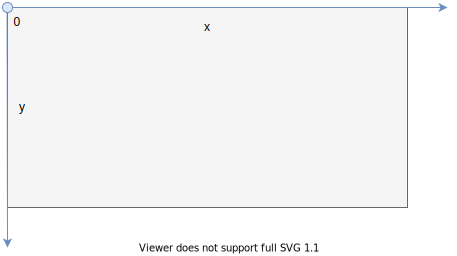

- offset: `<length>` or `<percentage>`
- offsets are x/y-coordinates
- percentage relative to width / height of positioning area
- keywords: pre-defined identifiers `top`, `right`, `bottom`, `left`, `center`
- keywords are edge / center x/y-coordinates, i.e. `top` ≙ `y = 0%`, `right` ≙ `x = 100%`, `bottom` ≙ `y = 100%`, `left` ≙ `x = 0%`, `center` ≙ `x = 50%` or `y = 50%`

### Canonical origin

- origin in canonical
- keywords are shorthand for offsets

| value | coordinate | possible coordinates |
| - | - | - | - |
| keyword | x or y, other defaults to `center` | 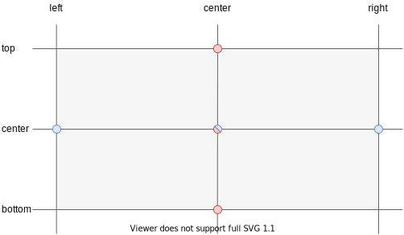 |
| offset | x, y defaults to `center` | 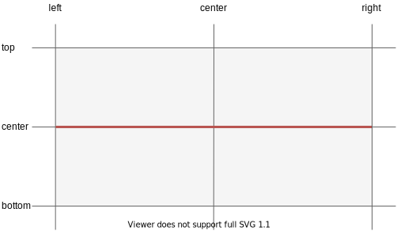 |
| keyword keyword | x y or y x | 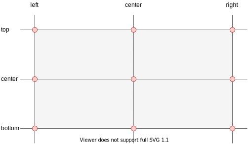 |
| keyword offset | x y | 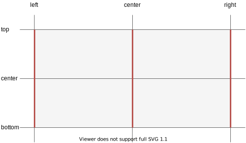 |
| offset keyword | x y | 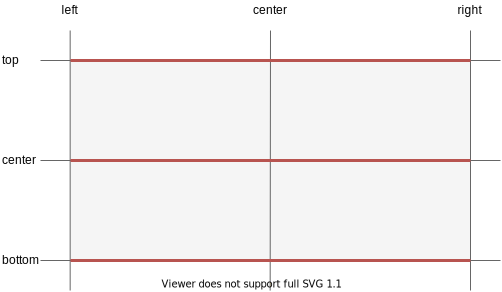 |
| offset offset | x y | 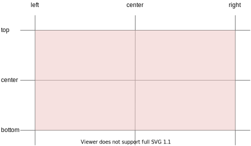 |

- beware: only for "keyword keyword" the order doesn't matter, can set "x y" or "y x", for other values is always "x y", e.g. `50% left` is invalid ❗️

### Non-canonical origin

- keywords set origin, beware: no `center` keyword ❗️
- beware: positive axis directions are inwards to positioning area, i.e. negative x-/y-axis direction for `right` / `bottom` origin ❗️

| value | coordinate | possible coordinates |
| - | - | - | - |
| keyword offset keyword offset | x y or y x | 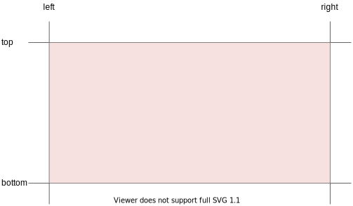 |

- beware: meaning of "x y" (and "y x") change depending on origin ❗️
- beware: order doesn't matter, can set "x y" or "y x", always two possibilities ❗️
- canonical origin is `left offset top offset` (or `top offset left offset`), others are non-canonical

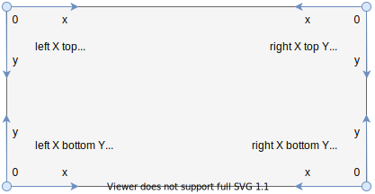

- beware: not really useful, just moves origin of coordinate system, nothing that can't specify with canonical origin ❗️
- beware: `4 * 2 = 8` equivalent values for same position, from four different origins, each in normal or reverse order ❗️

```css
 /* equivalent values with 4-value syntax */
position: 75% 75%;
        /* 4-value syntax, x y */
        : left 75% top 75%;
        : right 25% top 75%;
        : right 25% bottom 25%;
        : left 75% bottom 25%;
        /* 4-value syntax, y x */
        : top 75% left 75%;
        : top 75% right 25%;
        : bottom 25% right 25%;
        : bottom 25% left 75%;
```

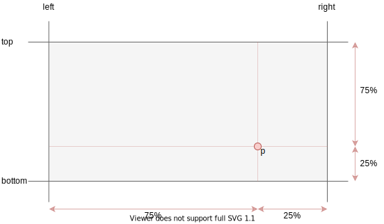

### Positioned area

- coordinate can be used to position a whole area
- positioned area is moved such that coordinate is at same position in positioned area as it's in positioning area, e.g. coordinate `(0%,0%)` positions top left of area in top left of coordinate system, `(100%, 100%)` positions bottom right of area in bottom right of coordinate system, `(50%, 50%)` positions center of area in center of coordinate system, etc.

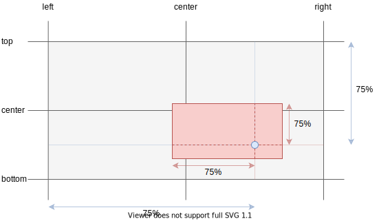

- beware: if positioned area has same size as positioning area, needs to use absolute offsets since percentages have no effect ❗️
- beware: if positioned area is bigger than positioning area, needs to use negative offsets for same effect ❗️


## Resources

- [W3C - CSS Values and Units Module Level 4](https://www.w3.org/TR/css-values-4/)