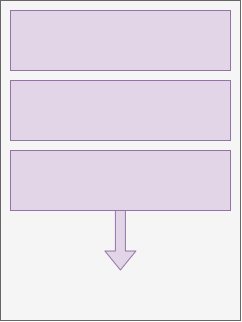
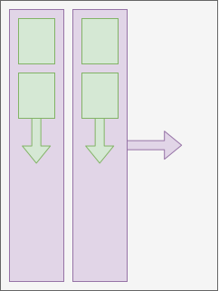
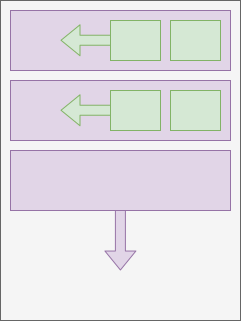
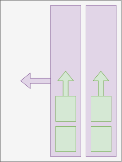
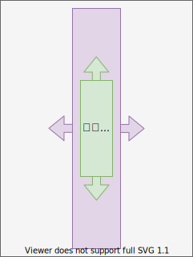
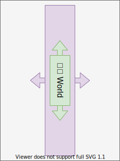
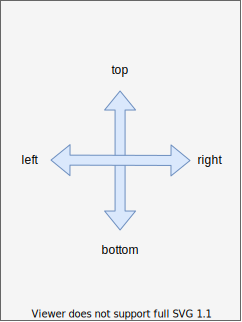
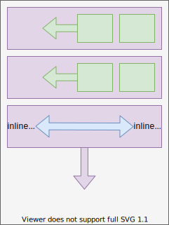
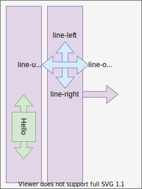
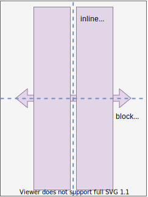

# Writing mode

[TOC]

## Introduction

- writing orientation: orientation of a line, e.g. horizontal or vertical
- line directionality: direction in which lines progress on a page, perpendicular to writing orientation, e.g. top-to-bottom or bottom-to-top, left-to-right or right-to-left
- text directionality: direction in which text progresses in a line, relative to writing orientation, i.e. (line-)left-to-(line-)right or (line-)right-to-(line-)left
- beware: line directionality and text directionality are often conflated, see [English StackExchange](https://english.stackexchange.com/questions/535835/precise-terms-for-directionality-in-a-writing-system) ⚠️

| writing orientation | line directionality | text directionality | example scripts |
| - | - | - | - |
| horizontal | top-to-bottom | left-to-right | Latin, Cyrillic, Indic |
| horizontal | top-to-bottom | right-to-left | Arabic, Hebrew |
| horizontal | bottom-to-top | left-to-right | N/A |
| horizontal | bottom-to-top | right-to-left | N/A |
| vertical | left-to-right | top-to-bottom | Mongolian |
| vertical | left-to-right | bottom-to-top | N/A |
| vertical | right-to-left | top-to-bottom | Chinese, Japanese, Korean |
| vertical | right-to-left | bottom-to-top | N/A |

- beware: note that for horizontal writing orientation scripts exist in both text directionalities while for vertical writing orientation only in top-to-bottom text directionality, for vertical orientation scripts exist in both line directionalities while for horizontal writing orientation only in top-to-bottom line directionality ❗️
- line orientation: orientation of text in a line, i.e. line-over, line-under, line-left, line-right
- text orientation: orientation of characters in text, e.g. upright, sideways, etc.
- writing mode: a particular line directionality, text directionality and text orientation
- beware: writing mode is often used as synonym for writing orientation, e.g. "horizontal writing mode", "vertical writing mode" ⚠️
- typographic mode: orientation used for typographic conventions, e.g. for baseline, beware: doesn't need to match writing orientation ❗️
- beware: unfortunate choice of properties, `writing-mode` sets limited combination of line directionality, line orientation and typographic mode, but not text directionality and text orientation, instead should have had separate properties for each with all possible values and `writing-mode` should have been shorthand for all ⚠️

## Block direction

- block axis with block-start and block-end directions
- direction of flow of boxes in Block Layout of Flow Layout, e.g. top-to-bottom by default
- also direction of flow of rows in Table Layout
- is line directionality, since line boxes are block-level boxes
- can set using `writing-mode` property
- is inherited, i.e. can set on root element if doesn't change
- defaults to `horizontal-tb`
- beware: doesn't default to `lang` attribute of element, see [#5373](https://github.com/w3c/csswg-drafts/issues/5373) ⚠️
- beware: semantic property of document, not presentation, set `writing-mode` based on `lang` attribute, e.g. `[lang="zh"] { writing-mode: vertical-rl; }` ⚠️
- beware: property name is confusing, should be `block-direction` ⚠️
- beware: property values are confusing, include redundant writing orientation, can be deduced from block direction ⚠️
- beware: also sets line orientation and typographic mode, should be separate properties ⚠️

| `writing-mode` | block direction | image | typographic mode |
| - | - | - | - | - |
| `horizontal-tb` | top-to-bottom |  | horizontal |
| `vertical-rl` | right-to-left |  | vertical |
| `vertical-lr` | left-to-right |  | vertical |
| `sideways-rl` | right-to-left | like `vertical-rl` | horizontal |
| `sideways-lr` | left-to-right | like `vertical-lr` | horizontal |

- beware: can't specify a `bottom-to-top` block direction ❗️
- beware: content of replaced element doesn't change orientation, e.g. image, iframe, etc. ❗️

## Inline direction

- inline axis with inline-start and inline-end directions
- direction of flow of boxes in Inline Layout of Flow Layout, e.g. line-left-to-line-right by default
- also direction of flow of columns in Table Layout
- is text directionality, since text are inline-level boxes
- relative to writing orientation, i.e. perpendicular to block direction (line directionality) ❗️
- can set using `direction` property
- is inherited, i.e. can set on root element if doesn't change
- defaults to `dir` attribute of element, otherwise `ltr`
- beware: semantic property of document, not presentation, don't set `direction` property, instead set `dir` attribute ⚠️
- beware: property name is confusing, should be `inline-direction` ⚠️
- use `<bdo>` element with different `dir` attribute for exceptions
- use `<bdi>` element for automatically determined direction, equivalent to `` with `dir="auto"` attribute, e.g. user input

| `direction` | block direction | image | block direction | image | block direction | image |
| - | - | - | - | - | - | - |
| `ltr` | top-to-bottom |  | right-to-left |  | left-to-right |  |
| `rtl` | top-to-bottom |  | right-to-left |  | left-to-right |  |

- beware: in left-to-right block direction `ltr` and `rtl` seem to be switched, because the line orientation stays the same as in right-to-left block direction, see line-relative logical directions ❗️
- `sideways-rl` behaves like `vertical-rl` for both `direction`s
- `sideways-lr` behaves like `vertical-lr` with `direction`s flipped, see line-relative logical directions for further differences

## Text orientation

- orientation of characters in text
- can set using `text-orientation`, possible values `mixed` (default), `upright`, `sideways`
- only takes effect for vertical typographic modes, i.e. `writing-mode: vertical-rl` or `writing-mode: vertical-lr`

| `text-orientation` | image |
| - | - |
| `mixed` |  |
| `upright` |  |
| `sideways` |  |

## Dimensions and directions

- logical dimensions and directions depend on writing mode, i.e. `writing-mode` and `direction`
- beware: "dimension" refers to spacial dimension, don't confuse with dimension of physical quantity, see NFP/Units#Dimension ❗️

### Physical directions

- relative to page, independent of writing mode
- "left", "right", "top", and "bottom"

### Logical directions

<!-- ToDo: differentiate clearer between block / inline direction and logical directions -->

#### Flow-relative

- relative to block direction
- block-start: side that comes earlier in block direction, "top of a page"
- block-end: side that comes later in block direction, "bottom of a page"

| `writing-mode` | block-start | block-end | image |
| - | - | - | - |
| `horizontal-tb` | top | bottom |  |
| `vertical-rl` | right | left |  |
| `vertical-lr` | left | right |  |
| `sideways-rl` | right | left | like `vertical-rl` |
| `sideways-lr` | left | right | like `vertical-lr` |

- inline-start: side that comes earlier in inline direction, "start of a line"
- inline-end: side that comes later in inline direction, "end of a line"
- beware: inline-* are always perpendicular to block-* ❗️

|  `writing-mode` | `direction` | inline-start | inline-end | image |
| - | - | - | - | - |
| `horizontal-tb` | `ltr` | left | right |  |
| `vertical-rl` | `ltr` | top | bottom |  |
| `vertical-lr` | `ltr` | top | bottom |  |
| `sideways-rl` | `ltr` | top | bottom | like `vertical-rl` |
| `sideways-lr` | `ltr` | bottom | top | like `vertical-lr` with `dir: rtl` |
| `horizontal-tb` | `rtl` | right | left |  |
| `vertical-rl` | `rtl` | bottom | top |  |
| `vertical-lr` | `rtl` | bottom | top |  |
| `sideways-rl` | `rtl` | bottom | top | like `vertical-rl` |
| `sideways-lr` | `rtl` | top | bottom | like `vertical-lr` with `dir: ltr` |

- `sideways-lr` behaves like `vertical-lr` with opposite `direction` ❗️
- beware: for `vertical-lr` the inline-start and inline-end are similar to `vertical-rl`, can use `sideways-lr` to flip it ⚠️

#### Line-relative

- relative to line orientation
- line-left: inline-start for left-to-right inline direction, (or inline-end for right-to-left inline direction)
- line-right: inline-end for left-to-right inline direction, (or inline-start for right-to-left inline direction)
- line-over: vector from line-left to line-right rotated by +90°, beware: not always `block-start` ❗️
- line-under: vector from line-left to line-right rotated by -90°, beware: not always `block-end` ❗️

| `writing-mode` | line-left | line-right | line-over | line-under | image |
| - | - | - | - | - | - |
| `horizontal-tb` | left | right | top | bottom |  |
| `vertical-rl` | top | bottom | right | left |  |
| `vertical-lr` | top | bottom | right | left |  |
| `sideways-rl` | top | bottom | right | left | like `vertical-rl` |
| `sideways-lr` | bottom | top | left | right |  |

- `sideways-lr` behaves like `vertical-lr` with line orientation flipped, beware: also `direction`s are opposite, not visible from last diagram ❗️
- beware: line orientation in `vertical-lr` is same as in `vertical-rl`, use `sideways-lr` to flip it ❗️

### Physical dimensions

- relative to page, independent of writing mode
- "horizontal" and "vertical"
- axes: "x-axis" and "y-axis"

### Logical dimensions

- relative to writing orientation
- block dimension: dimension parallel to block direction, perpendicular to inline direction
- inline dimension: dimension parallel to inline direction, perpendicular to block direction
- block / inline axis: axis in block / inline dimension

| writing orientation | block dimension | inline dimension | image |
| - | - | - | - | - | - | - | - |
| horizontal | vertical | horizontal |  |
| vertical | horizontal | vertical |  |

## Logical properties and values

- CSS specification uses logical directions and dimensions, i.e. CSS "works" similarly in other writing modes
- many legacy properties use physical directions or dimensions in name or value
- beware: in non-default writing modes legacy properties and values "behave" counter intuitive, e.g. in vertical writing orientation `margin-left` / `margin-right` collapse instead of `margin-top` / `margin-bottom` ❗️
- can't change meaning of physical properties and values, would add confusion, e.g. what does "top" mean?
- physical properties and values continue to correspond to physical directions / dimensions, i.e. `margin-left` is always left, or "top" is always top
- need new logical properties and values to replace physical counterparts
- beware: use logical properties and values instead of physical ones to support any writing mode ❗️
- beware: not all properties and values are replaced yet with logical equivalents, e.g. `rect()` notation of `clip` property, background properties, border-image properties, offsets in `box-shadow` and `text-shadow` properties, etc. ❗️

### Logical properties

- properties relative to writing mode
- replace physical properties, e.g. `width`, `margin-top`, etc.
- beware: don't use logical and physical properties together, could either take both effect for separate directions / dimensions or for same direction / dimension overwrite each other ⚠️
- beware: `inset` is physical shorthand for `top`, `bottom`, `left`, `right`, not a logical shorthand for `inset-*` ❗️

| logical property | physical property | notes |
| - | - | - |
| `block-size`, `inline-size` | `width`, `height` | beware: "size" is used for a length in a single spacial dimension, bad naming choice ⚠️ |
| `min-block-size`, `min-inline-size` | `min-width`, `min-height` | beware: "size" is used for a length in a single spacial dimension, bad naming choice ⚠️ |
| `max-inline-size`, `max-block-size` | `max-width`, `max-height` | beware: "size" is used for a length in a single spacial dimension, bad naming choice ⚠️ |
| `inset-block-start`, `inset-block-end`, `inset-inline-start`, `inset-inline-end` | `top`, `bottom`, `left`, `right` | |
| `inset-block`, `inset-inline` | shorthand for `inset-block-*`, `inset-inline-*` | like `inset` for single dimension |
| `margin-block-start`, `margin-block-end`, `margin-inline-start`, `margin-inline-end` | `margin-top`, `margin-bottom`, `margin-left`, `margin-right` | |
| `margin-block`, `margin-inline` | shorthand for `margin-block-*`, `margin-inline-*` | like `margin` for single dimension |
| `padding-block-start`, `padding-block-end`, `padding-inline-start`, `padding-inline-end` | `padding-top`, `padding-bottom`, `padding-left`, `padding-right` | |
| `padding-block`, `padding-inline` | shorthand for `padding-block-*`, `padding-inline-*` | like `padding` for single dimension |
| `border-block-start-width`, `border-block-end-width`, `border-inline-start-width`, `border-inline-end-width` | `border-top-width`, `border-bottom-width`, `border-left-width`, `border-right-width` | |
| `border-block-width`, `border-inline-width` | shorthand for `border-block-*-width`, `border-inline-*-width` | like `border-width` for single dimension |
| `border-block-start-style`, `border-block-end-style`, `border-inline-start-style`, `border-inline-end-style` | `border-top-style`, `border-bottom-style`, `border-left-style`, `border-right-style` | |
| `border-block-style`, `border-inline-style` | shorthand for `border-block-*-style`, `border-inline-*-style` | like `border-style` for single dimension |
| `border-block-start-color`, `border-block-end-color`, `border-inline-start-color`, `border-inline-end-color` | `border-top-color`, `border-bottom-color`, `border-left-color`, `border-right-color` | |
| `border-block-color`, `border-inline-color` | shorthand for `border-block-*-color`, `border-inline-*-color` | like `border-color` for single dimension |
| `border-block-start`, `border-block-end`, `border-inline-start`, `border-inline-end` | `border-top`, `border-bottom`, `border-left`, `border-right` | |
| `border-block`, `border-inline` | shorthand for `border-block-*`, `border-inline-*` | like `border` for separate dimensions |
| `border-start-start-radius`, `border-start-end-radius`, `border-end-start-radius`, `border-end-end-radius` | `border-top-left-radius`, `border-bottom-left-radius`, `border-top-right-radius`, `border-bottom-right-radius` | |

- beware: logical properties for `inset`, `margin`, `padding`, `border-width`, `border-style`, `border-color` are still under discussion, see [#1282](https://github.com/w3c/csswg-drafts/issues/1282) ❗️

### Logical values

- values relative to writing mode
- replace physical values, i.e. "top", "bottom", "left", "right"
- see Logical directions
- beware: can't combine logical and physical values, would leave values defined twice or undefined ❗️
- properties that take logical values: `text-align`, `text-indent`, `float`, `clear`, `resize`, `vertical-align`, `text-decoration`, `border-spacing`, `line-height`, `caption-side`

## Resources

- [W3C - CSS Writing Modes Level 4](https://www.w3.org/TR/css-writing-modes-4/)
- [W3C - CSS Logical Properties and Values Level 1](https://www.w3.org/TR/css-logical-1/)
- [Jen Simmons - CSS Writing Modes](https://24ways.org/2016/css-writing-modes/)