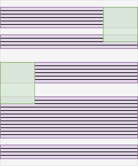
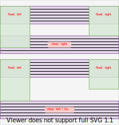

# Float Layout


## Introduction

- an irregular layout, can be used with regular Flow Layout
- beware: has no effect if parent FC is not flow FC ⚠️
- beware: only use if needs to *flow around* something, e.g. text around image, etc. ❗️
- beware: don't use for layout, instead use Flex or Grid Layout, e.g. inline navigation menu, etc. ❗️
- interacts with regularly laid out boxes across formatting contexts, e.g. following siblings of ancestors or descendants of following siblings

```html
<div>
  <div class="float"></div>
</div>
<p>Hello World</p>
```

```html
<div class="float"></div>
<div>
  <p>Hello World</p>
</div>
```

- beware: ignored with Absolute / Fixed positioning, Flexbox Layout, Grid Layout, etc. ❗️
- non-positioned floats are stacked in front of non-positioned block-level elements but behind non-positioned inline-level elements, see Stacking


## `float`

- shifts box(es) of element to single side of parent
- beware: `float` goes on element that is floated around, not on elements that float around it ❗️
- size is `max-content` by default, see Size#auto
- following boxes don't see float, like absolutely / fixedly positioned element
- line boxes see float, are shortened, makes content flow around the float
- beware: float overlaps everything except content in line box, e.g. background, border, etc. ❗️



```html
<div class="float">Lorem ipsum dolor sit amet, consectetur adipiscing elit.</div>

<p>Lorem ipsum dolor sit amet, consectetur adipiscing elit. Nulla luctus aliquam dolor, eu lacinia lorem placerat vulputate. Duis felis orci, pulvinar id metus ut, rutrum luctus orci. Cras porttitor imperdiet nunc, at ultricies tellus laoreet sit amet. Sed auctor cursus massa at porta. Integer ligula ipsum, tristique sit amet orci vel, viverra egestas ligula. Curabitur vehicula tellus neque, ac ornare ex malesuada et. In vitae convallis lacus. Aliquam erat volutpat. Suspendisse ac imperdiet turpis. Aenean finibus sollicitudin eros pharetra congue. Duis ornare egestas augue ut luctus. Proin blandit quam nec lacus varius commodo et a urna. Ut id ornare felis, eget fermentum sapien.</p>
```

```css
.float {
  float: left;
  width: 100px;
  border: 3px dashed dodgerblue;
} 

p {
  background-color: #CCC;
  border: 2px solid black;
}
```

- beware: float doesn't move up on preceding boxes, only following elements move up ❗️
- multiple float elements after each other pile up, or wrap onto next block if not enough inline space
- beware: float may seem to have larger bottom margin than specified if height isn't exact multiple of line box height ❗️
- not inherited
- applies only to not absolutely / fixedly positioned elements
- values: `none`, `left` / `right` (physical), `inline-start` / `inline-end` (logical, see Writing Mode)
- initial value: `none`
- beware: float is aligned at top edge with following box, can't align at bottom edge ❗️
- beware: blockifies box ❗️


## `clear`

- prevents box(es) of element to float around a float
- beware: `clear` goes on element that floats around float, not on float itself ❗️
- beware: clears only preceeding floats not following floats, since floats dont't affect preceding boxes ❗️


```html
<div class="float">Lorem ipsum dolor sit amet, consectetur adipiscing elit.</div>

<p>Lorem ipsum dolor sit amet, consectetur adipiscing elit.</p>

<p class="clear">Nulla luctus aliquam dolor, eu lacinia lorem placerat vulputate. Duis felis orci, pulvinar id metus ut, rutrum luctus orci. Cras porttitor imperdiet nunc, at ultricies tellus laoreet sit amet. Sed auctor cursus massa at porta. Integer ligula ipsum, tristique sit amet orci vel, viverra egestas ligula. Curabitur vehicula tellus neque, ac ornare ex malesuada et. In vitae convallis lacus. Aliquam erat volutpat. Suspendisse ac imperdiet turpis. Aenean finibus sollicitudin eros pharetra congue. Duis ornare egestas augue ut luctus. Proin blandit quam nec lacus varius commodo et a urna. Ut id ornare felis, eget fermentum sapien.</p>
```

```css
.float {
  float: left;
  width: 100px;
  border: 3px dashed dodgerblue;
} 

p {
  background-color: #CCC;
  border: 2px solid black;
}

.clear {
  clear: both;
}
```

- beware: only needed on single element, since following ones adjust to it due to being regularly laid out ❗️
- not inherited
- applies only to block-level elements
- values: `none` (default), `both`, `left` / `right` (physical), `inline-start` / `inline-end` (logical, see Writing Mode)
- beware: clearing single side useful only if floats on both side with opposite side larger than cleared side ❗️




## Containing floats

- historic bug of flow FC, fixed with flow-root FC
- a box doesn't see floats it contains, like absolutely / fixedly positioned element
- doesn't grow to contain floats, size is determined by regularly laid out children, zero if only float children, makes float bleed out of block-end of parent if too tall

```html
<div class="wrapper">
  <div class="float">Lorem ipsum dolor sit amet, consectetur adipiscing elit.</div>
  <p>Lorem ipsum dolor sit amet, consectetur adipiscing elit. Nulla luctus aliquam dolor, eu lacinia lorem placerat vulputate.</p>
</div>

<p>Lorem ipsum dolor sit amet, consectetur adipiscing elit. Nulla luctus aliquam dolor, eu lacinia lorem placerat vulputate. Duis felis orci, pulvinar id metus ut, rutrum luctus orci. Cras porttitor imperdiet nunc, at ultricies tellus laoreet sit amet. Sed auctor cursus massa at porta. Integer ligula ipsum, tristique sit amet orci vel, viverra egestas ligula. Curabitur vehicula tellus neque, ac ornare ex malesuada et. In vitae convallis lacus. Aliquam erat volutpat. Suspendisse ac imperdiet turpis. Aenean finibus sollicitudin eros pharetra congue. Duis ornare egestas augue ut luctus. Proin blandit quam nec lacus varius commodo et a urna. Ut id ornare felis, eget fermentum sapien.</p>
```

```css
/* note: view on screen width bigger than 320px, otherwise float is not high enough */

.float {
  float: left;
  width: 100px;
  border: 3px dashed dodgerblue;
} 

p {
  background-color: #CCC;
  border: 2px solid black;
}

.wrapper {
  /* display: flow-root; */
}
```

- beware: don't use legacy hacks anymore, instead use flow-root FC in wrapper box, see [SO](https://stackoverflow.com/a/32301823/2607891) ❗️
- legacy hack 1: add empty regularly laid out block-level box to clear float, but pollutes markup
- legacy hack 1.5 ("clearfix"): use `::after` pseudo-element of wrapper box for legacy hack 1, needs to give empty content to make visible, needs to make block-level since default is inline-level

```css
.wrapper::after {
  content: "";
  clear: both;
  display: block;
}
```

- legacy hack 2: make wrapper `overflow` other than `visible`, but has side effects of activating scrolling and possibly clipped shadows, also needs explaining comment
- legacy hack 3: make wrapper have a border, but has side effects of activating a border, also needs explaining comment
- legacy hack 4: make wrapper itself a float or absolutely  / fixedly positioned, needs to set custom size since default is `max-content`, but has side effects of activating the specific layout, also needs explaining comment


## Resources

- MDN