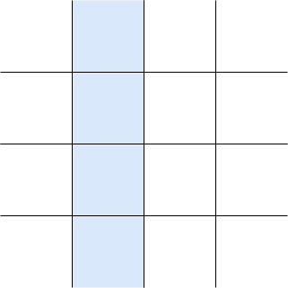
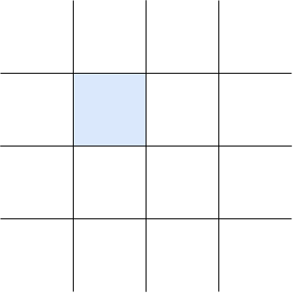
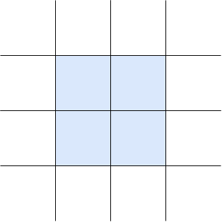

<!-- todo: remove unnecessary "grid" fillerword, e.g. explicit ~grid~ track -->
<!-- todo: add example code for almost everything -->
<!-- ToDo: update to Level 2 with subgrid -->

- a regular layout, for applications
- two-dimensional layout since uses grid, for one-dimensional layout see Flex Layout
- replaces Table Layout 🎉


## Terminology

- grid line: horizontal or vertical line


- grid: set of intersecting grid lines


- grid track: space between two adjacent grid lines, defines columns and rows



- grid cell: intersection of a row and a column



- grid area: rectangular set of adjacent grid cells



- beware: grid area is not a distinct feature of the grid, just a term for certain sets of grid cells ❗️


## Tracks

- rows / columns are relative to logical inline / block directions, see Writing Mode
- beware: can't specify directions independent of writing mode like in Flex Layout, not needed since can specify exact placement of items, see Placement ❗️
- explicit or implicit
- beware: size of grid can be larger than sum of all track sizes, since can have gaps due to gutter or content distribution, see Gutters and Alignment/Content distribution ❗️

### Track size

- breath of a track
- can be content-based or context-based
- can be fixed or if context-based also flexible

#### `<length-percentage>`

- non-negative
- percentage relative to corresponding dimension of the content area of the grid container
- context-based, fixed

#### `min-content`

- largest min-content contribution of a grid item in the track
- content-based, (fixed)

#### `max-content`

- largest max-content contribution of a grid item in the track
- content-based, (fixed)

#### `minmax(minimum, maximum)`

- flexible value that grows within the range
- `auto` minimum is largest minimum size of a grid item in the track ??? i.e. often but not always `min-content` ???
<!-- todo: see 6.6, minimum size is minimum size property, can be made smaller / bigger than min-content !! -->
- `auto` maximum is `max-content`, but track size can be bigger due to `*-content` alignment properties, see Alignment ❗️
- beware: can set `<flex>` factor only as maximum and not as minimum ❗️
- content-based (fixed) or context-based (fixed or flexible)

#### `auto`

- computes to `minmax(auto, auto)`, i.e. usually but not always `minmax(min-content, max-content)`
- content-based, (fixed)
- beware: auto track size can grow (but not shrink) due to content distribution, see Alignment/Content distribution ❗️

#### fit-content(limit)

- the limit, but bound below by auto minimum (see `minmax(auto, )`) and above by `max-content`
- limit is `<length-percentage>`
- computed as `min(minmax(auto, max-content), minmax(auto, limit))`
- context-based, fixed

#### `<flex>`

- non-negative
- beware: outside of `minmax()` has a lower bound of `auto`, i.e. like `minmax(auto, <flex>)`
- beware: positive free space is only distributed after all non-flexible track sizing functions have reached their maximum, e.g. `minmax()`, etc.
- content-based, flexible

### Track list

- space-separated list of track sizes
- beware: leave out line names here for clarity, see Named grid lines

```css
/* breadth values */
<flexible-breadth>       = <length-percentage> | <flex> | min-content | max-content | auto
<inflexible-breadth>     = <length-percentage> | min-content | max-content | auto
<fixed-breadth>          = <length-percentage>

/* track sizes */
<flexible-size>          = <flexible-breadth> | minmax( <inflexible-breadth> , <flexible-breadth> ) | fit-content( <length-percentage> )
<fixed-size>             = <fixed-breadth> | minmax( <fixed-breadth> , <flexible-breadth> ) | minmax( <inflexible-breadth> , <fixed-breadth> )

/* repeat functions */
<flexible-repeat>        = repeat( <integer [1,∞]> , <flexible-size>+ )
<auto-repeat>            = repeat( auto-fill | auto-fit , <fixed-size>+ )
<fixed-repeat>           = repeat( <integer [1,∞]> , <fixed-size>+ )

/* track lists */
<flexible-list>          = [ <flexible-size> | <flexible-repeat> ]+
<auto-flexible-list>     = [ <fixed-size> | <fixed-repeat> ]* <auto-repeat> [ <fixed-size> | <fixed-repeat> ]*
```

#### `repeat()`

- track list fragment from repeating a track list fragment, i.e. creates a pattern
- auto repetition to create as many tracks as fit in content box of container
- `auto-fit` is like `auto-fill`, except after Placement any empty tracks created by the repetition are removed
- beware: can't nest `repeat()` functions ❗️
- beware: auto repetition requires fixed track sizes, can't be used with flexible track sizes ❗️
- beware: a track list can only contain a single auto repetition ❗️
- beware: creates at least the non-repeated track list fragment, even if tracks already overflow ❗️
- can combine auto repetition with `minmax( <length-percentage>, <flex> )` to let tracks grow to fill any remaining space

<!-- Demo: gridrepeat -->

### Explicit tracks

- always created
- as many as have size and/or name specified
- beware: final grid may have more tracks, see Implicit tracks ❗️

#### `grid-template-columns`, `grid-template-rows`

- specify track size of explicit grid tracks in column, row
- not inherited
- applies only to grid containers
- values: `none`, `<track-list>`, `<auto-track-list>`, see Track Size
- initial value: `none`
- beware: with `none` explicit tracks can still be created by `grid-template-area` ❗️

#### `grid-template`

- shorthand for `grid-template-columns` and `grid-template-rows`, i.e. specifies all explicit track sizes
- first `grid-template-rows`, then `grid-template-columns` separated by a `/`
- beware: resets omitted explicit tracks properties to their initial value ❗️

### Implicit tracks

- created if grid items are placed outside of explicit tracks, see Placement
- as many as needed
- beware: can't guarantee size of final grid, depends on number of implicit tracks generated ❗️

#### `grid-auto-columns`, `grid-auto-rows`

- specify track size of implicit grid tracks in column, row
- beware: also sizes additional explicit grid tracks from `grid-template-areas` that aren't sized by `grid-template-columns` / `grid-template-rows` ❗️
- not inherited
- applies only to grid containers
- values: `<flexible-size>`+, see Track Size
- beware: can't use `repeat()` function ❗️
- initial value: `auto`, see Track Size/`auto`
- track list is repeated if not long enough
- beware: can't guarantee custom track size for every implicit track since can become arbitrarily many ❗️

### `grid`

- shorthand for all explicit and implicit grid track properties (`grid-template-rows`, `grid-template-columns`, `grid-template-areas` and `grid-auto-rows`, `grid-auto-columns`, `grid-auto-flow`)
- beware: includes `grid-auto-flow` although it's a placement property ❗️
- like `grid-template`, except can specify `[ auto-flow && dense? ] <grid-auto-*>?` for one of the `grid-template-*`
- beware: for each direction can specify either size of explicit or implicit tracks, i.e. can't specify for both explicit and implicit tracks ❗️
- beware: don't use, instead use longhands, less confusing and can specify size for both explicit and implicit tracks ❗️
- beware: resets omitted properties to their initial value ❗️

### Named grid lines

- can assign one or more names to a grid line of a explicit grid track
- used in placement, see Placement
- allows to place items independent of actual grid line since independent of numerical index, can redefine named grid line in media query without needing to change placement
- add `[<custom-ident>*]` in explicit grid properties, keywords `span` or `auto` are not allowed

```css
myel {
  /* the three lines each have two names (english, spanish) */
  grid-template-columns: [one uno] 150px [two dos] 1fr [three tres];
}
```

- beware: in `repeat()` function line names at start and end of the pattern create two names for middle lines, e.g. `repeat(2, [a] 1fr [b])` computes to `[a] 1fr [b a] 1fr [b]` ❗️

### Named grid areas

- can assign one or more names to a grid area of explicit grid tracks
- used in placement, see Placement
- actually just named grid lines that make up grid area with names `<custom-ident>-start` and `<custom-ident>-end` for named grid area `<custom-ident>`, see Named grid lines
- beware: could as well manually name grid lines like that, would work just like named grid area ⚠️
- beware: there are no named grid areas, just implicitly named grid lines, named grid area is just shorthand for multiple named grid lines ⚠️
- allows to place items independent of actual grid area since independent of numerical indices, can redefine named grid area in media query without needing to change placement

#### `grid-template-areas`

- specifies names for grid areas of explicit grid tracks
- not inherited
- applies only to grid containers
- values: `none`, `"<custom-ident-list>"`+ where `<custom-ident-list>` is list of one or more `<custom-ident>` (like in Named grid lines) seperated by any sequence of whitespace
- beware: actually `"<custom-ident-list>"` above is `<string>`, but would need to escape any other characters in placement properties, don't use ⚠️
- initial value: `none`
- each string represents a row, each word in string represents a cell in that row
- beware: number of words in string must be identical, otherwise wouldn't be valid grid ❗️
- each unique word specifies the name for the grid area represented by its occurrences
- beware: identical words must create rectangular shape, otherwise wouldn't be valid grid area ❗️

```css
/* holy grail layout */
myel {
  grid-template-areas: "header header header"
                       "nav    main   aside"
                       "footer footer footer";
}
```

- dot characters are not a name, i.e. can use for throwaway name

```css
myel {
  grid-template-areas: "header ..     ."
                       "main   main   main"
                       "footer .      ...";
}
```

- beware: can specify only names for non-overlapping grid areas ❗️
- beware: can specify only one name for a grid area unlike multiple names for a grid line, see Named grid line ❗️
- beware: if specifies names for more explicit tracks than sized by `grid-template-columns` / `grid-template-rows`, creates new explicit tracks that are sized by `grid-auto-columns`, `grid-auto-rows` ❗️
- beware: total number of explicit tracks is larger length of value list of `grid-template-columns`, `grid-template-rows` and `grid-template-areas` ❗️

### Shorthands

- can name grid areas also in shorthand
- in `grid-template` shorthand add names for each row before the corresponding row track size
- if no track size after names, then `auto` is assumed
- beware: column track lists may not contain `repeat()` function, intended to line up in ASCII art with columns ❗️

```css
myel {
  grid-template-columns: 100px 200px 300px;
  grid-template-rows: auto 400px;
  grid-template-areas: "header header header"
                        "nav   main   aside";
  /* shorthand for the above */
  grid-template: "header header header"
                 "nav    main   aside" 400px
                 / 100px 200px 300px;
}
```

- can add names for row grid lines before string and after track size
- beware: can only name row grid lines, not column grid lines, need to use longhand `grid-template-columns` instead ❗️

```css
myel {
  grid-template-columns: 100px 200px 300px;
  grid-template-rows: [one] auto [two dos] 400px [tres];
  grid-template-areas: "header header header"
                        "nav   main   aside";
  /* shorthand for the above */
  grid-template: [one] "header header header" auto [two]
                 [dos] "nav    main   aside" 400px [tres]
                 / 100px 200px 300px;
}
```

in `grid` shorthand identical to `grid-template` shorthand, except it resets also implicit grid track properties


## Placement

- grid item is placed in a grid area
- specifies grid area manually, or automatically, or as mix of both
- beware: doesn't "create" grid area because grid area doesn't "exist", just term for the set of grid cells that are used, see Terminology ❗️
- beware: affects only visual rendering, keyboard navigation and screen reader still use document tree order ❗️
- beware: item can be placed in implicit grid instead of explicit grid, e.g. if numeric index is too large in manual placement, if too many items to auto-place in auto-placement ❗️
- beware: grid item in grid area is aligned by alignment properties, see Alignment ❗️

### Manual placement

- specifies bounding grid lines of grid area, i.e. start and end grid line in each direction
- can partially place items, missing informations is figured out by auto placement, see Auto placement
- grid line is referenced by integer numeric index from edges of explicit grid
- positive numeric indexes count from start side of explicit grid, negative numeric indexes count from end side of explicit grid
- explicit grid contains at least one grid line in each axis, i.e. numeric indexes `1` and `-1` are always in explicit grid
- beware: zero is invalid numeric index ❗️
- beware: numeric index is relative to direction of writing mode since start / end side are relative to direction of writing mode ❗️
- alternatively can specify grid line relative to opposite grid line, i.e. amount of tracks the grid item "spans"
- can use `1` for start grid line and `-1` for end grid line to make grid area span all tracks
- span is positive integer, negative or zero are invalid
- beware: ignores named grid lines / areas here for simplicity ❗️
- beware: grid items can overlap if placed in intersecting grid areas or due to negative margins ❗️
- beware: order of stacking is same as Visual order, not order of document tree, see Stacking ❗️

#### grid-row-start, grid-row-end, grid-column-start, grid-column-end

- specify the inline-start, inline-end, block-start, block-end edges of the grid area
- `<grid-line> = auto | <integer> | [ span && <integer> ]`, integer is non-zero, for span integer is strictly positive
- `auto` uses auto placement, see Auto placement
- values: `<grid-line>`
- initial value: `auto`
- applies only to grid items
- not inherited
- if start line is further end-ward than the end line then swaps the two lines, e.g. `grid-row-start: 4; grid-row-end: 2;`
- if start line is equal to the end line then end line computes to `auto`, e.g. `grid-row-start: 2; grid-row-end: 2;`
- if both lines are spans then end line computes to `auto`, e.g. `grid-row-start: span 2; grid-row-end: span 4;`

#### `grid-row`, `grid-column`

- shorthand for `grid-row-*`, `grid-column-*`
- first `grid-*-start`, then optional `grid-*-end` separated by a `/`
- beware: resets omitted properties to their initial value ❗️

#### `grid-area`

- shorthand for `grid-row` and `grid-column`
- first `grid-row-start`, then optional `grid-column-start` separated by a `/`, then optional `grid-row-end` separated by a `/`, then optional `grid-column-end` separated by a `/`
- beware: in default writing mode order of values is anti-clockwise, opposite of other shorthand properties, e.g. `padding`, `margin`, etc. ❗️
- beware: resets omitted properties to their initial value ❗️

#### Named grid lines

- grid line can be referenced by name instead of numeric index, see Tracks/Named grid lines
- allows to place items independent of actual grid line since independent of numerical index, can redefine named grid line in media query without needing to change placement
- if multiple lines with same name can use numerical index before or after name to cycle through, by default as if provided numerical index `1`

```css
myel {
  /* span between the 5th and 7th lines named "abc" */
  grid-row: abc 5 / abc 7;
}

myel {
  /* start at the 5th line, then span across to next "abc" line */
  grid-row: 5 / span abc 1;
}

myel {
  /* start at the 5th line named "abc", then span across two "abc" lines (i.e. to the 7th line named "abc") */
  grid-row: abc 5 / span abc 2;
}
```

- if one side is `auto` and the opposite side is a span to a named grid line, then the span computes to `span 1`, e.g. `grid-row-start: auto; grid-row-end: span abc 1;`
- beware: if no / not enough grid lines with that name exists, all implicit grid lines are assumed to have that name ❗️

```css
/* two grid lines in explicit grid without name */
.container {
  grid-template-columns: 100px;
}

/* no lines named "abc" exist in explicit grid, therefore first line in implicit grid */
.item {
  grid-column: span abc / 4;
}
```

- if there are two named grid line with the same name, then the one with lower numeric index is used

```html
<div class="container">
  <div class="item">1</div>
</div>
```

```css
.container {
  display: grid;
  gap: 1rem;
  border: 1px solid red;
  /* creates named grid lines [a] [a] [] */
  grid-template-columns: [a] auto [a] auto;
}

.item {
  background-color: lightblue;
  padding: 1rem;
  text-align: center;
  font-weight: bold;
  border: 1px solid black;
  grid-column-start: a;
  /* default value */
  /* grid-column-end: span 1; */
}
```

#### Named grid areas

- grid areas can be referenced by name instead of bounding grid lines, see Tracks/Named grid areas
- actually just shorthand for the relevant named grid lines of the named grid area
- allows to place items independent of actual grid area since independent of numerical indices, can redefine named grid area in media query without needing to change placement
- longhands `grid-row-*`, `grid-column-*` search first for their respective `<custom-ident>-start`/`end` before the `<custom-ident>` that was specified
- beware: if there is a named grid area and a named grid line with the same name, then the named grid area’s line is prefered ⚠️

```html
<div class="container">
  <div class="item">1</div>
</div>
```

```css
/* toggle grid-template-areas to see effect */
.container {
  display: grid;
  gap: 1rem;
  border: 1px solid red;
  /* creates named grid lines [a-start] [a-end] [] */
  grid-template-areas: "a .";
  /* creates named grid lines [] [a] [] */
  grid-template-columns: auto [a] auto;
}

.item {
  background-color: lightblue;
  padding: 1rem;
  text-align: center;
  font-weight: bold;
  border: 1px solid black;
  /* beware: uses "a-start" line of named grid area instead of actual "a" line */
  grid-column-start: a;
  /* default value */
  /* grid-column-end: span 1; */
}
```

- beware: if there is a explicitly named grid line with the same name as a implicitly generated grid line of a named grid area, then has two grid lines with the same name, i.e. the one with lower numeric index is used ❗️

```html
<div class="container">
  <div class="item">1</div>
</div>
```

```css
/* toggle grid-template-areas (if grid area wins) or grid-template-columns (if grid area loes) to see effect */
.container {
  display: grid;
  gap: 1rem;
  border: 1px solid red;
  /* -- grid area wins -- */
  /* creates named grid lines [a-start] [a-end b-start] [b-end] */
  grid-template-areas: "a b";
  /* creates named grid lines [b-start] [b-end a-start] [a-end] */
  grid-template-columns: [b-start] auto [b-end a-start] auto [a-end];
  /* -- grid area loses -- */
  /* creates named grid lines [b-start] [b-end a-start] [a-end] */
  /* grid-template-areas: "b a"; */
  /* creates named grid lines [a-start] [a-end b-start] [b-end] */
  /* grid-template-columns: [a-start] auto [a-end b-start] auto [b-end]; */
}

.item {
  background-color: lightblue;
  padding: 1rem;
  text-align: center;
  font-weight: bold;
  border: 1px solid black;
  /* beware: uses "a-start" line with lower numeric index, either line of named grid area or actual "a-start" line */
  /* (could have used "a" as well, as it would have searched for "a-start" first anyway) */
  grid-column-start: a-start;
  /* default value */
  /* grid-column-end: span 1; */
}
```

- in shorthands `grid-row`, `grid-column`, `grid-area`, if start side is a name and end side is omitted, the end side is also set to that name
- beware: in shorthands if uses named grid line instead of named grid area, then end line is ignored since start line is equal to the end line, e.g. `grid-row: abc` for named grid line `abc` ❗️

### Auto placement

- determines bounding grid lines of grid area automatically if not (fully) specified in manual placement
- if no side has a definite position, then first `auto` side gets a definite position such that item is placed into first unoccupied grid area, e.g. `grid-*-start` and `grid-*-end` are `auto` or span
- if one side has a definite position and the opposite side is `auto`, then `auto` computes to `span 1`, e.g. `grid-*-*: N` for non-zero integer `N` and opposite side `grid-*-*: auto`
- beware: by default item is placed into first unoccupied grid area and spans one cell ❗️
- beware: never overlaps other grid items because only uses unoccupied grid areas and after manual placement ❗️
- beware: uses implicit tracks if explicit tracks are all occupied, creates more implicit grid tracks if needed ❗️

#### `grid-auto-flow`

- specifies direction in which boxes are laid out in auto placement
- also specifies packing
- beware: should have been two separate properties, conflates direction with packing ❗️
- not inherited
- applies only to grid containers
- values: `[ row | column ] || dense`
- initial value: `row`
- `row` fills grid from row-start in explicit grid towards row-end direction, wraps around rows from column-start in explicit grid towards column-end direction, creates more implicit rows if necessary
- `column` fills grid from column-start in explicit grid towards column-end direction, wraps around columns from row-start in explicit grid towards row-end direction, creates more implicit columns if necessary
- beware: implicit tracks are only ever created on end edge since starts at start edge of explicit grid ❗️
- beware: implicit tracks are only ever created for same direction, e.g. for `row` only implicit rows can be created ❗️
- beware: if grid has no tracks, by default items are laid out in block direction since only rows are created with a single full-width column, differs from Flex Layout which lays out in inline direction by default ❗️
- beware: doesn't affect stacking order since doesn't change order of boxes but only the direction (ignoring dense packing), see Visual order ❗️

##### Packing

- auto placement skips unoccupied grid areas between manually placed items that are too small to place a large item, leaves "holes" in the grid
- could return to those holes and fill with later smaller items
- sparse packing searches for unoccupied grid area from previous auto placed item onwards, i.e. leaves holes, keeps Visual order of auto-placed items
- dense packing searches for unoccupied grid area always from start edge of explicit grid, i.e. backfills holes, ignores Visual order of auto-placed items
- beware: if packing is `dense`, the order of items may not be in Visual order ❗️
- by default, packing is sparse
- if specifies `dense`, packing is dense
- beware: sparse packing only keeps order of auto placed items with respect to each other, not with respect to manually placed items ❗️
- beware: an item whose position is specified only in one direction could leave a hole which it wouldn't have if it had been fully manually placed, because in sparse auto placement a latter auto placed item can't backfill a hole created by a previous auto placed item, while if it were manually placed it's not part of the order of auto placed items ❗️

```html
<div class="container">
  <div class="item">1</div>
  <div class="item large">2</div>
  <div class="item">3</div>
</div>
```

```css
.container {
  display: grid;
  gap: 1rem;
  border: 1px solid red;
  /* TOGGLE ME (while .large is auto placed in its row) */
  /* grid-auto-flow: dense; */
}

.item {
  background-color: lightblue;
  padding: 1rem;
  text-align: center;
  font-weight: bold;
  border: 1px solid black;
}

.large {
  grid-column: span 2;
  /* TOGGLE ME (while container uses sparse packing) */
  /* grid-row: 2; */
}
```

#### Visual order

- specifies order in which boxes are laid out in auto placement
- beware: only affects order of auto placed items with respect to each other, not with respect to manually placed items ❗️
- `order`
- not inherited
- applies only to grid items
- values: `<integer>`
- initial value: `0`
- element with lower number comes first in row/column-start direction (depending on `grid-auto-flow`)
- elements with same number are laid out by order in document tree, earlier one is towards row/column-start direction (depending on `grid-auto-flow`)
- beware: can use negative numbers to always show first since default is zero ❗️
- beware: elements with positive order number come after non-ordered elements since default is zero ❗️
- beware: order of stacking is same as Visual order, not order of document tree, see Stacking ❗️
- beware: in manual placement `order` has identical effect to `z-index`, because there is no auto placement ❗️


## Size

<!-- todo: finish, COPY FROM Flex Layout -->
size of item can be relative to size of grid area
different than Flow Layout where specifies size on item

beware: use auto sizing of items to adapt to track size, different to Flex Layout where size on item determined layout

### `auto` size

depends on self-alignment values

if self-alignment is `normal`, then fills grid area, or keeps intrinsic size if replaced elements
if self-alignment is `stretch`, then fills grid area, even if it's replaced element
if self-alignment is anything else, then `fit-content`, or keeps intrinsic size if replaced elements


## Alignment

<!-- todo: baseline, see css-alignment 4.2, 5.4, 9, css-align -->
<!-- todo: overflow, see css-alignment 5.3, css-overflow -->

- positioning of boxes within free space
- beware: works with both positive / negative free space, i.e. can align overflow ❗️
- beware: alignment properties have no effect if there is no free space ❗️
- use terms "justify" / "align" for alignment along inline / block axis
- final step after determining size of tracks, boxes, margins, gutters, etc.

### Content distribution

- alignment of content within content box of grid container
- beware: flexible track sizing may have "eaten up" free space in grid container, except if grown / shrunk size hit limit of maximum / minimum size, or if distributes less than 100% of free space due to sum of `<flex>` factors being smaller than one ❗️
- beware: no free space if size of grid container is itself content-based, e.g. default block size in Flow Layout ❗️

#### `align-content`

- specifies alignment of grid rows in grid container along block axis
- not inherited
- applies to grid containers
- values: `normal`, `stretch`, `space-between`, `space-around`, `space-evenly`, `center`, `start`, `end`
- initial value: `normal`

##### `normal`

- behaves as `stretch`

##### `stretch`

- auto-sized grid rows grow to fill the container in the block dimension
- size is grown equally, not proportionally
- beware: can not cause tracks to shrink to fit container, because track size is bound below by content ❗️

```html
<div class="container">
  <div class="item">Lorem</div>
</div>
```

```css
.container {
  display: grid;
  border: 1px solid red;
  height: 1rem;
  /* row overflows grid container */
  grid-template-rows: auto;
  /* just to not stretch column */
  justify-content: start;
}

.item {
  background-color: cornflowerblue;
  border: 1px solid blue;
  font-size: 2rem;
}
```

##### `start` / `end`

- grid rows are packed to the grid container’s start / end side in the block dimension

#### `justify-content`

- like `align-content`, except grid columns along inline axis, see `align-content`

#### `place-content`

- shorthand for `align-content` and `justify-content`
- first `align-content`, then optional `justify-content`
- if `justify-content` is omitted is set to `align-content`

### Self-alignment

- alignment of margin box of grid item within its grid area
- beware: `auto` margins "eat up" any positive free space in grid area, but not negative ❗️
- beware: no free space if size of grid tracks is itself content-based ❗️

#### `align-self`

- specifies alignment of grid item in grid area along block axis
- not inherited
- applies to grid items
- values: `auto`, `normal`, `stretch`, `center`, `start`, `end`, `self-start`, `self-end`
- initial value: `auto`

##### `auto`

- computes to value of `align-items` of parent

##### `normal`

- behaves as `stretch` for non-replaced grid items
- behaves as `start` for replaced grid items

##### `stretch`

- grid item with `auto` block size grows to fill the grid area in the block dimension
- constrained by its minimum / maximum block size
- beware: can cause item to shrink to fit container as well ❗️

```html
<div class="container">
  <div class="item">Lorem ipsum</div>
</div>
```

```css
.container {
  display: grid;
  border: 1px solid red;
  height: 1rem;
  grid-template-rows: 100%;
  grid-template-columns: 100%;
}

.item {
  background-color: cornflowerblue;
  border: 1px solid blue;
  font-size: 2rem;
  /* TOGGLE ME, by default is stretch */
  /* align-self: start; */
}
```

##### `start` / `end`

- grid item is shifted to the grid container’s start / end side in the block dimension

##### `self-start` / `-end`

- grid item is shifted to its own start / end side in the block dimension
- beware: for grid item with opposite writing orientation and text directionality than parent differs from `start` / `end`, e.g. for parent with `writing-mode: horizontal-tb` and `direction: ltr` either `writing-mode: vertical-*` and `direction: rtl` or `writing-mode: sideways-lr`/`rl` and `direction: ltr`/`rtl` ❗️

#### `justify-self`

- like `align-self`, except along inline axis, see `align-self`

#### `place-self`

- shorthand for `align-self` and `justify-self`
- first `align-self`, then optional `justify-self`
- if `justify-self` is omitted is set to `align-self`

### Default alignment

- alignment of margin box of grid items within their grid areas

#### `align-items`

- specifies alignment of grid items in grid area along block axis
- shorthand that sets the initial value of `align-self` on all children elements
- not inherited
- applies to grid container
- values: like `align-self` but without `auto`
- initial value: `normal`, i.e. by default items fill their grid area in the block direction (if not `auto` sized or bound by their maximum size) ❗️

#### `justify-items`

- like `align-items`, except along inline axis, see `align-items`

#### `place-items`

- shorthand for `align-items` and `justify-items`
- first `align-items`, then optional `justify-items`
- if `justify-items` is omitted is set to `align-items`


## Gutters

- fixed-length space between grid tracks
- beware: only between tracks, not between outermost tracks and container ❗️
- replaces margin of individual item
- beware: can't specify individually for each track, need to resort to margin of individual item ❗️
- beware: size of final grid depends also on gutters, not only on track sizes ❗️
- beware: final space between grid tracks may be larger due to content-distribution properties ❗️

### `row-gap`, `column-gap`

- specify gutters in row, column
- not inherited
- applies to grid containers
- values: `normal`, `<length-percentage>`
- initial value: `normal`
- `normal` computes to `0`
- percentage relative to corresponding dimension of the content area of the grid container

### `gap`

- shorthand for `row-gap` and `column-gap`
- first `row-gap`, then optional `column-gap`
- if `column-gap` is omitted is set to `row-gap`


## Margins

- work like in Inline Layout of Flow Layout, but without any bugs
- work in block direction as well, not just in inline direction
- `auto` works in block direction as well, not just in inline direction, i.e. `margin: auto X` centers vertically
- no margin collapse
- applied after final size of box is determined but prior to alignment
- beware: don't use, historical baggage from Flow Layout, instead use gutters for spacing and alignment properties for alignment, see Gutters ⚠️

CAN INSTEAD USE SELF-ALIGNMENT PROPERTIES ??!!

### `auto`

- positive free space is distributed equally between all `auto` margins
- beware: has only effect if there is positive free space, not if there is negative free space, i.e. overflowing boxes ignore their `auto` margins ❗️
- can use to center one box


## Flex Layout comparison

- two dimensional instead of one dimensional

sizes the tracks and specifies placement instead of sizing the items themselves
-> useful if layout should stay independent of items
-> not useful if layout should stay dependent on items
e.g. flexible item in between variable number of non-flexible items
can do it if non-flexible items are only afterwards by ending explicit grid before them such that they fall into implicit grid, but not if they can be before or both before and after

- can explicitly place items instead of auto placement in Visual order
- can explicitly overlap items instead of auto placement without overlaps
- two dimensional alignment, symmetric behavior 🎉
- grid is sized itself, not by size of items

- direction of grid is always relative to writing mode

improvements like Flex Layout, e.g. removes Float Layout, removes Margin Collapse, same `auto` margins, same Visual order

??? can't auto place in reverse order like with `flex-direction: *-reverse`


## Absolutely / fixedly positioned elements

- manual placement properties also apply to absolutely positioned element with grid container as containing block
- but element doesn't contribute to grid, e.g. doesn't make grid area "occupied", doesn't create implicit tracks, doesn't affect track sizing, no auto placement, etc.
- `auto` value computes to relevant edge of padding box of grid container, i.e. default grid area is padding box of grid container
- grid lines that don't exist compute to `auto`, e.g. outside of existing implicit grid


## Resources

- [W3C - CSS Grid Layout Module Level 1](https://www.w3.org/TR/css-grid-1/)
- [W3C - CSS Box Alignment Module Level 3](https://www.w3.org/TR/css-align-3/)
- [Rachel Andrew - Grid by Example](https://gridbyexample.com/)