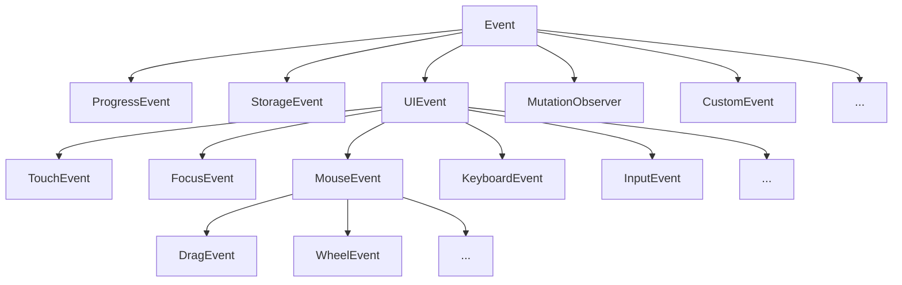

# Events API

<!-- todo: finish -->


## Introduction

- API to ???


## Events

- for JS to provide interactivity, it needs a way of reacting to changes in the system, so called "events"
- event (object): occurence in system represented as JS object, has properties related to type of event
- event target ("ET"): object that events can occur upon / which can "emit" events, e.g. DOM nodes, window, other APIs
- event handler ("EH"): code run when event happens, "handles" event
- browser fires event, checks if event target has event handler(s) "attached" / "registered", calls handler(s) with event object as argument
- event taget emits a "stream" of events that event handler can act on, see Streams later


## Event objects

- events are represented as objects, has properties related to type of event, methods to control event behavior
- `Event` interface is ancestor to all event objects, general event type, more built-in event types in inheritance chain



- can create custom events with `CustomEvent` interface (see later)
- some events have default behavior, e.g. right click opens context menu, clicking on link opens URL, clicking submit button submits form, pressing keys scrolls / zooms / closes the page, etc.
- can prevent default behavior for some but not all events, e.g. closing page is not cancelable
- most times EHs are called before default behavior is executed, but not always, e.g. scroll event ❓

### Properties

#### General (from `Event`)

- `type`: event name, e.g. "mousedown", "mouseup", "click"
- `target`: event target
- `currentTarget`:* object handling event, to which EH is attached, same as `this`
- `timeStamp`: time in ms since document creation
- `isTrusted`: if event was initiated "normally" or artificially through JS, boolean
- `defaultPrevented`: if `preventDefault()` has been called, boolean
- `cancelable`: if default action is cancelable using `preventDefault()` ❓, boolean
- `stopPropagation()`:* stops further event propagation after current node
- `stopImmediatePropagation()`:* like `stopPropagation()` plus stops all other EHs on current target
- `bubbles`:* if event bubbles, boolean
- `eventPhase`:* event's current "flow phase", integer 0-3

(* see later)

#### Specific

- `MouseEvent`: `pageX`/`Y`, `clientX`/`Y`, `screenX`/`Y`, `buttons`, `relatedTarget`, etc.
- `KeyboardEvent`: `key`, `code`, `metaKey`, `ctrlKey`, `altKey`, `shiftKey`, etc.


## Event targets

- event target ("ET"): object that events can occur upon / which can "emit" events, e.g. DOM nodes, window, other APIs, etc.
- `EventTarget` interface is ancestor to all event targets, e.g. `Node` (and all descendants like `Elements`, `Document`, etc.), `Window`, `XMLHttpRequest`


## Event handler

- event handler ("EH"): code run when event happens, "handles" event
- is "registered" / "assigned" to ET for given event type
- multiple ways to add EHs to ET, legacy and modern
- EH is called as function when event fires, i.e. uses function as EH
- EO is passed as single argument to EH, i.e. if wants to pass othe rarguments to EH needs to wrap it in anonoymous function that has EO as single argument
- multiple EHs for same event type and ET are called in order of attachment
- for most but not all built-in event types, EHs are called async, e.g. EHs for "focus" and "blur" events are called sync
- `this` inside EH is set to object that EH is registered on, i.e. same as `currentTarget` property of the EO
- for most but not all built-in event types, EHs are executed first before any default action, e.g. EH for "unload" event of window (window close) isn't called before❓
- can trigger event artificially in JS itself, e.g. for unit testing or custom events  
  beware: the `isTrusted` property of the EO is then `false`  
  beware: result might be different than "normal" event because call stack is not empty (see Runtime environment)

### On`event` handlers 👎

#### Inline EHs

- EH is added to HTML element in HTML via on`event` attribute
- Inline EH is parsed before any script, i.e. executes before any other EHs for given ET and event type
- can prevent default action also by adding `return false` to EH
- EH is actually wrapped in anonymous function that is passed the EO as argument "event", i.e. can access EO only via variable named "event"
- problems:
  - can only register single EH per ET
  - can not change or delete EH later
  - not supported for newer event types
  - no seperation of HTML and JS

```html
<a onclick='console.log("Hello World!");return false;'>...</a>'
```

#### EH properties

- EH is added to ET in JS via on`event` property
- set EH to function, not it's result at compile time, i.e. no parentheses ()
- can change EH through reassignment, delete by assigning it `null`
- can call on`event` property or ET to dispatch event
- problems:
  - can only register single EH per ET
  - not supported for newer event types

```javascript
myobj.onclick = function(event) {console.log("Hello World!");}
```

### Event Listeners 👍

- `EventTarget.addEventListener()`: add EH to ET for event type
- works for all types of events
- for legacy purposes EH can be object instead of function, then the object's `handleEvent` property becomes the EH which is called
- set EH to function, not it's result at compile time, i.e. no parentheses ()
- can register as many EHs per ET as wants, called in order of attachment
- `EventTarget.removeEventListener()`: remove EH from ET for event type  
  beware: EH must be identical reference as when created using `aEL()`, i.e. can't use anonymous function, must use named function  
  beware: `rEL()` throws no error if EH doesn't exist ⚠️
- `EventTarget.dispatchEvent()`: trigger event of event type on ET, needs to be passed EO created using event type constructor (see Custom events)  
  beware: EH is called synchronously ⚠️
- internally the `EventTarget.addEventListener()` method adds the EH to an internal registry within the ET for the given event type, when the event is triggered on the ET it calls every EH within registry for that given event type


## DOM event flow

- (doesn't apply to other events than in DOM, e.g. XMLHttpRequest ⚠️)
- DOM event target is the _deepest_ node where event happened
- DOM event travels from root node through DOM to target node and back, firing on every node on way, i.e. all their EHs for this event type get called  
  (here "root node" is `window` object, before `document`, even though it's not part of DOM)
- capturing phase: DOM event propagates down from root node
- targeting phase: DOM event fires on target node
- bubbling phase: DOM event "bubbles up" back to root node
- EO property `target` is constant target node while `currentTarget` changes with every propagation step
- EHs are by default registered in bubbling phase, can change in `aEL()`, i.e. on`event` handlers are always in bubbling phase
- all events capture but not all bubble, e.g. "focus" and "blur" don't bubble, can check `bubbles` property of EO
- can stop propagation with `sP()` or `sIP()`  
  beware: might stop other desired events, e.g. from deeper nodes, events for analytics, etc.
- event delegation: add only one EH to parent instead one to each descendant individually, use event bubbling to advantage, e.g. only on `<ul>` instead of each `<li>`


## Custom events

- create custom event with any event type constructor, e.g. `Event()`, `MouseEvent()`, `CustomEvent()`
- argument object with `bubbles` and `cancelable` properties, by default are both false❗️
- in `CustomEvent()` can add custom data via `detail` property in argument object
- needs to trigger via `EventTarget.dispatchEvent()` since browser doesn't know this event type

```javascript
let hungryDay = new CustomEvent("hunger", {
  bubbles: true,
  cancelable: false,
  detail: {favMeal: "hamburger", favDrink: "fanta"}
});
document.body.addEventListener("hunger", event => {
  console.log("Body needs " + event.detail.favMeal)
});
document.body.firstElementChild.dispatchEvent(hungryDay);
```


## Event rate

- often an event fires very often repeatedly, e.g. "scroll", "mousemove", "resize", etc.
- needs way to limit rate of EH function calls
- makes use of closure to store reference / decision variable
- pass value of `debounce()` / `throttle()` as argument to `aEL()` not function, i.e. use parentheses ()
- in an EH `this` is the event's current target, but because it is called from within other functions (here: `setTimeout`) it is set to the default global object when accessed from within the actual EH ("callback"), use `apply()` and arrow function to preserve it

### Debouncing

- debouncing: callback is executed only after it hasn't been called for X ms
- wait with callback until event is done, e.g. for scroll, mousemove

```javascript
function debounce(callback, time) {
  let timeoutId;

  return function(...args) {
    clearTimeout(timeoutId);
    timeoutId = setTimeout(() => {callback.apply(this, args)}, time);
  };
}

document.addEventListener('scroll', debounce(() => {console.log("Scrolling")}, 300));
```

### Throttling

- throttling: callback is executed only every X ms
- limit rate of callbacks while event handling, e.g. for input, resize

```javascript
function throttle(callback, time) {
  let enableCall = true;

  return function(...args) {
    if (!enableCall) {
      return;
    } else {
      enableCall = false;
      callback.apply(this, args);
      setTimeout(() => {enableCall = true}, time);
    }
  }
}

document.addEventListener('scroll', throttle(() => {console.log("Scrolling")}, 300));
```

- can use `rAF` instead of `setTimeout` to make time interval match the browser's repaint interval
- e.g. for animations

```javascript
function throttleRAF(callback) {
  let enableCall = true;

  return function(...args) {
    if (!enableCall) {
      return;
    } else {
      enableCall = false;
      callback.apply(this, args);
      requestAnimationFrame(() => {enableCall = true});
    }
  }
}

document.addEventListener('scroll', throttleRAF(() => {console.log("Scrolling")}));
```


## Resources

- MDN - as usual
- The Modern Javascript Tutorial - as usual
- [Alcides Queiroz - JavaScript patterns: Throttle and Debounce](https://programmingwithmosh.com/javascript/javascript-throttle-and-debounce-patterns/)