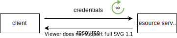
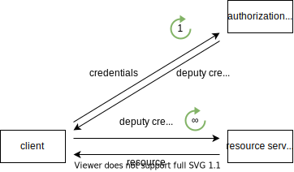

# Auth

<!-- ToDo: finish -->

## Introduction

- authentication and authorization
- authentication: verification of identity
- authorization: verification of permissions
- can't have one without the other, doesn't make sense
- must be done with each request since HTTP is stateless
- beware: only ever use over HTTPS ⚠️

## Terminology

- use OAuth terminology, since only clearly defined terminology

### Resource owner (RO)

- owner of the protected resource, has credentials
- beware: should have been called user, since doesn't necessarily "own" resource, e.g. API might return same resource for every user ❗️
- beware: not necessarily human, since client = RO possible, see RO types ❗️

### Resource server (RS)

- service that provides the protected resource of RO, e.g. API
- beware: should have been called resource provider (RP) ❗️

### Authorization server (AS)

<!-- Todo: in direct access there is no AS, mention this
? maybe introduce terminology later ? but then wouldn't understand delegated access here.. -->

- service that provides identity and permissions of RO
- beware: should have been called auth provider (AP), since doesn't only do authorization ❗️
- RS has single AS
- beware: use separate microservices for AS and RS, instead of running both on same server, see Cloud#Microservices ❗️
- AS can be used for multiple RSs, e.g. Google for Gmail, YouTube, etc.

### Client

<!-- todo: rephrase "front-end client"
e.g. f-e UI ?!
f-e client is also f-e UI, b-e client has separate f-e UI
 -->

- service that accesses resource on behalf of RO, e.g. application
- beware: should have been called service provider (SP) ❗️
- beware: client is special term, doesn't mean UA ⚠️
- beware: client is from perspective of RS not of UA, i.e. client can be back-end or front-end ⚠️
- beware: doesn't specify "front-end client" in UA which user interacts with, usually from same provider as client but not necessarily, e.g. addon in Gmail ❗️
<!-- todo:
front-end client may be from same provider as client, but not necessarily
front-end client keeps state with ?
-->
- beware: if client is back-end and "front-end client" is from same provider, then doesn't specify how back-end client keeps state with "front-end client", e.g. typical session cookie, see Session ❗️
- beware: client = RO possible, see RO types ❗️
- public client: client without client secret and without confirmed identity, e.g. front-end client (PWA, native app) etc.
- confidential client: client with client secret and confirmed identity, e.g. back-end client (traditional website) etc.
- credentialed client: client with client secret but without confirmed identity, e.g. front-end client that's dynamically registered at AS (native app), etc.
<!-- todo: consider deleting first- and third-party, unneccessary confusion -->
- first-party client: client from same provider as RS (& AS), e.g. own client for own RS
- third-party client: client from different provider as RS (& AS), e.g. own client for foreign RS, or foreign client for own RS

<!-- - beware: first-party back-end client can live on same server AS, e.g. Gmail and Google auth ❗️ -->

### Front- and Back Channel

<!-- todo: not necessary in 14., only in 14.3 -->

- front channel: redirect requests through browser, visible in address bar, XSS-attackable
- back channel: direct requests not through browser, not visible in address bar, not XSS-attackable
- beware: here browser means user-facing part of browser, for client that is "front-end client" back channel is Fetch API ❗️

## Access types

- beware: in U2M, client doesn't see credentials usually, see RO types ❗️
<!-- - use delegated access, see OAuth 

for direct access show HTTP auth, but use delegated access instead
for delegated access show only OAuth since best practice, don't roll your own login anymore, e.g. maybe client sees credentials, etc.
-->
- 

### Direct access

- client uses credentials to access resource on RS

- RS stores and verifies credentials of RO
- client has unlimited access, infinite duration, full permission to RS
- disadvantages:
    - larger attack window, because client sends credentials on every request
    - larger attack surface, because RS stores credentials
    - expensive, because RS validates credentials against database on every request, i.e. doesn't scale
    - less secure, because can't limit access of client
- advantages:
    - simple, because no additional layer of indirection
    - high latency, because of database call on every request
- can think of client and RS as having no session

### Delegated access

- client uses deputy credentials to access resource on RS

- AS stores and verifies credentials of RO, RS only verifies deputy credentials
- client has limited access, finite duration, granular permissions to RS
- advantages:
    - smaller attack window, because client sends credentials only on first request
    - smaller attack surface, because RS doesn't store credentials
    - inexpensive, because RS only validates deputy credentials on every request, i.e. scales
    - more secure, because can limit access of client
- disadvantages:
    - complex, because additional layer of indirection
    - high latency, because of additional roundtrip to AS on first request
- can think of client and RS as having a session, deputy credentials is session identifier, although details are more complicated since AS holds actual session

## RO types

### User-to-machine (U2M)

- RO is user, i.e. RO != client
- client doesn't need to see credentials, just RS (direct access) or AS (delegated access)
- beware: don't roll own Auth system where client sees credentials, e.g. mobile app login, instead use OAuth ACF ❗️
- in direct access, RS provides all resources, therefore RS provides both identity resource and non-identity resources
- in delegated access, AS stores identity instead of RS, therefore AS provides identity resource and RS provides non-identity resources

### Machine-to-machine (M2M)

- RO is machine, i.e. RO = client
- beware: can't use public client, otherwise can just as well leave RS unprotected ⚠️

## Resources

- [Brian Pontarelli - Authentication as a Microservice](https://www.youtube.com/watch?v=SLc3cTlypwM)
- [Microsoft - Azure AD Authentication Fundamentals](https://www.youtube.com/playlist?list=PLLasX02E8BPD5vC2XHS_oHaMVmaeHHPLy)