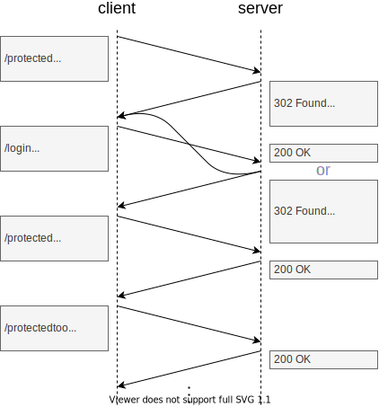

# Authentication

<!-- ToDo: finish -->

<!-- OLD OLD OLD, 14.2 -->

### Session / Cookie based

- sends credentials on first request, symmetric key in `Cookie` request header for subsequent request
- server can redirect to login page where submits form with credentials, redirects back if successful else stays on same page
- server stores symmetric key and sets it as cookie in UA
- UA authenticates silently on subsequent requests until cookie expires

<!-- todo: diagram shows monolith, or access to routes on AS itself -->

- advantages:
advanced, because needs custom login page, e.g. appearance, validation, multiple factors, etc.
custom, because request can send any way that wants, e.g. form action, AJAX, etc.
controllable, because website can invalidate session after duration
cheap, because server only needs to validate session on subsequent request instead of computing authentication (hashes, etc.)

- disadvantages:
advanced, because needs custom login page, e.g. keep redirect target (e.g. in server session, hidden field in login form, etc.), secure, etc.
complex, because needs to keep state, session list on server and session token client
long, because needs additional roundtrip for redirect to login page
attackable, because login details visible to webpage instead of only to UA, e.g. JS can read out form data

#### Cookie

#### 3rd idea

has two cookies
  one session cookie, that changes with every request if previous one was valid, otherwise fixation attack ?? needs also short duration on server
  one persistent cookie (earlier was manual through "remember me" checkbox, nowadays automatically set ??!?!), that is used in new session (when no session cookie), has additional factos of validation, e.g. same device (UA etc.), same location (IP etc.)
?? beware: the longer the duration of the persistent cookie, the higher risk through XSS or XSRF because time that's vulnerable after last visit increases
  time period an attacker can launch attacks over active sessions
server should limit amount of simultaneously active sessions per user

password change must invalidate all open sessions
other role changes as well
needs new session ID

renews session cookie on every visit, unauthenticated or not, with short lifetime
  ?? but needs to keep history of all past session cookie chain ??
beware: uses term session cookie, although is technically persistent cookie !

- cookie has `Secure` and `HttpOnly` flag
make `SameSite: Lax` if possible (when page isn't embedded in other websites, needs cookie only for cross-origin requests due to top-level navigation, e.g. link)
or make even two cookies with Lax for read, and Strict for write access
  use two authentication cookies, one with `Lax` for read-only permission, one with `Strict` for read-and-write permission

beware: relies on cookie being sent with every request (?? same-origin), see HTTP cookie

### Token based auth

differences to cookie based auth
- uses own header, manual transmission
- uses own storage, manual session storage

like cookie based auth, but
token is username signed by server
  no need for server to store symmetric key

token can also contain authorization

client stores token, e.g. local storage
  could store in cookie as well, but would loose flexibility
sends token in `Authorization: Bearer <token>`, or URL, or POST body
-> gives up attributes of cookie, e.g. scope, HttpOnly, ??duration
need to use local storage instead of session storage, otherwise token won't persist accross tabs
but needs to delete manually on logout, since doesn't expire on own

??? what is advantage over cookie, just includes signed permissions, but nothing special otherwise
but if statless on server then can't invalidate

client needs to include token manually in every request, not like cookie which browser includes automatically
-> CSRF safe

token include authorization, since signed can't tamper

stateless on server ?? HOW CAN SERVER THEN KNOW WHICH TOKEN IS INVALID ??
takes all tokens as valid if not expired
can't invalidate tokens !!
-> can scale easier, no need to keep session store in sync, scales better

adv:
  - full control, client can decide when (not) to send, e.g. multiple domains, not by default -> CSRF safe
  - scale, because stateless on server
  - manual submission, not relied on cookie functionality, e.g. can use on native apps
cons:
  - bad duration, either too short or too long
  - no invalidation, website can't delete remotely, only on client
  - XSS, since local storage can be accessed by JS
  - needs JS, not send in HTML, e.g. image tag to protected URL, etc.

--> put token into cookie, uses cookie only for storage properties, ignores `Cookie` header on server, includes it manually in `Auth..` header still just like if it were stored in local storage

often used for APIs, e.g. SPAs, native apps

### Login page

login page should have no external dependencies that can be manipulated, otherwise XSS risk, e.g. 3rd party libraries
must use HTTPS, also on rest of site from where links to login page otherwise fake login page
login page should be rate limited increasingly
login page should use CSP, i.e. only execute signed scripts
should include anti CSRF token in form ???

Block IPs, not accounts
Challenge accounts with CAPTCHAs.