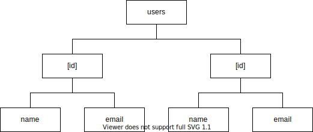

# HTTP API

[TOC]

## Introduction

- API for operations on resources on the Internet, e.g. CRUD (Create, Read, Update, Delete)
- often require authentication, see Auth
- request specifies resource(s) and operations
- response contains result(s) of operation(s)
- request / response body is usually in JSON
- beware: don't confuse with Web Server that serves Web pages ❗️
- ideal API allows a request to specify multiple operations on any set of resources
- can think of resources like a tree
  <!-- ToDo: what is resource and subresource, maybe differentiate between type, object field and scalar field ?? -->
  <!-- collection resource e.g. users -->
  <!-- individual resource e.g. [id] -->
  <!-- field e.g. name ???? -->
  - a (sub-)resource is like a node in the tree, e.g. user X, name of user X, email of user X, etc.
  - a combination of (sub-)resources is like a set of nodes in the tree, e.g. user X and user Y, name and email of user X, name of user X and email of user Y, etc.

## IDL

- specification language that describes API
- independent of programming language
- can generate documentation
- can generate client program in various programming languages

## Representational State Transfer (REST)

- architectural style of HTTP APIs
- API is called "RESTful API"
- uses URL to define unique resource
- uses HTTP methods to define operations, e.g. GET, POST, PUT, DELETE for CRUD (Create, Read, Update, Delete)
- has same URL for different operations on same resource, e.g. GET / POST / PUT / DELETE request to `/users/[id]`, etc.
- earlier styles used URL to define unique action on unique resource, because only GET and POST HTTP methods existed
- earlier styles had multiple URLs for different actions on same resource, e.g. GET to `/getUser`, POST to `/createUser`, etc.
- coarse granularity:
  - requests can specify operations on any (sub-)resource (but not their combination), because of linear structure of URL
  - single request can specify only one such operation, because of single HTTP method
  - but often doesn't even expose subresources, because not much value without being able to combine them
  - single requests gets too much data while too little of what it wants
  - needs multiple requests to multiple URLs
  - N+1 problem to get all subresources of a resource
- disadvantages:
  - complex for client, because needs to filter out data it wants
  - high bandwith or high latency, because transmits more data than needs or needs follow-up request for nested data
  - difficult analytics, because doesn't know exactly what data consumers use
  - dependent, because design is dependent on what data consumer selects
  - difficult versioning, because can't extend a resource without breaking existing consumers
  - undocumented, because has no built-in IDL, needs to document manually or use external IDL, e.g. OpenAPI
- advantages:
  - easy caching, because data is separated by URL and operations by un/safe HTTP method
  <!-- browser caches safe methods automatically
  resource and operation are VISIBLE TO TRANSPORT LAYER, CAN CACHE ON TRANSPORT LAYER, e.g. browser can cache safe method to given URL -->
  - simple for server, because no additional layer of query processing

## GraphQL

- API query language and IDL
- used for new architectural style of HTTP APIs
- API is called "GraphQL API"
- beware: don't confuse query language with architectural style ❗️
- beware: don't confuse with graph database, query language has no dependencies on underlying database ⚠️
- uses query to define unique action on unique resource
- uses single URL and HTTP method to transmit a query in the request body, e.g. POST to `/api/v1/`
- beware: resources aren't defined by URLs anymore ❗️
- fine granularity:
  - requests can specify operations on any combination of (sub-)resources, because of tree structure of query
  - single request can specify one or more such operations, because of tree structure of query
  - single request gets exactly data it wants, not more not less
  - no need for multiple requests
  - no N+1 problem to get all subresources of a resource
- advantages:
  - simple for client, because doesn't need to filter out data it wants
  - low bandwith and low latency, because transmits just data that needs without need for follow-up request for nested data
  - easy analytics, because knows exactly what data consumers use
  - independent, because design is independent from what data consumer selects
  - easy versioning, because can extend a resource without breaking existing consumers
  - documented, because has built-in IDL
- disadvantages:
  - difficult caching, because data is not separated by URL
  - complex for server, because additional layer of query processing

## Design Principles

- simple, selfexplanatory naming
- independent of implementation, e.g. database 
- independent of consum, e.g. mobile app
- model the data, not the view
- implement what you need, not what you think you will need
- "When in doubt leave it out!"
- evolve, don't rewrite

## Resources

- [REST API Tutorial - What is REST](https://restfulapi.net/)
- [Brian Sletten - REST API Design](https://www.youtube.com/watch?v=HW9wWZHWhnI)
- [How To Design A Good API and Why it Matters](https://www.youtube.com/watch?v=heh4OeB9A-c)
- [Nate Barbettini – API Throwdown: RPC vs REST vs GraphQL](https://www.youtube.com/watch?v=IvsANO0qZEg)