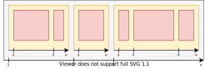
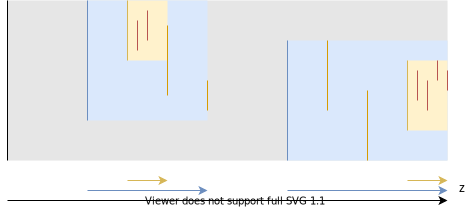

# Stacking

[TOC]


## Introduction

- needs third axis since positioned elements can overlap
- 3D coordinate system, x-axis to right, y-axis to bottom, z-axis out of screen, origin in top left corner of screen
- beware: coordinate system is left-handed, non-canonical ⚠️
- can think of canvas as projection of three spacial dimensions along the z-axis onto two spacial dimensions
- beware: negative z-axis doesn't make sense since "behind screen", box would be invisible ⚠️
- beware: third axis is not used for box itself, box stays two dimensional ⚠️
- beware: distances on z-axis don't matter due to projection, solely order of values ⚠️
- layout on z-axis consists solely of ordering, since box has no size in z-axis
- could order using coordinates, but just as impractical as on other axes, instead use relative ordering
- beware: flex / grid items are treated like positioned elements, i.e. `z-index` applies, creates SC for non-`auto` value, etc. ❗️
<!-- spec bug, doesn't define z-index for flex / grid items, should be defined for all items that it applies to, see [SO](https://stackoverflow.com/questions/34569226/does-z-index-specify-the-stack-level-of-a-non-positioned-flex-item) -->


## Stacking context

- a Flexbox Layout-like formatting context on the z-axis
- each box is in closest SC established by an ancestor box
- not each box establishes a SC for child boxes
- beware: single difference from FC, otherwise same, e.g. nested SCs build a SC tree similar to box tree, etc. ❗️
- beware: allows for child to overlay grandparent while grandparent overlays parent ❗️
- boxes are ordered in their SC according to their `z-index` property, see Stacking level
- can think of SC creating own z-axis for descendant boxes relative to own position on outer z-axis where SC itself is on, spans distance until next value on the outer z-axis
- establishing box itself is at origin of own z-axis, i.e. always behind descendant boxes
- ordering is similar to Flexbox Layout, each flex container creates own x-axis, children are ordered on it according to their Visual order



- beware: diagram uses integers ascending from 1, but can use arbitrary integers with same relative order, e.g. sequence `1, 2, 3` is equivalent to `-17, 5, 22` ❗️
- beware: diagram has separate FC for each box, not true for SC anymore ❗️



- beware: in diagram vertical lines are boxes, reduced by one spacial dimension as seen along either the x- or y-axis, since diagram is two dimensional can only draw either x- or y-axis instead of both ❗️
- beware: in diagram each box establishes an SC, not necessarily true ❗️
- established by elements with one of the following properties
  - root element
  - element with `z-index` not `auto` (if `z-index` applies)
  - stickily / fixedly positioned element (even if `z-index` is `auto`!)
  <!-- as of 07/2020 spec still needs to be updated to include stickily positioned element, see [#1053](https://github.com/w3c/csswg-drafts/issues/1053) -->
  - `opacity` not `1`
  - `transform`, `perspective`, `will-change`, `filter`, `contain`, `clip-path`, `mask` properties, `isolation`, etc. with certain values, see [MDN - The stacking context](https://developer.mozilla.org/en-US/docs/Web/CSS/CSS_Positioning/Understanding_z_index/The_stacking_context)
- beware: relatively / absolutely positioned elements don't establish a stacking context if `z-index` is `auto` ⚠️


## Stacking level

- position of box on z-axis of its stacking context
- integer for simplicity, since only relative order of values matters, not distances
- can think of as integer z-coordinate
- boxes with same stack level are stacked by Visual order, or by order in document tree otherwise, last one is on top
- beware: in Flow Layout is always document tree order since Visual order only applies in Flow / Grid Layout ❗️
- beware: each box has a stacking level, but can change only for elements to which `z-index` applies ❗️
- can be negative to have infinitely many values below a given value available, otherwise would bottom out at zero
- can think of origin of z-axis actually being at `z = -∞` instead of `z = 0`, `z = 0` is just another value like any other, has no special meaning unlike on x-/y-axes where is boundary of screen ⚠️


## `z-index` property

- specifies stacking level of a box
- values: `auto`, `<integer>`
- initial value: `auto`
- not inherited
- `auto` computes to zero
- applies only to positioned elements
- non-positioned elements have fixed stacking level between negative and non-negative integers, i.e. can think of `z = -0.5`
- beware: zero is actually special, last stacking level before non-positioned elements ❗️
- beware: positioned elements are by default in front of any non-positioned elements, since `0 > -0.5`, e.g. floats ❗️

```html
<p>Note: Make sure to view on screen width with at least 600px to view the effect.</p>

<div class="float">Lorem ipsum dolor sit amet, consectetur adipiscing elit, sed do eiusmod tempor incididunt ut labore et dolore magna aliqua. Ut enim ad minim veniam, quis nostrud exercitation ullamco laboris nisi ut aliquip ex ea commodo consequat.</div>

<div>Lorem ipsum dolor sit amet, consectetur adipiscing elit, sed do eiusmod tempor incididunt ut labore et dolore magna aliqua. Ut enim ad minim veniam, quis nostrud exercitation ullamco laboris nisi ut aliquip ex ea commodo consequat.</div>

<div class="relative">Lorem ipsum dolor sit amet, consectetur adipiscing elit, sed do eiusmod tempor incididunt ut labore et dolore magna aliqua. Ut enim ad minim veniam, quis nostrud exercitation ullamco laboris nisi ut aliquip ex ea commodo consequat.</div>
```

```css
div {
  background: lightgrey;
  margin-bottom: 5px;
}

.float {
  float: right;
  background: tomato;
  width: 200px;
}

.relative {
  position: relative
}
```

- beware: can't change SL of all elements that can establish a SC, since `z-index` applies only to positioned elements, but non-positioned elements can be SCs as well, e.g. using `opacity` other than `1`, etc. ❗️
- beware: can't change order of box relative to boxes in other SCs, since z-axis is relative to position of SC ❗️

```html
<div class="grey">Grey
  <div class="red">Red</div>
  <div class="green">Green</div>
</div>

<div class="blue">Blue</div>
```

```css
div {
  position: absolute;
  width: 100px;
  color: white;
  line-height: 100px;
  text-align: center;
}

.grey {
  /* establishes SC for children since non-auto */
  z-index: 1;
  background: lightgrey;
  top: 0;
  left: 0;
}

.red {
  /* always behind .blue because in SC of .grey */
  z-index: 11;
  top: 20px;
  left: 30px;
  background: red;
}

.green {
  z-index: 12;
  top: 40px;
  left: 60px;
  background: green;
}

.blue {
  /* in front of .grey in root SC */
  z-index: 2;
  top: 90px;
  left: 10px;
  background: blue;
}
```

- beware: text content in establishing element is like non-positioned element in SC, i.e. in front of any child boxes with negative SL ❗️

```html
<div class="grey">Grey
  <div class="red">Red</div>
</div>
```

```css
div {
  position: absolute;
  width: 100px;
  color: white;
  line-height: 100px;
  text-align: center;
}

.grey {
  /* establishes SC for children since non-auto */
  z-index: 1;
  background: lightgrey;
  top: 0;
  left: 0;
}

.red {
  /* behind non-positioned elements since negative */
  z-index: -1;
  top: 20px;
  left: 30px;
  background: red;
}
```

- beware: flex / grid items of same stack level are stacked by Visual order before resorting to document tree order ❗️

```html
<div class="container">
  <div class="red"></div>
  <div class="green"></div>
  <div class="blue"></div>
</div>
```

```css
.container {
  display: flex;
  flex-direction: column;
}

.red {
  background-color: red;
  height: 30vh;
  width: 70vw;
  align-self: flex-start;
  /* z-index: 42; */
}

.blue {
  background-color: blue;
  height: 30vh;
  width: 70vw;
  align-self: center;
  margin-top: -10vh;
  order: 1;
}

.green {
  background-color: green;
  height: 30vh;
  width: 70vw;
  align-self: flex-end;
  margin-top: -10vh;
  order: 2;
}
```

```css
.container {
  display: grid;
  grid-template-columns: 30vw 30vw 30vw;
  grid-template-rows: 30vh 30vh 30vh;
}

.red {
  grid-column: 1 / 3;
  background-color: red;
  height: 100%;
  width: 100%;
  /* z-index: 42; */
}

.blue {
  grid-column: 1 / 3;
  background-color: blue;
  height: 100%;
  width: 100%;
  margin-left: 10vw;
  margin-top: -10vh;
  order: 1;
}

.green {
  grid-column: 1 / 3;
  background-color: green;
  height: 100%;
  width: 100%;
  margin-left: 20vw;
  margin-top: -20vh;
  order: 2;
}
```


## Resources

<!-- ToDo: revisit once covered by module spec -->